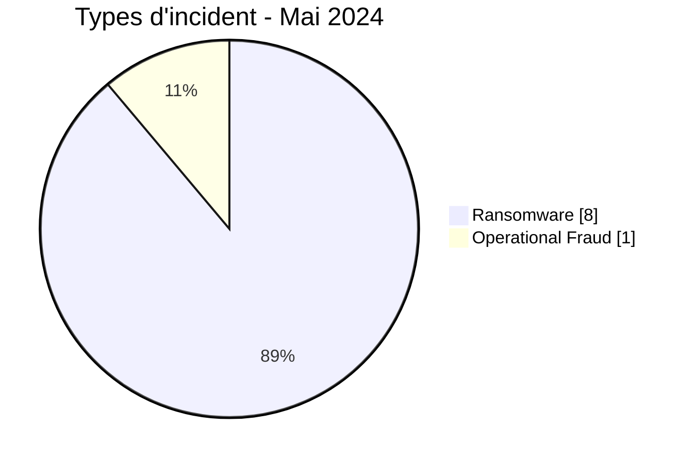

# Rapport CTI AFRINTEL - Cybermenaces en Afrique - Mai 2024

👉🏾 [English version](./README.md)

## 1. Synthèse exécutive

En Mai 2024, AFRINTEL retient **9 cyberincidents canoniques dans 6 pays**. Le mois est dominé par **Ransomware (8, 88,9 %)** puis **Operational Fraud (1, 11,1 %)**. Les pays les plus représentés sont **Afrique du Sud (3)**, **Égypte (2)**, **Nigeria (1)**. Les secteurs les plus visibles sont **Finance / Banque (3)**, **Services professionnels / Business (2)**, **Construction / Immobilier (1)**. Les labels acteur/groupe les plus fréquents sont `lockbit3` (4), `blacksuit` (1), `ransomhub` (1). `Unknown` désigne une absence d'attribution, pas un groupe.

La maturité de preuve est répartie entre **Claim - Unverified: 8**, **Confirmed: 1**. Les claims ne sont pas convertis en confirmations sans preuve supplémentaire.

### 1.1 Étude comparative avec le mois précédent

| Indicateur | Avril 2024 | Mai 2024 | Évolution |
|---|---|---|---|
| Total | 9 | 9 | Stable |
| Ransomware | 5 | 8 | +3 (+60,0 %) |
| Data Leak | 2 | 0 | -2 (-100,0 %) |
| Access Sale | 0 | 0 | Stable |
| DDoS | 2 | 0 | -2 (-100,0 %) |
| Defacement | 0 | 0 | Stable |
| Account Takeover | 0 | 0 | Stable |
| System Intrusion | 0 | 0 | Stable |
| Malware | 0 | 0 | Stable |
| Operational Fraud | 0 | 1 | +1 (nouveau) |

### 1.2 Analyse comparative

Le volume mensuel **reste stable de 0 incident(s)**. Les variations structurantes sont : Ransomware 5->8 (+3), Data Leak 2->0 (-2), DDoS 2->0 (-2), Operational Fraud 0->1 (+1). Cette variation décrit le corpus documenté, pas nécessairement une variation équivalente du nombre réel de compromissions sur le continent.

## 2. Méthodologie

- Un incident canonique correspond à un événement retenu dans le millésime 2024.
- Les découvertes/republications historiques sont conservées séparément et ne gonflent pas les statistiques 2024.
- La date d'incident ou la meilleure fenêtre soutenue prime ; la date de découverte AFRINTEL reste distincte.
- Les 9 types AFRINTEL sont utilisés ; une tentative est représentée par le statut, jamais par un type `Attempted Attack`.
- Un DDoS coordonné est compté par campagne.
- Type, statut, confiance, impact, attribution et source restent distincts.

## 3. Répartition par type d'incident

| Type | Fiches | Part |
|---|---|---|
| Ransomware | 8 | 88,9 % |
| Data Leak | 0 | 0,0 % |
| Access Sale | 0 | 0,0 % |
| DDoS | 0 | 0,0 % |
| Defacement | 0 | 0,0 % |
| Account Takeover | 0 | 0,0 % |
| System Intrusion | 0 | 0,0 % |
| Malware | 0 | 0,0 % |
| Operational Fraud | 1 | 11,1 % |

## 4. Pays x type

| Pays | Total | Ransomware | Data Leak | Access Sale | DDoS | Defacement | Account Takeover | System Intrusion | Malware | Operational Fraud |
|---|---|---|---|---|---|---|---|---|---|---|
| Afrique du Sud | 3 | 2 | 0 | 0 | 0 | 0 | 0 | 0 | 0 | 1 |
| Égypte | 2 | 2 | 0 | 0 | 0 | 0 | 0 | 0 | 0 | 0 |
| Nigeria | 1 | 1 | 0 | 0 | 0 | 0 | 0 | 0 | 0 | 0 |
| Namibie | 1 | 1 | 0 | 0 | 0 | 0 | 0 | 0 | 0 | 0 |
| Côte d'Ivoire | 1 | 1 | 0 | 0 | 0 | 0 | 0 | 0 | 0 | 0 |
| Sénégal | 1 | 1 | 0 | 0 | 0 | 0 | 0 | 0 | 0 | 0 |

## 5. Répartition régionale

| Région | Fiches | Part |
|---|---|---|
| Afrique australe | 4 | 44,4 % |
| Afrique de l'Ouest | 3 | 33,3 % |
| Afrique du Nord | 2 | 22,2 % |

## 6. Répartition sectorielle

| Secteur | Fiches | Part |
|---|---|---|
| Finance / Banque | 3 | 33,3 % |
| Services professionnels / Business | 2 | 22,2 % |
| Construction / Immobilier | 1 | 11,1 % |
| Santé / Médical | 1 | 11,1 % |
| Technologie / IT | 1 | 11,1 % |
| Gouvernement / Administration | 1 | 11,1 % |

## 7. Acteurs / groupes

| Acteur / Groupe | Fiches | Part |
|---|---|---|
| lockbit3 | 4 | 44,4 % |
| blacksuit | 1 | 11,1 % |
| ransomhub | 1 | 11,1 % |
| hunters | 1 | 11,1 % |
| arcusmedia | 1 | 11,1 % |
| Unknown | 1 | 11,1 % |

## 8. Maturité des preuves

| Position de preuve | Fiches | Part |
|---|---|---|
| Claim - Unverified | 8 | 88,9 % |
| Confirmed | 1 | 11,1 % |

### Confiance

| Confiance | Fiches | Part |
|---|---|---|
| Low | 8 | 88,9 % |
| Very High | 1 | 11,1 % |

## 9. Chronologie

```mermaid
timeline
    title AFRINTEL - Mai 2024
    6 Mai 2024 : Nestoil
- **Acteur / Groupe -** blacksuit
- **Secteur -** Construction / Real Estate
- **Site web -** [nestoilgroup.com](https -//www.nestoilgroup.com)
- **Statut -** Claim - Unverified
- **Type d'incident -** Ransomware
- **Niveau de confiance -** Low
- **Niveau d'impact -** Level 2
- **Description victime -** Nestoil est une entreprise commerciale majeure opérant dans le secteur des construction, contribuant de manière significative au tissu économique régional en Nigeria.

----------------------------
    6 Mai 2024 : Elarabygroup
- **Acteur / Groupe -** lockbit3
- **Secteur -** Professional / Business Services
- **Site web -** [elarabygroup.com](https -//www.elarabygroup.com)
- **Statut -** Claim - Unverified
- **Type d'incident -** Ransomware
- **Niveau de confiance -** Low
- **Niveau d'impact -** Level 2
- **Description victime -** Elarabygroup est une entreprise commerciale majeure opérant dans le secteur des business services, contribuant de manière significative au tissu économique régional en Egypt.

----------------------------
    7 Mai 2024 : Lenmed
- **Acteur / Groupe -** lockbit3
- **Secteur -** Healthcare / Medical
- **Site web -** [lenmed.co.za](https -//www.lenmed.co.za)
- **Statut -** Claim - Unverified
- **Type d'incident -** Ransomware
- **Niveau de confiance -** Low
- **Niveau d'impact -** Level 3
- **Description victime -** Lenmed est une entreprise commerciale majeure opérant dans le secteur des healthcare services, contribuant de manière significative au tissu économique régional en South Africa.

----------------------------
    7 Mai 2024 : Kamo jou trading
- **Acteur / Groupe -** ransomhub
- **Secteur -** Finance / Banking
- **Site web -** [kamojou.co.za](https -//www.kamojou.co.za)
- **Statut -** Claim - Unverified
- **Type d'incident -** Ransomware
- **Niveau de confiance -** Low
- **Niveau d'impact -** Level 3
- **Description victime -** Kamo jou trading est une entreprise commerciale majeure opérant dans le secteur des finance, contribuant de manière significative au tissu économique régional en South Africa.

----------------------------
    9 Mai 2024 : Eif.na
- **Acteur / Groupe -** lockbit3
- **Secteur -** Finance / Banking
- **Site web -** [eif.org.na](https -//www.eif.org.na)
- **Statut -** Claim - Unverified
- **Type d'incident -** Ransomware
- **Niveau de confiance -** Low
- **Niveau d'impact -** Level 3
- **Description victime -** Eif.na est une entreprise commerciale majeure opérant dans le secteur des financial organizations, contribuant de manière significative au tissu économique régional en Namibia.

----------------------------
    13 Mai 2024 : Treasury of cote d'ivoire
- **Acteur / Groupe -** hunters
- **Secteur -** Finance / Banking
- **Site web -** [tresor.gouv.ci](https -//www.tresor.gouv.ci)
- **Statut -** Claim - Unverified
- **Type d'incident -** Ransomware
- **Niveau de confiance -** Low
- **Niveau d'impact -** Level 3
- **Description victime -** Treasury of cote d'ivoire est une entreprise commerciale majeure opérant dans le secteur des finance, contribuant de manière significative au tissu économique régional en Côte d'Ivoire.

----------------------------
    16 Mai 2024 : Egyptian sudanese
- **Acteur / Groupe -** arcusmedia
- **Secteur -** Professional / Business Services
- **Site web -** Not validated from the provided source
- **Statut -** Claim - Unverified
- **Type d'incident -** Ransomware
- **Niveau de confiance -** Low
- **Niveau d'impact -** Level 2
- **Description victime -** Egyptian sudanese est une entreprise commerciale majeure opérant dans le secteur des services, contribuant de manière significative au tissu économique régional en Egypt.

----------------------------
    25 Mai 2024 : Sysroad
- **Acteur / Groupe -** lockbit3
- **Secteur -** Technology / IT
- **Site web -** [sysroad.com](https -//www.sysroad.com)
- **Statut -** Claim - Unverified
- **Type d'incident -** Ransomware
- **Niveau de confiance -** Low
- **Niveau d'impact -** Level 2
- **Description victime -** Sysroad est une entreprise commerciale majeure opérant dans le secteur des information technologies consulting, contribuant de manière significative au tissu économique régional en Senegal.

----------------------------
    Mai 2024 - date exacte de l'incident non divulguée publiquement : Department of Public Works and Infrastructure (DPWI)
- **Date de l'incident -** Mai 2024 - date exacte non divulguée publiquement
- **Date de publication initiale -** 10 juillet 2024
- **Date de correction AFRINTEL -** 23 août 2026
- **Acteur / Groupe -** Unknown
- **Secteur -** Government / Administration
- **Site web -** [publicworks.gov.za](https -//www.publicworks.gov.za/)
- **Statut -** Government Confirmed - Forensic Investigation
- **Type d'incident -** Operational Fraud
- **Niveau de confiance -** Very High
- **Niveau d'impact -** Level 4
- **Note de taxonomie -** `Operational Fraud` est retenu car l'événement confirmé correspond à un vol financier cyberactivé associé à une compromission de système. Les sources publiques n'établissent ni le déploiement d'un ransomware, ni une fuite de données autonome, ni le chemin technique exact de l'intrusion.
- **Description victime -** Le Department of Public Works and Infrastructure d'Afrique du Sud gère les bâtiments publics, les infrastructures et les fonctions gouvernementales liées au patrimoine immobilier.
- **Analyse -** Le gouvernement sud-africain a indiqué qu'une activité cybercriminelle avait permis de détourner des fonds importants du DPWI sur une longue période et que le dernier incident, en mai 2024, avait entraîné le vol supplémentaire de **24 millions de rands**. Cette perte a déclenché une enquête forensique complète impliquant les Hawks, le SAPS, la State Security Agency et des spécialistes en cybersécurité. Des responsables gouvernementaux ont également évoqué une possible collusion entre des personnes internes et des criminels. La source publique ne permet pas d'établir le chemin d'intrusion exact, la faiblesse précise des contrôles de paiement ni l'identité des attaquants. AFRINTEL enregistre donc l'événement de mai comme un incident Operational Fraud confirmé par le gouvernement, impliquant un vol financier cyberactivé et une compromission de système, sans attribuer une famille de malware ou une technique d'accès non étayée.
- **Source publique -** [SAnews - enquête DPWI](https -//www.sanews.gov.za/south-africa/dpwi-investigates-theft-r300-million)

----------------------------
```

## 10. Analyse CTI par type

### Ransomware - 8

**8 fiche(s) (88,9 %).** Principaux pays : Égypte (2), Afrique du Sud (2), Nigeria (1). Les conclusions restent limitées aux éléments documentés ; le type ne permet pas d'inférer un vecteur ou un impact non observé.

### Operational Fraud - 1

**1 fiche(s) (11,1 %).** Principaux pays : Afrique du Sud (1). Les conclusions restent limitées aux éléments documentés ; le type ne permet pas d'inférer un vecteur ou un impact non observé.

## 11. Incidents prioritaires pour revue

| Pays | Organisation | Type | Statut | Impact | Confiance |
|---|---|---|---|---|---|
| Afrique du Sud | Department of Public Works and Infrastructure (DPWI)
- **Date de l'incident:** Mai 2024 - date exacte non divulguée publiquement
- **Date de publication initiale:** 10 juillet 2024
- **Date de correction AFRINTEL:** 23 août 2026
- **Acteur / Groupe:** Unknown
- **Secteur:** Government / Administration
- **Site web:** [publicworks.gov.za](https://www.publicworks.gov.za/)
- **Statut:** Government Confirmed - Forensic Investigation
- **Type d'incident:** Operational Fraud
- **Niveau de confiance:** Very High
- **Niveau d'impact:** Level 4
- **Note de taxonomie:** `Operational Fraud` est retenu car l'événement confirmé correspond à un vol financier cyberactivé associé à une compromission de système. Les sources publiques n'établissent ni le déploiement d'un ransomware, ni une fuite de données autonome, ni le chemin technique exact de l'intrusion.
- **Description victime:** Le Department of Public Works and Infrastructure d'Afrique du Sud gère les bâtiments publics, les infrastructures et les fonctions gouvernementales liées au patrimoine immobilier.
- **Analyse:** Le gouvernement sud-africain a indiqué qu'une activité cybercriminelle avait permis de détourner des fonds importants du DPWI sur une longue période et que le dernier incident, en mai 2024, avait entraîné le vol supplémentaire de **24 millions de rands**. Cette perte a déclenché une enquête forensique complète impliquant les Hawks, le SAPS, la State Security Agency et des spécialistes en cybersécurité. Des responsables gouvernementaux ont également évoqué une possible collusion entre des personnes internes et des criminels. La source publique ne permet pas d'établir le chemin d'intrusion exact, la faiblesse précise des contrôles de paiement ni l'identité des attaquants. AFRINTEL enregistre donc l'événement de mai comme un incident Operational Fraud confirmé par le gouvernement, impliquant un vol financier cyberactivé et une compromission de système, sans attribuer une famille de malware ou une technique d'accès non étayée.
- **Source publique:** [SAnews - enquête DPWI](https://www.sanews.gov.za/south-africa/dpwi-investigates-theft-r300-million)

---------------------------- | Operational Fraud | Government Confirmed - Forensic Investigation | Level 4 | Very High |
| Afrique du Sud | Lenmed
- **Acteur / Groupe:** lockbit3
- **Secteur:** Healthcare / Medical
- **Site web:** [lenmed.co.za](https://www.lenmed.co.za)
- **Statut:** Claim - Unverified
- **Type d'incident:** Ransomware
- **Niveau de confiance:** Low
- **Niveau d'impact:** Level 3
- **Description victime:** Lenmed est une entreprise commerciale majeure opérant dans le secteur des healthcare services, contribuant de manière significative au tissu économique régional en South Africa.

---------------------------- | Ransomware | Claim - Unverified | Level 3 | Low |
| Afrique du Sud | Kamo jou trading
- **Acteur / Groupe:** ransomhub
- **Secteur:** Finance / Banking
- **Site web:** [kamojou.co.za](https://www.kamojou.co.za)
- **Statut:** Claim - Unverified
- **Type d'incident:** Ransomware
- **Niveau de confiance:** Low
- **Niveau d'impact:** Level 3
- **Description victime:** Kamo jou trading est une entreprise commerciale majeure opérant dans le secteur des finance, contribuant de manière significative au tissu économique régional en South Africa.

---------------------------- | Ransomware | Claim - Unverified | Level 3 | Low |
| Namibie | Eif.na
- **Acteur / Groupe:** lockbit3
- **Secteur:** Finance / Banking
- **Site web:** [eif.org.na](https://www.eif.org.na)
- **Statut:** Claim - Unverified
- **Type d'incident:** Ransomware
- **Niveau de confiance:** Low
- **Niveau d'impact:** Level 3
- **Description victime:** Eif.na est une entreprise commerciale majeure opérant dans le secteur des financial organizations, contribuant de manière significative au tissu économique régional en Namibia.

---------------------------- | Ransomware | Claim - Unverified | Level 3 | Low |
| Côte d'Ivoire | Treasury of cote d'ivoire
- **Acteur / Groupe:** hunters
- **Secteur:** Finance / Banking
- **Site web:** [tresor.gouv.ci](https://www.tresor.gouv.ci)
- **Statut:** Claim - Unverified
- **Type d'incident:** Ransomware
- **Niveau de confiance:** Low
- **Niveau d'impact:** Level 3
- **Description victime:** Treasury of cote d'ivoire est une entreprise commerciale majeure opérant dans le secteur des finance, contribuant de manière significative au tissu économique régional en Côte d'Ivoire.

---------------------------- | Ransomware | Claim - Unverified | Level 3 | Low |

> Sélection structurée selon impact, statut et confiance ; ce n'est pas un classement absolu de gravité.

## 12. Intelligence gaps et corrections

- vecteur d'accès initial souvent inconnu ;
- date technique de compromission parfois différente de la date de publication ;
- volumes revendiqués rarement vérifiables intégralement ;
- attribution technique souvent limitée au compte de publication ;
- republications historiques suivies séparément.

## 13. Recommandations

- MFA résistante au phishing, PAM et moindre privilège ;
- segmentation, sauvegardes immuables et tests de restauration ;
- centralisation EDR/IAM/VPN/WAF/DNS/cloud/applications ;
- détection des exports massifs, archives inhabituelles et transferts sortants ;
- conservation séparée des dates d'incident, publication initiale, repost et découverte AFRINTEL.

## 14. Conclusion

Mai 2024 contient **9 incidents canoniques**. La comparaison avec le mois précédent est calculée sur la même taxonomie et les mêmes règles chronologiques, sauf janvier où décembre 2023 reste `N/A` faute de réaudit homogène.

👉🏾 [Victimes canoniques](./victims_FR.md)

**AFRINTEL** - TLP:CLEAR
