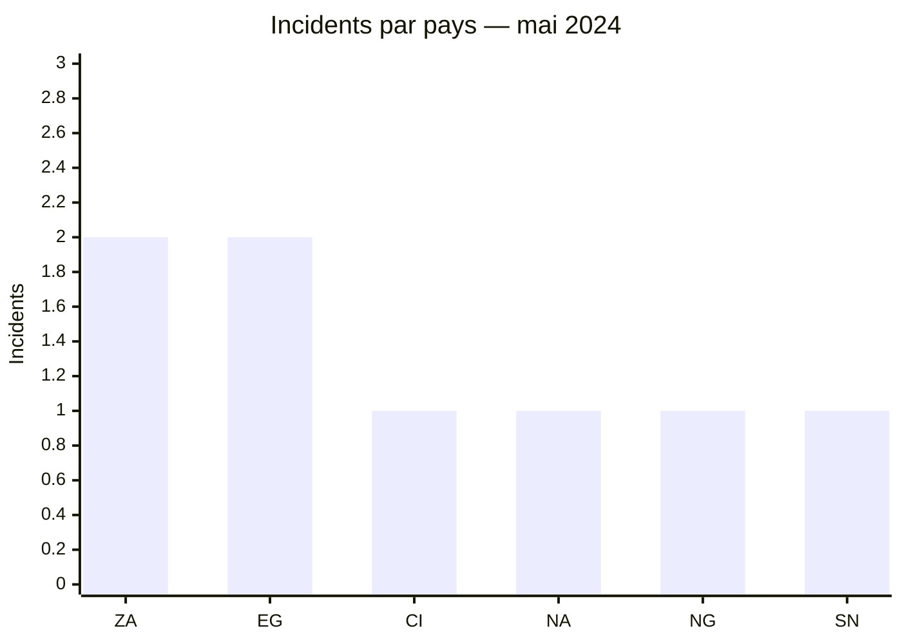
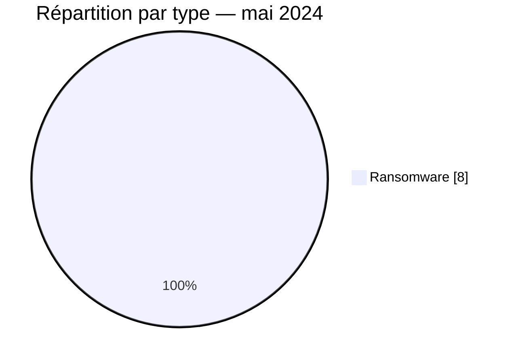

# Rapport CTI AFRINTEL — Mai 2024

👉🏾 [English version](./README.md)

## 1. Résumé exécutif

Les **8 incidents** de mai 2024 sont tous des **revendications ransomware**. L’Afrique du Sud et l’Égypte comptent deux publications chacune ; quatre autres pays apparaissent une fois. L’Afrique de l’Ouest, l’Afrique australe et l’Afrique du Nord enregistrent respectivement trois, trois et deux incidents.

LockBit3 représente la moitié du corpus. Les secteurs financier et professionnel sont les plus visibles, mais aucun échantillon exploitable n’est documenté dans les sources du mois. Le rapport mesure donc une activité de publication, pas huit compromissions indépendamment confirmées.

Voir [victims_FR.md](./victims_FR.md).

## 2. Méthodologie

Le corpus couvre les publications classées en mai 2024. Une organisation équivaut à un incident, même si plusieurs sources la mentionnent. Les huit cas sont conservés sous le statut public correspondant aux preuves disponibles ; aucune technique d’accès ou d’impact n’est inférée depuis le seul nom du groupe.

Les statistiques dérivent de [victims_FR.md](./victims_FR.md), synchronisé avec [victims.md](./victims.md).

## 3. Vue globale

| Indicateur | Valeur |
|---|---:|
| Incidents / Pays | **8 / 6** |
| Ransomware | **8** |
| Fuite / Vente d’accès / Défacement | **0 / 0 / 0** |

### Classement par pays

| Pays | Incidents |
|---|---:|
| 🇿🇦 Afrique du Sud | 2 |
| 🇪🇬 Égypte | 2 |
| 🇨🇮 Côte d’Ivoire | 1 |
| 🇳🇦 Namibie | 1 |
| 🇳🇬 Nigeria | 1 |
| 🇸🇳 Sénégal | 1 |
| **Total** | **8** |

### Répartition régionale

| Région | Incidents |
|---|---:|
| Afrique de l’Ouest | 3 |
| Afrique australe | 3 |
| Afrique du Nord | 2 |
| **Total** | **8** |

### Répartition sectorielle normalisée

| Secteur | Incidents | Part |
|---|---:|---:|
| Finance / Banque | 3 | 37,5 % |
| Services professionnels / Entreprises | 2 | 25,0 % |
| Construction / Immobilier | 1 | 12,5 % |
| Santé / Médical | 1 | 12,5 % |
| Technologies / Informatique | 1 | 12,5 % |
| **Total** | **8** | **100 %** |

### Acteurs les plus visibles

| Acteur | Incidents |
|---|---:|
| LockBit3 | 4 |
| Arcus Media, BlackSuit, Hunters, RansomHub | 1 chacun |

## 4. Analyse détaillée par type d’incident

### 4.1 Ransomware

Les publications concernent Nestoil, Elaraby Group, Lenmed, Kamo Jou Trading, EIF Namibia, le Trésor public de Côte d’Ivoire, Egyptian Sudanese et Sysroad. Les services financiers regroupent trois cas, dont une administration financière. Aucun élément public du corpus n’établit un chiffrement, une interruption ou une exfiltration effective.

### 4.2 Fuites, ventes d’accès et défacement

Aucun incident de ces trois catégories n’est recensé en mai. Cette absence décrit uniquement les sources suivies par AFRINTEL pendant la période.

## 5. Impact sectoriel

La finance arrive en tête avec trois incidents, devant les services professionnels. Le Trésor public ivoirien et Lenmed présentent les enjeux les plus sensibles en raison de leurs fonctions. L’absence d’échantillon empêche toutefois de qualifier les données potentiellement concernées ou l’ampleur réelle des événements.

## 6. Profil des acteurs et évaluation du risque

| Périmètre | Niveau | Justification |
|---|---|---|
| 🇿🇦 Afrique du Sud | 🔴 Élevé | Deux publications, dont un réseau de santé |
| 🇨🇮 Côte d’Ivoire | 🔴 Élevé | Publication visant le Trésor public |
| 🇪🇬 Égypte | 🟠 Moyen | Deux revendications sans élément technique public |
| 🇳🇦 Namibie / 🇳🇬 Nigeria / 🇸🇳 Sénégal | 🟡 Faible à moyen | Une revendication chacune |

## 7. Tendances et lacunes de renseignement

- **Observé — confiance élevée :** le corpus est exclusivement composé de revendications ransomware.
- **Observé — confiance élevée :** LockBit3 est associé à quatre incidents sur huit.
- **Lacune :** aucun rapport DFIR public ni échantillon exploitable n’a été identifié dans les sources consultées.
- **Lacune :** l’état opérationnel des organisations et l’existence d’une exfiltration restent inconnus.
- **Collecte attendue :** communications victimes, notifications réglementaires et mises à jour des sites de publication.

## 8. Cartographie MITRE ATT&CK contextuelle

| Statut | Technique | Utilisation |
|---|---|---|
| Préventif | T1486 — Data Encrypted for Impact | Surveillance du chiffrement ; aucune confirmation technique publique |
| Préventif | T1490 — Inhibit System Recovery | Surveillance des sauvegardes et copies de restauration |
| Hypothèse | T1078 — Valid Accounts | Scénario d’accès à vérifier ; aucun compte compromis observé |

## 9. Recommandations

- **Finance :** imposer MFA résistante au phishing, revoir les accès distants et contrôler les exports.
- **Santé :** isoler les applications cliniques et tester les procédures de continuité.
- **Prestataires IT :** séparer les accès clients et faire tourner les secrets à privilèges.
- **Toutes les organisations :** maintenir des sauvegardes immuables vérifiées par restauration.

## 10. Recommandations SOC et tactiques

| Qualification | Action |
|---|---|
| **Observé** | Suivre les huit organisations publiées ; aucune TTP technique n’est confirmée. |
| **Hypothèse** | Rechercher des accès distants inhabituels et des créations d’archives avant les dates de publication. |
| **Préventif** | Alerter sur le chiffrement massif, la suppression de sauvegardes et l’usage anormal d’outils d’administration. |

## 11. Recommandations stratégiques

| Priorité | Qualification | Mesure |
|---:|---|---|
| 1 | **Observé** | Prioriser la finance, la santé et les prestataires technologiques présents dans le corpus. |
| 2 | **Hypothèse** | Vérifier l’exposition des identités et équipements Edge sans présenter ces vecteurs comme observés. |
| 3 | **Préventif** | Mettre en œuvre ASM, MFA résistante au phishing et sauvegardes isolées. |

## 12. Conclusion

Mai montre une forte homogénéité de type, mais une faible profondeur technique publique. La concentration de LockBit3 et la présence d’organisations financières justifient une vigilance renforcée ; elles ne suffisent pas à établir un mode opératoire commun. La priorité reste la validation interne et la résilience.

**AFRINTEL — TLP:CLEAR**

[Dépôt AFRINTEL](https://github.com/Hatchepsoute/AFRINTEL)
