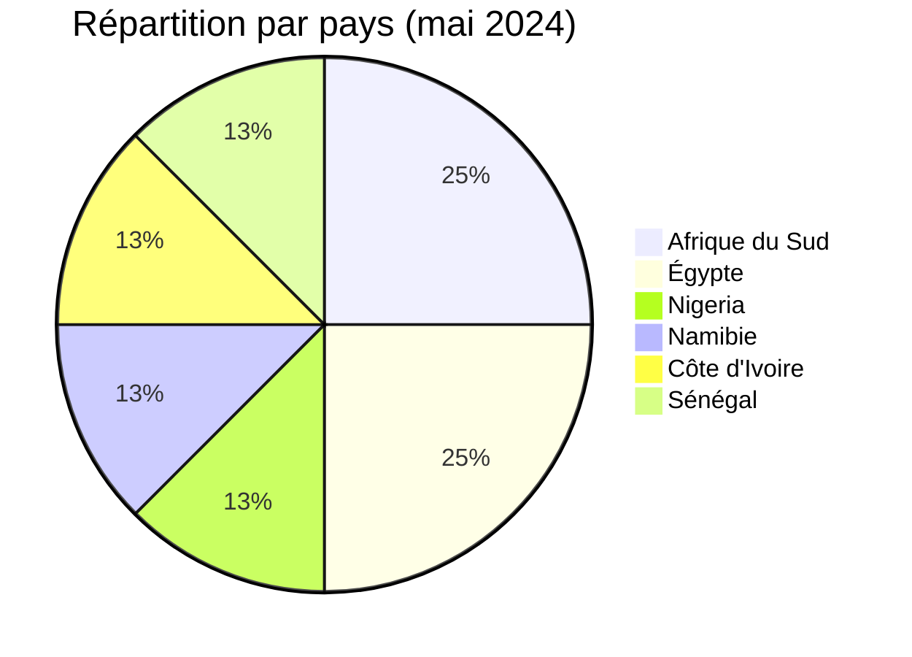
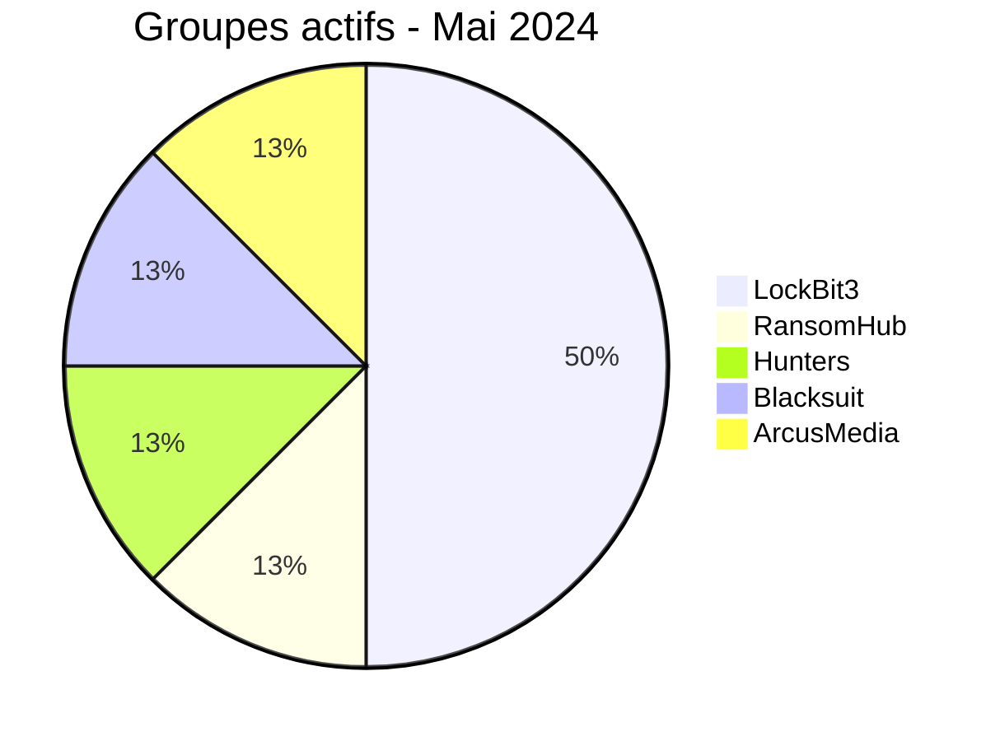

# Rapport CTI - Mai 2024 : Vague de ransomwares en Afrique

👉🏾 [English version available here](./README.md)
---

### 1. Résumé exécutif

En mai 2024, l’Afrique a enregistré **8 nouvelles victimes** documentées d’attaques par ransomware. Le mois a été marqué par la diversité des groupes actifs et une cible inédite : le **Trésor public de Côte d’Ivoire**.

👉🏾 [Liste des victimes](./victims_FR.md)

**Chiffres clés :**
- 🔹 **8 victimes** identifiées
- 🔹 **5 groupes différents** : LockBit3 (4 attaques), RansomHub (1), Hunters (1), Blacksuit (1), ArcusMedia (1)
- 🔹 **Pays touchés** : Afrique du Sud (2), Égypte (2), Nigeria (1), Namibie (1), Côte d’Ivoire (1), Sénégal (1)
- 🔹 **Secteurs** : Finance / Trésor (3), Santé (1), Construction (1), Services aux entreprises (1), Conseil IT (1), Services génériques (1)

### Vue agrégée mensuelle de l’exposition

La vue CTI mensuelle regroupe les fuites de données et les ventes d’accès sous **exposition des données** : **0 fiches** (0.0% du corpus mensuel). Les fiches sources restent la référence ; une vente d’accès ne prouve pas à elle seule l’exfiltration de données.

---

### 2. Chronologie des attaques

| Date       | Victime                          | Pays             | Groupe ransomware |
|------------|----------------------------------|------------------|-------------------|
| 6 mai      | Nestoil                          | Nigeria          | Blacksuit         |
| 6 mai      | Elarabygroup                     | Égypte           | LockBit3          |
| 7 mai      | Lenmed                           | Afrique du Sud   | LockBit3          |
| 7 mai      | Kamo jou trading                 | Afrique du Sud   | RansomHub         |
| 9 mai      | Eif.na                           | Namibie          | LockBit3          |
| 13 mai     | Trésor public ivoirien           | Côte d’Ivoire    | Hunters           |
| 16 mai     | Egyptian sudanese                | Égypte           | ArcusMedia        |
| 25 mai     | Sysroad                          | Sénégal          | LockBit3          |

---

### 3. Analyse des victimes

#### 3.1 Par pays

| Pays               | Nombre d’attaques |
|--------------------|------------------|
| Afrique du Sud     | 2                |
| Égypte             | 2                |
| Nigeria            | 1                |
| Namibie            | 1                |
| Côte d’Ivoire      | 1                |
| Sénégal            | 1                |

#### 3.2 Par secteur

| Secteur                        | Nombre |
|--------------------------------|--------|
| Finance / Trésor public        | 3      |
| Services de santé              | 1      |
| Construction                   | 1      |
| Services aux entreprises       | 1      |
| Conseil en technologies        | 1      |
| Services génériques            | 1      |

#### 3.3 Groupes ransomware

| Groupe ransomware | Nombre d’attaques |
|------------------|------------------|
| LockBit3         | 4                |
| RansomHub        | 1                |
| Hunters          | 1                |
| Blacksuit        | 1                |
| ArcusMedia       | 1                |

---

### 4. Points d’attention

- **LockBit3** reste majoritaire (50% des attaques du mois).
- **Cible gouvernementale** : le Trésor public ivoirien (Hunters) montre l’intérêt des cybercriminels pour les institutions financières étatiques.
- **Secteur santé** : Lenmed (Afrique du Sud) est la seule cible santé du mois, mais récurrente (déjà touchée en mai et août 2024).
- **Géographie** : 6 pays distincts, sans concentration excessive.

---

### 5. Recommandations pour mai 2024

| Domaine                        | Action recommandée |
|--------------------------------|--------------------|
| Institutions financières       | Renforcer la surveillance des accès privilégiés et la segmentation des réseaux. |
| Services de santé              | Mettre en place une sauvegarde hors ligne quotidienne. |
| Entreprises de conseil IT      | Auditer les accès RDP et VPN, activer le MFA. |

*Rapport CTI des données OSINT AFRINTEL - Diffusion libre (TLP:CLEAR)*  
