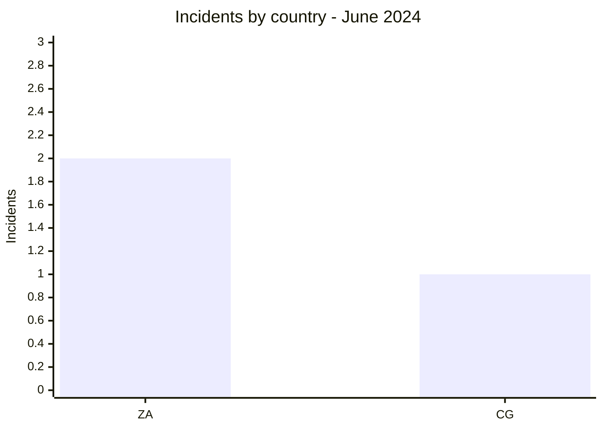
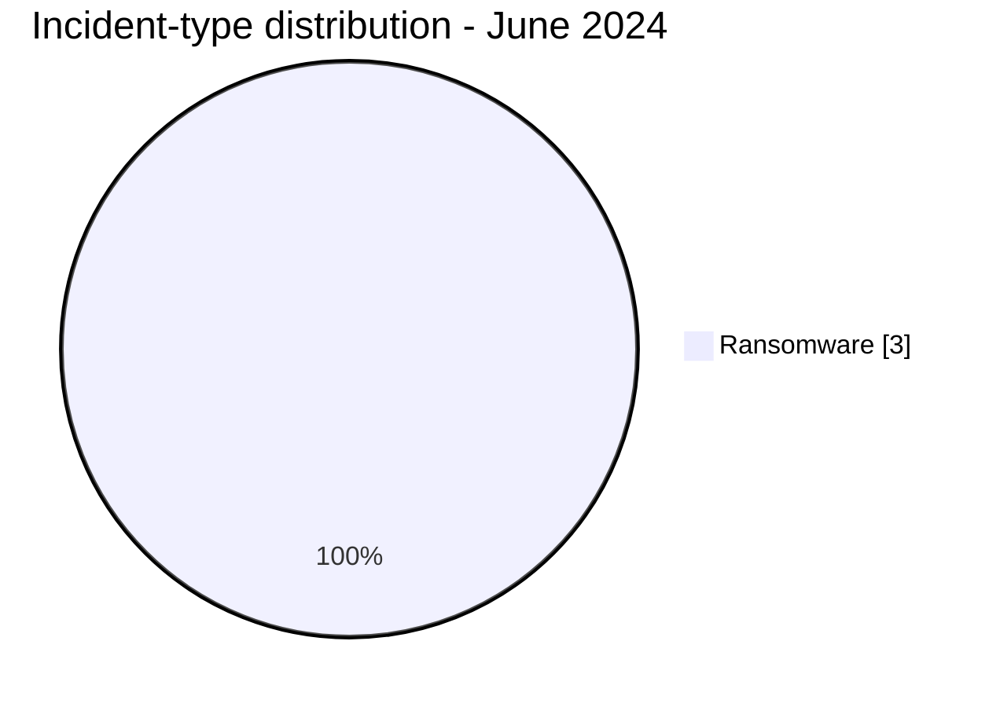

# AFRINTEL CTI Report - June 2024

👉🏾 [Version française](./README_FR.md)

## 1. Executive summary

June 2024 is the smallest month of the first half, with **3 ransomware claims**. Two concern South Africa and one concerns Congo. Arcus Media, Eldorado, and Cactus appear once each, so no actor dominates this limited corpus.

The reviewed public sources provide neither a usable sample nor independent confirmation. Counts should be read as publication monitoring, without extrapolation to the actual threat across the continent.

See [victims.md](./victims.md).

## 2. Methodology

This report covers publications assigned to June 2024. The three incidents are deduplicated by organization. The absence of leaks, access sales, or defacement from the corpus does not mean that none occurred in Africa during the month.

Statistics derive from [victims.md](./victims.md), synchronized with [victims_FR.md](./victims_FR.md).

## 3. Global overview

| Indicator | Value |
|---|---:|
| Incidents / Countries | **3 / 2** |
| Ransomware | **3** |
| Data leak / Access sale / Defacement | **0 / 0 / 0** |

### Country ranking

| Country | Incidents |
|---|---:|
| 🇿🇦 South Africa | 2 |
| 🇨🇬 Congo | 1 |
| **Total** | **3** |

### Regional distribution

| Region | Incidents |
|---|---:|
| Southern Africa | 2 |
| Central Africa | 1 |
| **Total** | **3** |

### Normalized sector distribution

| Sector | Incidents | Share |
|---|---:|---:|
| Agriculture / Agribusiness | 1 | 33.3% |
| Professional / Business Services | 1 | 33.3% |
| Legal / Justice | 1 | 33.3% |
| **Total** | **3** | **100%** |

### Most visible actors

| Actor | Incidents |
|---|---:|
| Arcus Media | 1 |
| Eldorado | 1 |
| Cactus | 1 |

## 4. Detailed analysis by incident type

### 4.1 Ransomware

Botselo, Burotec.biz, and Glyn Marais were published by three different actors. Agriculture, professional services, and legal services are not homogeneous enough to support a sector-targeting conclusion. No public technical evidence qualifies access, impact, or exfiltration.

### 4.2 Other categories

No data leak, access sale, or defacement is documented in the monthly sources.

## 5. Sectoral impact

Each sector records one incident. The main analytical risk would be drawing a trend from such a small corpus. All three organizations should nevertheless review external access, privileged accounts, and backup integrity.

## 6. Threat actor profile and risk assessment

| Scope | Level | Rationale |
|---|---|---|
| 🇿🇦 South Africa | 🟠 Medium | Two independent claims |
| 🇨🇬 Congo | 🟡 Low to medium | One claim with no public sample |

## 7. Key trends and intelligence gaps

- **Observed - high confidence:** three ransomware publications, with no repeated actor.
- **Observed - medium confidence:** volume is markedly lower than previous months, although collection effects may contribute.
- **Gap:** no public DFIR report or sample was identified in the sources reviewed.
- **Gap:** Burotec.biz's activity remains insufficiently documented for a finer sector classification.
- **Collection need:** victim confirmation, operational status, and technical indicators.

## 8. Contextual MITRE ATT&CK mapping

| Status | Technique | Use |
|---|---|---|
| Preventive | T1486 - Data Encrypted for Impact | Encryption detection; not publicly confirmed |
| Preventive | T1490 - Inhibit System Recovery | Backup-integrity monitoring |
| Assumption | T1078 - Valid Accounts | Scenario to test; no valid access observed |

## 9. Recommendations

- **Agriculture:** protect production systems and third-party access.
- **Professional and legal services:** compartmentalize client files and monitor exports.
- **All organizations:** review exposed services and test a full restoration.

## 10. SOC and tactical recommendations

| Qualification | Action |
|---|---|
| **Observed** | Monitor assets belonging to the three cited organizations; no technical TTP is confirmed. |
| **Assumption** | Review remote access and privileged authentication around publication dates. |
| **Preventive** | Detect mass encryption, backup deletion, large archives, and unusual outbound transfers. |

## 11. Strategic recommendations

| Priority | Qualification | Measure |
|---:|---|---|
| 1 | **Observed** | Validate each of the three claims without sector-wide generalization. |
| 2 | **Assumption** | Examine edge exposure and identities as leads, not established vectors. |
| 3 | **Preventive** | Maintain ASM, phishing-resistant MFA, and immutable backups. |

## 12. Conclusion

June does not support a robust trend beyond three ransomware publications. Its value lies precisely in that limit: low volume is a reminder that OSINT statistics also measure source visibility. Defensive response should remain focused on the named organizations.

**AFRINTEL - TLP:CLEAR**

[AFRINTEL repository](https://github.com/Hatchepsoute/AFRINTEL)
