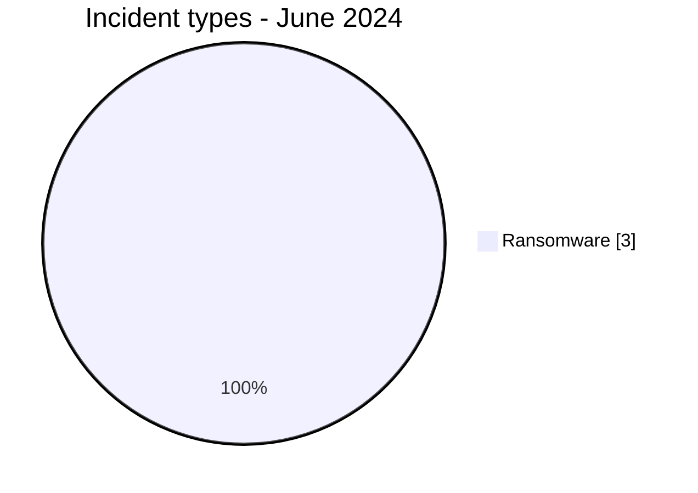

# AFRINTEL CTI Report - Cyber Threats in Africa - June 2024

👉🏾 [Version française](./README_FR.md)

## 1. Executive summary

In June 2024, AFRINTEL retains **3 canonical cyber incidents across 2 countries**. The month is led by **Ransomware (3, 100.0%)**. Leading countries are **South Africa (2)**, **Congo (1)**. Leading sectors are **Agriculture / Agribusiness (1)**, **Professional / Business Services (1)**, **Legal / Justice (1)**. Most frequent actor/group labels are `arcusmedia` (1), `eldorado` (1), `cactus` (1). `Unknown` means missing attribution, not an actor.

### 1.1 Month-over-month study

| Indicator | May 2024 | June 2024 | Change |
|---|---|---|---|
| Total | 9 | 3 | -6 (-66.7%) |
| Ransomware | 8 | 3 | -5 (-62.5%) |
| Data Leak | 0 | 0 | Stable |
| Access Sale | 0 | 0 | Stable |
| DDoS | 0 | 0 | Stable |
| Defacement | 0 | 0 | Stable |
| Account Takeover | 0 | 0 | Stable |
| System Intrusion | 0 | 0 | Stable |
| Malware | 0 | 0 | Stable |
| Operational Fraud | 1 | 0 | -1 (-100.0%) |

### 1.2 Comparative analysis

Monthly volume **decreases by 6 incident(s)**. Structural changes are: Ransomware 8->3 (-5), Operational Fraud 1->0 (-1). This describes the documented corpus and does not necessarily equal the change in real compromises across the continent.

## 2. Methodology

- One canonical incident equals one event retained in the 2024 year.
- Historical discoveries/republications are preserved separately and do not inflate 2024 statistics.
- Incident date or best-supported window takes precedence; AFRINTEL discovery date remains separate.
- Nine AFRINTEL types are used; attempts are represented by status, never by an `Attempted Attack` type.
- Coordinated DDoS is counted by campaign.
- Type, status, confidence, impact, attribution, and source remain separate.

## 3. Incident-type distribution

| Type | Records | Share |
|---|---|---|
| Ransomware | 3 | 100.0% |
| Data Leak | 0 | 0.0% |
| Access Sale | 0 | 0.0% |
| DDoS | 0 | 0.0% |
| Defacement | 0 | 0.0% |
| Account Takeover | 0 | 0.0% |
| System Intrusion | 0 | 0.0% |
| Malware | 0 | 0.0% |
| Operational Fraud | 0 | 0.0% |

## 4. Country x type

| Country | Total | Ransomware | Data Leak | Access Sale | DDoS | Defacement | Account Takeover | System Intrusion | Malware | Operational Fraud |
|---|---|---|---|---|---|---|---|---|---|---|
| South Africa | 2 | 2 | 0 | 0 | 0 | 0 | 0 | 0 | 0 | 0 |
| Congo | 1 | 1 | 0 | 0 | 0 | 0 | 0 | 0 | 0 | 0 |

## 5. Regional distribution

| Region | Records | Share |
|---|---|---|
| Southern Africa | 2 | 66.7% |
| Central Africa | 1 | 33.3% |

## 6. Sector distribution

| Sector | Records | Share |
|---|---|---|
| Agriculture / Agribusiness | 1 | 33.3% |
| Professional / Business Services | 1 | 33.3% |
| Legal / Justice | 1 | 33.3% |

## 7. Actors / groups

| Actor / Group | Records | Share |
|---|---|---|
| arcusmedia | 1 | 33.3% |
| eldorado | 1 | 33.3% |
| cactus | 1 | 33.3% |

## 8. Evidence maturity

| Evidence position | Records | Share |
|---|---|---|
| Claim - Unverified | 3 | 100.0% |

### Confidence

| Confidence | Records | Share |
|---|---|---|
| Low | 3 | 100.0% |

## 9. Timeline

```mermaid
timeline
    title AFRINTEL - June 2024
    4 Juin 2024 : Botselo
- **Acteur / Groupe -** arcusmedia
- **Secteur -** Agriculture / Agribusiness
- **Site web -** [botselo.com](https -//www.botselo.com)
- **Statut -** Claim - Unverified
- **Niveau de confiance -** Low
- **Niveau d'impact -** Level 2
- **Type d'incident -** Ransomware

- **Note de fiabilité -**
  Botselo figure sur le site de fuite du groupe arcusmedia. AFRINTEL n'a observé aucun échantillon, capture ou extrait de données accessible associé à cette publication au moment de la collecte, et la revendication n'a pas été confirmée de manière indépendante par l'organisation.

- **Description -**
  Botselo est une organisation sud-africaine classée dans le secteur Agriculture / Agribusiness dans le corpus AFRINTEL.

- **Analyse -**
  AFRINTEL a recensé Botselo (Afrique du Sud) comme victime revendiquée par le groupe ransomware arcusmedia. Aucun fichier divulgué, extrait de base de données ou capture d'écran n'était accessible pour analyse, ce qui ne permet pas d'évaluer l'ampleur, le volume ni la sensibilité des données éventuellement exposées. En l'absence d'échantillon accessible, AFRINTEL ne peut pas déterminer quelles catégories de données auraient éventuellement été concernées ni si une perturbation opérationnelle a réellement eu lieu. AFRINTEL ne confirme ni l'intrusion, ni l'exfiltration de données, ni l'existence d'un jeu de données complet sur la seule base de cette publication.

- **Recommandations -**
  1. Examiner la surface d'attaque externe, les services d'accès distant et l'intégrité des sauvegardes à la suite de cette publication par arcusmedia, et vérifier la disponibilité de sauvegardes hors ligne ou immuables.
  2. Surveiller toute publication ultérieure d'échantillons de données liés à cette revendication et préparer des procédures de protection des données opérationnelles et de réponse à incident en cas d'éléments de compromission avérés.

----------------------------
    6 Juin 2024 : Burotec.biz
- **Acteur / Groupe -** eldorado
- **Secteur -** Professional / Business Services
- **Site web -** [burotec.biz](https -//www.burotec.biz)
- **Statut -** Claim - Unverified
- **Niveau de confiance -** Low
- **Niveau d'impact -** Level 2
- **Type d'incident -** Ransomware

- **Note de fiabilité -**
  Burotec.biz figure sur le site de fuite du groupe eldorado. AFRINTEL n'a observé aucun échantillon, capture ou extrait de données accessible associé à cette publication au moment de la collecte, et la revendication n'a pas été confirmée de manière indépendante par l'organisation.

- **Description -**
  Burotec.biz est une organisation basée au Congo. Les sources du mois ne permettent pas de documenter plus finement son activité ; AFRINTEL conserve donc le secteur harmonisé Professional / Business Services.

- **Analyse -**
  AFRINTEL a recensé Burotec.biz (Congo) comme victime revendiquée par le groupe ransomware eldorado. Aucun fichier divulgué, extrait de base de données ou capture d'écran n'était accessible pour analyse, ce qui ne permet pas d'évaluer l'ampleur, le volume ni la sensibilité des données éventuellement exposées. En l'absence d'échantillon accessible, AFRINTEL ne peut pas déterminer quelles catégories de données auraient éventuellement été concernées ni si une perturbation opérationnelle a réellement eu lieu. AFRINTEL ne confirme ni l'intrusion, ni l'exfiltration de données, ni l'existence d'un jeu de données complet sur la seule base de cette publication.

- **Recommandations -**
  1. Examiner la surface d'attaque externe, les services d'accès distant et l'intégrité des sauvegardes à la suite de cette publication par eldorado, et vérifier la disponibilité de sauvegardes hors ligne ou immuables.
  2. Surveiller toute publication ultérieure d'échantillons de données liés à cette revendication et préparer des procédures de protection des données et de réponse à incident en cas d'éléments de compromission avérés.

----------------------------
    23 Juin 2024 : Glyn Marais
- **Acteur / Groupe -** cactus
- **Secteur -** Legal / Justice
- **Site web -** [glynmarais.co.za](https -//www.glynmarais.co.za)
- **Statut -** Claim - Unverified
- **Niveau de confiance -** Low
- **Niveau d'impact -** Level 2
- **Type d'incident -** Ransomware

- **Note de fiabilité -**
  Glyn Marais figure sur le site de fuite du groupe cactus. AFRINTEL n'a observé aucun échantillon, capture ou extrait de données accessible associé à cette publication au moment de la collecte, et la revendication n'a pas été confirmée de manière indépendante par l'organisation.

- **Description -**
  Glyn Marais est une organisation sud-africaine classée dans le secteur Legal / Justice dans le corpus AFRINTEL.

- **Analyse -**
  AFRINTEL a recensé Glyn Marais (Afrique du Sud) comme victime revendiquée par le groupe ransomware cactus. Aucun fichier divulgué, extrait de base de données ou capture d'écran n'était accessible pour analyse, ce qui ne permet pas d'évaluer l'ampleur, le volume ni la sensibilité des données éventuellement exposées. En l'absence d'échantillon accessible, AFRINTEL ne peut pas déterminer quelles catégories de données auraient éventuellement été concernées ni si une perturbation opérationnelle a réellement eu lieu. AFRINTEL ne confirme ni l'intrusion, ni l'exfiltration de données, ni l'existence d'un jeu de données complet sur la seule base de cette publication.

- **Recommandations -**
  1. Examiner la surface d'attaque externe, les services d'accès distant et l'intégrité des sauvegardes à la suite de cette publication par cactus, et vérifier la disponibilité de sauvegardes hors ligne ou immuables.
  2. Surveiller toute publication ultérieure d'échantillons de données liés à cette revendication et préparer des procédures de confidentialité des données clients et de réponse à incident en cas d'éléments de compromission avérés.

----------------------------
```

## 10. CTI analysis by type

### Ransomware - 3

**3 record(s) (100.0%).** Leading countries: South Africa (2), Congo (1). Conclusions remain limited to documented evidence; the incident type does not justify inferring an unobserved vector or impact.

## 11. Priority incidents for review

| Country | Organization | Type | Status | Impact | Confidence |
|---|---|---|---|---|---|
| South Africa | Botselo
- **Acteur / Groupe:** arcusmedia
- **Secteur:** Agriculture / Agribusiness
- **Site web:** [botselo.com](https://www.botselo.com)
- **Statut:** Claim - Unverified
- **Niveau de confiance:** Low
- **Niveau d'impact:** Level 2
- **Type d'incident:** Ransomware

- **Note de fiabilité:**
  Botselo figure sur le site de fuite du groupe arcusmedia. AFRINTEL n'a observé aucun échantillon, capture ou extrait de données accessible associé à cette publication au moment de la collecte, et la revendication n'a pas été confirmée de manière indépendante par l'organisation.

- **Description:**
  Botselo est une organisation sud-africaine classée dans le secteur Agriculture / Agribusiness dans le corpus AFRINTEL.

- **Analyse:**
  AFRINTEL a recensé Botselo (Afrique du Sud) comme victime revendiquée par le groupe ransomware arcusmedia. Aucun fichier divulgué, extrait de base de données ou capture d'écran n'était accessible pour analyse, ce qui ne permet pas d'évaluer l'ampleur, le volume ni la sensibilité des données éventuellement exposées. En l'absence d'échantillon accessible, AFRINTEL ne peut pas déterminer quelles catégories de données auraient éventuellement été concernées ni si une perturbation opérationnelle a réellement eu lieu. AFRINTEL ne confirme ni l'intrusion, ni l'exfiltration de données, ni l'existence d'un jeu de données complet sur la seule base de cette publication.

- **Recommandations:**
  1. Examiner la surface d'attaque externe, les services d'accès distant et l'intégrité des sauvegardes à la suite de cette publication par arcusmedia, et vérifier la disponibilité de sauvegardes hors ligne ou immuables.
  2. Surveiller toute publication ultérieure d'échantillons de données liés à cette revendication et préparer des procédures de protection des données opérationnelles et de réponse à incident en cas d'éléments de compromission avérés.

---------------------------- | Ransomware | Claim - Unverified | Level 2 | Low |
| Congo | Burotec.biz
- **Acteur / Groupe:** eldorado
- **Secteur:** Professional / Business Services
- **Site web:** [burotec.biz](https://www.burotec.biz)
- **Statut:** Claim - Unverified
- **Niveau de confiance:** Low
- **Niveau d'impact:** Level 2
- **Type d'incident:** Ransomware

- **Note de fiabilité:**
  Burotec.biz figure sur le site de fuite du groupe eldorado. AFRINTEL n'a observé aucun échantillon, capture ou extrait de données accessible associé à cette publication au moment de la collecte, et la revendication n'a pas été confirmée de manière indépendante par l'organisation.

- **Description:**
  Burotec.biz est une organisation basée au Congo. Les sources du mois ne permettent pas de documenter plus finement son activité ; AFRINTEL conserve donc le secteur harmonisé Professional / Business Services.

- **Analyse:**
  AFRINTEL a recensé Burotec.biz (Congo) comme victime revendiquée par le groupe ransomware eldorado. Aucun fichier divulgué, extrait de base de données ou capture d'écran n'était accessible pour analyse, ce qui ne permet pas d'évaluer l'ampleur, le volume ni la sensibilité des données éventuellement exposées. En l'absence d'échantillon accessible, AFRINTEL ne peut pas déterminer quelles catégories de données auraient éventuellement été concernées ni si une perturbation opérationnelle a réellement eu lieu. AFRINTEL ne confirme ni l'intrusion, ni l'exfiltration de données, ni l'existence d'un jeu de données complet sur la seule base de cette publication.

- **Recommandations:**
  1. Examiner la surface d'attaque externe, les services d'accès distant et l'intégrité des sauvegardes à la suite de cette publication par eldorado, et vérifier la disponibilité de sauvegardes hors ligne ou immuables.
  2. Surveiller toute publication ultérieure d'échantillons de données liés à cette revendication et préparer des procédures de protection des données et de réponse à incident en cas d'éléments de compromission avérés.

---------------------------- | Ransomware | Claim - Unverified | Level 2 | Low |
| South Africa | Glyn Marais
- **Acteur / Groupe:** cactus
- **Secteur:** Legal / Justice
- **Site web:** [glynmarais.co.za](https://www.glynmarais.co.za)
- **Statut:** Claim - Unverified
- **Niveau de confiance:** Low
- **Niveau d'impact:** Level 2
- **Type d'incident:** Ransomware

- **Note de fiabilité:**
  Glyn Marais figure sur le site de fuite du groupe cactus. AFRINTEL n'a observé aucun échantillon, capture ou extrait de données accessible associé à cette publication au moment de la collecte, et la revendication n'a pas été confirmée de manière indépendante par l'organisation.

- **Description:**
  Glyn Marais est une organisation sud-africaine classée dans le secteur Legal / Justice dans le corpus AFRINTEL.

- **Analyse:**
  AFRINTEL a recensé Glyn Marais (Afrique du Sud) comme victime revendiquée par le groupe ransomware cactus. Aucun fichier divulgué, extrait de base de données ou capture d'écran n'était accessible pour analyse, ce qui ne permet pas d'évaluer l'ampleur, le volume ni la sensibilité des données éventuellement exposées. En l'absence d'échantillon accessible, AFRINTEL ne peut pas déterminer quelles catégories de données auraient éventuellement été concernées ni si une perturbation opérationnelle a réellement eu lieu. AFRINTEL ne confirme ni l'intrusion, ni l'exfiltration de données, ni l'existence d'un jeu de données complet sur la seule base de cette publication.

- **Recommandations:**
  1. Examiner la surface d'attaque externe, les services d'accès distant et l'intégrité des sauvegardes à la suite de cette publication par cactus, et vérifier la disponibilité de sauvegardes hors ligne ou immuables.
  2. Surveiller toute publication ultérieure d'échantillons de données liés à cette revendication et préparer des procédures de confidentialité des données clients et de réponse à incident en cas d'éléments de compromission avérés.

---------------------------- | Ransomware | Claim - Unverified | Level 2 | Low |

> Structured selection based on impact, status, and confidence; not an absolute severity ranking.

## 12. Intelligence gaps and corrections

- initial-access vector often unknown;
- technical compromise date may differ from publication date;
- claimed volumes are rarely fully verifiable;
- technical attribution is often limited to the publication account;
- historical republications are tracked separately.

## 13. Recommendations

- phishing-resistant MFA, PAM, and least privilege;
- segmentation, immutable backups, and restoration testing;
- centralized EDR/IAM/VPN/WAF/DNS/cloud/application logging;
- detection of mass exports, unusual archives, and outbound transfers;
- separate preservation of incident, initial-publication, repost, and AFRINTEL discovery dates.

## 14. Conclusion

June 2024 contains **3 canonical incidents**. Month-over-month comparison uses the same taxonomy and chronology rules, except January where December 2023 remains `N/A` because no equivalent re-audit has been completed.

👉🏾 [Canonical victims](./victims.md)

**AFRINTEL** - TLP:CLEAR
