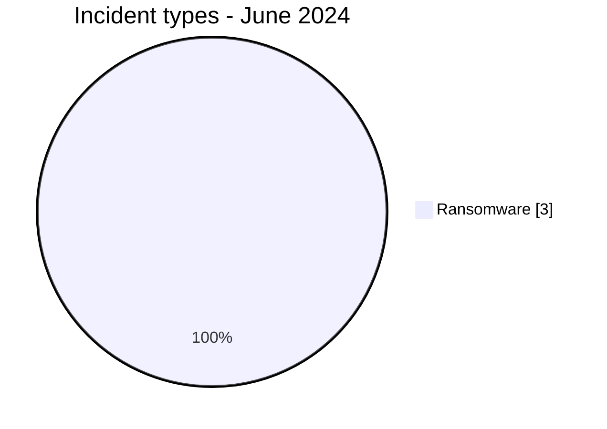
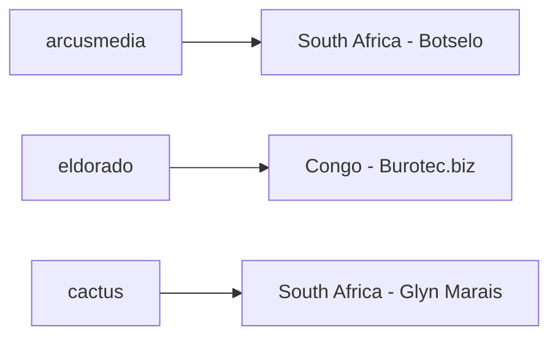
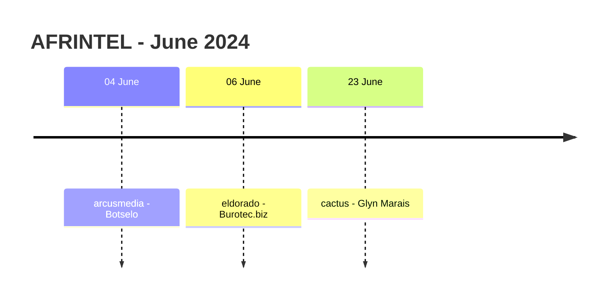

# AFRINTEL CTI Report - June 2024

👉🏾 [Version française](./README_FR.md)

## 1. Executive summary

June 2024 contains **3 documented incident records**, all classified as **Ransomware**, across **2 African countries**. South Africa accounts for two publications and Congo for one. No Data Leak, Access Sale, DDoS, Defacement or Operational Fraud record is present in the validated June corpus.

The three publications are attributed separately to `arcusmedia`, `eldorado` and `cactus`; no actor repeats in this small dataset. The organizations also fall into three different harmonized sectors: Agriculture / Agribusiness, Professional / Business Services, and Legal / Justice.

None of the three victim cards contains an accessible data sample, DFIR report or independent victim confirmation. June therefore measures observed ransomware publication activity, not three independently confirmed compromises.

👉🏾 [View the full victim list](./victims.md)

### 1.1 Month-over-month comparison

| Indicator | May 2024 | June 2024 | Change |
|---|---:|---:|---:|
| Total incidents | 9 | **3** | **-6 (-66.7%)** |
| Ransomware | 8 | **3** | **-5 (-62.5%)** |
| Data Leak | 0 | **0** | Stable |
| Access Sale | 0 | **0** | Stable |
| DDoS | 0 | **0** | Stable |
| Defacement | 0 | **0** | Stable |
| Operational Fraud | 1 | **0** | **-1 (-100.0%)** |

June is **66.7% lower** than the corrected May corpus. Ransomware publications fall from 8 to 3, while the single Operational Fraud incident present in May has no June equivalent. This is a change in the AFRINTEL observed corpus and should not be interpreted as proof of a continent-wide reduction in cyber activity.

## 2. Methodology

- **Period:** 1-30 June 2024.
- **Source of truth:** harmonized `victims_FR.md` / `victims.md`.
- **Counting:** one harmonized card equals one documented incident record.
- **Taxonomy:** Ransomware, Data Leak, Access Sale, DDoS, Defacement, Operational Fraud.
- **Retrospective correction registry:** none of the 10 identified missing 2024 incidents belongs to June, so no additional record is injected into this month.
- **Evidence rule:** actor publication, victim confirmation, sample availability and technical validation remain separate evidence states.
- Technical behavior commonly associated with ransomware is not treated as observed unless supported by the monthly evidence.

## 3. Global overview

### 3.1 Incident-type distribution

| Incident type | Records | Share |
|---|---:|---:|
| Ransomware | **3** | **100%** |
| Data Leak | 0 | 0% |
| Access Sale | 0 | 0% |
| DDoS | 0 | 0% |
| Defacement | 0 | 0% |
| Operational Fraud | 0 | 0% |
| **Total** | **3** | **100%** |

### 3.2 Country distribution

| Country | Ransomware | Total |
|---|---:|---:|
| 🇿🇦 South Africa | 2 | **2** |
| 🇨🇬 Congo | 1 | **1** |
| **Total** | **3** | **3** |

### 3.3 Regional distribution

| Region | Records | Share |
|---|---:|---:|
| Southern Africa | 2 | 66.7% |
| Central Africa | 1 | 33.3% |
| **Total** | **3** | **100%** |

### 3.4 Harmonized sector distribution

| Sector | Records | Share |
|---|---:|---:|
| Agriculture / Agribusiness | 1 | 33.3% |
| Professional / Business Services | 1 | 33.3% |
| Legal / Justice | 1 | 33.3% |
| **Total** | **3** | **100%** |

### 3.5 Actors / groups

| Actor / Group | Records |
|---|---:|
| arcusmedia | 1 |
| eldorado | 1 |
| cactus | 1 |
| **Total** | **3** |

## 4. Detailed analysis

### 4.1 Ransomware - 3 records

The three records concern **Botselo**, **Burotec.biz** and **Glyn Marais**.

All three remain `Claim - Unverified` with `Low` confidence. At collection time, AFRINTEL had no accessible leaked file, database extract, screenshot or independent victim confirmation associated with these publications. The monthly evidence therefore does not establish intrusion, encryption, operational disruption, data exfiltration or dataset completeness for any of the three cases.

No actor appears more than once, and no sector appears more than once. The corpus is consequently too small and too heterogeneous to support a defensible conclusion about actor concentration, sector targeting or common tradecraft.

## 5. Key findings and intelligence gaps

- June is the **smallest monthly corpus in the corrected January-June 2024 sequence**, with 3 records.
- All three records are Ransomware publications, but all remain unverified claims.
- South Africa accounts for 2 of the 3 records; this concentration reflects the monthly corpus only.
- No ransomware actor repeats.
- No sector repeats.
- No accessible data sample or public DFIR evidence is documented for the three claims.
- Victim confirmation, operational impact, exfiltration status and initial-access method remain open collection requirements.

## 6. Contextual MITRE ATT&CK mapping

| Status | Technique | Application |
|---|---|---|
| Preventive | T1486 - Data Encrypted for Impact | Relevant ransomware detection control; encryption is not confirmed in the June evidence. |
| Preventive | T1490 - Inhibit System Recovery | Relevant backup-resilience control; behavior is not observed in the June corpus. |
| Assumption | T1078 - Valid Accounts | Possible access scenario to investigate internally, not an observed fact. |

## 7. Recommendations

- Validate each of the three claims individually before escalating confidence.
- Preserve authentication, endpoint, remote-access and backup telemetry around the publication dates.
- Monitor the three leak sites for later samples or status changes that could alter the evidence level.
- Avoid extrapolating sector or actor trends from a three-record corpus.
- Maintain tested isolated backups and privileged-access controls as preventive ransomware measures.

## 8. Timeline

## 9. Conclusion

June 2024 closes with **3 documented incident records across 2 African countries**, all of them Ransomware publications. Compared with the corrected May corpus of 9 incidents, June falls by **66.7%**, while Ransomware publications decline from 8 to 3. The Operational Fraud case recorded in May has no equivalent in June.

This sharp numerical decrease must be interpreted cautiously. The June dataset is an OSINT publication corpus, not a census of every cyberattack that occurred in Africa. The available evidence therefore supports a statement about **reduced visibility in AFRINTEL's June corpus**, but it does not support the stronger conclusion that ransomware activity or cyber risk across the continent fell by the same proportion.

The month also provides no defensible basis for identifying a dominant actor, targeted sector or shared intrusion pattern. `arcusmedia`, `eldorado` and `cactus` appear once each, and the three organizations belong to three different harmonized sectors. With only three records, any broader attribution of intent, campaign coordination or sector preference would exceed the evidence.

Evidence maturity is equally limited. All three entries remain low-confidence, unverified actor claims. No accessible sample, public DFIR report or independent victim confirmation establishes intrusion, encryption, disruption or exfiltration. The most important intelligence requirement after June is therefore not to infer missing technical detail, but to monitor whether later victim statements, leak-site samples, regulatory notices or technical indicators strengthen or contradict the original claims.

For AFRINTEL, June is analytically useful precisely because it demonstrates the need to separate **publication volume, evidence maturity and actual threat prevalence**. A small corpus should produce a proportionately cautious conclusion. The defensible position is that three ransomware publications were observed, their technical impact remains unconfirmed, and further evidence is required before drawing broader conclusions about the African threat landscape.

**AFRINTEL** - TLP:CLEAR
