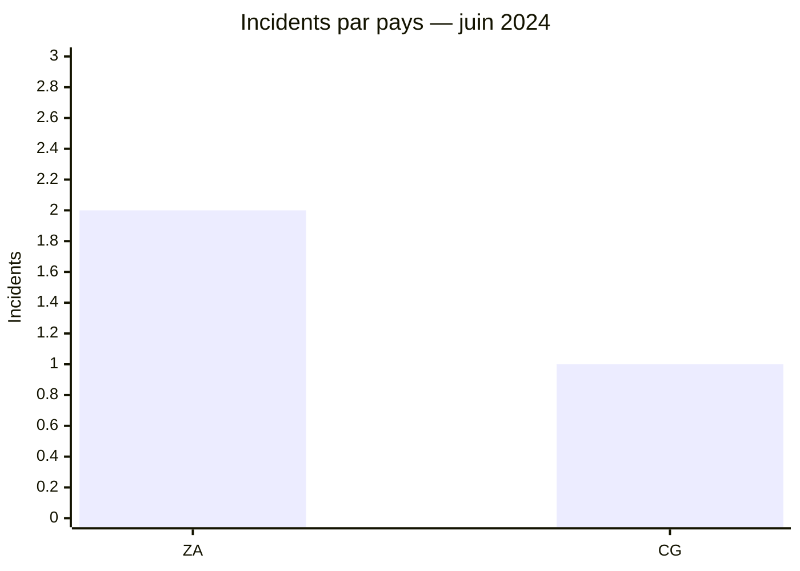
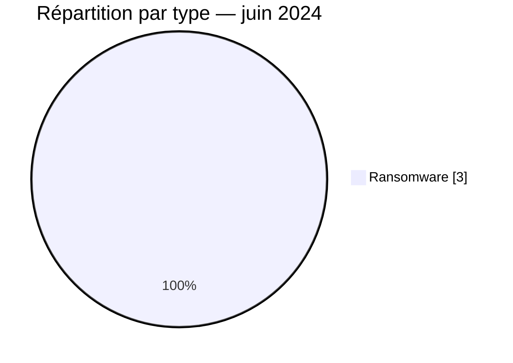

# Rapport CTI AFRINTEL — Juin 2024

👉🏾 [English version](./README.md)

## 1. Résumé exécutif

Juin 2024 est le mois le moins fourni du premier semestre avec **3 revendications ransomware**. Deux concernent l’Afrique du Sud et une le Congo. Arcus Media, Eldorado et Cactus apparaissent une fois chacun ; aucun acteur ne domine donc ce corpus restreint.

Les sources publiques consultées n’apportent ni échantillon exploitable ni confirmation indépendante. Les chiffres doivent être lus comme un relevé de publications, sans extrapolation à la menace réelle sur l’ensemble du continent.

Voir [victims_FR.md](./victims_FR.md).

## 2. Méthodologie

Le rapport couvre les publications classées en juin 2024. Les trois incidents sont dédupliqués par organisation. L’absence de fuite, de vente d’accès ou de défacement dans le corpus ne signifie pas qu’aucun événement de ces types n’a eu lieu en Afrique pendant le mois.

Les statistiques dérivent de [victims_FR.md](./victims_FR.md), synchronisé avec [victims.md](./victims.md).

## 3. Vue globale

| Indicateur | Valeur |
|---|---:|
| Incidents / Pays | **3 / 2** |
| Ransomware | **3** |
| Fuite / Vente d’accès / Défacement | **0 / 0 / 0** |

### Classement par pays

| Pays | Incidents |
|---|---:|
| 🇿🇦 Afrique du Sud | 2 |
| 🇨🇬 Congo | 1 |
| **Total** | **3** |

### Répartition régionale

| Région | Incidents |
|---|---:|
| Afrique australe | 2 |
| Afrique centrale | 1 |
| **Total** | **3** |

### Répartition sectorielle normalisée

| Secteur | Incidents | Part |
|---|---:|---:|
| Agriculture / Agro-industrie | 1 | 33,3 % |
| Services professionnels / Entreprises | 1 | 33,3 % |
| Juridique / Justice | 1 | 33,3 % |
| **Total** | **3** | **100 %** |

### Acteurs les plus visibles

| Acteur | Incidents |
|---|---:|
| Arcus Media | 1 |
| Eldorado | 1 |
| Cactus | 1 |

## 4. Analyse détaillée par type d’incident

### 4.1 Ransomware

Botselo, Burotec.biz et Glyn Marais ont été publiés par trois acteurs différents. Les secteurs agricole, professionnel et juridique ne forment pas un ensemble suffisamment homogène pour conclure à un ciblage sectoriel. Aucun élément technique public ne permet de qualifier l’accès, l’impact ou une exfiltration.

### 4.2 Autres catégories

Aucune fuite de données, vente d’accès ou opération de défacement n’est documentée dans les sources mensuelles.

## 5. Impact sectoriel

Chaque secteur ne compte qu’un incident. Le principal risque analytique serait de tirer une tendance à partir d’un corpus aussi faible. Les trois organisations doivent néanmoins vérifier les accès externes, les comptes privilégiés et l’intégrité de leurs sauvegardes.

## 6. Profil des acteurs et évaluation du risque

| Périmètre | Niveau | Justification |
|---|---|---|
| 🇿🇦 Afrique du Sud | 🟠 Moyen | Deux revendications indépendantes |
| 🇨🇬 Congo | 🟡 Faible à moyen | Une revendication, sans échantillon public |

## 7. Tendances et lacunes de renseignement

- **Observé — confiance élevée :** trois publications ransomware, sans acteur répété.
- **Observé — confiance moyenne :** le volume est nettement inférieur aux mois précédents, mais cela peut refléter la collecte.
- **Lacune :** aucun rapport DFIR public ou échantillon n’a été identifié dans les sources consultées.
- **Lacune :** l’activité précise de Burotec.biz reste insuffisamment documentée pour une qualification sectorielle plus fine.
- **Collecte attendue :** confirmations victimes, état opérationnel et indicateurs techniques.

## 8. Cartographie MITRE ATT&CK contextuelle

| Statut | Technique | Utilisation |
|---|---|---|
| Préventif | T1486 — Data Encrypted for Impact | Détection du chiffrement ; non confirmé publiquement |
| Préventif | T1490 — Inhibit System Recovery | Surveillance de l’intégrité des sauvegardes |
| Hypothèse | T1078 — Valid Accounts | Scénario à vérifier, sans accès valide observé |

## 9. Recommandations

- **Agriculture :** protéger les systèmes de production et les accès prestataires.
- **Services professionnels et juridiques :** cloisonner les dossiers clients et surveiller les exports.
- **Toutes les organisations :** revoir les services exposés et tester une restauration complète.

## 10. Recommandations SOC et tactiques

| Qualification | Action |
|---|---|
| **Observé** | Surveiller les actifs des trois organisations citées ; aucune TTP technique n’est confirmée. |
| **Hypothèse** | Examiner les accès distants et les authentifications privilégiées autour des dates de publication. |
| **Préventif** | Détecter chiffrement massif, suppression de sauvegardes, archives volumineuses et transferts sortants inhabituels. |

## 11. Recommandations stratégiques

| Priorité | Qualification | Mesure |
|---:|---|---|
| 1 | **Observé** | Valider individuellement les trois revendications, sans généralisation sectorielle. |
| 2 | **Hypothèse** | Examiner l’exposition Edge et les identités comme pistes, non comme vecteurs établis. |
| 3 | **Préventif** | Maintenir ASM, MFA résistante au phishing et sauvegardes immuables. |

## 12. Conclusion

Juin ne permet pas de dégager une tendance robuste au-delà de la présence de trois publications ransomware. Sa valeur tient précisément à cette limite : le faible volume rappelle que les statistiques OSINT mesurent aussi la visibilité des sources. La réponse défensive doit rester ciblée sur les organisations concernées.

**AFRINTEL — TLP:CLEAR**

[Dépôt AFRINTEL](https://github.com/Hatchepsoute/AFRINTEL)
