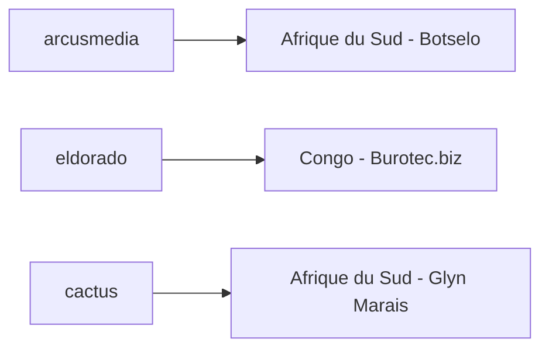
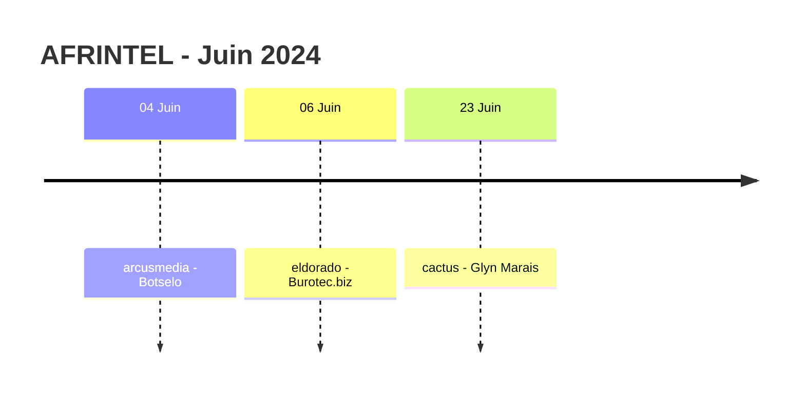

# Rapport CTI AFRINTEL - Juin 2024

👉🏾 [English version](./README.md)

## 1. Résumé exécutif

Juin 2024 contient **3 fiches incident documentées**, toutes classées **Ransomware**, dans **2 pays africains**. L'Afrique du Sud représente deux publications et le Congo une. Aucun Data Leak, Access Sale, DDoS, Defacement ou Operational Fraud n'est présent dans le corpus validé de juin.

Les trois publications sont attribuées séparément à `arcusmedia`, `eldorado` et `cactus` ; aucun acteur ne se répète dans ce corpus restreint. Les organisations appartiennent également à trois secteurs harmonisés différents : Agriculture / Agribusiness, Professional / Business Services et Legal / Justice.

Aucune des trois fiches victimes ne contient d'échantillon de données accessible, de rapport DFIR ou de confirmation indépendante de la victime. Juin mesure donc une activité de publication ransomware observée et non trois compromissions indépendamment confirmées.

👉🏾 [Voir la liste complète des victimes](./victims_FR.md)

### 1.1 Comparaison avec le mois précédent

| Indicateur | Mai 2024 | Juin 2024 | Évolution |
|---|---:|---:|---:|
| Total incidents | 9 | **3** | **-6 (-66,7 %)** |
| Ransomware | 8 | **3** | **-5 (-62,5 %)** |
| Data Leak | 0 | **0** | Stable |
| Access Sale | 0 | **0** | Stable |
| DDoS | 0 | **0** | Stable |
| Defacement | 0 | **0** | Stable |
| Operational Fraud | 1 | **0** | **-1 (-100,0 %)** |

Juin est inférieur de **66,7 %** au corpus corrigé de mai. Les publications Ransomware passent de 8 à 3, tandis que l'unique incident Operational Fraud présent en mai n'a pas d'équivalent en juin. Il s'agit d'une évolution du corpus observé par AFRINTEL et non d'une preuve d'une baisse générale de la cyberactivité à l'échelle du continent.

## 2. Méthodologie

- **Période :** 1er au 30 juin 2024.
- **Source de vérité :** couple harmonisé `victims_FR.md` / `victims.md`.
- **Comptage :** une fiche harmonisée correspond à un incident documenté.
- **Taxonomie :** Ransomware, Data Leak, Access Sale, DDoS, Defacement, Operational Fraud.
- **Registre de corrections rétrospectives :** aucun des 10 incidents manquants identifiés en 2024 ne concerne juin ; aucune fiche supplémentaire n'est donc injectée dans ce mois.
- **Règle de preuve :** publication d'acteur, confirmation victime, disponibilité d'un échantillon et validation technique restent des états de preuve distincts.
- Les comportements techniques généralement associés au ransomware ne sont pas considérés comme observés sans élément présent dans le corpus mensuel.

## 3. Vue globale

### 3.1 Répartition par type d'incident

| Type d'incident | Fiches | Part |
|---|---:|---:|
| Ransomware | **3** | **100 %** |
| Data Leak | 0 | 0 % |
| Access Sale | 0 | 0 % |
| DDoS | 0 | 0 % |
| Defacement | 0 | 0 % |
| Operational Fraud | 0 | 0 % |
| **Total** | **3** | **100 %** |

### 3.2 Répartition par pays

| Pays | Ransomware | Total |
|---|---:|---:|
| 🇿🇦 Afrique du Sud | 2 | **2** |
| 🇨🇬 Congo | 1 | **1** |
| **Total** | **3** | **3** |

### 3.3 Répartition régionale

| Région | Fiches | Part |
|---|---:|---:|
| Afrique australe | 2 | 66,7 % |
| Afrique centrale | 1 | 33,3 % |
| **Total** | **3** | **100 %** |

### 3.4 Répartition sectorielle harmonisée

| Secteur | Fiches | Part |
|---|---:|---:|
| Agriculture / Agribusiness | 1 | 33,3 % |
| Professional / Business Services | 1 | 33,3 % |
| Legal / Justice | 1 | 33,3 % |
| **Total** | **3** | **100 %** |

### 3.5 Acteurs / groupes

| Acteur / Groupe | Fiches |
|---|---:|
| arcusmedia | 1 |
| eldorado | 1 |
| cactus | 1 |
| **Total** | **3** |

## 4. Analyse détaillée

### 4.1 Ransomware - 3 fiches

Les trois fiches concernent **Botselo**, **Burotec.biz** et **Glyn Marais**.

Toutes restent `Claim - Unverified` avec un niveau de confiance `Low`. Au moment de la collecte, AFRINTEL ne disposait d'aucun fichier divulgué, extrait de base de données, capture d'écran ou confirmation indépendante de victime associé à ces publications. Les éléments mensuels ne permettent donc pas d'établir une intrusion, un chiffrement, une perturbation opérationnelle, une exfiltration de données ou l'exhaustivité d'un éventuel jeu de données pour les trois dossiers.

Aucun acteur n'apparaît plus d'une fois et aucun secteur n'apparaît plus d'une fois. Le corpus est donc trop réduit et trop hétérogène pour soutenir une conclusion défendable sur une concentration d'acteurs, un ciblage sectoriel ou un mode opératoire commun.

## 5. Principaux constats et lacunes

- Juin constitue le **plus petit corpus mensuel de la séquence corrigée janvier-juin 2024**, avec 3 fiches.
- Les trois fiches sont des publications Ransomware, mais toutes restent des revendications non vérifiées.
- L'Afrique du Sud représente 2 des 3 fiches ; cette concentration décrit uniquement le corpus mensuel.
- Aucun acteur ransomware ne se répète.
- Aucun secteur ne se répète.
- Aucun échantillon de données accessible ni élément DFIR public n'est documenté pour les trois revendications.
- Confirmation victime, impact opérationnel, statut d'exfiltration et méthode d'accès initiale restent des besoins de collecte ouverts.

## 6. Cartographie MITRE ATT&CK contextuelle

| Statut | Technique | Application |
|---|---|---|
| Préventif | T1486 - Data Encrypted for Impact | Contrôle pertinent de détection ransomware ; chiffrement non confirmé dans les éléments de juin. |
| Préventif | T1490 - Inhibit System Recovery | Contrôle pertinent de résilience des sauvegardes ; comportement non observé dans le corpus de juin. |
| Hypothèse | T1078 - Valid Accounts | Scénario d'accès possible à examiner en interne et non fait observé. |

## 7. Recommandations

- Valider individuellement chacune des trois revendications avant d'élever le niveau de confiance.
- Préserver les journaux d'authentification, endpoints, accès distants et sauvegardes autour des dates de publication.
- Surveiller les trois leak sites pour détecter d'éventuels échantillons ultérieurs ou changements de statut.
- Éviter toute extrapolation sectorielle ou liée aux acteurs à partir d'un corpus de trois fiches.
- Maintenir des sauvegardes isolées testées et des contrôles d'accès privilégiés comme mesures préventives contre le ransomware.

## 8. Chronologie

## 9. Conclusion

Juin 2024 se clôt sur **3 fiches incident documentées dans 2 pays africains**, toutes correspondant à des publications Ransomware. Par rapport au corpus corrigé de mai, qui comptait 9 incidents, juin recule de **66,7 %**, tandis que les publications Ransomware passent de 8 à 3. L'incident Operational Fraud présent en mai n'a pas d'équivalent en juin.

Cette forte baisse numérique doit être interprétée avec prudence. Le corpus de juin est un relevé de publications OSINT et non un recensement exhaustif de toutes les cyberattaques ayant eu lieu en Afrique. Les éléments disponibles permettent donc d'affirmer une **baisse de la visibilité dans le corpus AFRINTEL de juin**, mais ne permettent pas de conclure que l'activité ransomware ou le risque cyber sur le continent ont diminué dans les mêmes proportions.

Le mois ne permet pas non plus d'identifier de manière défendable un acteur dominant, un secteur privilégié ou un schéma d'intrusion commun. `arcusmedia`, `eldorado` et `cactus` apparaissent chacun une seule fois, tandis que les trois organisations appartiennent à trois secteurs harmonisés différents. Avec seulement trois fiches, toute conclusion plus large sur une intention commune, une campagne coordonnée ou une préférence sectorielle dépasserait les preuves disponibles.

La maturité des preuves reste également faible. Les trois entrées demeurent des revendications d'acteurs non vérifiées avec un niveau de confiance faible. Aucun échantillon accessible, rapport DFIR public ou confirmation indépendante de victime ne permet d'établir une intrusion, un chiffrement, une perturbation ou une exfiltration. Le principal besoin de renseignement après juin consiste donc à surveiller l'apparition de déclarations de victimes, d'échantillons sur les leak sites, de notifications réglementaires ou d'indicateurs techniques susceptibles de renforcer ou de contredire les revendications initiales.

Pour AFRINTEL, juin est justement utile parce qu'il montre la nécessité de séparer **volume de publications, maturité des preuves et prévalence réelle de la menace**. Un petit corpus doit conduire à une conclusion proportionnellement prudente. La position défendable est que trois publications ransomware ont été observées, que leur impact technique reste non confirmé et que des éléments supplémentaires sont nécessaires avant toute conclusion plus générale sur le paysage de la menace en Afrique.

**AFRINTEL** - TLP:CLEAR
