# Rapport CTI AFRINTEL - Cybermenaces en Afrique - Juin 2024

👉🏾 [English version](./README.md)

## 1. Synthèse exécutive

En Juin 2024, AFRINTEL retient **3 cyberincidents canoniques dans 2 pays**. Le mois est dominé par **Ransomware (3, 100,0 %)**. Les pays les plus représentés sont **Afrique du Sud (2)**, **Congo (1)**. Les secteurs les plus visibles sont **Agriculture / Agro-industrie (1)**, **Services professionnels / Business (1)**, **Juridique / Justice (1)**. Les labels acteur/groupe les plus fréquents sont `arcusmedia` (1), `eldorado` (1), `cactus` (1). `Unknown` désigne une absence d'attribution, pas un groupe.

La maturité de preuve est répartie entre **Claim - Unverified: 3**. Les claims ne sont pas convertis en confirmations sans preuve supplémentaire.

### 1.1 Étude comparative avec le mois précédent

| Indicateur | Mai 2024 | Juin 2024 | Évolution |
|---|---|---|---|
| Total | 9 | 3 | -6 (-66,7 %) |
| Ransomware | 8 | 3 | -5 (-62,5 %) |
| Data Leak | 0 | 0 | Stable |
| Access Sale | 0 | 0 | Stable |
| DDoS | 0 | 0 | Stable |
| Defacement | 0 | 0 | Stable |
| Account Takeover | 0 | 0 | Stable |
| System Intrusion | 0 | 0 | Stable |
| Malware | 0 | 0 | Stable |
| Operational Fraud | 1 | 0 | -1 (-100,0 %) |

### 1.2 Analyse comparative

Le volume mensuel **diminue de 6 incident(s)**. Les variations structurantes sont : Ransomware 8->3 (-5), Operational Fraud 1->0 (-1). Cette variation décrit le corpus documenté, pas nécessairement une variation équivalente du nombre réel de compromissions sur le continent.

## 2. Méthodologie

- Un incident canonique correspond à un événement retenu dans le millésime 2024.
- Les découvertes/republications historiques sont conservées séparément et ne gonflent pas les statistiques 2024.
- La date d'incident ou la meilleure fenêtre soutenue prime ; la date de découverte AFRINTEL reste distincte.
- Les 9 types AFRINTEL sont utilisés ; une tentative est représentée par le statut, jamais par un type `Attempted Attack`.
- Un DDoS coordonné est compté par campagne.
- Type, statut, confiance, impact, attribution et source restent distincts.

## 3. Répartition par type d'incident

| Type | Fiches | Part |
|---|---|---|
| Ransomware | 3 | 100,0 % |
| Data Leak | 0 | 0,0 % |
| Access Sale | 0 | 0,0 % |
| DDoS | 0 | 0,0 % |
| Defacement | 0 | 0,0 % |
| Account Takeover | 0 | 0,0 % |
| System Intrusion | 0 | 0,0 % |
| Malware | 0 | 0,0 % |
| Operational Fraud | 0 | 0,0 % |

## 4. Pays x type

| Pays | Total | Ransomware | Data Leak | Access Sale | DDoS | Defacement | Account Takeover | System Intrusion | Malware | Operational Fraud |
|---|---|---|---|---|---|---|---|---|---|---|
| Afrique du Sud | 2 | 2 | 0 | 0 | 0 | 0 | 0 | 0 | 0 | 0 |
| Congo | 1 | 1 | 0 | 0 | 0 | 0 | 0 | 0 | 0 | 0 |

## 5. Répartition régionale

| Région | Fiches | Part |
|---|---|---|
| Afrique australe | 2 | 66,7 % |
| Afrique centrale | 1 | 33,3 % |

## 6. Répartition sectorielle

| Secteur | Fiches | Part |
|---|---|---|
| Agriculture / Agro-industrie | 1 | 33,3 % |
| Services professionnels / Business | 1 | 33,3 % |
| Juridique / Justice | 1 | 33,3 % |

## 7. Acteurs / groupes

| Acteur / Groupe | Fiches | Part |
|---|---|---|
| arcusmedia | 1 | 33,3 % |
| eldorado | 1 | 33,3 % |
| cactus | 1 | 33,3 % |

## 8. Maturité des preuves

| Position de preuve | Fiches | Part |
|---|---|---|
| Claim - Unverified | 3 | 100,0 % |

### Confiance

| Confiance | Fiches | Part |
|---|---|---|
| Low | 3 | 100,0 % |

## 9. Chronologie

```mermaid
timeline
    title AFRINTEL - Juin 2024
    4 Juin 2024 : Botselo
- **Acteur / Groupe -** arcusmedia
- **Secteur -** Agriculture / Agribusiness
- **Site web -** [botselo.com](https -//www.botselo.com)
- **Statut -** Claim - Unverified
- **Niveau de confiance -** Low
- **Niveau d'impact -** Level 2
- **Type d'incident -** Ransomware

- **Note de fiabilité -**
  Botselo figure sur le site de fuite du groupe arcusmedia. AFRINTEL n'a observé aucun échantillon, capture ou extrait de données accessible associé à cette publication au moment de la collecte, et la revendication n'a pas été confirmée de manière indépendante par l'organisation.

- **Description -**
  Botselo est une organisation sud-africaine classée dans le secteur Agriculture / Agribusiness dans le corpus AFRINTEL.

- **Analyse -**
  AFRINTEL a recensé Botselo (Afrique du Sud) comme victime revendiquée par le groupe ransomware arcusmedia. Aucun fichier divulgué, extrait de base de données ou capture d'écran n'était accessible pour analyse, ce qui ne permet pas d'évaluer l'ampleur, le volume ni la sensibilité des données éventuellement exposées. En l'absence d'échantillon accessible, AFRINTEL ne peut pas déterminer quelles catégories de données auraient éventuellement été concernées ni si une perturbation opérationnelle a réellement eu lieu. AFRINTEL ne confirme ni l'intrusion, ni l'exfiltration de données, ni l'existence d'un jeu de données complet sur la seule base de cette publication.

- **Recommandations -**
  1. Examiner la surface d'attaque externe, les services d'accès distant et l'intégrité des sauvegardes à la suite de cette publication par arcusmedia, et vérifier la disponibilité de sauvegardes hors ligne ou immuables.
  2. Surveiller toute publication ultérieure d'échantillons de données liés à cette revendication et préparer des procédures de protection des données opérationnelles et de réponse à incident en cas d'éléments de compromission avérés.

----------------------------
    6 Juin 2024 : Burotec.biz
- **Acteur / Groupe -** eldorado
- **Secteur -** Professional / Business Services
- **Site web -** [burotec.biz](https -//www.burotec.biz)
- **Statut -** Claim - Unverified
- **Niveau de confiance -** Low
- **Niveau d'impact -** Level 2
- **Type d'incident -** Ransomware

- **Note de fiabilité -**
  Burotec.biz figure sur le site de fuite du groupe eldorado. AFRINTEL n'a observé aucun échantillon, capture ou extrait de données accessible associé à cette publication au moment de la collecte, et la revendication n'a pas été confirmée de manière indépendante par l'organisation.

- **Description -**
  Burotec.biz est une organisation basée au Congo. Les sources du mois ne permettent pas de documenter plus finement son activité ; AFRINTEL conserve donc le secteur harmonisé Professional / Business Services.

- **Analyse -**
  AFRINTEL a recensé Burotec.biz (Congo) comme victime revendiquée par le groupe ransomware eldorado. Aucun fichier divulgué, extrait de base de données ou capture d'écran n'était accessible pour analyse, ce qui ne permet pas d'évaluer l'ampleur, le volume ni la sensibilité des données éventuellement exposées. En l'absence d'échantillon accessible, AFRINTEL ne peut pas déterminer quelles catégories de données auraient éventuellement été concernées ni si une perturbation opérationnelle a réellement eu lieu. AFRINTEL ne confirme ni l'intrusion, ni l'exfiltration de données, ni l'existence d'un jeu de données complet sur la seule base de cette publication.

- **Recommandations -**
  1. Examiner la surface d'attaque externe, les services d'accès distant et l'intégrité des sauvegardes à la suite de cette publication par eldorado, et vérifier la disponibilité de sauvegardes hors ligne ou immuables.
  2. Surveiller toute publication ultérieure d'échantillons de données liés à cette revendication et préparer des procédures de protection des données et de réponse à incident en cas d'éléments de compromission avérés.

----------------------------
    23 Juin 2024 : Glyn Marais
- **Acteur / Groupe -** cactus
- **Secteur -** Legal / Justice
- **Site web -** [glynmarais.co.za](https -//www.glynmarais.co.za)
- **Statut -** Claim - Unverified
- **Niveau de confiance -** Low
- **Niveau d'impact -** Level 2
- **Type d'incident -** Ransomware

- **Note de fiabilité -**
  Glyn Marais figure sur le site de fuite du groupe cactus. AFRINTEL n'a observé aucun échantillon, capture ou extrait de données accessible associé à cette publication au moment de la collecte, et la revendication n'a pas été confirmée de manière indépendante par l'organisation.

- **Description -**
  Glyn Marais est une organisation sud-africaine classée dans le secteur Legal / Justice dans le corpus AFRINTEL.

- **Analyse -**
  AFRINTEL a recensé Glyn Marais (Afrique du Sud) comme victime revendiquée par le groupe ransomware cactus. Aucun fichier divulgué, extrait de base de données ou capture d'écran n'était accessible pour analyse, ce qui ne permet pas d'évaluer l'ampleur, le volume ni la sensibilité des données éventuellement exposées. En l'absence d'échantillon accessible, AFRINTEL ne peut pas déterminer quelles catégories de données auraient éventuellement été concernées ni si une perturbation opérationnelle a réellement eu lieu. AFRINTEL ne confirme ni l'intrusion, ni l'exfiltration de données, ni l'existence d'un jeu de données complet sur la seule base de cette publication.

- **Recommandations -**
  1. Examiner la surface d'attaque externe, les services d'accès distant et l'intégrité des sauvegardes à la suite de cette publication par cactus, et vérifier la disponibilité de sauvegardes hors ligne ou immuables.
  2. Surveiller toute publication ultérieure d'échantillons de données liés à cette revendication et préparer des procédures de confidentialité des données clients et de réponse à incident en cas d'éléments de compromission avérés.

----------------------------
```

## 10. Analyse CTI par type

### Ransomware - 3

**3 fiche(s) (100,0 %).** Principaux pays : Afrique du Sud (2), Congo (1). Les conclusions restent limitées aux éléments documentés ; le type ne permet pas d'inférer un vecteur ou un impact non observé.

## 11. Incidents prioritaires pour revue

| Pays | Organisation | Type | Statut | Impact | Confiance |
|---|---|---|---|---|---|
| Afrique du Sud | Botselo
- **Acteur / Groupe:** arcusmedia
- **Secteur:** Agriculture / Agribusiness
- **Site web:** [botselo.com](https://www.botselo.com)
- **Statut:** Claim - Unverified
- **Niveau de confiance:** Low
- **Niveau d'impact:** Level 2
- **Type d'incident:** Ransomware

- **Note de fiabilité:**
  Botselo figure sur le site de fuite du groupe arcusmedia. AFRINTEL n'a observé aucun échantillon, capture ou extrait de données accessible associé à cette publication au moment de la collecte, et la revendication n'a pas été confirmée de manière indépendante par l'organisation.

- **Description:**
  Botselo est une organisation sud-africaine classée dans le secteur Agriculture / Agribusiness dans le corpus AFRINTEL.

- **Analyse:**
  AFRINTEL a recensé Botselo (Afrique du Sud) comme victime revendiquée par le groupe ransomware arcusmedia. Aucun fichier divulgué, extrait de base de données ou capture d'écran n'était accessible pour analyse, ce qui ne permet pas d'évaluer l'ampleur, le volume ni la sensibilité des données éventuellement exposées. En l'absence d'échantillon accessible, AFRINTEL ne peut pas déterminer quelles catégories de données auraient éventuellement été concernées ni si une perturbation opérationnelle a réellement eu lieu. AFRINTEL ne confirme ni l'intrusion, ni l'exfiltration de données, ni l'existence d'un jeu de données complet sur la seule base de cette publication.

- **Recommandations:**
  1. Examiner la surface d'attaque externe, les services d'accès distant et l'intégrité des sauvegardes à la suite de cette publication par arcusmedia, et vérifier la disponibilité de sauvegardes hors ligne ou immuables.
  2. Surveiller toute publication ultérieure d'échantillons de données liés à cette revendication et préparer des procédures de protection des données opérationnelles et de réponse à incident en cas d'éléments de compromission avérés.

---------------------------- | Ransomware | Claim - Unverified | Level 2 | Low |
| Congo | Burotec.biz
- **Acteur / Groupe:** eldorado
- **Secteur:** Professional / Business Services
- **Site web:** [burotec.biz](https://www.burotec.biz)
- **Statut:** Claim - Unverified
- **Niveau de confiance:** Low
- **Niveau d'impact:** Level 2
- **Type d'incident:** Ransomware

- **Note de fiabilité:**
  Burotec.biz figure sur le site de fuite du groupe eldorado. AFRINTEL n'a observé aucun échantillon, capture ou extrait de données accessible associé à cette publication au moment de la collecte, et la revendication n'a pas été confirmée de manière indépendante par l'organisation.

- **Description:**
  Burotec.biz est une organisation basée au Congo. Les sources du mois ne permettent pas de documenter plus finement son activité ; AFRINTEL conserve donc le secteur harmonisé Professional / Business Services.

- **Analyse:**
  AFRINTEL a recensé Burotec.biz (Congo) comme victime revendiquée par le groupe ransomware eldorado. Aucun fichier divulgué, extrait de base de données ou capture d'écran n'était accessible pour analyse, ce qui ne permet pas d'évaluer l'ampleur, le volume ni la sensibilité des données éventuellement exposées. En l'absence d'échantillon accessible, AFRINTEL ne peut pas déterminer quelles catégories de données auraient éventuellement été concernées ni si une perturbation opérationnelle a réellement eu lieu. AFRINTEL ne confirme ni l'intrusion, ni l'exfiltration de données, ni l'existence d'un jeu de données complet sur la seule base de cette publication.

- **Recommandations:**
  1. Examiner la surface d'attaque externe, les services d'accès distant et l'intégrité des sauvegardes à la suite de cette publication par eldorado, et vérifier la disponibilité de sauvegardes hors ligne ou immuables.
  2. Surveiller toute publication ultérieure d'échantillons de données liés à cette revendication et préparer des procédures de protection des données et de réponse à incident en cas d'éléments de compromission avérés.

---------------------------- | Ransomware | Claim - Unverified | Level 2 | Low |
| Afrique du Sud | Glyn Marais
- **Acteur / Groupe:** cactus
- **Secteur:** Legal / Justice
- **Site web:** [glynmarais.co.za](https://www.glynmarais.co.za)
- **Statut:** Claim - Unverified
- **Niveau de confiance:** Low
- **Niveau d'impact:** Level 2
- **Type d'incident:** Ransomware

- **Note de fiabilité:**
  Glyn Marais figure sur le site de fuite du groupe cactus. AFRINTEL n'a observé aucun échantillon, capture ou extrait de données accessible associé à cette publication au moment de la collecte, et la revendication n'a pas été confirmée de manière indépendante par l'organisation.

- **Description:**
  Glyn Marais est une organisation sud-africaine classée dans le secteur Legal / Justice dans le corpus AFRINTEL.

- **Analyse:**
  AFRINTEL a recensé Glyn Marais (Afrique du Sud) comme victime revendiquée par le groupe ransomware cactus. Aucun fichier divulgué, extrait de base de données ou capture d'écran n'était accessible pour analyse, ce qui ne permet pas d'évaluer l'ampleur, le volume ni la sensibilité des données éventuellement exposées. En l'absence d'échantillon accessible, AFRINTEL ne peut pas déterminer quelles catégories de données auraient éventuellement été concernées ni si une perturbation opérationnelle a réellement eu lieu. AFRINTEL ne confirme ni l'intrusion, ni l'exfiltration de données, ni l'existence d'un jeu de données complet sur la seule base de cette publication.

- **Recommandations:**
  1. Examiner la surface d'attaque externe, les services d'accès distant et l'intégrité des sauvegardes à la suite de cette publication par cactus, et vérifier la disponibilité de sauvegardes hors ligne ou immuables.
  2. Surveiller toute publication ultérieure d'échantillons de données liés à cette revendication et préparer des procédures de confidentialité des données clients et de réponse à incident en cas d'éléments de compromission avérés.

---------------------------- | Ransomware | Claim - Unverified | Level 2 | Low |

> Sélection structurée selon impact, statut et confiance ; ce n'est pas un classement absolu de gravité.

## 12. Intelligence gaps et corrections

- vecteur d'accès initial souvent inconnu ;
- date technique de compromission parfois différente de la date de publication ;
- volumes revendiqués rarement vérifiables intégralement ;
- attribution technique souvent limitée au compte de publication ;
- republications historiques suivies séparément.

## 13. Recommandations

- MFA résistante au phishing, PAM et moindre privilège ;
- segmentation, sauvegardes immuables et tests de restauration ;
- centralisation EDR/IAM/VPN/WAF/DNS/cloud/applications ;
- détection des exports massifs, archives inhabituelles et transferts sortants ;
- conservation séparée des dates d'incident, publication initiale, repost et découverte AFRINTEL.

## 14. Conclusion

Juin 2024 contient **3 incidents canoniques**. La comparaison avec le mois précédent est calculée sur la même taxonomie et les mêmes règles chronologiques, sauf janvier où décembre 2023 reste `N/A` faute de réaudit homogène.

👉🏾 [Victimes canoniques](./victims_FR.md)

**AFRINTEL** - TLP:CLEAR
