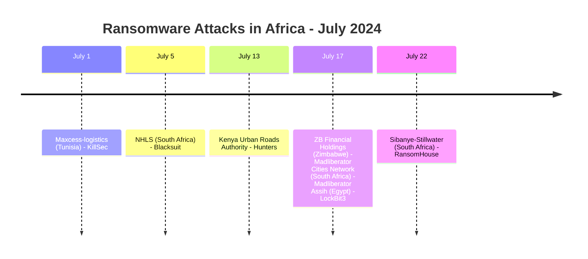
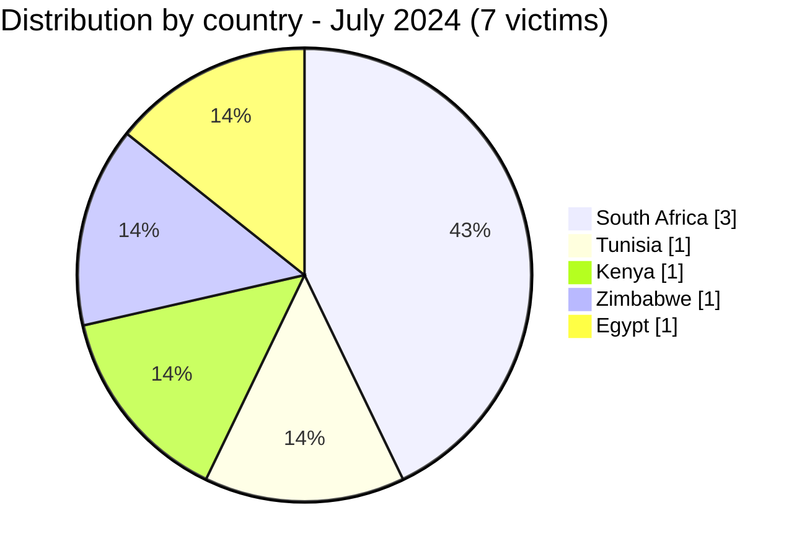

[](https://github.com/Hatchepsoute/AFRINTEL)


# CTI Report - July 2024: Ransomware activity peak in Africa
👉🏾 [French version available here](./README_FR.md)

### 1. Executive summary

In July 2024, Africa recorded **7 documented ransomware victims**. The month saw a **strong rebound** after the June lull (3 victims) and significant geographic and sectoral diversity.

👉🏾 [Victims list](./victims.md)
**Key figures:**
- 🔹 **7 victims** identified
- 🔹 **6 different groups**: KillSec (1), Blacksuit (1), Hunters (1), Madliberator (2), LockBit3 (1), RansomHouse (1)
- 🔹 **Countries affected**: South Africa (3), Tunisia (1), Kenya (1), Zimbabwe (1), Egypt (1)
- 🔹 **Sectors**: Logistics, Healthcare, Rail transport, Finance, Services, Government, Heavy industries (mining)

---

### 2. Attack timeline

| Date       | Victim                          | Country          | Ransomware group |
|------------|----------------------------------|------------------|------------------|
| July 1     | Maxcess-logistics                | Tunisia          | KillSec          |
| July 5     | National health laboratory services | South Africa | Blacksuit        |
| July 13    | Kenya urban roads authority      | Kenya            | Hunters          |
| July 17    | Zb financial holdings            | Zimbabwe         | Madliberator     |
| July 17    | Cities network                   | South Africa     | Madliberator     |
| July 17    | Assih                            | Egypt            | LockBit3         |
| July 22    | Sibanye-stillwater               | South Africa     | RansomHouse      |



---

### 3. Victim analysis

#### 3.1 By country

| Country          | Number of attacks |
|------------------|------------------|
| South Africa     | 3                |
| Tunisia          | 1                |
| Kenya            | 1                |
| Zimbabwe         | 1                |
| Egypt            | 1                |



#### 3.2 By sector

| Sector                            | Count |
|-----------------------------------|-------|
| Logistics                         | 1     |
| Healthcare (national lab)         | 1     |
| Rail/road transport authority     | 1     |
| Financial organizations           | 1     |
| Services (generic)                | 1     |
| Government administration         | 1     |
| Heavy industries (mining)         | 1     |

```mermaid
xychart-beta
    title "Targeted Sectors - July 2024"
    x-axis ["Logistics", "Healthcare", "Transport", "Finance", "Services", "Government", "Heavy industries"]
    y-axis "Number of attacks" 0 to 2
    bar [1, 1, 1, 1, 1, 1, 1]
```

#### 3.3 Ransomware groups

| Ransomware group | Number of attacks |
|------------------|------------------|
| Madliberator     | 2                |
| KillSec          | 1                |
| Blacksuit        | 1                |
| Hunters          | 1                |
| LockBit3         | 1                |
| RansomHouse      | 1                |

```mermaid
gantt
    title Active Ransomware Groups - July 2024
    dateFormat X
    axisFormat %s
    section Madliberator
    Madliberator : 0, 2
    section KillSec
    KillSec : 0, 1
    section Blacksuit
    Blacksuit : 0, 1
    section Hunters
    Hunters : 0, 1
    section LockBit3
    LockBit3 : 0, 1
    section RansomHouse
    RansomHouse : 0, 1
```


---

### 4. Key observations

- **Activity rebound**: 7 attacks in July vs 3 in June - back to a high level.
- **Madliberator** appears for the first time and strikes twice on the same day (July 17) in Zimbabwe and South Africa.
- **Healthcare sector**: South Africa’s National Health Laboratory Service (NHLS) is a critical target.
- **Government entities**: Kenya Urban Roads Authority and Assih (Egypt) show interest in state infrastructure.
- **Mining industry**: Sibanye-Stillwater (gold, platinum) is a strategic target.
- **New group**: RansomHouse (aka RansomHouse) - active on the continent.

---
```mermaid
xychart-beta
    title "Monthly Evolution of Attacks (Jan - Jul 2024)"
    x-axis ["Jan", "Feb", "Mar", "Apr", "May", "Jun", "Jul"]
    y-axis "Number of attacks" 0 to 12
    bar [2, 4, 5, 4, 8, 3, 7]
```
### 5. Recommendations for July 2024

| Domain                        | Recommended action |
|-------------------------------|--------------------|
| Laboratories & healthcare      | Isolate critical systems, monitor access to sensitive data. |
| Government administrations    | Strengthen RDP/VPN monitoring, segment networks. |
| Mining industries             | Offline backups, OT security audits. |
| All organizations             | Track emerging groups (Madliberator, RansomHouse) and their TTPs. |

---

*Rapport généré à partir des données OSINT AFRINTEL - Diffusion libre (TLP:CLEAR)*  
*Report generated from AFRINTEL OSINT data - Free distribution (TLP:CLEAR)*
