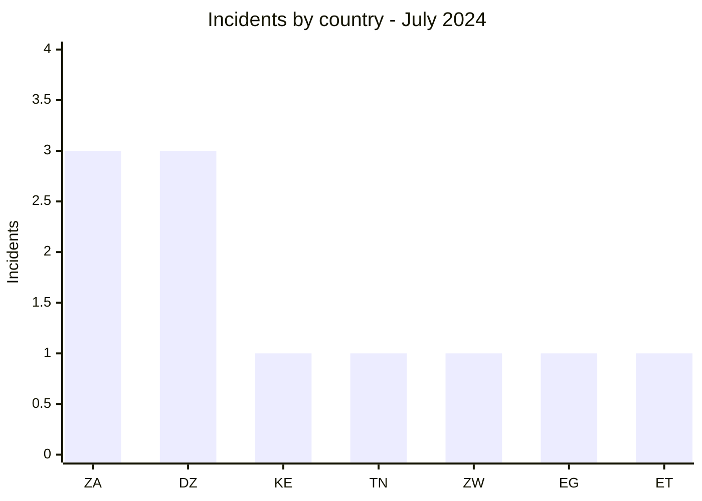
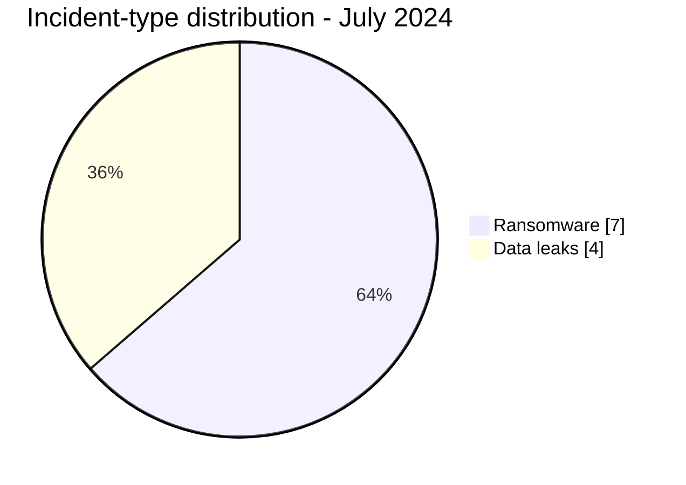

# AFRINTEL CTI Report - July 2024

👉🏾 [Version française](./README_FR.md)

## 1. Executive summary

July 2024 contains **11 incidents**: **7 ransomware claims** and **4 data leaks**. South Africa and Algeria rank first with three incidents each. Algeria's concentration requires caution: all three publications come from a single compilation of older databases being recirculated.

The month spans healthcare, education, defense, transport, finance, and mining. The National War College case contains a material inconsistency: the cited domain belongs to a US institution, while the five provided PNG files point to Ethiopia's F.D.R.E Defence War College. A domain error, naming confusion, or incorrect technical attribution remains possible; AFRINTEL therefore separates the organization observed in the samples from the domain announced by the actor.

See [victims.md](./victims.md).

## 2. Methodology

This report covers publications assigned to July 2024. A repost remains a data-circulation incident in the corpus but is not presented as a new intrusion. Confidence reflects the quality of visible evidence, not the age or reputation of the source alone.

Statistics derive from the **11 incidents** in [victims.md](./victims.md), synchronized with [victims_FR.md](./victims_FR.md).

## 3. Global overview

| Indicator | Value |
|---|---:|
| Incidents / Countries | **11 / 7** |
| Ransomware | **7** |
| Data leaks | **4** |
| Access sales / Defacement | **0 / 0** |

### Country ranking

| Country | Total | Ransomware | Data leak |
|---|---:|---:|---:|
| 🇿🇦 South Africa | 3 | 3 | 0 |
| 🇩🇿 Algeria | 3 | 0 | 3 |
| 🇰🇪 Kenya | 1 | 1 | 0 |
| 🇹🇳 Tunisia | 1 | 1 | 0 |
| 🇿🇼 Zimbabwe | 1 | 1 | 0 |
| 🇪🇬 Egypt | 1 | 1 | 0 |
| 🇪🇹 Ethiopia | 1 | 0 | 1 |
| **Total** | **11** | **7** | **4** |

### Regional distribution

| Region | Total | Ransomware | Data leak |
|---|---:|---:|---:|
| North Africa | 5 | 2 | 3 |
| Southern Africa | 4 | 4 | 0 |
| East Africa | 2 | 1 | 1 |
| **Total** | **11** | **7** | **4** |

### Normalized sector distribution

| Sector | Incidents | Share |
|---|---:|---:|
| Healthcare / Medical | 2 | 18.2% |
| Professional / Business Services | 2 | 18.2% |
| Transport / Logistics | 2 | 18.2% |
| Defense / Security | 1 | 9.1% |
| Education / University | 1 | 9.1% |
| Media / Entertainment | 1 | 9.1% |
| Finance / Banking | 1 | 9.1% |
| Mining / Extractive Industries | 1 | 9.1% |
| **Total** | **11** | **100%** |

### Most visible actors and sources

| Actor or source | Incidents |
|---|---:|
| Addka72424, repost attributed to FriendlyChemist | 3 |
| Mad Liberator | 2 |
| Six other actors or sources | 1 each |

## 4. Comparative analysis: June-July 2024

| Indicator | June 2024 | July 2024 | Absolute change | Change |
|---|---:|---:|---:|---:|
| Incidents | 3 | 11 | +8 | +266.7% |
| Ransomware | 3 | 7 | +4 | +133.3% |
| Data leaks | 0 | 4 | +4 | From 0 to 4 |
| Countries concerned | 2 | 7 | +5 | +250.0% |
| Access sales / Defacement | 0 / 0 | 0 / 0 | 0 / 0 | Stable |

July records a volume **3.7 times higher** than June. The increase consists of four additional ransomware claims and four leaks that were absent from the June corpus. It should not be read as an equivalent multiplication of real compromises: the statistics measure collected publications, and July includes three Algerian reposts from an older compilation as well as a partial Ethiopian sample.

Geographic coverage expands from two to seven countries. South Africa is present in both months, but June’s concentration (2 of 3 incidents) becomes more diffuse in July, when South Africa and Algeria each account for three incidents. The number of countries and incident categories therefore grows faster than the available technical depth.

**Objective reading:** the strongest signal is greater ransomware visibility and the appearance of leaks in the July corpus. The exact cause of the variation, the share of genuinely new incidents, and operational impact remain unknown without victim confirmations, timelines, and DFIR data.

## 5. Detailed analysis by incident type

### 4.1 Ransomware

The seven publications concern Maxcess Logistics, National Health Laboratory Service, Kenya Urban Roads Authority, ZB Financial Holdings, Cities Network, Assih, and Sibanye-Stillwater. Mad Liberator appears twice on the same day, but public sources do not technically connect the two cases.

### 4.2 Data leaks

The three Algerian entries are reposts from a compilation advertised as dating from 2019 to 2023. They measure renewed data circulation, not three July intrusions. The Ethiopian case is linked to the F.D.R.E Defence War College documents observed in the samples. nwc.ndu.edu is retained as the announced but unverified domain; the local directory contains five PNG files and no PST or Exchange export.

## 6. Sectoral impact

Healthcare, professional services, and transport each account for two incidents. The greatest sensitivity concerns visible or claimed medical, education, and military data. Mining and transport organizations mainly face continuity risk that cannot be quantified from publications alone.

## 7. Threat actor profile and risk assessment

| Scope | Level | Rationale |
|---|---|---|
| 🇩🇿 Algeria | 🔴 High | Three recirculated leaks, including healthcare and education |
| 🇿🇦 South Africa | 🔴 High | Three ransomware claims |
| 🇪🇹 Ethiopia | 🔴 High | Visible military documents and inconsistent domain attribution |
| Other countries | 🟠 Medium | One publication per country |

## 8. Key trends and intelligence gaps

- **Observed - high confidence:** seven ransomware incidents and four data leaks.
- **Observed - high confidence:** three Algerian leaks originate from one repost rather than established new intrusions.
- **Gap:** no public DFIR report was identified in the sources reviewed for the ransomware claims.
- **Gap:** the organization observed in the documents is identifiable, but the domain cited in the announcement remains contradictory; the provenance of the claimed 747 MB Exchange volume is not demonstrated.
- **Collection need:** provenance of the Algerian compilation, institutional confirmation, and technical indicators for ransomware cases.

## 9. Contextual MITRE ATT&CK mapping

| Status | Technique | Use |
|---|---|---|
| Preventive | T1486 - Data Encrypted for Impact | Encryption detection; not confirmed in the seven claims |
| Preventive | T1567 - Exfiltration Over Web Service | Outbound monitoring; leak-acquisition method unknown |
| Assumption | T1078 - Valid Accounts | Compromise scenario to investigate; no valid credential observed |

## 10. Recommendations

- **Healthcare and education:** identify old datasets, reset exposed accounts, and monitor republication.
- **Defense:** resolve institutional attribution before public response and protect document systems.
- **Transport and mining:** segment operational environments and test continuity.
- **All organizations:** preserve logs and maintain immutable backups.

## 11. SOC and tactical recommendations

| Qualification | Action |
|---|---|
| **Observed** | Search for accounts and applications referenced in samples; no ransomware chain is confirmed. |
| **Assumption** | Review abnormal authentication, database exports, and archive staging before publication. |
| **Preventive** | Detect mass encryption, backup inhibition, and high-volume outbound transfers. |

## 12. Strategic recommendations

| Priority | Qualification | Measure |
|---:|---|---|
| 1 | **Observed** | Treat data republication and new compromise as separate conditions. |
| 2 | **Assumption** | Investigate links between simultaneous publications without declaring a common campaign. |
| 3 | **Preventive** | Strengthen ASM, phishing-resistant MFA, secret management, and isolated backups. |

## 13. Conclusion

July demonstrates why volume and novelty must be separated. Three of four leaks are older data in circulation, while seven ransomware publications provide limited technical depth. Sound assessment depends on provenance, chronology, and explicit attribution limits.

**AFRINTEL - TLP:CLEAR**

[AFRINTEL repository](https://github.com/Hatchepsoute/AFRINTEL)
