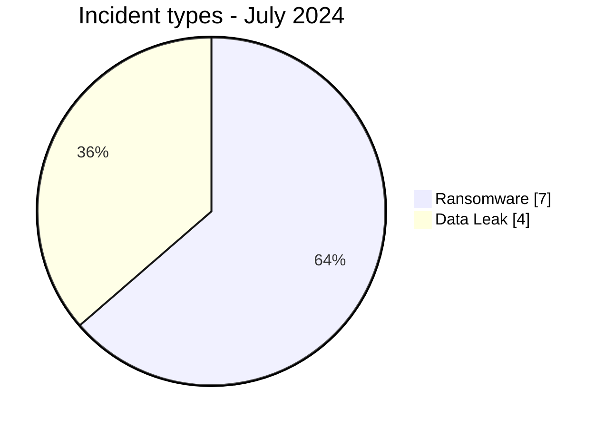
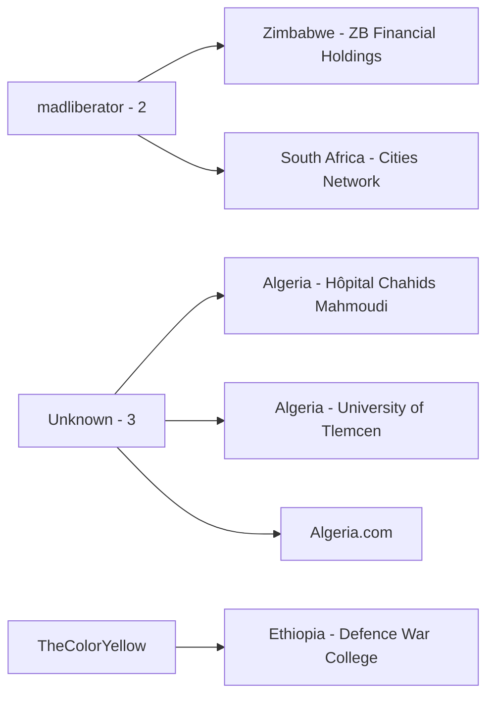
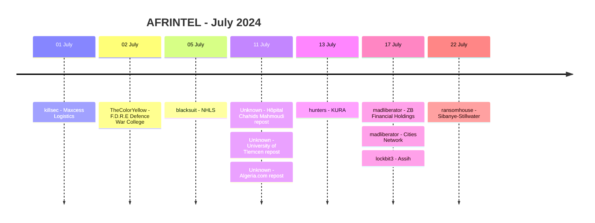

# AFRINTEL CTI Report - July 2024

👉🏾 [Version française](./README_FR.md)

## 1. Executive summary

July 2024 contains **11 documented incident records**: **7 Ransomware** and **4 Data Leak**, across **7 African countries**. No Access Sale, DDoS, Defacement or Operational Fraud record is present in the validated July corpus.

South Africa and Algeria each account for three records. Algeria's concentration requires an important qualification: all three Algerian Data Leak entries come from a July repost of an older compilation containing datasets dated 2019, 2022 and 2023. They are counted as data-circulation incidents in the monthly corpus, not as three newly established July intrusions.

The Ethiopian F.D.R.E Defence War College case also requires caution. The visible sample is consistent with internal Ethiopian military-education documents, while the domain announced by the seller, `nwc.ndu.edu`, belongs to the US National Defense University. AFRINTEL therefore separates the organization visible in the sample from the actor-cited but unverified domain.

👉🏾 [View the full victim list](./victims.md)

### 1.1 Month-over-month comparison

| Indicator | June 2024 | July 2024 | Change |
|---|---:|---:|---:|
| Total incidents | 3 | **11** | **+8 (+266.7%)** |
| Ransomware | 3 | **7** | **+4 (+133.3%)** |
| Data Leak | 0 | **4** | **+4 (new in corpus)** |
| Access Sale | 0 | **0** | Stable |
| DDoS | 0 | **0** | Stable |
| Defacement | 0 | **0** | Stable |
| Operational Fraud | 0 | **0** | Stable |

July's corpus is **3.7 times the size of June's**, but this does not mean confirmed compromises multiplied by the same factor. Three of the four Data Leak records are older datasets recirculated in July, while the seven Ransomware records remain publication claims without public DFIR evidence in the supplied corpus.

## 2. Methodology

- **Period:** 1-31 July 2024.
- **Source of truth:** harmonized `victims_FR.md` / `victims.md`.
- **Counting:** one harmonized card equals one documented incident record.
- **Taxonomy:** Ransomware, Data Leak, Access Sale, DDoS, Defacement, Operational Fraud.
- **Retrospective correction registry:** none of the 10 identified missing 2024 incidents belongs to July.
- **Reposts:** a repost remains a data-circulation incident in the monthly corpus, but is not represented as a new intrusion.
- **Actor/source separation:** reposting accounts are not treated as intrusion actors unless evidence supports that attribution.
- Confidence reflects visible evidence quality, not actor reputation or publication volume.

## 3. Global overview

### 3.1 Incident-type distribution

| Incident type | Records | Share |
|---|---:|---:|
| Ransomware | **7** | **63.6%** |
| Data Leak | **4** | **36.4%** |
| Access Sale | 0 | 0.0% |
| DDoS | 0 | 0.0% |
| Defacement | 0 | 0.0% |
| Operational Fraud | 0 | 0.0% |
| **Total** | **11** | **100%** |

### 3.2 Country distribution

| Country | Ransomware | Data Leak | Total |
|---|---:|---:|---:|
| 🇿🇦 South Africa | 3 | 0 | **3** |
| 🇩🇿 Algeria | 0 | 3 | **3** |
| 🇰🇪 Kenya | 1 | 0 | 1 |
| 🇹🇳 Tunisia | 1 | 0 | 1 |
| 🇿🇼 Zimbabwe | 1 | 0 | 1 |
| 🇪🇬 Egypt | 1 | 0 | 1 |
| 🇪🇹 Ethiopia | 0 | 1 | 1 |
| **Total** | **7** | **4** | **11** |

### 3.3 Regional distribution

| Region | Ransomware | Data Leak | Total |
|---|---:|---:|---:|
| North Africa | 2 | 3 | **5** |
| Southern Africa | 4 | 0 | **4** |
| East Africa | 1 | 1 | **2** |
| **Total** | **7** | **4** | **11** |

### 3.4 Harmonized sector distribution

| Sector | Records | Share |
|---|---:|---:|
| Healthcare / Medical | 2 | 18.2% |
| Professional / Business Services | 2 | 18.2% |
| Transport / Logistics | 2 | 18.2% |
| Defense / Security | 1 | 9.1% |
| Education / University | 1 | 9.1% |
| Media / Entertainment | 1 | 9.1% |
| Finance / Banking | 1 | 9.1% |
| Mining / Extractive Industries | 1 | 9.1% |
| **Total** | **11** | **100%** |

### 3.5 Actors / groups

| Actor / Group | Records |
|---|---:|
| Unknown | **3** |
| madliberator | **2** |
| killsec | 1 |
| TheColorYellow | 1 |
| blacksuit | 1 |
| hunters | 1 |
| lockbit3 | 1 |
| ransomhouse | 1 |
| **Total** | **11** |

> The three `Unknown` records are the Algerian reposted datasets. `Addka72424` and `FriendlyChemist` remain documented as source context, not as confirmed intrusion actors.

## 4. Detailed analysis

### 4.1 Ransomware - 7 records

The seven Ransomware records concern **Maxcess Logistics**, **National Health Laboratory Service**, **Kenya Urban Roads Authority**, **ZB Financial Holdings**, **South African Cities Network**, **Assih** and **Sibanye-Stillwater**.

All seven remain `Claim - Unverified` with low confidence in the supplied victim cards. No accessible technical sample or public DFIR report in the supplied corpus establishes encryption, operational disruption or exfiltration for these seven cases.

`madliberator` appears twice on 17 July, against ZB Financial Holdings and South African Cities Network. The shared publication date and actor are observable facts, but there is no technical evidence in the supplied corpus linking the two incidents through a common initial-access vector, infrastructure or campaign.

### 4.2 Data Leak - 4 records

Three Data Leak entries are Algerian datasets recirculated on 11 July as part of an "Algerian Databases Collection":

- **Hôpital Chahids Mahmoudi:** source file dated 21 September 2023, with an email-filtering log sample. Sensitive health-related metadata is visible, but access to complete mailboxes is not established.
- **University of Tlemcen:** source file dated 27 June 2022. The sample contains a structurally coherent Moodle `mdl_user` table and supports `High` confidence in the dataset's authenticity.
- **Algeria.com:** source file dated September 2019. The data is old, the domain is a generic portal, and no clearly identifiable password field is established, supporting a lower confidence and current relevance assessment.

These three records measure renewed circulation of older material in July 2024, not three newly established intrusions.

The fourth Data Leak concerns **F.D.R.E Defence War College** in Ethiopia. Five visible PNG files support the link to the Ethiopian institution, but the actor-cited domain `nwc.ndu.edu` is inconsistent with that organization. No PST, EML, MSG or Exchange export is present in the supplied material, so the claimed 747 MB of Exchange email cannot be confirmed.

## 5. Key findings and intelligence gaps

- July rises from 3 to **11 records**, but novelty and publication volume must be separated.
- Ransomware accounts for **7 of 11 records (63.6%)**, all unverified in the supplied corpus.
- Three of four Data Leak records are older Algerian datasets recirculated in July.
- South Africa and Algeria each account for three records, but their evidence profiles are very different: ransomware claims in South Africa versus older data circulation in Algeria.
- The University of Tlemcen sample has the strongest authenticity indicators among the Algerian republications.
- The Ethiopian Defence War College sample supports the observed organization but not the actor-cited domain or the claimed Exchange volume.
- The seven ransomware cases still require victim confirmation, technical indicators and operational-impact evidence.

## 6. Contextual MITRE ATT&CK mapping

| Status | Technique | Application |
|---|---|---|
| Preventive | T1486 - Data Encrypted for Impact | Relevant ransomware monitoring; encryption is not confirmed in the seven July claims. |
| Contextual | T1213 - Data from Information Repositories | Relevant to Moodle and other structured repository exposure in the Data Leak cases. |
| Preventive | T1567 - Exfiltration Over Web Service | Relevant outbound monitoring; acquisition/exfiltration channel is not established. |
| Assumption | T1078 - Valid Accounts | Possible scenario to investigate internally, not an observed fact in the supplied evidence. |

## 7. Recommendations

- Treat older-data republication and new compromise as separate analytical conditions.
- For the Algerian records, identify whether exposed accounts are still active and monitor credential reuse without assuming a current intrusion.
- For the Ethiopian military-education case, resolve the domain discrepancy before external attribution or escalation.
- For ransomware-listed organizations, preserve authentication, endpoint, remote-access and backup telemetry around publication dates.
- Monitor later actor updates, victim notices and sample releases that could change evidence status.

## 8. Timeline

## 9. Conclusion

July 2024 closes with **11 documented incident records across 7 African countries**, consisting of **7 Ransomware publications and 4 Data Leak records**. Compared with June, the corpus increases from 3 to 11 records, a rise of **266.7%**. Ransomware publications increase from 3 to 7 and Data Leak reappears with four records.

That increase is real at the level of the AFRINTEL collection, but it must not be read as an equivalent increase in confirmed compromises. Three of the four Data Leak entries are republications of Algerian datasets whose underlying dates are 2019, 2022 and 2023. Their appearance in July reflects renewed circulation and renewed exposure risk, not evidence that the three organizations were newly breached during July 2024. This distinction materially changes how the country's apparent concentration should be interpreted.

The month also illustrates the importance of provenance. The F.D.R.E Defence War College case contains visible documents consistent with the Ethiopian institution, but the domain cited by the seller belongs to a different institution in the United States. The supplied files strengthen sample attribution to the Ethiopian organization, while failing to substantiate the announced Exchange origin or 747 MB volume. Preserving that contradiction is analytically stronger than forcing the actor's announcement and the observed evidence into a single unsupported narrative.

Ransomware visibility is broader than in June, yet the seven ransomware cards remain low-confidence, unverified claims in the supplied corpus. The simultaneous `madliberator` publications against two organizations are noteworthy for monitoring, but no technical evidence establishes a common intrusion path or campaign. The available evidence therefore supports a statement about greater **publication visibility**, not about a proven coordinated surge in ransomware compromises.

For AFRINTEL, July demonstrates that **volume, novelty, provenance and evidence maturity must be evaluated together**. The most defensible reading is not simply that July was "more attacked" than June. Rather, AFRINTEL observed a much larger and more diverse publication corpus, partly driven by recirculated historical data, alongside seven ransomware claims whose technical impact remains largely unverified. Continued monitoring should focus on victim confirmations, later samples, regulatory disclosures and technical indicators capable of separating persistent data exposure from genuinely new compromise activity.

**AFRINTEL** - TLP:CLEAR
