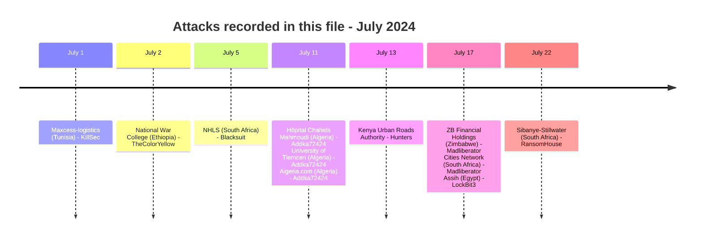
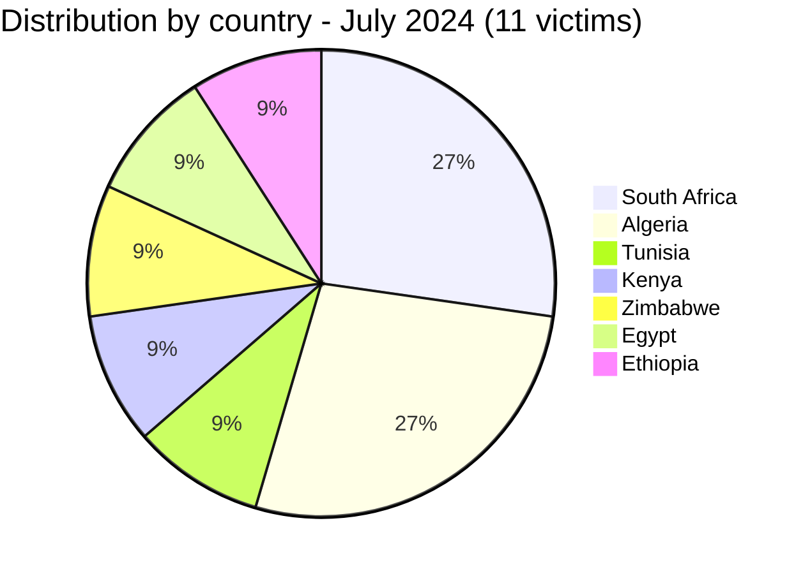
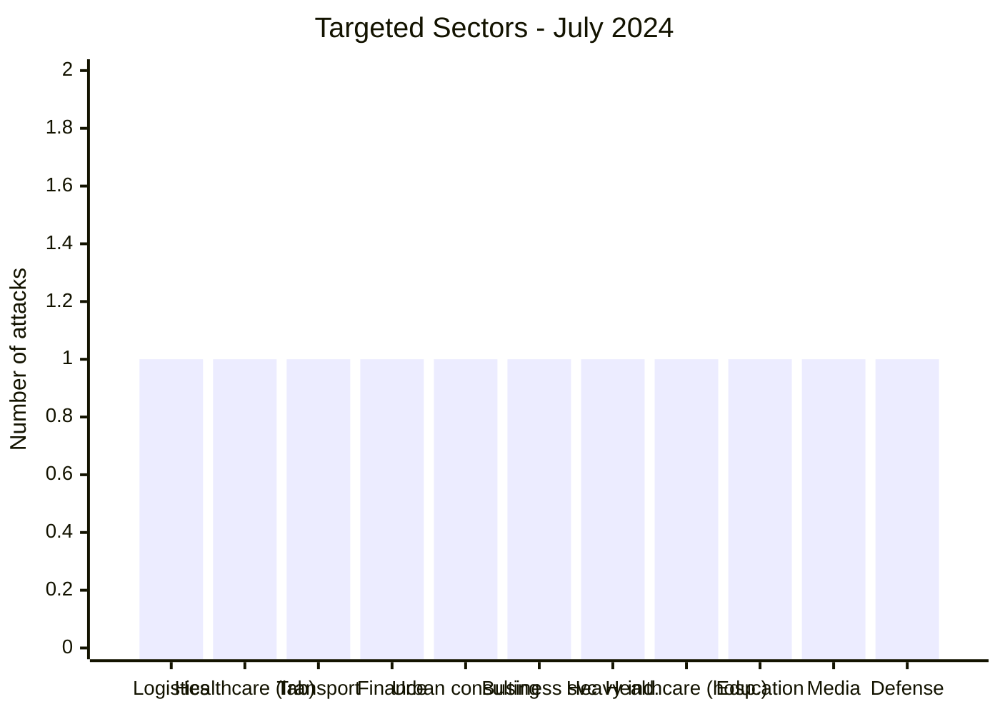

[](https://github.com/Hatchepsoute/AFRINTEL)


# CTI Report - July 2024: Ransomware activity peak in Africa
👉🏾 [French version available here](./README_FR.md)

### 1. Executive summary

In July 2024, Africa recorded **11 documented victims** in this file: **7 ransomware victims**, claimed by six different groups, and **4 data leak claims**. Three of the data leak claims are in **Algeria**, all coming from a single compilation reposted on July 11, 2024 by the account Addka72424 (originally attributed to FriendlyChemist), bundling older samples dated between 2019 and 2023 and associated with Hôpital Chahids Mahmoudi, the University of Tlemcen and the Algeria.com portal. The fourth is a July 2 claim by the actor TheColorYellow against an **Ethiopian military-education institution** (documents reviewed by AFRINTEL bear the FDRE Defence War College letterhead, though the domain cited in the post, nwc.ndu.edu, matches the unrelated US National Defense University). The month saw a **strong rebound** in ransomware activity after the June lull (3 victims), significant geographic and sectoral diversity, and the resurfacing of an old Algerian dataset that has been circulating on cybercriminal forums for several years.

**Key figures:**
- 🔹 **11 victims** identified
- 🔹 **8 sources**: KillSec (1), Blacksuit (1), Hunters (1), Madliberator (2), LockBit3 (1), RansomHouse (1), Addka72424 (3), TheColorYellow (1)
- 🔹 **Countries affected**: South Africa (3), Algeria (3), Tunisia (1), Kenya (1), Zimbabwe (1), Egypt (1), Ethiopia (1)
- 🔹 **Sectors**: Logistics, Healthcare (public lab), Urban road transport, Finance, Urban consulting services, Business services, Heavy industries, Healthcare (private hospital), Education, Media / Web portal, Defense / Military education
- 🔹 **Incident types**: Ransomware (7), Data Leak (4)
### Monthly aggregate exposure view

The monthly CTI view combines data leaks and access sales as **data exposure**: **4 records** (36.4% of the monthly corpus). Source cards remain authoritative; an access sale does not by itself prove data exfiltration.


👉🏾 [Victims list](./victims.md)

---

### 2. Attack timeline

| Date       | Victim                          | Country          | Actor / Group | Type | Leak date |
|------------|----------------------------------|------------------|------------------|------|-----------|
| July 1     | Maxcess-logistics                | Tunisia          | KillSec          | Ransomware | - |
| July 2     | National War College (nwc.ndu.edu) | Ethiopia       | TheColorYellow    | Data Leak | - |
| July 5     | National health laboratory services | South Africa | Blacksuit        | Ransomware | - |
| July 11    | Hôpital Chahids Mahmoudi (hcm-dz.com) | Algeria      | Addka72424 (repost, FriendlyChemist) | Data Leak | September 21, 2023 |
| July 11    | University of Tlemcen (univ-tlemcen.dz) | Algeria   | Addka72424 (repost, FriendlyChemist) | Data Leak | June 27, 2022 |
| July 11    | Algeria.com (web portal)         | Algeria          | Addka72424 (repost, FriendlyChemist) | Data Leak | September 2019 |
| July 13    | Kenya urban roads authority      | Kenya            | Hunters           | Ransomware | - |
| July 17    | Zb financial holdings            | Zimbabwe         | Madliberator      | Ransomware | - |
| July 17    | Cities network                   | South Africa     | Madliberator      | Ransomware | - |
| July 17    | Assih                            | Egypt            | LockBit3          | Ransomware | - |
| July 22    | Sibanye-stillwater               | South Africa     | RansomHouse       | Ransomware | - |



---

### 3. Victim analysis

#### 3.1 By country

| Country          | Number of attacks |
|------------------|------------------|
| South Africa     | 3                |
| Algeria          | 3                |
| Tunisia          | 1                |
| Kenya            | 1                |
| Zimbabwe         | 1                |
| Egypt            | 1                |
| Ethiopia         | 1                |



#### 3.2 By sector

| Sector                                | Count |
|----------------------------------------|-------|
| Logistics                              | 1     |
| Healthcare (public lab)                | 1     |
| Rail/road transport authority          | 1     |
| Financial organizations                | 1     |
| Urban consulting services              | 1     |
| Business services / Consulting         | 1     |
| Heavy industries (mining)              | 1     |
| Healthcare (private hospital)          | 1     |
| Education / Higher education           | 1     |
| Media / Web portal                     | 1     |
| Defense / Military education           | 1     |



#### 3.3 Ransomware groups

| Ransomware group | Number of attacks |
|------------------|------------------|
| Madliberator     | 2                |
| KillSec          | 1                |
| Blacksuit        | 1                |
| Hunters          | 1                |
| LockBit3         | 1                |
| RansomHouse      | 1                |

```mermaid
gantt
    title Active Ransomware Groups - July 2024
    dateFormat X
    axisFormat %s
    section Madliberator
    Madliberator : 0, 2
    section KillSec
    KillSec : 0, 1
    section Blacksuit
    Blacksuit : 0, 1
    section Hunters
    Hunters : 0, 1
    section LockBit3
    LockBit3 : 0, 1
    section RansomHouse
    RansomHouse : 0, 1
```



#### 3.4 Data leak sources

| Source | Number of claims |
|--------|-------------------|
| Addka72424 (repost, originally attributed to FriendlyChemist) | 3 |
| TheColorYellow (post on RaidForums) | 1 |

---

### 4. Key observations

- **Ransomware activity rebound**: 7 ransomware attacks in July vs 3 in June - back to a high level.
- **Madliberator** appears for the first time and strikes twice on the same day (July 17) in Zimbabwe and South Africa.
- **Healthcare sector**: South Africa's National Health Laboratory Service (NHLS) is a critical ransomware target.
- **Government entities**: Kenya Urban Roads Authority and Assih (Egypt) show interest in state infrastructure.
- **Mining industry**: Sibanye-Stillwater (gold, platinum) is a strategic target.
- **New group**: RansomHouse - active on the continent.
- **Reposted Algerian compilation**: the three July 11, 2024 entries (Hôpital Chahids Mahmoudi, University of Tlemcen, Algeria.com) come from a single compilation titled "Algerian Databases Collection", reposted by the account Addka72424 from an original post attributed to FriendlyChemist. These are not new intrusions but the recirculation of samples dated between 2019 and 2023. They are counted separately from ransomware as data leaks, with differentiated confidence levels (medium for the hospital, high for the university, low for Algeria.com) based on the quality of the observed samples.
- **Ethiopia, domain inconsistency flagged**: the July 2 claim by TheColorYellow cites the domain "nwc.ndu.edu", which in reality belongs to the (US) National Defense University's National War College, but the document samples shown bear the emblem and Amharic-language letterhead of the FDRE Defence War College, an Ethiopian military institution. AFRINTEL records the claim against the Ethiopian institution identifiable from the letterhead and flags the domain cited by the actor as unverified rather than discarding or silently correcting the claim.

---

```mermaid
xychart-beta
    title "Monthly Evolution of Attacks (Jan - Jul 2024)"
    x-axis ["Jan", "Feb", "Mar", "Apr", "May", "Jun", "Jul"]
    y-axis "Number of attacks" 0 to 12
    bar [2, 4, 5, 4, 8, 3, 11]
```
### 5. Recommendations for July 2024

| Domain                        | Recommended action |
|-------------------------------|--------------------|
| Laboratories & healthcare      | Isolate critical systems, monitor access to sensitive data. |
| Government administrations    | Strengthen RDP/VPN monitoring, segment networks. |
| Mining industries             | Offline backups, OT security audits. |
| Hospitals                     | Verify whether the reposted email logs correspond to a real system, review email gateway access logs, and raise staff awareness of phishing exploiting patient references. |
| Higher education              | Verify the status of the affected Moodle database, reset exposed accounts starting with administrator accounts, and review the scope of the authentication federation with the other identified universities. |
| Defense / Military education  | Audit Exchange server access logs and mailbox export activity, restrict administrative-document distribution, and independently verify the institution's public-facing domain records to detect impersonation or metadata confusion in future claims. |
| All organizations             | Track emerging groups (Madliberator, RansomHouse) and their TTPs, and monitor the reuse of old Algerian datasets circulating on forums. |

---

*Rapport généré à partir des données OSINT AFRINTEL - Diffusion libre (TLP:CLEAR)*  
*Report generated from AFRINTEL OSINT data - Free distribution (TLP:CLEAR)*
