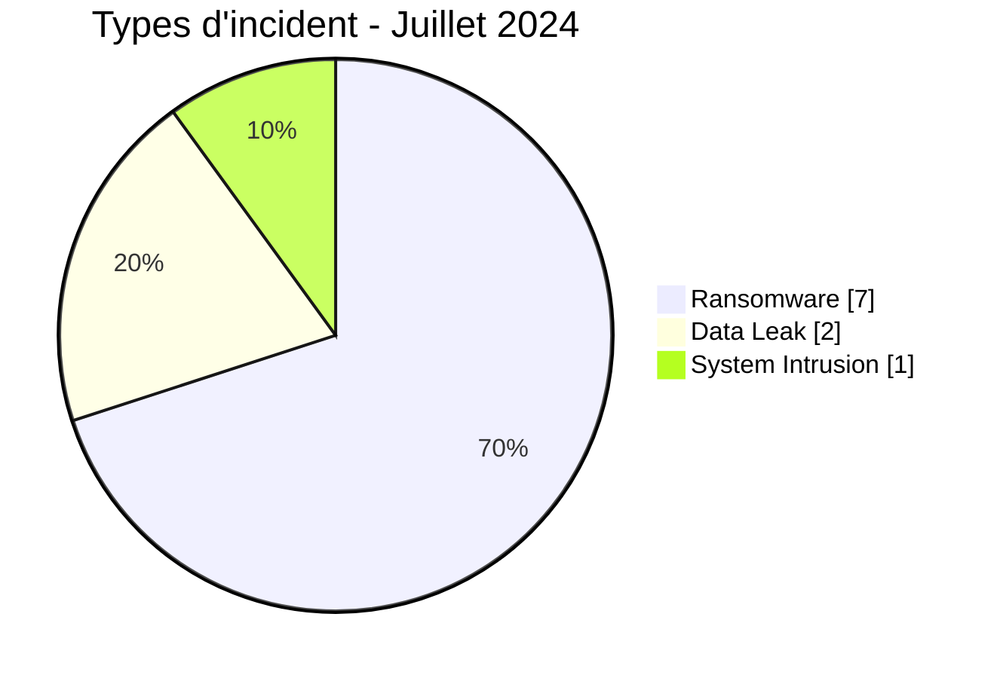

# Rapport CTI AFRINTEL - Cybermenaces en Afrique - Juillet 2024

👉🏾 [English version](./README.md)

## 1. Synthèse exécutive

En Juillet 2024, AFRINTEL retient **10 cyberincidents canoniques dans 8 pays**. Le mois est dominé par **Ransomware (7, 70,0 %)** puis **Data Leak (2, 20,0 %)**. Les pays les plus représentés sont **Afrique du Sud (3)**, **Tunisie (1)**, **Éthiopie (1)**. Les secteurs les plus visibles sont **Services professionnels / Business (3)**, **Transport / Logistique (2)**, **Défense / Sécurité (1)**. Les labels acteur/groupe les plus fréquents sont `madliberator` (2), `killsec` (1), `TheColorYellow` (1). `Unknown` désigne une absence d'attribution, pas un groupe.

La maturité de preuve est répartie entre **Claim - Unverified: 7**, **Claim - Data Sample Published: 1**, **Confirmed: 1**, **Corroborated: 1**. Les claims ne sont pas convertis en confirmations sans preuve supplémentaire.

### 1.1 Étude comparative avec le mois précédent

| Indicateur | Juin 2024 | Juillet 2024 | Évolution |
|---|---|---|---|
| Total | 3 | 10 | +7 (+233,3 %) |
| Ransomware | 3 | 7 | +4 (+133,3 %) |
| Data Leak | 0 | 2 | +2 (nouveau) |
| Access Sale | 0 | 0 | Stable |
| DDoS | 0 | 0 | Stable |
| Defacement | 0 | 0 | Stable |
| Account Takeover | 0 | 0 | Stable |
| System Intrusion | 0 | 1 | +1 (nouveau) |
| Malware | 0 | 0 | Stable |
| Operational Fraud | 0 | 0 | Stable |

### 1.2 Analyse comparative

Le volume mensuel **augmente de 7 incident(s)**. Les variations structurantes sont : Ransomware 3->7 (+4), Data Leak 0->2 (+2), System Intrusion 0->1 (+1). Cette variation décrit le corpus documenté, pas nécessairement une variation équivalente du nombre réel de compromissions sur le continent.

## 2. Méthodologie

- Un incident canonique correspond à un événement retenu dans le millésime 2024.
- Les découvertes/republications historiques sont conservées séparément et ne gonflent pas les statistiques 2024.
- La date d'incident ou la meilleure fenêtre soutenue prime ; la date de découverte AFRINTEL reste distincte.
- Les 9 types AFRINTEL sont utilisés ; une tentative est représentée par le statut, jamais par un type `Attempted Attack`.
- Un DDoS coordonné est compté par campagne.
- Type, statut, confiance, impact, attribution et source restent distincts.

## 3. Répartition par type d'incident

| Type | Fiches | Part |
|---|---|---|
| Ransomware | 7 | 70,0 % |
| Data Leak | 2 | 20,0 % |
| Access Sale | 0 | 0,0 % |
| DDoS | 0 | 0,0 % |
| Defacement | 0 | 0,0 % |
| Account Takeover | 0 | 0,0 % |
| System Intrusion | 1 | 10,0 % |
| Malware | 0 | 0,0 % |
| Operational Fraud | 0 | 0,0 % |

## 4. Pays x type

| Pays | Total | Ransomware | Data Leak | Access Sale | DDoS | Defacement | Account Takeover | System Intrusion | Malware | Operational Fraud |
|---|---|---|---|---|---|---|---|---|---|---|
| Afrique du Sud | 3 | 3 | 0 | 0 | 0 | 0 | 0 | 0 | 0 | 0 |
| Tunisie | 1 | 1 | 0 | 0 | 0 | 0 | 0 | 0 | 0 | 0 |
| Éthiopie | 1 | 0 | 1 | 0 | 0 | 0 | 0 | 0 | 0 | 0 |
| Algérie | 1 | 0 | 0 | 0 | 0 | 0 | 0 | 1 | 0 | 0 |
| Kenya | 1 | 1 | 0 | 0 | 0 | 0 | 0 | 0 | 0 | 0 |
| Zimbabwe | 1 | 1 | 0 | 0 | 0 | 0 | 0 | 0 | 0 | 0 |
| Égypte | 1 | 1 | 0 | 0 | 0 | 0 | 0 | 0 | 0 | 0 |
| Maroc | 1 | 0 | 1 | 0 | 0 | 0 | 0 | 0 | 0 | 0 |

## 5. Répartition régionale

| Région | Fiches | Part |
|---|---|---|
| Afrique du Nord | 4 | 40,0 % |
| Afrique australe | 4 | 40,0 % |
| Afrique de l'Est | 2 | 20,0 % |

## 6. Répartition sectorielle

| Secteur | Fiches | Part |
|---|---|---|
| Services professionnels / Business | 3 | 30,0 % |
| Transport / Logistique | 2 | 20,0 % |
| Défense / Sécurité | 1 | 10,0 % |
| Santé / Médical | 1 | 10,0 % |
| Finance / Banque | 1 | 10,0 % |
| Mines / Industries extractives | 1 | 10,0 % |
| Aviation | 1 | 10,0 % |

## 7. Acteurs / groupes

| Acteur / Groupe | Fiches | Part |
|---|---|---|
| madliberator | 2 | 20,0 % |
| killsec | 1 | 10,0 % |
| TheColorYellow | 1 | 10,0 % |
| blacksuit | 1 | 10,0 % |
| Unknown | 1 | 10,0 % |
| hunters | 1 | 10,0 % |
| lockbit3 | 1 | 10,0 % |
| ransomhouse | 1 | 10,0 % |
| vjvjvj | 1 | 10,0 % |

## 8. Maturité des preuves

| Position de preuve | Fiches | Part |
|---|---|---|
| Claim - Unverified | 7 | 70,0 % |
| Claim - Data Sample Published | 1 | 10,0 % |
| Confirmed | 1 | 10,0 % |
| Corroborated | 1 | 10,0 % |

### Confiance

| Confiance | Fiches | Part |
|---|---|---|
| Low | 7 | 70,0 % |
| High | 2 | 20,0 % |
| Medium | 1 | 10,0 % |

## 9. Chronologie

```mermaid
timeline
    title AFRINTEL - Juillet 2024
    01 Juillet 2024 : Maxcess-logistics
- **Acteur / Groupe -** killsec
- **Secteur -** Transport / Logistics
- **Site web -** [maxcess-logistics.com](https -//www.maxcess-logistics.com)
- **Statut -** Claim - Unverified
- **Type d'incident -** Ransomware
- **Niveau de confiance -** Low
- **Niveau d'impact -** Level 2
- **Description victime -** Maxcess-logistics est une organisation basée en Tunisie, classée dans Transport / Logistics dans le corpus AFRINTEL.


- **Note de fiabilité -**
  La fiche documente une publication sur un leak site ransomware, sans échantillon technique ni confirmation indépendante de la victime dans le matériel fourni. AFRINTEL ne confirme donc ni l'intrusion, ni le chiffrement, ni l'exfiltration sur la seule base de cette publication.
    02 Juillet 2024 : F.D.R.E Defence War College (domaine cité  - nwc.ndu.edu)

- **Acteur / Groupe -** TheColorYellow
- **Contexte source -** Publication de vente de données sur RaidForums
- **Secteur -** Defense / Security
- **Statut -** Claim - Data Sample Published
- **Site web -** [dwc.edu.et](https -//dwc.edu.et/wc/) (organisation observée dans les échantillons) ; domaine cité par l'acteur  - nwc.ndu.edu
- **Niveau de confiance -** Medium
- **Niveau d'impact -** Level 4
- **Type d'incident -** Data Leak
- **Date de découverte -** 02 juillet 2024

- **Note de fiabilité -**
  La publication de TheColorYellow annonce une victime présentée comme le « National War College of Ethiopia » et cite le domaine nwc.ndu.edu. Ce domaine correspond au National War College de la National Defense University des États-Unis. Toutefois, les cinq fichiers PNG fournis localement présentent l'emblème et l'en-tête en amharique du « F.D.R.E Defence War College » éthiopien, ainsi que des documents internes, un inventaire de 29 postes et un tableau de 17 entrées téléphoniques. Une erreur de domaine dans l'annonce, une confusion de nom ou une attribution technique incorrecte restent donc possibles. AFRINTEL retient comme organisation observée le F.D.R.E Defence War College et conserve nwc.ndu.edu comme domaine annoncé mais non vérifié.

- **Description -**
  Les éléments visibles correspondent au F.D.R.E Defence War College, établissement d’enseignement militaire éthiopien. Le lien officiel observé pour cette organisation est [dwc.edu.et](https -//dwc.edu.et/wc/). Le domaine nwc.ndu.edu reste uniquement le domaine cité dans l’annonce de l’acteur.

- **Analyse -**
  L'acteur TheColorYellow affirme détenir 747 Mo de courriels confidentiels prétendument volés directement sur le serveur Exchange de l'établissement, exportés sous forme de fichiers de boîtes aux lettres PST, et propose ces données pour 500 $ avec recours à un escrow. Le répertoire local fourni contient cinq PNG, mais aucun PST, EML, MSG ou export Exchange. Les images comprennent des documents institutionnels, un avis en chinois pour les étudiants internationaux, un inventaire visible de 29 postes et un tableau visible de 17 entrées téléphoniques. Ces éléments sont cohérents avec des documents internes du F.D.R.E Defence War College et renforcent l'attribution de l'échantillon, mais ne confirment ni l'accès au serveur Exchange, ni l'existence des 747 Mo, ni l'exhaustivité ou l'origine des données. L'OCR amharique et chinois n'a pas été utilisé pour transcrire les valeurs ; aucun nom, numéro, identifiant matériel ou numéro de téléphone n'est reproduit.
    5 Juillet 2024 : National health laboratory services (NHLS)
- **Acteur / Groupe -** blacksuit
- **Secteur -** Healthcare / Medical
- **Site web -** [nhls.ac.za](https -//www.nhls.ac.za)
- **Statut -** Claim - Unverified
- **Type d'incident -** Ransomware
- **Niveau de confiance -** Low
- **Niveau d'impact -** Level 3
- **Description victime -** Le National Health Laboratory Service (NHLS) est une organisation sud-africaine de services de laboratoires publics, classée dans Healthcare / Medical.


- **Note de fiabilité -**
  La fiche documente une publication sur un leak site ransomware, sans échantillon technique ni confirmation indépendante de la victime dans le matériel fourni. AFRINTEL ne confirme donc ni l'intrusion, ni le chiffrement, ni l'exfiltration sur la seule base de cette publication.
    10 Juillet 2024 : EmploiPartner
- **Date de l'incident -** 10 Juillet 2024
- **Date de publication initiale / source retenue -** 14 juillet 2024
- **Date de découverte AFRINTEL -** 23 août 2026 - audit rétrospectif
- **Précision chronologique -** Date du mercredi 10 juillet supportée par les sources de l'audit.
- **Acteur / Groupe -** Unknown
- **Secteur -** Professional / Business Services
- **Site web -** [emploipartner.com](https -//www.emploipartner.com/)
- **Statut -** Victim Confirmed
- **Type d'incident -** System Intrusion
- **Niveau de confiance -** High
- **Niveau d'impact -** Level 3
- **Analyse -** EmploiPartner a indiqué avoir détecté et maîtrisé une intrusion non autorisée, lancé une enquête et renforcé sa plateforme. Les sources publiques utilisées dans l'audit ne suffisent pas à confirmer une exfiltration de données, un ransomware, un DDoS ou une vente d'accès. AFRINTEL retient `System Intrusion`.
- **Sources publiques -** [Le Jeune Indépendant](https -//www.jeune-independant.net/wp-content/uploads/2024/07/EDITION-14-07-2024.pdf) | [KonBriefing](https -//konbriefing.com/en-topics/cyber-attacks-2024.html) | [EmploiPartner](https -//www.emploipartner.com/)

----------------------------
    13 Juillet 2024 : Kenya urban roads authority (KURA)
- **Acteur / Groupe -** hunters
- **Secteur -** Transport / Logistics
- **Site web -** [kura.go.ke](https -//www.kura.go.ke)
- **Statut -** Claim - Unverified
- **Type d'incident -** Ransomware
- **Niveau de confiance -** Low
- **Niveau d'impact -** Level 2
- **Description victime -** La Kenya Urban Roads Authority (KURA) est une autorité publique kenyane chargée des infrastructures routières urbaines, classée dans Transport / Logistics.


- **Note de fiabilité -**
  La fiche documente une publication sur un leak site ransomware, sans échantillon technique ni confirmation indépendante de la victime dans le matériel fourni. AFRINTEL ne confirme donc ni l'intrusion, ni le chiffrement, ni l'exfiltration sur la seule base de cette publication.
    17 Juillet 2024 : Zb financial holdings
- **Acteur / Groupe -** madliberator
- **Secteur -** Finance / Banking
- **Site web -** [zb.co.zw](https -//www.zb.co.zw)
- **Statut -** Claim - Unverified
- **Type d'incident -** Ransomware
- **Niveau de confiance -** Low
- **Niveau d'impact -** Level 3
- **Description victime -** ZB Financial Holdings est une organisation financière zimbabwéenne classée dans Finance / Banking.


- **Note de fiabilité -**
  La fiche documente une publication sur un leak site ransomware, sans échantillon technique ni confirmation indépendante de la victime dans le matériel fourni. AFRINTEL ne confirme donc ni l'intrusion, ni le chiffrement, ni l'exfiltration sur la seule base de cette publication.
    17 Juillet 2024 : Cities network
- **Acteur / Groupe -** madliberator
- **Secteur -** Professional / Business Services
- **Site web -** [sacities.net](https -//www.sacities.net)
- **Statut -** Claim - Unverified
- **Type d'incident -** Ransomware
- **Niveau de confiance -** Low
- **Niveau d'impact -** Level 2
- **Description victime -** South African Cities Network est classé dans Professional / Business Services dans le corpus AFRINTEL.


- **Note de fiabilité -**
  La fiche documente une publication sur un leak site ransomware, sans échantillon technique ni confirmation indépendante de la victime dans le matériel fourni. AFRINTEL ne confirme donc ni l'intrusion, ni le chiffrement, ni l'exfiltration sur la seule base de cette publication.
    17 Juillet 2024 : Assih
- **Acteur / Groupe -** lockbit3
- **Secteur -** Professional / Business Services
- **Site web -** [assih.com](https -//www.assih.com)
- **Statut -** Claim - Unverified
- **Type d'incident -** Ransomware
- **Niveau de confiance -** Low
- **Niveau d'impact -** Level 2
- **Description victime -** Assih est une organisation basée en Égypte, classée dans Professional / Business Services dans le corpus AFRINTEL.


- **Note de fiabilité -**
  La fiche documente une publication sur un leak site ransomware, sans échantillon technique ni confirmation indépendante de la victime dans le matériel fourni. AFRINTEL ne confirme donc ni l'intrusion, ni le chiffrement, ni l'exfiltration sur la seule base de cette publication.
    22 Juillet 2024 : Sibanye-stillwater
- **Acteur / Groupe -** ransomhouse
- **Secteur -** Mining / Extractive Industries
- **Site web -** [sibanyestillwater.com](https -//www.sibanyestillwater.com)
- **Statut -** Claim - Unverified
- **Type d'incident -** Ransomware
- **Niveau de confiance -** Low
- **Niveau d'impact -** Level 2
- **Description victime -** Sibanye-Stillwater est une organisation minière basée en Afrique du Sud, classée dans Mining / Extractive Industries.

---

- **Note de fiabilité -**
  La fiche documente une publication sur un leak site ransomware, sans échantillon technique ni confirmation indépendante de la victime dans le matériel fourni. AFRINTEL ne confirme donc ni l'intrusion, ni le chiffrement, ni l'exfiltration sur la seule base de cette publication.
    26 Juillet 2024 : Arab Civil Aviation Organization (ACAO)
- **Date de compromission -** Inconnue - au plus tard le 26 juillet 2024
- **Date de publication initiale observée -** 26 juillet 2024
- **Date de republication observée -** 12 novembre 2024
- **Publication ultérieure observée -** 24 décembre 2024
- **Acteur / Groupe -** vjvjvj
- **Affiliation revendiquée -** The Night Hunters - selon le post observé
- **Secteur -** Aviation
- **Site web -** [acao.org.ma](https -//acao.org.ma)
- **Statut -** Corroborated
- **Type d'incident -** Data Leak
- **Niveau de confiance -** High
- **Niveau d'impact -** Level 4
- **Description victime -** L'Arab Civil Aviation Organization (ACAO) est une organisation intergouvernementale basée à Rabat, au Maroc, active dans la coordination de l'aviation civile entre États arabes.
- **Analyse -** AFRINTEL dispose désormais d'une chronologie plus complète. Une publication du 26 juillet 2024 annonce une base ACAO et fournit un échantillon ainsi qu'une archive annoncée. Une publication du 12 novembre 2024 est explicitement marquée `[REPOST]`, ce qui indique qu'elle ne constitue pas une nouvelle compromission. Une autre publication du 24 décembre 2024 revendique à nouveau une compromission et affiche un échantillon de données associé à ACAO. Les éléments visibles dans les captures et le fichier structuré examiné sont cohérents avec des données liées à l'écosystème ACAO et de l'aviation civile, notamment des informations de contact, fonctions et éléments professionnels. AFRINTEL ne reproduit aucune donnée personnelle brute. Ces éléments corroborent l'existence d'une exposition de données, mais ne permettent pas d'établir la date technique exacte de l'accès initial ni de prouver que la publication de décembre correspond à une seconde intrusion indépendante.
- **Qualification de la preuve -** `Corroborated`. Plusieurs publications distinctes se recoupent et des échantillons cohérents avec ACAO sont visibles. Il n'existe toutefois pas de confirmation publique de la victime ou d'une autorité identifiée dans les éléments examinés.
- **Source / provenance -** Publications underground observées et analysées par AFRINTEL ; captures conservées. Aucune URL opérationnelle du forum ou de téléchargement n'est publiée.

----------------------------
```

## 10. Analyse CTI par type

### Ransomware - 7

**7 fiche(s) (70,0 %).** Principaux pays : Afrique du Sud (3), Tunisie (1), Kenya (1). Les conclusions restent limitées aux éléments documentés ; le type ne permet pas d'inférer un vecteur ou un impact non observé.

### Data Leak - 2

**2 fiche(s) (20,0 %).** Principaux pays : Éthiopie (1), Maroc (1). Les conclusions restent limitées aux éléments documentés ; le type ne permet pas d'inférer un vecteur ou un impact non observé.

### System Intrusion - 1

**1 fiche(s) (10,0 %).** Principaux pays : Algérie (1). Les conclusions restent limitées aux éléments documentés ; le type ne permet pas d'inférer un vecteur ou un impact non observé.

## 11. Incidents prioritaires pour revue

| Pays | Organisation | Type | Statut | Impact | Confiance |
|---|---|---|---|---|---|
| Maroc | Arab Civil Aviation Organization (ACAO)
- **Date de compromission:** Inconnue - au plus tard le 26 juillet 2024
- **Date de publication initiale observée:** 26 juillet 2024
- **Date de republication observée:** 12 novembre 2024
- **Publication ultérieure observée:** 24 décembre 2024
- **Acteur / Groupe:** vjvjvj
- **Affiliation revendiquée:** The Night Hunters - selon le post observé
- **Secteur:** Aviation
- **Site web:** [acao.org.ma](https://acao.org.ma)
- **Statut:** Corroborated
- **Type d'incident:** Data Leak
- **Niveau de confiance:** High
- **Niveau d'impact:** Level 4
- **Description victime:** L'Arab Civil Aviation Organization (ACAO) est une organisation intergouvernementale basée à Rabat, au Maroc, active dans la coordination de l'aviation civile entre États arabes.
- **Analyse:** AFRINTEL dispose désormais d'une chronologie plus complète. Une publication du 26 juillet 2024 annonce une base ACAO et fournit un échantillon ainsi qu'une archive annoncée. Une publication du 12 novembre 2024 est explicitement marquée `[REPOST]`, ce qui indique qu'elle ne constitue pas une nouvelle compromission. Une autre publication du 24 décembre 2024 revendique à nouveau une compromission et affiche un échantillon de données associé à ACAO. Les éléments visibles dans les captures et le fichier structuré examiné sont cohérents avec des données liées à l'écosystème ACAO et de l'aviation civile, notamment des informations de contact, fonctions et éléments professionnels. AFRINTEL ne reproduit aucune donnée personnelle brute. Ces éléments corroborent l'existence d'une exposition de données, mais ne permettent pas d'établir la date technique exacte de l'accès initial ni de prouver que la publication de décembre correspond à une seconde intrusion indépendante.
- **Qualification de la preuve:** `Corroborated`. Plusieurs publications distinctes se recoupent et des échantillons cohérents avec ACAO sont visibles. Il n'existe toutefois pas de confirmation publique de la victime ou d'une autorité identifiée dans les éléments examinés.
- **Source / provenance:** Publications underground observées et analysées par AFRINTEL ; captures conservées. Aucune URL opérationnelle du forum ou de téléchargement n'est publiée.

---------------------------- | Data Leak | Corroborated | Level 4 | High |
| Éthiopie | F.D.R.E Defence War College (domaine cité : nwc.ndu.edu)

- **Acteur / Groupe:** TheColorYellow
- **Contexte source:** Publication de vente de données sur RaidForums
- **Secteur:** Defense / Security
- **Statut:** Claim - Data Sample Published
- **Site web:** [dwc.edu.et](https://dwc.edu.et/wc/) (organisation observée dans les échantillons) ; domaine cité par l'acteur : nwc.ndu.edu
- **Niveau de confiance:** Medium
- **Niveau d'impact:** Level 4
- **Type d'incident:** Data Leak
- **Date de découverte:** 02 juillet 2024

- **Note de fiabilité:**
  La publication de TheColorYellow annonce une victime présentée comme le « National War College of Ethiopia » et cite le domaine nwc.ndu.edu. Ce domaine correspond au National War College de la National Defense University des États-Unis. Toutefois, les cinq fichiers PNG fournis localement présentent l'emblème et l'en-tête en amharique du « F.D.R.E Defence War College » éthiopien, ainsi que des documents internes, un inventaire de 29 postes et un tableau de 17 entrées téléphoniques. Une erreur de domaine dans l'annonce, une confusion de nom ou une attribution technique incorrecte restent donc possibles. AFRINTEL retient comme organisation observée le F.D.R.E Defence War College et conserve nwc.ndu.edu comme domaine annoncé mais non vérifié.

- **Description:**
  Les éléments visibles correspondent au F.D.R.E Defence War College, établissement d’enseignement militaire éthiopien. Le lien officiel observé pour cette organisation est [dwc.edu.et](https://dwc.edu.et/wc/). Le domaine nwc.ndu.edu reste uniquement le domaine cité dans l’annonce de l’acteur.

- **Analyse:**
  L'acteur TheColorYellow affirme détenir 747 Mo de courriels confidentiels prétendument volés directement sur le serveur Exchange de l'établissement, exportés sous forme de fichiers de boîtes aux lettres PST, et propose ces données pour 500 $ avec recours à un escrow. Le répertoire local fourni contient cinq PNG, mais aucun PST, EML, MSG ou export Exchange. Les images comprennent des documents institutionnels, un avis en chinois pour les étudiants internationaux, un inventaire visible de 29 postes et un tableau visible de 17 entrées téléphoniques. Ces éléments sont cohérents avec des documents internes du F.D.R.E Defence War College et renforcent l'attribution de l'échantillon, mais ne confirment ni l'accès au serveur Exchange, ni l'existence des 747 Mo, ni l'exhaustivité ou l'origine des données. L'OCR amharique et chinois n'a pas été utilisé pour transcrire les valeurs ; aucun nom, numéro, identifiant matériel ou numéro de téléphone n'est reproduit. | Data Leak | Claim - Data Sample Published | Level 4 | Medium |
| Algérie | EmploiPartner
- **Date de l'incident:** 10 Juillet 2024
- **Date de publication initiale / source retenue:** 14 juillet 2024
- **Date de découverte AFRINTEL:** 23 août 2026 - audit rétrospectif
- **Précision chronologique:** Date du mercredi 10 juillet supportée par les sources de l'audit.
- **Acteur / Groupe:** Unknown
- **Secteur:** Professional / Business Services
- **Site web:** [emploipartner.com](https://www.emploipartner.com/)
- **Statut:** Victim Confirmed
- **Type d'incident:** System Intrusion
- **Niveau de confiance:** High
- **Niveau d'impact:** Level 3
- **Analyse:** EmploiPartner a indiqué avoir détecté et maîtrisé une intrusion non autorisée, lancé une enquête et renforcé sa plateforme. Les sources publiques utilisées dans l'audit ne suffisent pas à confirmer une exfiltration de données, un ransomware, un DDoS ou une vente d'accès. AFRINTEL retient `System Intrusion`.
- **Sources publiques:** [Le Jeune Indépendant](https://www.jeune-independant.net/wp-content/uploads/2024/07/EDITION-14-07-2024.pdf) | [KonBriefing](https://konbriefing.com/en-topics/cyber-attacks-2024.html) | [EmploiPartner](https://www.emploipartner.com/)

---------------------------- | System Intrusion | Victim Confirmed | Level 3 | High |
| Afrique du Sud | National health laboratory services (NHLS)
- **Acteur / Groupe:** blacksuit
- **Secteur:** Healthcare / Medical
- **Site web:** [nhls.ac.za](https://www.nhls.ac.za)
- **Statut:** Claim - Unverified
- **Type d'incident:** Ransomware
- **Niveau de confiance:** Low
- **Niveau d'impact:** Level 3
- **Description victime:** Le National Health Laboratory Service (NHLS) est une organisation sud-africaine de services de laboratoires publics, classée dans Healthcare / Medical.

- **Note de fiabilité:**
  La fiche documente une publication sur un leak site ransomware, sans échantillon technique ni confirmation indépendante de la victime dans le matériel fourni. AFRINTEL ne confirme donc ni l'intrusion, ni le chiffrement, ni l'exfiltration sur la seule base de cette publication. | Ransomware | Claim - Unverified | Level 3 | Low |
| Zimbabwe | Zb financial holdings
- **Acteur / Groupe:** madliberator
- **Secteur:** Finance / Banking
- **Site web:** [zb.co.zw](https://www.zb.co.zw)
- **Statut:** Claim - Unverified
- **Type d'incident:** Ransomware
- **Niveau de confiance:** Low
- **Niveau d'impact:** Level 3
- **Description victime:** ZB Financial Holdings est une organisation financière zimbabwéenne classée dans Finance / Banking.

- **Note de fiabilité:**
  La fiche documente une publication sur un leak site ransomware, sans échantillon technique ni confirmation indépendante de la victime dans le matériel fourni. AFRINTEL ne confirme donc ni l'intrusion, ni le chiffrement, ni l'exfiltration sur la seule base de cette publication. | Ransomware | Claim - Unverified | Level 3 | Low |

> Sélection structurée selon impact, statut et confiance ; ce n'est pas un classement absolu de gravité.

## 12. Intelligence gaps et corrections

**Correction ACAO :** la fiche ACAO est rattachée à juillet sur la base d’une première publication observée le 26 juillet 2024. Le repost du 12 novembre et la publication du 24 décembre ne sont pas comptés comme nouvelles attaques distinctes.

- vecteur d'accès initial souvent inconnu ;
- date technique de compromission parfois différente de la date de publication ;
- volumes revendiqués rarement vérifiables intégralement ;
- attribution technique souvent limitée au compte de publication ;
- republications historiques suivies séparément.

## 13. Recommandations

- MFA résistante au phishing, PAM et moindre privilège ;
- segmentation, sauvegardes immuables et tests de restauration ;
- centralisation EDR/IAM/VPN/WAF/DNS/cloud/applications ;
- détection des exports massifs, archives inhabituelles et transferts sortants ;
- conservation séparée des dates d'incident, publication initiale, repost et découverte AFRINTEL.

## 14. Conclusion

Juillet 2024 contient **10 incidents canoniques**. La comparaison avec le mois précédent est calculée sur la même taxonomie et les mêmes règles chronologiques, sauf janvier où décembre 2023 reste `N/A` faute de réaudit homogène.

👉🏾 [Victimes canoniques](./victims_FR.md)

**AFRINTEL** - TLP:CLEAR
