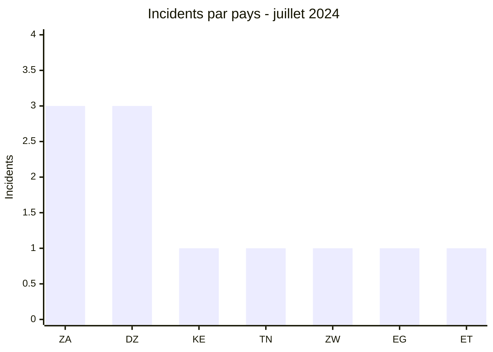
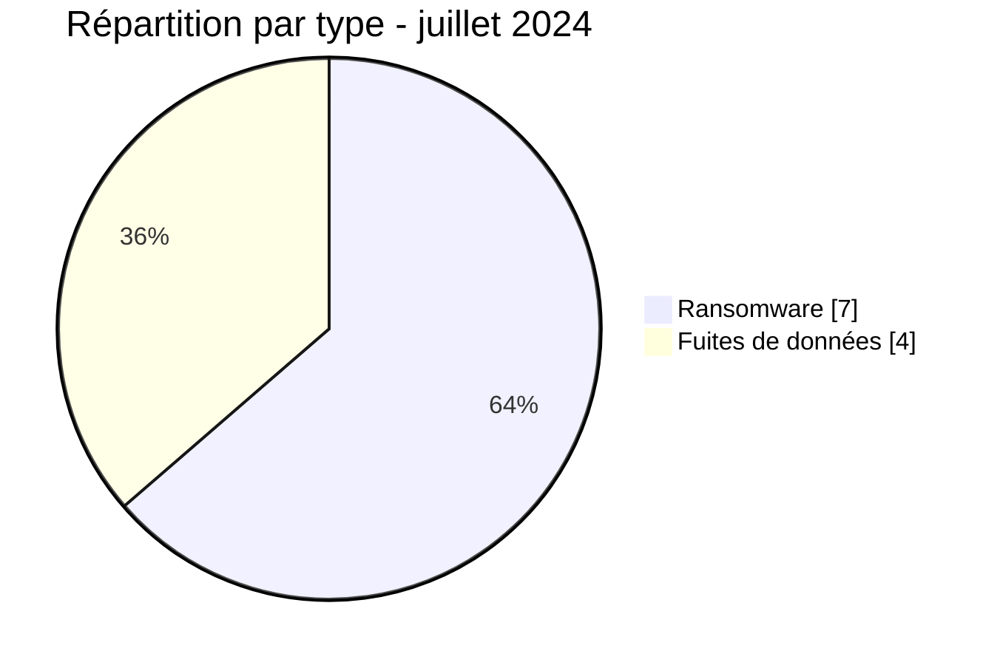

# Rapport CTI AFRINTEL - Juillet 2024

👉🏾 [English version](./README.md)

## 1. Résumé exécutif

Juillet 2024 compte **11 incidents** : **7 revendications ransomware** et **4 fuites de données**. L’Afrique du Sud et l’Algérie arrivent en tête avec trois incidents chacune. La concentration algérienne doit être interprétée avec prudence : trois publications proviennent d’une même compilation de bases anciennes remise en circulation.

Le mois combine des cibles de santé, d’éducation, de défense, de transport, de finance et d’industrie minière. L’incident attribué au National War College présente une incohérence importante : le domaine cité appartient à une institution américaine, tandis que les cinq PNG fournis renvoient au F.D.R.E Defence War College éthiopien. Une erreur de domaine, une confusion de nom ou une attribution technique incorrecte restent possibles ; AFRINTEL distingue donc l’organisation observée du domaine annoncé par l’acteur.

Voir [victims_FR.md](./victims_FR.md).

## 2. Méthodologie

Le rapport couvre les publications classées en juillet 2024. Une republication reste un incident de circulation de données dans le corpus, mais n’est pas présentée comme une nouvelle intrusion. Les niveaux de confiance reflètent la qualité des éléments visibles et non la seule ancienneté ou notoriété de la source.

Les statistiques dérivent des **11 incidents** de [victims_FR.md](./victims_FR.md), synchronisés avec [victims.md](./victims.md).

## 3. Vue globale

| Indicateur | Valeur |
|---|---:|
| Incidents / Pays | **11 / 7** |
| Ransomware | **7** |
| Fuites de données | **4** |
| Ventes d’accès / Défacement | **0 / 0** |

### Classement par pays

| Pays | Total | Ransomware | Fuite |
|---|---:|---:|---:|
| 🇿🇦 Afrique du Sud | 3 | 3 | 0 |
| 🇩🇿 Algérie | 3 | 0 | 3 |
| 🇰🇪 Kenya | 1 | 1 | 0 |
| 🇹🇳 Tunisie | 1 | 1 | 0 |
| 🇿🇼 Zimbabwe | 1 | 1 | 0 |
| 🇪🇬 Égypte | 1 | 1 | 0 |
| 🇪🇹 Éthiopie | 1 | 0 | 1 |
| **Total** | **11** | **7** | **4** |

### Répartition régionale

| Région | Total | Ransomware | Fuite |
|---|---:|---:|---:|
| Afrique du Nord | 5 | 2 | 3 |
| Afrique australe | 4 | 4 | 0 |
| Afrique de l’Est | 2 | 1 | 1 |
| **Total** | **11** | **7** | **4** |

### Répartition sectorielle normalisée

| Secteur | Incidents | Part |
|---|---:|---:|
| Santé / Médical | 2 | 18,2 % |
| Services professionnels / Entreprises | 2 | 18,2 % |
| Transport / Logistique | 2 | 18,2 % |
| Défense / Sécurité | 1 | 9,1 % |
| Éducation / Université | 1 | 9,1 % |
| Médias / Divertissement | 1 | 9,1 % |
| Finance / Banque | 1 | 9,1 % |
| Mines / Industries extractives | 1 | 9,1 % |
| **Total** | **11** | **100 %** |

### Acteurs et sources les plus visibles

| Acteur ou source | Incidents |
|---|---:|
| Addka72424, republication attribuée à FriendlyChemist | 3 |
| Mad Liberator | 2 |
| Six autres acteurs ou sources | 1 chacun |

## 4. Analyse comparative : juin-juillet 2024

| Indicateur | Juin 2024 | Juillet 2024 | Écart absolu | Évolution |
|---|---:|---:|---:|---:|
| Incidents | 3 | 11 | +8 | +266,7 % |
| Ransomware | 3 | 7 | +4 | +133,3 % |
| Fuites de données | 0 | 4 | +4 | Passage de 0 à 4 |
| Pays concernés | 2 | 7 | +5 | +250,0 % |
| Ventes d’accès / Défacement | 0 / 0 | 0 / 0 | 0 / 0 | Stable |

Juillet présente un volume **3,7 fois supérieur** à celui de juin. L’augmentation est composée de quatre revendications ransomware supplémentaires et de quatre fuites qui n’étaient pas présentes dans le corpus de juin. Elle ne doit pas être interprétée comme une multiplication équivalente des compromissions réelles : les statistiques mesurent les publications collectées, et juillet comprend notamment trois republications algériennes issues d’une compilation ancienne ainsi qu’un échantillon éthiopien partiel.

La couverture géographique s’élargit de deux à sept pays. L’Afrique du Sud reste présente dans les deux mois, mais la concentration de juin (2 incidents sur 3) devient plus diffuse en juillet, où l’Afrique du Sud et l’Algérie comptent trois incidents chacune. Le nombre de pays et la diversité des catégories augmentent donc davantage que la profondeur technique disponible.

**Lecture objective :** le signal le plus robuste est une hausse de visibilité du ransomware et l’apparition de fuites dans le corpus de juillet. La cause exacte de cette variation, la part d’incidents réellement nouveaux et l’impact opérationnel restent inconnus sans confirmations victimes, chronologies et données DFIR.

## 5. Analyse détaillée par type d’incident

### 4.1 Ransomware

Les sept publications couvrent Maxcess Logistics, National Health Laboratory Service, Kenya Urban Roads Authority, ZB Financial Holdings, Cities Network, Assih et Sibanye-Stillwater. Mad Liberator apparaît deux fois le même jour, mais les sources publiques ne suffisent pas à relier techniquement les deux cas.

### 4.2 Fuites de données

Les trois entrées algériennes sont des republications d’une compilation annoncée comme datant de 2019 à 2023. Elles mesurent une nouvelle circulation de données, non trois intrusions de juillet. Le cas éthiopien est rattaché aux documents observés du F.D.R.E Defence War College. Le domaine nwc.ndu.edu est conservé comme domaine annoncé mais non vérifié ; le répertoire local contient cinq PNG, sans export PST ou boîte Exchange.

## 6. Impact sectoriel

La santé, les services professionnels et le transport comptent chacun deux incidents. La sensibilité la plus élevée concerne les données médicales, éducatives et militaires visibles ou revendiquées. Les organisations minières et de transport présentent surtout un risque de continuité, qui ne peut être quantifié depuis les publications seules.

## 7. Profil des acteurs et évaluation du risque

| Périmètre | Niveau | Justification |
|---|---|---|
| 🇩🇿 Algérie | 🔴 Élevé | Trois fuites republiées, dont santé et éducation |
| 🇿🇦 Afrique du Sud | 🔴 Élevé | Trois revendications ransomware |
| 🇪🇹 Éthiopie | 🔴 Élevé | Documents militaires visibles, attribution de domaine incohérente |
| Autres pays | 🟠 Moyen | Une publication par pays |

## 8. Tendances et lacunes de renseignement

- **Observé - confiance élevée :** sept incidents ransomware et quatre fuites.
- **Observé - confiance élevée :** trois fuites algériennes relèvent d’une même republication et non d’intrusions nouvelles établies.
- **Lacune :** aucun rapport DFIR public n’a été identifié dans les sources consultées pour les revendications ransomware.
- **Lacune :** l’organisation observée est identifiable dans les documents, mais le domaine cité dans l’annonce reste contradictoire ; la provenance du prétendu volume Exchange de 747 Mo n’est pas démontrée.
- **Collecte attendue :** origine de la compilation algérienne, confirmation des établissements et indicateurs techniques des cas ransomware.

## 9. Cartographie MITRE ATT&CK contextuelle

| Statut | Technique | Utilisation |
|---|---|---|
| Préventif | T1486 - Data Encrypted for Impact | Détection du chiffrement ; non confirmé dans les sept revendications |
| Préventif | T1567 - Exfiltration Over Web Service | Surveillance des sorties ; méthode d’acquisition des fuites inconnue |
| Hypothèse | T1078 - Valid Accounts | Scénario de compromission à rechercher, sans identifiant valide observé |

## 10. Recommandations

- **Santé et éducation :** identifier les jeux anciens, réinitialiser les comptes exposés et surveiller les republications.
- **Défense :** vérifier l’attribution institutionnelle avant toute réponse publique et protéger les systèmes documentaires.
- **Transport et mines :** segmenter les environnements opérationnels et tester la continuité.
- **Toutes les organisations :** préserver les journaux et maintenir des sauvegardes immuables.

## 11. Recommandations SOC et tactiques

| Qualification | Action |
|---|---|
| **Observé** | Rechercher les comptes et applications mentionnés dans les échantillons ; aucune chaîne ransomware n’est confirmée. |
| **Hypothèse** | Examiner les authentifications anormales, exports de bases et archives préparées avant publication. |
| **Préventif** | Détecter chiffrement massif, inhibition des sauvegardes et transferts sortants volumineux. |

## 12. Recommandations stratégiques

| Priorité | Qualification | Mesure |
|---:|---|---|
| 1 | **Observé** | Traiter séparément republication de données et nouvelle compromission. |
| 2 | **Hypothèse** | Étudier un lien entre publications simultanées sans conclure à une campagne commune. |
| 3 | **Préventif** | Renforcer ASM, MFA résistante au phishing, gestion des secrets et sauvegardes isolées. |

## 13. Conclusion

Juillet illustre la nécessité de distinguer volume et nouveauté. Trois des quatre fuites sont des données anciennes remises en circulation, tandis que les sept publications ransomware offrent peu de profondeur technique. La bonne lecture du mois repose donc sur la provenance, la chronologie et les limites d’attribution.

**AFRINTEL - TLP:CLEAR**

[Dépôt AFRINTEL](https://github.com/Hatchepsoute/AFRINTEL)
