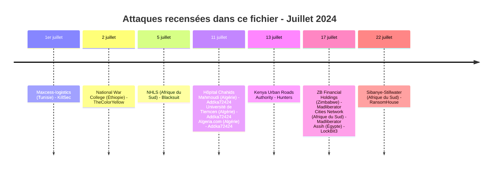
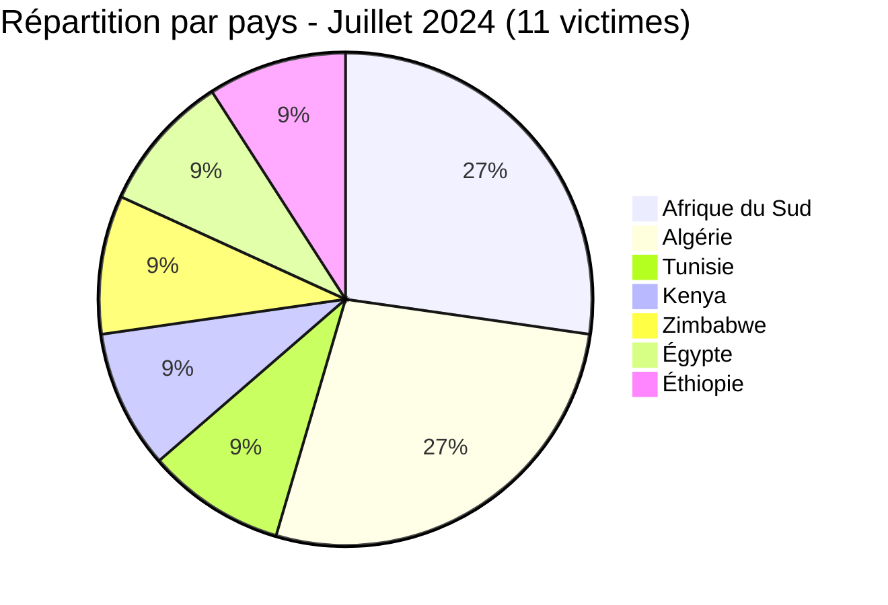
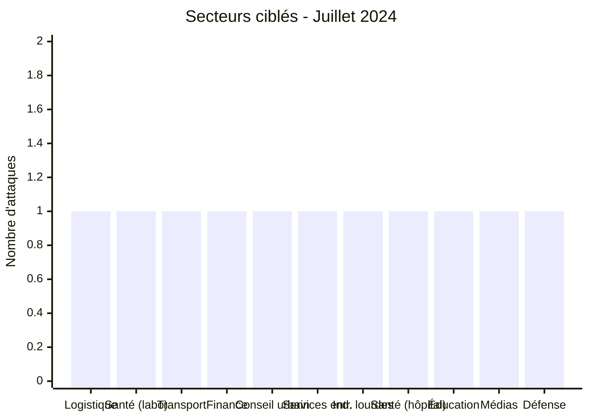

[](https://github.com/Hatchepsoute/AFRINTEL)


# Rapport CTI - Juillet 2024 : Pic d’activité des ransomwares en Afrique
👉🏾 [English version available here](./README.md)
### 1. Résumé exécutif

En juillet 2024, l'Afrique a enregistré **11 victimes** documentées dans ce fichier : **7 victimes de ransomware**, revendiquées par six groupes différents, et **4 revendications de fuite de données**. Trois de ces revendications concernent l'**Algérie**, toutes issues d'une même compilation republiée le 11 juillet 2024 par le compte Addka72424 (à l'origine attribuée à FriendlyChemist), regroupant des échantillons anciens datés de 2019 à 2023 et associés à l'Hôpital Chahids Mahmoudi, à l'Université de Tlemcen et au portail Algeria.com. La quatrième est une revendication du 2 juillet par l'acteur TheColorYellow visant un **établissement d'enseignement militaire éthiopien** (les documents examinés par AFRINTEL portent l'en-tête du FDRE Defence War College, bien que le domaine cité dans la publication, nwc.ndu.edu, corresponde à la National Defense University américaine, sans lien apparent). Le mois est marqué par une **forte reprise** de l'activité ransomware après le creux de juin (3 victimes), une grande diversité géographique et sectorielle, ainsi que par la réapparition d'un ancien jeu de données algériennes en circulation depuis plusieurs années sur les forums cybercriminels.

**Chiffres clés :**
- 🔹 **11 victimes** identifiées
- 🔹 **8 sources** : KillSec (1), Blacksuit (1), Hunters (1), Madliberator (2), LockBit3 (1), RansomHouse (1), Addka72424 (3), TheColorYellow (1)
- 🔹 **Pays touchés** : Afrique du Sud (3), Algérie (3), Tunisie (1), Kenya (1), Zimbabwe (1), Égypte (1), Éthiopie (1)
- 🔹 **Secteurs** : Logistique, Santé (laboratoire public), Transport routier urbain, Finance, Services de conseil, Services aux entreprises, Industries lourdes, Santé (hôpital privé), Éducation, Médias / Portail web, Défense / Enseignement militaire
- 🔹 **Types d'incident** : Ransomware (7), Fuite de données (4)
### Vue agrégée mensuelle de l’exposition

La vue CTI mensuelle regroupe les fuites de données et les ventes d’accès sous **exposition des données** : **4 fiches** (36.4% du corpus mensuel). Les fiches sources restent la référence ; une vente d’accès ne prouve pas à elle seule l’exfiltration de données.


👉🏾 [Liste des victimes](./victims_FR.md)
---

### 2. Chronologie des attaques

| Date       | Victime                          | Pays             | Acteur / Groupe | Type | Date de la fuite |
|------------|----------------------------------|------------------|------------------|------|-------------------|
| 1er juillet | Maxcess-logistics                | Tunisie          | KillSec           | Ransomware | - |
| 2 juillet  | National War College (nwc.ndu.edu) | Éthiopie       | TheColorYellow    | Fuite de données | - |
| 5 juillet  | National health laboratory services | Afrique du Sud | Blacksuit         | Ransomware | - |
| 11 juillet | Hôpital Chahids Mahmoudi (hcm-dz.com) | Algérie      | Addka72424 (repost FriendlyChemist) | Fuite de données | 21 septembre 2023 |
| 11 juillet | Université de Tlemcen (univ-tlemcen.dz) | Algérie   | Addka72424 (repost FriendlyChemist) | Fuite de données | 27 juin 2022 |
| 11 juillet | Algeria.com (portail web)        | Algérie          | Addka72424 (repost FriendlyChemist) | Fuite de données | Septembre 2019 |
| 13 juillet | Kenya urban roads authority      | Kenya            | Hunters           | Ransomware | - |
| 17 juillet | Zb financial holdings            | Zimbabwe         | Madliberator      | Ransomware | - |
| 17 juillet | Cities network                   | Afrique du Sud   | Madliberator      | Ransomware | - |
| 17 juillet | Assih                            | Égypte           | LockBit3          | Ransomware | - |
| 22 juillet | Sibanye-stillwater               | Afrique du Sud   | RansomHouse       | Ransomware | - |


---

### 3. Analyse des victimes

#### 3.1 Par pays

| Pays               | Nombre d’attaques |
|--------------------|------------------|
| Afrique du Sud     | 3                |
| Algérie            | 3                |
| Tunisie            | 1                |
| Kenya              | 1                |
| Zimbabwe           | 1                |
| Égypte             | 1                |
| Éthiopie           | 1                |



#### 3.2 Par secteur

| Secteur                                   | Nombre |
|--------------------------------------------|--------|
| Logistique                                 | 1      |
| Services de santé (laboratoire public)     | 1      |
| Transport routier urbain                   | 1      |
| Organismes financiers                      | 1      |
| Services de conseil urbain                 | 1      |
| Services aux entreprises / Conseil         | 1      |
| Industries lourdes (mines)                 | 1      |
| Santé (hôpital privé)                      | 1      |
| Éducation / Enseignement supérieur         | 1      |
| Médias / Portail web                       | 1      |
| Défense / Enseignement militaire           | 1      |



#### 3.3 Groupes ransomware

| Groupe ransomware | Nombre d’attaques |
|------------------|------------------|
| Madliberator     | 2                |
| KillSec          | 1                |
| Blacksuit        | 1                |
| Hunters          | 1                |
| LockBit3         | 1                |
| RansomHouse      | 1                |

```mermaid
gantt
    title Groupes ransomware actifs - Juillet 2024
    dateFormat X
    axisFormat %s
    section Madliberator
    Madliberator : 0, 2
    section KillSec
    KillSec : 0, 1
    section Blacksuit
    Blacksuit : 0, 1
    section Hunters
    Hunters : 0, 1
    section LockBit3
    LockBit3 : 0, 1
    section RansomHouse
    RansomHouse : 0, 1
```



#### 3.4 Sources de fuite de données

| Source | Nombre de revendications |
|--------|--------------------------|
| Addka72424 (republication, origine attribuée à FriendlyChemist) | 3 |
| TheColorYellow (publication sur RaidForums) | 1 |

---

### 4. Points d’attention

- **Reprise d’activité ransomware** : 7 attaques ransomware en juillet contre 3 en juin - retour à un niveau élevé.
- **Madliberator** apparaît pour la première fois et frappe deux fois le même jour (17 juillet) au Zimbabwe et en Afrique du Sud.
- **Secteur santé** : le laboratoire national sud-africain (NHLS) est une cible critique côté ransomware.
- **Administrations publiques** : le Kenya Urban Roads Authority et Assih (Égypte) montrent l’intérêt pour les infrastructures étatiques.
- **Industrie minière** : Sibanye-Stillwater (or, platine) est une cible stratégique.
- **Nouveau groupe** : RansomHouse - actif sur le continent.
- **Compilation algérienne republiée** : les trois entrées du 11 juillet 2024 (Hôpital Chahids Mahmoudi, Université de Tlemcen, Algeria.com) proviennent d’une seule compilation intitulée « Algerian Databases Collection », republiée par le compte Addka72424 à partir d’un post initial attribué à FriendlyChemist. Il ne s’agit pas de nouvelles intrusions mais de la recirculation d’échantillons datés de 2019 à 2023. Elles sont comptabilisées séparément des ransomwares comme des fuites de données, avec des niveaux de confiance différenciés (moyen pour l’hôpital, élevé pour l’université, faible pour Algeria.com) selon la qualité des échantillons observés.
- **Éthiopie, incohérence de domaine signalée** : la revendication du 2 juillet par TheColorYellow cite le domaine « nwc.ndu.edu », qui appartient en réalité au National War College de la National Defense University américaine, mais les échantillons de documents montrés portent l'emblème et l'en-tête en amharique du FDRE Defence War College, un établissement militaire éthiopien. AFRINTEL enregistre la revendication contre l'établissement éthiopien identifiable par l'en-tête et signale le domaine cité par l'acteur comme non vérifié, plutôt que de l'écarter ou de le corriger silencieusement.

---

```mermaid
xychart-beta
    title "Évolution mensuelle des attaques (janv. à juil. 2024)"
    x-axis ["Jan", "Fév", "Mar", "Avr", "Mai", "Juin", "Juil"]
    y-axis "Nombre d'attaques" 0 to 12
    bar [2, 4, 5, 4, 8, 3, 11]
```
### 5. Recommandations pour juillet 2024

| Domaine                        | Action recommandée |
|--------------------------------|--------------------|
| Laboratoires et santé          | Isoler les systèmes critiques, surveiller les accès aux données sensibles. |
| Administrations publiques      | Mettre en place une surveillance renforcée des RDP et VPN, segmenter les réseaux. |
| Industries minières            | Sauvegardes hors ligne, audits de sécurité OT. |
| Établissements hospitaliers    | Vérifier si les journaux de messagerie republiés correspondent à un système réel, contrôler les accès à la passerelle de messagerie et sensibiliser le personnel médical au phishing exploitant des références de patients. |
| Enseignement supérieur         | Vérifier l’état de la base Moodle concernée, réinitialiser les comptes exposés en priorité les comptes administrateurs, et contrôler l’étendue de la fédération d’authentification avec les autres universités identifiées. |
| Défense / Enseignement militaire | Auditer les journaux d'accès au serveur Exchange et l'activité d'export de boîtes aux lettres, restreindre la diffusion des documents administratifs, et vérifier de façon indépendante les enregistrements de domaine de l'établissement pour détecter une usurpation ou une confusion de métadonnées dans de futures revendications. |
| Toutes organisations           | Suivre les nouveaux groupes (Madliberator, RansomHouse) et leurs modes opératoires, et surveiller la réutilisation d’anciens jeux de données algériens en circulation sur les forums. |

---

