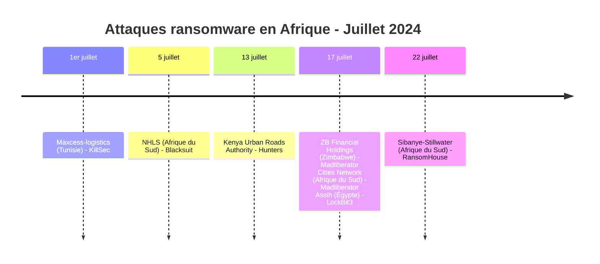
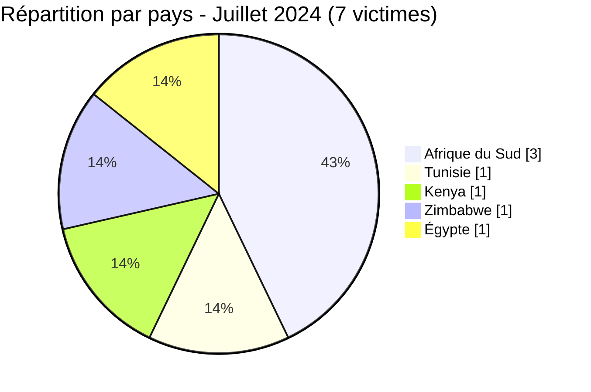

[](https://github.com/Hatchepsoute/AFRINTEL)


# Rapport CTI - Juillet 2024 : Pic d’activité des ransomwares en Afrique
👉🏾 [English version available here](./README.md)
### 1. Résumé exécutif

En juillet 2024, l’Afrique a enregistré **7 victimes** documentées d’attaques par ransomware. Le mois a été marqué par une **forte reprise** après le creux de juin (3 victimes) et une grande diversité géographique et sectorielle.

**Chiffres clés :**
- 🔹 **7 victimes** identifiées
- 🔹 **5 groupes différents** : KillSec (1), Blacksuit (1), Hunters (1), Madliberator (2), LockBit3 (1), RansomHouse (1)
- 🔹 **Pays touchés** : Afrique du Sud (3), Tunisie (1), Kenya (1), Zimbabwe (1), Égypte (1)
- 🔹 **Secteurs** : Logistique, Santé, Transport ferroviaire, Finance, Services, Administration publique, Industries lourdes

👉🏾 [Liste des victimes](./victims_FR.md)
---

### 2. Chronologie des attaques

| Date       | Victime                          | Pays             | Groupe ransomware |
|------------|----------------------------------|------------------|-------------------|
| 1er juillet | Maxcess-logistics                | Tunisie          | KillSec           |
| 5 juillet  | National health laboratory services | Afrique du Sud | Blacksuit         |
| 13 juillet | Kenya urban roads authority      | Kenya            | Hunters           |
| 17 juillet | Zb financial holdings            | Zimbabwe         | Madliberator      |
| 17 juillet | Cities network                   | Afrique du Sud   | Madliberator      |
| 17 juillet | Assih                            | Égypte           | LockBit3          |
| 22 juillet | Sibanye-stillwater               | Afrique du Sud   | RansomHouse       |


---

### 3. Analyse des victimes

#### 3.1 Par pays

| Pays               | Nombre d’attaques |
|--------------------|------------------|
| Afrique du Sud     | 3                |
| Tunisie            | 1                |
| Kenya              | 1                |
| Zimbabwe           | 1                |
| Égypte             | 1                |



#### 3.2 Par secteur

| Secteur                            | Nombre |
|------------------------------------|--------|
| Logistique                         | 1      |
| Services de santé (laboratoire)    | 1      |
| Transport ferroviaire / routes     | 1      |
| Organismes financiers              | 1      |
| Services (générique)               | 1      |
| Administration publique            | 1      |
| Industries lourdes (mines)         | 1      |

```mermaid
xychart-beta
    title "Secteurs ciblés - Juillet 2024"
    x-axis ["Logistique", "Santé", "Transport", "Finance", "Services", "Admin publique", "Industries lourdes"]
    y-axis "Nombre d'attaques" 0 to 2
    bar [1, 1, 1, 1, 1, 1, 1]
```

#### 3.3 Groupes ransomware

| Groupe ransomware | Nombre d’attaques |
|------------------|------------------|
| Madliberator     | 2                |
| KillSec          | 1                |
| Blacksuit        | 1                |
| Hunters          | 1                |
| LockBit3         | 1                |
| RansomHouse      | 1                |

```mermaid
gantt
    title Groupes ransomware actifs - Juillet 2024
    dateFormat X
    axisFormat %s
    section Madliberator
    Madliberator : 0, 2
    section KillSec
    KillSec : 0, 1
    section Blacksuit
    Blacksuit : 0, 1
    section Hunters
    Hunters : 0, 1
    section LockBit3
    LockBit3 : 0, 1
    section RansomHouse
    RansomHouse : 0, 1
```


---

### 4. Points d’attention

- **Reprise d’activité** : 7 attaques en juillet contre 3 en juin - retour à un niveau élevé.
- **Madliberator** apparaît pour la première fois et frappe deux fois le même jour (17 juillet) au Zimbabwe et en Afrique du Sud.
- **Secteur santé** : le laboratoire national sud-africain (NHLS) est une cible critique.
- **Administrations publiques** : le Kenya Urban Roads Authority et Assih (Égypte) montrent l’intérêt pour les infrastructures étatiques.
- **Industrie minière** : Sibanye-Stillwater (or, platine) est une cible stratégique.
- **Nouveau groupe** : RansomHouse (alias RansomHouse) - actif sur le continent.

---
```mermaid
xychart-beta
    title "Évolution mensuelle des attaques (janv. à juil. 2024)"
    x-axis ["Jan", "Fév", "Mar", "Avr", "Mai", "Juin", "Juil"]
    y-axis "Nombre d'attaques" 0 to 12
    bar [2, 4, 5, 4, 8, 3, 7]
```
### 5. Recommandations pour juillet 2024

| Domaine                        | Action recommandée |
|--------------------------------|--------------------|
| Laboratoires et santé          | Isoler les systèmes critiques, surveiller les accès aux données sensibles. |
| Administrations publiques      | Mettre en place une surveillance renforcée des RDP et VPN, segmenter les réseaux. |
| Industries minières            | Sauvegardes hors ligne, audits de sécurité OT. |
| Toutes organisations           | Suivre les nouveaux groupes (Madliberator, RansomHouse) et leurs modes opératoires. |

---

