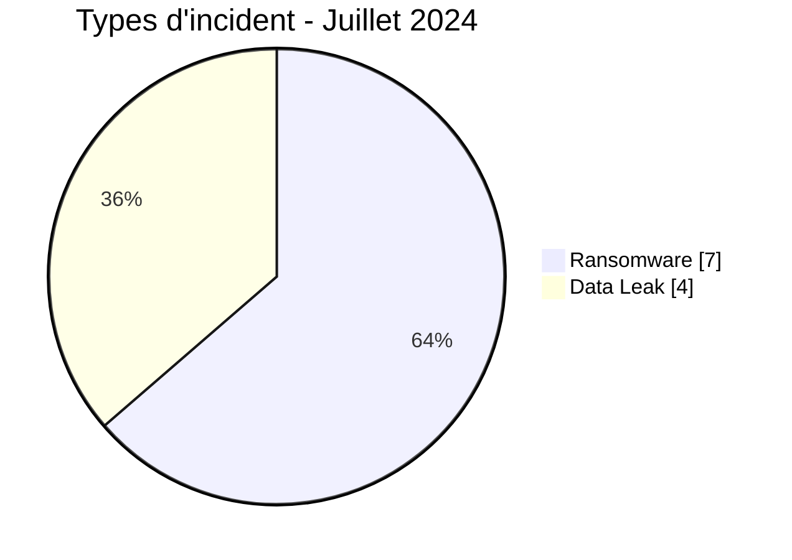
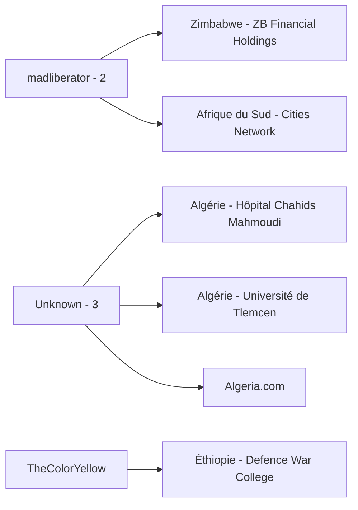
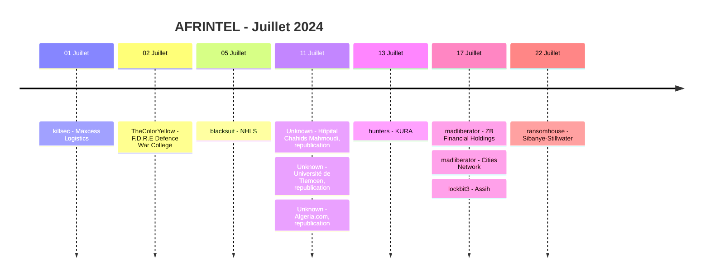

# Rapport CTI AFRINTEL - Juillet 2024

👉🏾 [English version](./README.md)

## 1. Résumé exécutif

Juillet 2024 contient **11 fiches incident documentées** : **7 Ransomware** et **4 Data Leak**, dans **7 pays africains**. Aucun Access Sale, DDoS, Defacement ou Operational Fraud n'est présent dans le corpus validé de juillet.

L'Afrique du Sud et l'Algérie comptent chacune trois fiches. La concentration algérienne nécessite une qualification importante : les trois Data Leak algériens proviennent d'une republication de juillet d'une compilation plus ancienne contenant des jeux de données datés de 2019, 2022 et 2023. Ils sont comptés comme incidents de circulation de données dans le corpus mensuel et non comme trois nouvelles intrusions établies en juillet.

Le dossier éthiopien du F.D.R.E Defence War College exige également de la prudence. L'échantillon visible est cohérent avec des documents internes d'un établissement d'enseignement militaire éthiopien, tandis que le domaine annoncé par le vendeur, `nwc.ndu.edu`, appartient à la National Defense University américaine. AFRINTEL sépare donc l'organisation visible dans l'échantillon du domaine cité par l'acteur mais non vérifié.

👉🏾 [Voir la liste complète des victimes](./victims_FR.md)

### 1.1 Comparaison avec le mois précédent

| Indicateur | Juin 2024 | Juillet 2024 | Évolution |
|---|---:|---:|---:|
| Total incidents | 3 | **11** | **+8 (+266,7 %)** |
| Ransomware | 3 | **7** | **+4 (+133,3 %)** |
| Data Leak | 0 | **4** | **+4 (nouveau dans le corpus)** |
| Access Sale | 0 | **0** | Stable |
| DDoS | 0 | **0** | Stable |
| Defacement | 0 | **0** | Stable |
| Operational Fraud | 0 | **0** | Stable |

Le corpus de juillet est **3,7 fois plus important que celui de juin**, mais cela ne signifie pas que les compromissions confirmées ont été multipliées dans la même proportion. Trois des quatre Data Leak sont des jeux de données anciens remis en circulation en juillet, tandis que les sept Ransomware restent des revendications de publication sans élément DFIR public dans le corpus fourni.

## 2. Méthodologie

- **Période :** 1er au 31 juillet 2024.
- **Source de vérité :** couple harmonisé `victims_FR.md` / `victims.md`.
- **Comptage :** une fiche harmonisée correspond à un incident documenté.
- **Taxonomie :** Ransomware, Data Leak, Access Sale, DDoS, Defacement, Operational Fraud.
- **Registre de corrections rétrospectives :** aucun des 10 incidents manquants identifiés en 2024 ne concerne juillet.
- **Republications :** une republication reste un incident de circulation de données dans le corpus mensuel, mais n'est pas présentée comme une nouvelle intrusion.
- **Séparation acteur/source :** les comptes de republication ne sont pas considérés comme acteurs d'intrusion sans preuve permettant cette attribution.
- Le niveau de confiance reflète la qualité des éléments visibles et non la réputation de l'acteur ou le volume annoncé.

## 3. Vue globale

### 3.1 Répartition par type d'incident

| Type d'incident | Fiches | Part |
|---|---:|---:|
| Ransomware | **7** | **63,6 %** |
| Data Leak | **4** | **36,4 %** |
| Access Sale | 0 | 0,0 % |
| DDoS | 0 | 0,0 % |
| Defacement | 0 | 0,0 % |
| Operational Fraud | 0 | 0,0 % |
| **Total** | **11** | **100 %** |

### 3.2 Répartition par pays

| Pays | Ransomware | Data Leak | Total |
|---|---:|---:|---:|
| 🇿🇦 Afrique du Sud | 3 | 0 | **3** |
| 🇩🇿 Algérie | 0 | 3 | **3** |
| 🇰🇪 Kenya | 1 | 0 | 1 |
| 🇹🇳 Tunisie | 1 | 0 | 1 |
| 🇿🇼 Zimbabwe | 1 | 0 | 1 |
| 🇪🇬 Égypte | 1 | 0 | 1 |
| 🇪🇹 Éthiopie | 0 | 1 | 1 |
| **Total** | **7** | **4** | **11** |

### 3.3 Répartition régionale

| Région | Ransomware | Data Leak | Total |
|---|---:|---:|---:|
| Afrique du Nord | 2 | 3 | **5** |
| Afrique australe | 4 | 0 | **4** |
| Afrique de l'Est | 1 | 1 | **2** |
| **Total** | **7** | **4** | **11** |

### 3.4 Répartition sectorielle harmonisée

| Secteur | Fiches | Part |
|---|---:|---:|
| Healthcare / Medical | 2 | 18,2 % |
| Professional / Business Services | 2 | 18,2 % |
| Transport / Logistics | 2 | 18,2 % |
| Defense / Security | 1 | 9,1 % |
| Education / University | 1 | 9,1 % |
| Media / Entertainment | 1 | 9,1 % |
| Finance / Banking | 1 | 9,1 % |
| Mining / Extractive Industries | 1 | 9,1 % |
| **Total** | **11** | **100 %** |

### 3.5 Acteurs / groupes

| Acteur / Groupe | Fiches |
|---|---:|
| Unknown | **3** |
| madliberator | **2** |
| killsec | 1 |
| TheColorYellow | 1 |
| blacksuit | 1 |
| hunters | 1 |
| lockbit3 | 1 |
| ransomhouse | 1 |
| **Total** | **11** |

> Les trois fiches `Unknown` correspondent aux jeux de données algériens republiés. `Addka72424` et `FriendlyChemist` restent documentés comme contexte de source, et non comme acteurs d'intrusion confirmés.

## 4. Analyse détaillée

### 4.1 Ransomware - 7 fiches

Les sept fiches Ransomware concernent **Maxcess Logistics**, **National Health Laboratory Service**, **Kenya Urban Roads Authority**, **ZB Financial Holdings**, **South African Cities Network**, **Assih** et **Sibanye-Stillwater**.

Les sept restent `Claim - Unverified` avec un niveau de confiance faible dans les fiches fournies. Aucun échantillon technique accessible ni rapport DFIR public dans le corpus fourni ne permet d'établir un chiffrement, une perturbation opérationnelle ou une exfiltration pour ces sept dossiers.

`madliberator` apparaît deux fois le 17 juillet, contre ZB Financial Holdings et South African Cities Network. La date de publication commune et l'acteur constituent des faits observables, mais aucun élément technique du corpus fourni ne relie les deux incidents par un vecteur d'accès initial, une infrastructure ou une campagne commune.

### 4.2 Data Leak - 4 fiches

Trois fiches Data Leak correspondent à des jeux de données algériens remis en circulation le 11 juillet dans une "Algerian Databases Collection" :

- **Hôpital Chahids Mahmoudi :** fichier source daté du 21 septembre 2023, avec un échantillon de journaux de filtrage de messagerie. Des métadonnées sensibles liées à la santé sont visibles, mais l'accès aux boîtes de messagerie complètes n'est pas établi.
- **Université de Tlemcen :** fichier source daté du 27 juin 2022. L'échantillon contient une table Moodle `mdl_user` structurellement cohérente et soutient un niveau `High` quant à l'authenticité du jeu de données.
- **Algeria.com :** fichier source daté de septembre 2019. Les données sont anciennes, le domaine correspond à un portail générique et aucun champ de mot de passe clairement identifiable n'est établi, ce qui justifie une confiance et une pertinence opérationnelle actuelles plus faibles.

Ces trois fiches mesurent une remise en circulation d'anciens éléments en juillet 2024 et non trois nouvelles intrusions établies.

Le quatrième Data Leak concerne le **F.D.R.E Defence War College** en Éthiopie. Cinq fichiers PNG visibles renforcent le lien avec l'établissement éthiopien, mais le domaine `nwc.ndu.edu` cité par l'acteur est incohérent avec cette organisation. Aucun fichier PST, EML, MSG ou export Exchange n'est présent dans le matériel fourni ; les 747 Mo de courriels Exchange revendiqués ne peuvent donc pas être confirmés.

## 5. Principaux constats et lacunes

- Juillet passe de 3 à **11 fiches**, mais nouveauté et volume de publication doivent être distingués.
- Les Ransomware représentent **7 fiches sur 11 (63,6 %)**, toutes non vérifiées dans le corpus fourni.
- Trois des quatre Data Leak correspondent à des jeux de données algériens plus anciens remis en circulation en juillet.
- L'Afrique du Sud et l'Algérie comptent chacune trois fiches, mais avec des profils de preuve très différents : revendications ransomware en Afrique du Sud et circulation de données anciennes en Algérie.
- L'échantillon de l'Université de Tlemcen présente les indicateurs d'authenticité les plus solides parmi les republications algériennes.
- L'échantillon du Defence War College soutient l'organisation observée, mais pas le domaine cité par l'acteur ni le volume Exchange revendiqué.
- Les sept dossiers ransomware nécessitent encore des confirmations victimes, indicateurs techniques et éléments sur l'impact opérationnel.

## 6. Cartographie MITRE ATT&CK contextuelle

| Statut | Technique | Application |
|---|---|---|
| Préventif | T1486 - Data Encrypted for Impact | Surveillance ransomware pertinente ; chiffrement non confirmé dans les sept revendications de juillet. |
| Contextuel | T1213 - Data from Information Repositories | Pertinent pour Moodle et les autres référentiels structurés exposés dans les Data Leak. |
| Préventif | T1567 - Exfiltration Over Web Service | Surveillance des flux sortants ; canal d'acquisition/exfiltration non établi. |
| Hypothèse | T1078 - Valid Accounts | Scénario possible à examiner en interne, non fait observé dans les éléments fournis. |

## 7. Recommandations

- Traiter les republications de données anciennes et les nouvelles compromissions comme deux conditions analytiques distinctes.
- Pour les dossiers algériens, déterminer si les comptes exposés sont encore actifs et surveiller la réutilisation d'identifiants sans supposer une intrusion actuelle.
- Pour le cas militaire éthiopien, résoudre l'incohérence de domaine avant toute attribution externe ou escalade.
- Pour les organisations listées par des groupes ransomware, préserver les journaux d'authentification, endpoints, accès distants et sauvegardes autour des dates de publication.
- Surveiller les futures mises à jour des acteurs, notifications victimes et publications d'échantillons susceptibles de modifier le niveau de preuve.

## 8. Chronologie

## 9. Conclusion

Juillet 2024 se clôt sur **11 fiches incident documentées dans 7 pays africains**, réparties entre **7 publications Ransomware et 4 Data Leak**. Par rapport à juin, le corpus passe de 3 à 11 fiches, soit une hausse de **266,7 %**. Les publications Ransomware passent de 3 à 7 et les Data Leak réapparaissent avec quatre fiches.

Cette hausse est réelle au niveau de la collecte AFRINTEL, mais elle ne doit pas être interprétée comme une augmentation équivalente des compromissions confirmées. Trois des quatre Data Leak sont des republications de jeux de données algériens dont les dates sous-jacentes remontent à 2019, 2022 et 2023. Leur apparition en juillet traduit une nouvelle circulation et un risque renouvelé d'exposition, mais ne constitue pas une preuve que les trois organisations ont été compromises à nouveau pendant juillet 2024. Cette distinction modifie fortement la lecture de la concentration apparente de l'Algérie.

Le mois illustre également l'importance de la provenance. Le dossier du F.D.R.E Defence War College contient des documents visibles cohérents avec l'établissement éthiopien, mais le domaine cité par le vendeur appartient à une autre institution située aux États-Unis. Les fichiers fournis renforcent donc l'attribution de l'échantillon à l'organisation éthiopienne, sans permettre de confirmer l'origine Exchange annoncée ni le volume de 747 Mo. Conserver cette contradiction est analytiquement plus solide que de forcer l'annonce de l'acteur et les preuves observées dans un récit unique non étayé.

La visibilité ransomware est plus importante qu'en juin, mais les sept fiches restent des revendications non vérifiées à faible confiance dans le corpus fourni. Les deux publications `madliberator` du même jour méritent un suivi, mais aucun élément technique n'établit un chemin d'intrusion commun ou une campagne coordonnée. Les éléments disponibles soutiennent donc une conclusion sur une plus forte **visibilité des publications**, et non sur une vague coordonnée de compromissions ransomware démontrée.

Pour AFRINTEL, juillet montre que **volume, nouveauté, provenance et maturité des preuves doivent être analysés ensemble**. La lecture la plus défendable n'est pas simplement que juillet a été "plus attaqué" que juin. AFRINTEL a surtout observé un corpus beaucoup plus volumineux et plus diversifié, en partie alimenté par des données historiques remises en circulation, parallèlement à sept revendications ransomware dont l'impact technique reste largement non confirmé. Le suivi doit donc se concentrer sur les confirmations victimes, les nouveaux échantillons, les notifications réglementaires et les indicateurs techniques permettant de distinguer exposition persistante de données et nouvelles compromissions réelles.

**AFRINTEL** - TLP:CLEAR
