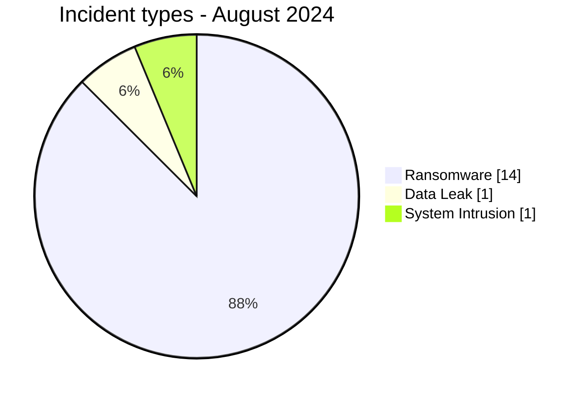

# AFRINTEL CTI Report - Cyber Threats in Africa - August 2024

👉🏾 [Version française](./README_FR.md)

## 1. Executive summary

In August 2024, AFRINTEL retains **16 canonical cyber incidents across 9 countries**. The month is led by **Ransomware (14, 87.5%)** followed by **System Intrusion (1, 6.2%)**. Leading countries are **South Africa (6)**, **Seychelles (2)**, **Zimbabwe (2)**. Leading sectors are **Finance / Banking (5)**, **Retail / E-commerce (4)**, **Telecommunications (2)**. Most frequent actor/group labels are `darkvault` (3), `meow` (2), `ransomhub` (2). `Unknown` means missing attribution, not an actor.

### 1.1 Month-over-month study

| Indicator | July 2024 | August 2024 | Change |
|---|---|---|---|
| Total | 10 | 16 | +6 (+60.0%) |
| Ransomware | 7 | 14 | +7 (+100.0%) |
| Data Leak | 2 | 1 | -1 (-50.0%) |
| Access Sale | 0 | 0 | Stable |
| DDoS | 0 | 0 | Stable |
| Defacement | 0 | 0 | Stable |
| Account Takeover | 0 | 0 | Stable |
| System Intrusion | 1 | 1 | Stable |
| Malware | 0 | 0 | Stable |
| Operational Fraud | 0 | 0 | Stable |

### 1.2 Comparative analysis

Monthly volume **increases by 6 incident(s)**. Structural changes are: Ransomware 7->14 (+7), Data Leak 2->1 (-1). This describes the documented corpus and does not necessarily equal the change in real compromises across the continent.

## 2. Methodology

- One canonical incident equals one event retained in the 2024 year.
- Historical discoveries/republications are preserved separately and do not inflate 2024 statistics.
- Incident date or best-supported window takes precedence; AFRINTEL discovery date remains separate.
- Nine AFRINTEL types are used; attempts are represented by status, never by an `Attempted Attack` type.
- Coordinated DDoS is counted by campaign.
- Type, status, confidence, impact, attribution, and source remain separate.

## 3. Incident-type distribution

| Type | Records | Share |
|---|---|---|
| Ransomware | 14 | 87.5% |
| Data Leak | 1 | 6.2% |
| Access Sale | 0 | 0.0% |
| DDoS | 0 | 0.0% |
| Defacement | 0 | 0.0% |
| Account Takeover | 0 | 0.0% |
| System Intrusion | 1 | 6.2% |
| Malware | 0 | 0.0% |
| Operational Fraud | 0 | 0.0% |



## 4. Country x type

| Country | Total | Ransomware | Data Leak | Access Sale | DDoS | Defacement | Account Takeover | System Intrusion | Malware | Operational Fraud |
|---|---|---|---|---|---|---|---|---|---|---|
| South Africa | 6 | 6 | 0 | 0 | 0 | 0 | 0 | 0 | 0 | 0 |
| Seychelles | 2 | 2 | 0 | 0 | 0 | 0 | 0 | 0 | 0 | 0 |
| Zimbabwe | 2 | 2 | 0 | 0 | 0 | 0 | 0 | 0 | 0 | 0 |
| Nigeria | 1 | 0 | 0 | 0 | 0 | 0 | 0 | 1 | 0 | 0 |
| Tunisia | 1 | 0 | 1 | 0 | 0 | 0 | 0 | 0 | 0 | 0 |
| Ivory Coast | 1 | 1 | 0 | 0 | 0 | 0 | 0 | 0 | 0 | 0 |
| Kenya | 1 | 1 | 0 | 0 | 0 | 0 | 0 | 0 | 0 | 0 |
| Djibouti | 1 | 1 | 0 | 0 | 0 | 0 | 0 | 0 | 0 | 0 |
| Ghana | 1 | 1 | 0 | 0 | 0 | 0 | 0 | 0 | 0 | 0 |

## 5. Regional distribution

| Region | Records | Share |
|---|---|---|
| Southern Africa | 8 | 50.0% |
| West Africa | 3 | 18.8% |
| Indian Ocean | 2 | 12.5% |
| East Africa | 2 | 12.5% |
| North Africa | 1 | 6.2% |

## 6. Sector distribution

| Sector | Records | Share |
|---|---|---|
| Finance / Banking | 5 | 31.2% |
| Retail / E-commerce | 4 | 25.0% |
| Telecommunications | 2 | 12.5% |
| Professional / Business Services | 2 | 12.5% |
| Healthcare / Medical | 1 | 6.2% |
| Government / Administration | 1 | 6.2% |
| Technology / IT | 1 | 6.2% |

## 7. Actors / groups

| Actor / Group | Records | Share |
|---|---|---|
| darkvault | 3 | 18.8% |
| meow | 2 | 12.5% |
| ransomhub | 2 | 12.5% |
| killsec | 2 | 12.5% |
| lockbit3 | 1 | 6.2% |
| hunters | 1 | 6.2% |
| Unknown | 1 | 6.2% |
| Bambi | 1 | 6.2% |
| spacebears | 1 | 6.2% |
| incransom | 1 | 6.2% |
| BrainCipher | 1 | 6.2% |

## 8. Evidence maturity

| Evidence position | Records | Share |
|---|---|---|
| Claim - Unverified | 14 | 87.5% |
| Attempted | 1 | 6.2% |
| Claim - Data Sample Published | 1 | 6.2% |

### Confidence

| Confidence | Records | Share |
|---|---|---|
| Low | 14 | 87.5% |
| High | 1 | 6.2% |
| Medium | 1 | 6.2% |

## 9. Timeline

```mermaid
timeline
    title AFRINTEL - August 2024
    01 Août 2024 : Remitano
- **Acteur / Groupe -** meow
- **Secteur -** Finance / Banking
- **Site web -** [remitano.com](https -//www.remitano.com)
- **Statut -** Claim - Unverified
- **Niveau de confiance -** Low
- **Niveau d'impact -** Level 3
- **Type d'incident -** Ransomware

- **Note de fiabilité -**
  Remitano figure sur le site de fuite du groupe meow. AFRINTEL n'a observé aucun échantillon, capture ou extrait de données accessible associé à cette publication au moment de la collecte, et la revendication n'a pas été confirmée de manière indépendante par l'organisation.

- **Description -**
  Remitano est une entreprise commerciale majeure opérant dans le secteur des finance, contribuant de manière significative au tissu économique régional en Seychelles.

- **Analyse -**
  AFRINTEL a recensé Remitano (Seychelles) comme victime revendiquée par le groupe ransomware meow. Aucun fichier divulgué, extrait de base de données ou capture d'écran n'était accessible pour analyse, ce qui ne permet pas d'évaluer l'ampleur, le volume ni la sensibilité des données éventuellement exposées. AFRINTEL ne confirme ni l'intrusion, ni l'exfiltration de données, ni l'existence d'un jeu de données complet sur la seule base de cette publication.

- **Recommandations -**
  1. Examiner la surface d'attaque externe, les services d'accès distant et l'intégrité des sauvegardes à la suite de cette publication par meow, et vérifier la disponibilité de sauvegardes hors ligne ou immuables.
  2. Surveiller toute publication ultérieure d'échantillons de données liés à cette revendication et préparer des procédures de protection des données clients et de paiement et de réponse à incident adaptées au secteur financier en cas d'éléments de compromission avérés.

----------------------------
    11 Août 2024 : Acdcexpress
- **Acteur / Groupe -** lockbit3
- **Secteur -** Retail / E-commerce
- **Site web -** [acdcexpress.com](https -//www.acdcexpress.com)
- **Statut -** Claim - Unverified
- **Niveau de confiance -** Low
- **Niveau d'impact -** Level 2
- **Type d'incident -** Ransomware

- **Note de fiabilité -**
  Acdcexpress figure sur le site de fuite du groupe lockbit3. AFRINTEL n'a observé aucun échantillon, capture ou extrait de données accessible associé à cette publication au moment de la collecte, et la revendication n'a pas été confirmée de manière indépendante par l'organisation.

- **Description -**
  Acdcexpress est une entreprise commerciale majeure opérant dans le secteur des retail (distribution), contribuant de manière significative au tissu économique régional en South Africa.

- **Analyse -**
  AFRINTEL a recensé Acdcexpress (Afrique du Sud) comme victime revendiquée par le groupe ransomware lockbit3. Aucun fichier divulgué, extrait de base de données ou capture d'écran n'était accessible pour analyse, ce qui ne permet pas d'évaluer l'ampleur, le volume ni la sensibilité des données éventuellement exposées. AFRINTEL ne confirme ni l'intrusion, ni l'exfiltration de données, ni l'existence d'un jeu de données complet sur la seule base de cette publication.

- **Recommandations -**
  1. Examiner la surface d'attaque externe, les services d'accès distant et l'intégrité des sauvegardes à la suite de cette publication par lockbit3, et vérifier la disponibilité de sauvegardes hors ligne ou immuables.
  2. Surveiller toute publication ultérieure d'échantillons de données liés à cette revendication et préparer des procédures de protection des données clients et de réponse à incident adaptées au secteur du commerce en cas d'éléments de compromission avérés.

----------------------------
    13 Août 2024 : Netone
- **Acteur / Groupe -** hunters
- **Secteur -** Telecommunications
- **Site web -** [netone.co.zw](https -//www.netone.co.zw)
- **Statut -** Claim - Unverified
- **Niveau de confiance -** Low
- **Niveau d'impact -** Level 3
- **Type d'incident -** Ransomware

- **Note de fiabilité -**
  Netone figure sur le site de fuite du groupe hunters. AFRINTEL n'a observé aucun échantillon, capture ou extrait de données accessible associé à cette publication au moment de la collecte, et la revendication n'a pas été confirmée de manière indépendante par l'organisation.

- **Description -**
  Netone est un opérateur de réseau mobile de premier plan fournissant des infrastructures de télécommunications, des services de téléphonie et des données haut débit.

- **Analyse -**
  AFRINTEL a recensé Netone (Zimbabwe) comme victime revendiquée par le groupe ransomware hunters. Aucun fichier divulgué, extrait de base de données ou capture d'écran n'était accessible pour analyse, ce qui ne permet pas d'évaluer l'ampleur, le volume ni la sensibilité des données éventuellement exposées. AFRINTEL ne confirme ni l'intrusion, ni l'exfiltration de données, ni l'existence d'un jeu de données complet sur la seule base de cette publication.

- **Recommandations -**
  1. Examiner la surface d'attaque externe, les services d'accès distant et l'intégrité des sauvegardes à la suite de cette publication par hunters, et vérifier la disponibilité de sauvegardes hors ligne ou immuables.
  2. Surveiller toute publication ultérieure d'échantillons de données liés à cette revendication et préparer des procédures de protection des données et de réponse à incident en cas d'éléments de compromission avérés.

----------------------------
    13 Août 2024 : Lenmed
- **Acteur / Groupe -** darkvault
- **Secteur -** Healthcare / Medical
- **Site web -** [lenmed.co.za](https -//www.lenmed.co.za)
- **Statut -** Claim - Unverified
- **Niveau de confiance -** Low
- **Niveau d'impact -** Level 3
- **Type d'incident -** Ransomware

- **Note de fiabilité -**
  Lenmed figure sur le site de fuite du groupe darkvault. AFRINTEL n'a observé aucun échantillon, capture ou extrait de données accessible associé à cette publication au moment de la collecte, et la revendication n'a pas été confirmée de manière indépendante par l'organisation.

- **Note de double revendication -**
  Lenmed (lenmed.co.za) avait déjà été enregistrée comme revendiquée par lockbit3 le 7 mai 2024 (Claim - Unverified). L'acteur et la date diffèrent, et aucun élément n'indique une republication du même matériel ou une revente du même jeu de données. AFRINTEL enregistre cette publication de darkvault comme une revendication indépendante, en l'état des éléments disponibles.

- **Description -**
  Lenmed est une entreprise commerciale majeure opérant dans le secteur des healthcare services, contribuant de manière significative au tissu économique régional en South Africa.

- **Analyse -**
  AFRINTEL a recensé Lenmed (Afrique du Sud) comme victime revendiquée par le groupe ransomware darkvault. Aucun fichier divulgué, extrait de base de données ou capture d'écran n'était accessible pour analyse, ce qui ne permet pas d'évaluer l'ampleur, le volume ni la sensibilité des données éventuellement exposées. AFRINTEL ne confirme ni l'intrusion, ni l'exfiltration de données, ni l'existence d'un jeu de données complet sur la seule base de cette publication.

- **Recommandations -**
  1. Examiner la surface d'attaque externe, les services d'accès distant et l'intégrité des sauvegardes à la suite de cette publication par darkvault, et vérifier la disponibilité de sauvegardes hors ligne ou immuables.
  2. Surveiller toute publication ultérieure d'échantillons de données liés à cette revendication et préparer des procédures de protection des données patients et de réponse à incident adaptées au secteur de la santé en cas d'éléments de compromission avérés.

----------------------------
    13 Août 2024 : Gpf.za
- **Acteur / Groupe -** darkvault
- **Secteur -** Finance / Banking
- **Site web -** [gpf.org.za](https -//www.gpf.org.za)
- **Statut -** Claim - Unverified
- **Niveau de confiance -** Low
- **Niveau d'impact -** Level 3
- **Type d'incident -** Ransomware

- **Note de fiabilité -**
  Gpf.za figure sur le site de fuite du groupe darkvault. AFRINTEL n'a observé aucun échantillon, capture ou extrait de données accessible associé à cette publication au moment de la collecte, et la revendication n'a pas été confirmée de manière indépendante par l'organisation.

- **Description -**
  Gpf.za est une entreprise commerciale majeure opérant dans le secteur des finance, contribuant de manière significative au tissu économique régional en South Africa.

- **Analyse -**
  AFRINTEL a recensé Gpf.za (Afrique du Sud) comme victime revendiquée par le groupe ransomware darkvault. Aucun fichier divulgué, extrait de base de données ou capture d'écran n'était accessible pour analyse, ce qui ne permet pas d'évaluer l'ampleur, le volume ni la sensibilité des données éventuellement exposées. AFRINTEL ne confirme ni l'intrusion, ni l'exfiltration de données, ni l'existence d'un jeu de données complet sur la seule base de cette publication.

- **Recommandations -**
  1. Examiner la surface d'attaque externe, les services d'accès distant et l'intégrité des sauvegardes à la suite de cette publication par darkvault, et vérifier la disponibilité de sauvegardes hors ligne ou immuables.
  2. Surveiller toute publication ultérieure d'échantillons de données liés à cette revendication et préparer des procédures de protection des données clients et de paiement et de réponse à incident adaptées au secteur financier en cas d'éléments de compromission avérés.

----------------------------
    14 Août 2024 : Guaranty Trust Bank (GTBank)
- **Date de l'incident -** 14 août 2024
- **Date de publication initiale -** 15 août 2024
- **Date de correction AFRINTEL -** 23 août 2026
- **Acteur / Groupe -** Unknown
- **Secteur -** Finance / Banking
- **Site web -** [gtbank.com](https -//www.gtbank.com/)
- **Statut -** Attempted - Blocked
- **Type d'incident -** System Intrusion
- **Niveau de confiance -** High
- **Niveau d'impact -** Level 2
- **Note de taxonomie -** `Attempted Attack` n'est pas un type AFRINTEL. La tentative isolée de compromission du domaine est classée `System Intrusion` avec le statut `Attempted - Blocked`; aucune compromission de données clients n'a été confirmée.
- **Note de preuve -** GTBank a confirmé une tentative isolée de compromission de son domaine web. La banque a déclaré que la tentative avait échoué, que le site n'avait pas été cloné et qu'aucune compromission de données clients n'avait eu lieu.
- **Description victime -** GTBank est une banque commerciale nigériane fournissant des services bancaires aux particuliers, aux entreprises et des services numériques.
- **Analyse -** GTBank a confirmé une tentative isolée de compromission de son domaine web le 14 août 2024. L'événement a coïncidé avec une indisponibilité temporaire du site et des spéculations publiques selon lesquelles celui-ci aurait été cloné. Selon la banque, la tentative a échoué, le site n'a pas été cloné et les informations clients n'étaient pas stockées sur le site ; aucune compromission de données clients n'a donc été confirmée. AFRINTEL conserve la fiche car la tentative de compromission du domaine et l'impact de disponibilité ont été reconnus par la victime, mais ne transforme pas l'événement en violation réussie et ne lui attribue pas une catégorie des six types sans preuve. L'impact confirmé reste limité à la disponibilité du site/domaine et à la réponse à incident ; la méthode technique d'accès et l'acteur restent inconnus.
- **Source publique -** [Punch - déclaration GTBank](https -//punchng.com/gtb-confirms-attempt-to-hack-banks-website/)

----------------------------
    17 Août 2024 : Wwwconfig
- **Acteur / Groupe -** ransomhub
- **Secteur -** Telecommunications
- **Site web -** [netconfig.co.za](https -//www.netconfig.co.za)
- **Statut -** Claim - Unverified
- **Niveau de confiance -** Low
- **Niveau d'impact -** Level 3
- **Type d'incident -** Ransomware

- **Note de fiabilité -**
  Wwwconfig figure sur le site de fuite du groupe ransomhub. AFRINTEL n'a observé aucun échantillon, capture ou extrait de données accessible associé à cette publication au moment de la collecte, et la revendication n'a pas été confirmée de manière indépendante par l'organisation.

- **Description -**
  Wwwconfig est un opérateur de réseau mobile de premier plan fournissant des infrastructures de télécommunications, des services de téléphonie et des données haut débit.

- **Analyse -**
  AFRINTEL a recensé Wwwconfig (Afrique du Sud) comme victime revendiquée par le groupe ransomware ransomhub. Aucun fichier divulgué, extrait de base de données ou capture d'écran n'était accessible pour analyse, ce qui ne permet pas d'évaluer l'ampleur, le volume ni la sensibilité des données éventuellement exposées. AFRINTEL ne confirme ni l'intrusion, ni l'exfiltration de données, ni l'existence d'un jeu de données complet sur la seule base de cette publication.

- **Recommandations -**
  1. Examiner la surface d'attaque externe, les services d'accès distant et l'intégrité des sauvegardes à la suite de cette publication par ransomhub, et vérifier la disponibilité de sauvegardes hors ligne ou immuables.
  2. Surveiller toute publication ultérieure d'échantillons de données liés à cette revendication et préparer des procédures de protection des données et de réponse à incident en cas d'éléments de compromission avérés.

----------------------------
    19 Août 2024 : Eventizer
- **Acteur / Groupe -** Bambi
- **Contexte source -** Publication sur un forum cybercriminel
- **Secteur -** Professional / Business Services
- **Site web -** [eventizer.io](https -//www.eventizer.io)
- **Statut -** Claim - Data Sample Published
- **Type d'incident -** Data Leak
- **Niveau de confiance -** Medium
- **Niveau d'impact -** Level 3
- **Description victime -** Eventizer est une agence événementielle tunisienne et une plateforme numérique centralisant les inscriptions, paiements, contrôles d’accès, hébergements et tableaux de bord liés aux événements.
- **Analyse -** La publication attribuée à Bambi annonce environ 60 000 enregistrements associés à Eventizer et présente un échantillon structuré avec des identifiants utilisateurs, noms, adresses électroniques, numéros de téléphone, pays et informations de rôle de connexion. Le titre de la publication revendique une couverture de la Tunisie et du Nigeria, tandis que l’échantillon visible contient des enregistrements associés à plusieurs pays. L’échantillon démontre l’exposition de données de contact et de contexte de comptes, mais le volume total, l’exhaustivité, la provenance et le rattachement technique direct à Eventizer n’ont pas été vérifiés indépendamment. Les champs exposés pourraient faciliter le phishing ciblé, l’usurpation, l’énumération de comptes et l’ingénierie sociale. Les enregistrements et coordonnées bruts ne sont pas reproduits.

----------------------------
    21 Août 2024 : Codival
- **Acteur / Groupe -** spacebears
- **Secteur -** Retail / E-commerce
- **Site web -** [codival.ci](https -//www.codival.ci)
- **Statut -** Claim - Unverified
- **Niveau de confiance -** Low
- **Niveau d'impact -** Level 2
- **Type d'incident -** Ransomware

- **Note de fiabilité -**
  Codival figure sur le site de fuite du groupe spacebears. AFRINTEL n'a observé aucun échantillon, capture ou extrait de données accessible associé à cette publication au moment de la collecte, et la revendication n'a pas été confirmée de manière indépendante par l'organisation.

- **Description -**
  Codival est une entreprise commerciale majeure opérant dans le secteur des retail (distribution), contribuant de manière significative au tissu économique régional en Côte d'Ivoire.

- **Analyse -**
  AFRINTEL a recensé Codival (Côte d'Ivoire) comme victime revendiquée par le groupe ransomware spacebears. Aucun fichier divulgué, extrait de base de données ou capture d'écran n'était accessible pour analyse, ce qui ne permet pas d'évaluer l'ampleur, le volume ni la sensibilité des données éventuellement exposées. AFRINTEL ne confirme ni l'intrusion, ni l'exfiltration de données, ni l'existence d'un jeu de données complet sur la seule base de cette publication.

- **Recommandations -**
  1. Examiner la surface d'attaque externe, les services d'accès distant et l'intégrité des sauvegardes à la suite de cette publication par spacebears, et vérifier la disponibilité de sauvegardes hors ligne ou immuables.
  2. Surveiller toute publication ultérieure d'échantillons de données liés à cette revendication et préparer des procédures de protection des données clients et de réponse à incident adaptées au secteur du commerce en cas d'éléments de compromission avérés.

----------------------------
    22 Août 2024 : Don’t waste group
- **Acteur / Groupe -** incransom
- **Secteur -** Professional / Business Services
- **Site web -** Not validated from the supplied source
- **Statut -** Claim - Unverified
- **Niveau de confiance -** Low
- **Niveau d'impact -** Level 2
- **Type d'incident -** Ransomware

- **Note de fiabilité -**
  Don’t waste group figure sur le site de fuite du groupe incransom. AFRINTEL n'a observé aucun échantillon, capture ou extrait de données accessible associé à cette publication au moment de la collecte, et la revendication n'a pas été confirmée de manière indépendante par l'organisation.

- **Description -**
  Don’t waste group est une entreprise commerciale majeure opérant dans le secteur des services, contribuant de manière significative au tissu économique régional en South Africa.

- **Analyse -**
  AFRINTEL a recensé Don’t waste group (Afrique du Sud) comme victime revendiquée par le groupe ransomware incransom. Aucun fichier divulgué, extrait de base de données ou capture d'écran n'était accessible pour analyse, ce qui ne permet pas d'évaluer l'ampleur, le volume ni la sensibilité des données éventuellement exposées. AFRINTEL ne confirme ni l'intrusion, ni l'exfiltration de données, ni l'existence d'un jeu de données complet sur la seule base de cette publication.

- **Recommandations -**
  1. Examiner la surface d'attaque externe, les services d'accès distant et l'intégrité des sauvegardes à la suite de cette publication par incransom, et vérifier la disponibilité de sauvegardes hors ligne ou immuables.
  2. Surveiller toute publication ultérieure d'échantillons de données liés à cette revendication et préparer des procédures de protection des données et de réponse à incident en cas d'éléments de compromission avérés.

----------------------------
    22 Août 2024 : Instadriver.co
- **Acteur / Groupe -** killsec
- **Secteur -** Retail / E-commerce
- **Site web -** [instadriver.co](https -//www.instadriver.co)
- **Statut -** Claim - Unverified
- **Niveau de confiance -** Low
- **Niveau d'impact -** Level 2
- **Type d'incident -** Ransomware

- **Note de fiabilité -**
  Instadriver.co figure sur le site de fuite du groupe killsec. AFRINTEL n'a observé aucun échantillon, capture ou extrait de données accessible associé à cette publication au moment de la collecte, et la revendication n'a pas été confirmée de manière indépendante par l'organisation.

- **Description -**
  Instadriver.co est une entreprise commerciale majeure opérant dans le secteur des retail (distribution), contribuant de manière significative au tissu économique régional en Kenya.

- **Analyse -**
  AFRINTEL a recensé Instadriver.co (Kenya) comme victime revendiquée par le groupe ransomware killsec. Aucun fichier divulgué, extrait de base de données ou capture d'écran n'était accessible pour analyse, ce qui ne permet pas d'évaluer l'ampleur, le volume ni la sensibilité des données éventuellement exposées. AFRINTEL ne confirme ni l'intrusion, ni l'exfiltration de données, ni l'existence d'un jeu de données complet sur la seule base de cette publication.

- **Recommandations -**
  1. Examiner la surface d'attaque externe, les services d'accès distant et l'intégrité des sauvegardes à la suite de cette publication par killsec, et vérifier la disponibilité de sauvegardes hors ligne ou immuables.
  2. Surveiller toute publication ultérieure d'échantillons de données liés à cette revendication et préparer des procédures de protection des données clients et de réponse à incident adaptées au secteur du commerce en cas d'éléments de compromission avérés.

----------------------------
    24 Août 2024 : Ingotbrokers
- **Acteur / Groupe -** darkvault
- **Secteur -** Finance / Banking
- **Site web -** [ingotbrokers.com](https -//www.ingotbrokers.com)
- **Statut -** Claim - Unverified
- **Niveau de confiance -** Low
- **Niveau d'impact -** Level 3
- **Type d'incident -** Ransomware

- **Note de fiabilité -**
  Ingotbrokers figure sur le site de fuite du groupe darkvault. AFRINTEL n'a observé aucun échantillon, capture ou extrait de données accessible associé à cette publication au moment de la collecte, et la revendication n'a pas été confirmée de manière indépendante par l'organisation.

- **Description -**
  Ingotbrokers est une entreprise commerciale majeure opérant dans le secteur des financial organizations, contribuant de manière significative au tissu économique régional en Seychelles.

- **Analyse -**
  AFRINTEL a recensé Ingotbrokers (Seychelles) comme victime revendiquée par le groupe ransomware darkvault. Aucun fichier divulgué, extrait de base de données ou capture d'écran n'était accessible pour analyse, ce qui ne permet pas d'évaluer l'ampleur, le volume ni la sensibilité des données éventuellement exposées. AFRINTEL ne confirme ni l'intrusion, ni l'exfiltration de données, ni l'existence d'un jeu de données complet sur la seule base de cette publication.

- **Recommandations -**
  1. Examiner la surface d'attaque externe, les services d'accès distant et l'intégrité des sauvegardes à la suite de cette publication par darkvault, et vérifier la disponibilité de sauvegardes hors ligne ou immuables.
  2. Surveiller toute publication ultérieure d'échantillons de données liés à cette revendication et préparer des procédures de protection des données clients et de paiement et de réponse à incident adaptées au secteur financier en cas d'éléments de compromission avérés.

----------------------------
    26 Août 2024 : Onedayonly
- **Acteur / Groupe -** killsec
- **Secteur -** Retail / E-commerce
- **Site web -** [onedayonly.co.za](https -//www.onedayonly.co.za)
- **Statut -** Claim - Unverified
- **Niveau de confiance -** Low
- **Niveau d'impact -** Level 2
- **Type d'incident -** Ransomware

- **Note de fiabilité -**
  Onedayonly figure sur le site de fuite du groupe killsec. AFRINTEL n'a observé aucun échantillon, capture ou extrait de données accessible associé à cette publication au moment de la collecte, et la revendication n'a pas été confirmée de manière indépendante par l'organisation.

- **Description -**
  Onedayonly est une entreprise commerciale majeure opérant dans le secteur des shops, contribuant de manière significative au tissu économique régional en South Africa.

- **Analyse -**
  AFRINTEL a recensé Onedayonly (Afrique du Sud) comme victime revendiquée par le groupe ransomware killsec. Aucun fichier divulgué, extrait de base de données ou capture d'écran n'était accessible pour analyse, ce qui ne permet pas d'évaluer l'ampleur, le volume ni la sensibilité des données éventuellement exposées. AFRINTEL ne confirme ni l'intrusion, ni l'exfiltration de données, ni l'existence d'un jeu de données complet sur la seule base de cette publication.

- **Recommandations -**
  1. Examiner la surface d'attaque externe, les services d'accès distant et l'intégrité des sauvegardes à la suite de cette publication par killsec, et vérifier la disponibilité de sauvegardes hors ligne ou immuables.
  2. Surveiller toute publication ultérieure d'échantillons de données liés à cette revendication et préparer des procédures de protection des données clients et de réponse à incident adaptées au secteur du commerce en cas d'éléments de compromission avérés.

----------------------------
    28 Août 2024 : Dpfza.gov.dj
- **Acteur / Groupe -** ransomhub
- **Secteur -** Government / Administration
- **Site web -** [dpfza.gov.dj](https -//www.dpfza.gov.dj)
- **Statut -** Claim - Unverified
- **Niveau de confiance -** Low
- **Niveau d'impact -** Level 3
- **Type d'incident -** Ransomware

- **Note de fiabilité -**
  Dpfza.gov.dj figure sur le site de fuite du groupe ransomhub. AFRINTEL n'a observé aucun échantillon, capture ou extrait de données accessible associé à cette publication au moment de la collecte, et la revendication n'a pas été confirmée de manière indépendante par l'organisation.

- **Description -**
  Dpfza.gov.dj est une institution publique ou une autorité de régulation étatique essentielle, chargée des services administratifs et de la gestion publique.

- **Analyse -**
  AFRINTEL a recensé Dpfza.gov.dj (Djibouti) comme victime revendiquée par le groupe ransomware ransomhub. Aucun fichier divulgué, extrait de base de données ou capture d'écran n'était accessible pour analyse, ce qui ne permet pas d'évaluer l'ampleur, le volume ni la sensibilité des données éventuellement exposées. AFRINTEL ne confirme ni l'intrusion, ni l'exfiltration de données, ni l'existence d'un jeu de données complet sur la seule base de cette publication.

- **Recommandations -**
  1. Examiner la surface d'attaque externe, les services d'accès distant et l'intégrité des sauvegardes à la suite de cette publication par ransomhub, et vérifier la disponibilité de sauvegardes hors ligne ou immuables.
  2. Surveiller toute publication ultérieure d'échantillons de données liés à cette revendication et préparer des procédures de protection des données citoyennes et de réponse à incident adaptées au secteur public en cas d'éléments de compromission avérés.

----------------------------
    28 Août 2024 : Success microfinance bank
- **Acteur / Groupe -** meow
- **Secteur -** Finance / Banking
- **Site web -** Not validated from the supplied source
- **Statut -** Claim - Unverified
- **Niveau de confiance -** Low
- **Niveau d'impact -** Level 3
- **Type d'incident -** Ransomware

- **Note de fiabilité -**
  Success microfinance bank figure sur le site de fuite du groupe meow. AFRINTEL n'a observé aucun échantillon, capture ou extrait de données accessible associé à cette publication au moment de la collecte, et la revendication n'a pas été confirmée de manière indépendante par l'organisation.

- **Description -**
  Success microfinance bank est une entreprise commerciale majeure opérant dans le secteur des banking institutions, contribuant de manière significative au tissu économique régional en Zimbabwe.

- **Analyse -**
  AFRINTEL a recensé Success microfinance bank (Zimbabwe) comme victime revendiquée par le groupe ransomware meow. Aucun fichier divulgué, extrait de base de données ou capture d'écran n'était accessible pour analyse, ce qui ne permet pas d'évaluer l'ampleur, le volume ni la sensibilité des données éventuellement exposées. AFRINTEL ne confirme ni l'intrusion, ni l'exfiltration de données, ni l'existence d'un jeu de données complet sur la seule base de cette publication.

- **Recommandations -**
  1. Examiner la surface d'attaque externe, les services d'accès distant et l'intégrité des sauvegardes à la suite de cette publication par meow, et vérifier la disponibilité de sauvegardes hors ligne ou immuables.
  2. Surveiller toute publication ultérieure d'échantillons de données liés à cette revendication et préparer des procédures de protection des données clients et de paiement et de réponse à incident adaptées au secteur financier en cas d'éléments de compromission avérés.

----------------------------
    28 Août 2024 : Ghanare
- **Acteur / Groupe -** BrainCipher
- **Secteur -** Technology / IT
- **Site web -** [ghanare.com](https -//www.ghanare.com)
- **Statut -** Claim - Unverified
- **Niveau de confiance -** Low
- **Niveau d'impact -** Level 2
- **Type d'incident -** Ransomware

- **Note de fiabilité -**
  Ghanare figure sur le site de fuite du groupe BrainCipher. AFRINTEL n'a observé aucun échantillon, capture ou extrait de données accessible associé à cette publication au moment de la collecte, et la revendication n'a pas été confirmée de manière indépendante par l'organisation.

- **Description -**
  Ghanare est une entreprise commerciale majeure opérant dans le secteur des technologies, contribuant de manière significative au tissu économique régional en Ghana.

- **Analyse -**
  AFRINTEL a recensé Ghanare (Ghana) comme victime revendiquée par le groupe ransomware BrainCipher. Aucun fichier divulgué, extrait de base de données ou capture d'écran n'était accessible pour analyse, ce qui ne permet pas d'évaluer l'ampleur, le volume ni la sensibilité des données éventuellement exposées. AFRINTEL ne confirme ni l'intrusion, ni l'exfiltration de données, ni l'existence d'un jeu de données complet sur la seule base de cette publication.

- **Recommandations -**
  1. Examiner la surface d'attaque externe, les services d'accès distant et l'intégrité des sauvegardes à la suite de cette publication par BrainCipher, et vérifier la disponibilité de sauvegardes hors ligne ou immuables.
  2. Surveiller toute publication ultérieure d'échantillons de données liés à cette revendication et préparer des procédures de protection des données clients et de réponse à incident adaptées au secteur technologique en cas d'éléments de compromission avérés.

----------------------------
```

## 10. CTI analysis by type

### Ransomware - 14

**14 record(s) (87.5%).** Leading countries: South Africa (6), Seychelles (2), Zimbabwe (2). Conclusions remain limited to documented evidence; the incident type does not justify inferring an unobserved vector or impact.

### System Intrusion - 1

**1 record(s) (6.2%).** Leading countries: Nigeria (1). Conclusions remain limited to documented evidence; the incident type does not justify inferring an unobserved vector or impact.

### Data Leak - 1

**1 record(s) (6.2%).** Leading countries: Tunisia (1). Conclusions remain limited to documented evidence; the incident type does not justify inferring an unobserved vector or impact.

## 11. Priority incidents for review

| Country | Organization | Type | Status | Impact | Confidence |
|---|---|---|---|---|---|
| Tunisia | Eventizer
- **Acteur / Groupe:** Bambi
- **Contexte source:** Publication sur un forum cybercriminel
- **Secteur:** Professional / Business Services
- **Site web:** [eventizer.io](https://www.eventizer.io)
- **Statut:** Claim - Data Sample Published
- **Type d'incident:** Data Leak
- **Niveau de confiance:** Medium
- **Niveau d'impact:** Level 3
- **Description victime:** Eventizer est une agence événementielle tunisienne et une plateforme numérique centralisant les inscriptions, paiements, contrôles d’accès, hébergements et tableaux de bord liés aux événements.
- **Analyse:** La publication attribuée à Bambi annonce environ 60 000 enregistrements associés à Eventizer et présente un échantillon structuré avec des identifiants utilisateurs, noms, adresses électroniques, numéros de téléphone, pays et informations de rôle de connexion. Le titre de la publication revendique une couverture de la Tunisie et du Nigeria, tandis que l’échantillon visible contient des enregistrements associés à plusieurs pays. L’échantillon démontre l’exposition de données de contact et de contexte de comptes, mais le volume total, l’exhaustivité, la provenance et le rattachement technique direct à Eventizer n’ont pas été vérifiés indépendamment. Les champs exposés pourraient faciliter le phishing ciblé, l’usurpation, l’énumération de comptes et l’ingénierie sociale. Les enregistrements et coordonnées bruts ne sont pas reproduits.

---------------------------- | Data Leak | Claim - Data Sample Published | Level 3 | Medium |
| Seychelles | Remitano
- **Acteur / Groupe:** meow
- **Secteur:** Finance / Banking
- **Site web:** [remitano.com](https://www.remitano.com)
- **Statut:** Claim - Unverified
- **Niveau de confiance:** Low
- **Niveau d'impact:** Level 3
- **Type d'incident:** Ransomware

- **Note de fiabilité:**
  Remitano figure sur le site de fuite du groupe meow. AFRINTEL n'a observé aucun échantillon, capture ou extrait de données accessible associé à cette publication au moment de la collecte, et la revendication n'a pas été confirmée de manière indépendante par l'organisation.

- **Description:**
  Remitano est une entreprise commerciale majeure opérant dans le secteur des finance, contribuant de manière significative au tissu économique régional en Seychelles.

- **Analyse:**
  AFRINTEL a recensé Remitano (Seychelles) comme victime revendiquée par le groupe ransomware meow. Aucun fichier divulgué, extrait de base de données ou capture d'écran n'était accessible pour analyse, ce qui ne permet pas d'évaluer l'ampleur, le volume ni la sensibilité des données éventuellement exposées. AFRINTEL ne confirme ni l'intrusion, ni l'exfiltration de données, ni l'existence d'un jeu de données complet sur la seule base de cette publication.

- **Recommandations:**
  1. Examiner la surface d'attaque externe, les services d'accès distant et l'intégrité des sauvegardes à la suite de cette publication par meow, et vérifier la disponibilité de sauvegardes hors ligne ou immuables.
  2. Surveiller toute publication ultérieure d'échantillons de données liés à cette revendication et préparer des procédures de protection des données clients et de paiement et de réponse à incident adaptées au secteur financier en cas d'éléments de compromission avérés.

---------------------------- | Ransomware | Claim - Unverified | Level 3 | Low |
| Zimbabwe | Netone
- **Acteur / Groupe:** hunters
- **Secteur:** Telecommunications
- **Site web:** [netone.co.zw](https://www.netone.co.zw)
- **Statut:** Claim - Unverified
- **Niveau de confiance:** Low
- **Niveau d'impact:** Level 3
- **Type d'incident:** Ransomware

- **Note de fiabilité:**
  Netone figure sur le site de fuite du groupe hunters. AFRINTEL n'a observé aucun échantillon, capture ou extrait de données accessible associé à cette publication au moment de la collecte, et la revendication n'a pas été confirmée de manière indépendante par l'organisation.

- **Description:**
  Netone est un opérateur de réseau mobile de premier plan fournissant des infrastructures de télécommunications, des services de téléphonie et des données haut débit.

- **Analyse:**
  AFRINTEL a recensé Netone (Zimbabwe) comme victime revendiquée par le groupe ransomware hunters. Aucun fichier divulgué, extrait de base de données ou capture d'écran n'était accessible pour analyse, ce qui ne permet pas d'évaluer l'ampleur, le volume ni la sensibilité des données éventuellement exposées. AFRINTEL ne confirme ni l'intrusion, ni l'exfiltration de données, ni l'existence d'un jeu de données complet sur la seule base de cette publication.

- **Recommandations:**
  1. Examiner la surface d'attaque externe, les services d'accès distant et l'intégrité des sauvegardes à la suite de cette publication par hunters, et vérifier la disponibilité de sauvegardes hors ligne ou immuables.
  2. Surveiller toute publication ultérieure d'échantillons de données liés à cette revendication et préparer des procédures de protection des données et de réponse à incident en cas d'éléments de compromission avérés.

---------------------------- | Ransomware | Claim - Unverified | Level 3 | Low |
| South Africa | Lenmed
- **Acteur / Groupe:** darkvault
- **Secteur:** Healthcare / Medical
- **Site web:** [lenmed.co.za](https://www.lenmed.co.za)
- **Statut:** Claim - Unverified
- **Niveau de confiance:** Low
- **Niveau d'impact:** Level 3
- **Type d'incident:** Ransomware

- **Note de fiabilité:**
  Lenmed figure sur le site de fuite du groupe darkvault. AFRINTEL n'a observé aucun échantillon, capture ou extrait de données accessible associé à cette publication au moment de la collecte, et la revendication n'a pas été confirmée de manière indépendante par l'organisation.

- **Note de double revendication:**
  Lenmed (lenmed.co.za) avait déjà été enregistrée comme revendiquée par lockbit3 le 7 mai 2024 (Claim - Unverified). L'acteur et la date diffèrent, et aucun élément n'indique une republication du même matériel ou une revente du même jeu de données. AFRINTEL enregistre cette publication de darkvault comme une revendication indépendante, en l'état des éléments disponibles.

- **Description:**
  Lenmed est une entreprise commerciale majeure opérant dans le secteur des healthcare services, contribuant de manière significative au tissu économique régional en South Africa.

- **Analyse:**
  AFRINTEL a recensé Lenmed (Afrique du Sud) comme victime revendiquée par le groupe ransomware darkvault. Aucun fichier divulgué, extrait de base de données ou capture d'écran n'était accessible pour analyse, ce qui ne permet pas d'évaluer l'ampleur, le volume ni la sensibilité des données éventuellement exposées. AFRINTEL ne confirme ni l'intrusion, ni l'exfiltration de données, ni l'existence d'un jeu de données complet sur la seule base de cette publication.

- **Recommandations:**
  1. Examiner la surface d'attaque externe, les services d'accès distant et l'intégrité des sauvegardes à la suite de cette publication par darkvault, et vérifier la disponibilité de sauvegardes hors ligne ou immuables.
  2. Surveiller toute publication ultérieure d'échantillons de données liés à cette revendication et préparer des procédures de protection des données patients et de réponse à incident adaptées au secteur de la santé en cas d'éléments de compromission avérés.

---------------------------- | Ransomware | Claim - Unverified | Level 3 | Low |
| South Africa | Gpf.za
- **Acteur / Groupe:** darkvault
- **Secteur:** Finance / Banking
- **Site web:** [gpf.org.za](https://www.gpf.org.za)
- **Statut:** Claim - Unverified
- **Niveau de confiance:** Low
- **Niveau d'impact:** Level 3
- **Type d'incident:** Ransomware

- **Note de fiabilité:**
  Gpf.za figure sur le site de fuite du groupe darkvault. AFRINTEL n'a observé aucun échantillon, capture ou extrait de données accessible associé à cette publication au moment de la collecte, et la revendication n'a pas été confirmée de manière indépendante par l'organisation.

- **Description:**
  Gpf.za est une entreprise commerciale majeure opérant dans le secteur des finance, contribuant de manière significative au tissu économique régional en South Africa.

- **Analyse:**
  AFRINTEL a recensé Gpf.za (Afrique du Sud) comme victime revendiquée par le groupe ransomware darkvault. Aucun fichier divulgué, extrait de base de données ou capture d'écran n'était accessible pour analyse, ce qui ne permet pas d'évaluer l'ampleur, le volume ni la sensibilité des données éventuellement exposées. AFRINTEL ne confirme ni l'intrusion, ni l'exfiltration de données, ni l'existence d'un jeu de données complet sur la seule base de cette publication.

- **Recommandations:**
  1. Examiner la surface d'attaque externe, les services d'accès distant et l'intégrité des sauvegardes à la suite de cette publication par darkvault, et vérifier la disponibilité de sauvegardes hors ligne ou immuables.
  2. Surveiller toute publication ultérieure d'échantillons de données liés à cette revendication et préparer des procédures de protection des données clients et de paiement et de réponse à incident adaptées au secteur financier en cas d'éléments de compromission avérés.

---------------------------- | Ransomware | Claim - Unverified | Level 3 | Low |

> Structured selection based on impact, status, and confidence; not an absolute severity ranking.

## 12. Intelligence gaps and corrections

- initial-access vector often unknown;
- technical compromise date may differ from publication date;
- claimed volumes are rarely fully verifiable;
- technical attribution is often limited to the publication account;
- historical republications are tracked separately.

## 13. Recommendations

- phishing-resistant MFA, PAM, and least privilege;
- segmentation, immutable backups, and restoration testing;
- centralized EDR/IAM/VPN/WAF/DNS/cloud/application logging;
- detection of mass exports, unusual archives, and outbound transfers;
- separate preservation of incident, initial-publication, repost, and AFRINTEL discovery dates.

## 14. Conclusion

August 2024 contains **16 canonical incidents**. Month-over-month comparison uses the same taxonomy and chronology rules, except January where December 2023 remains `N/A` because no equivalent re-audit has been completed.

👉🏾 [Canonical victims](./victims.md)

**AFRINTEL** - TLP:CLEAR
