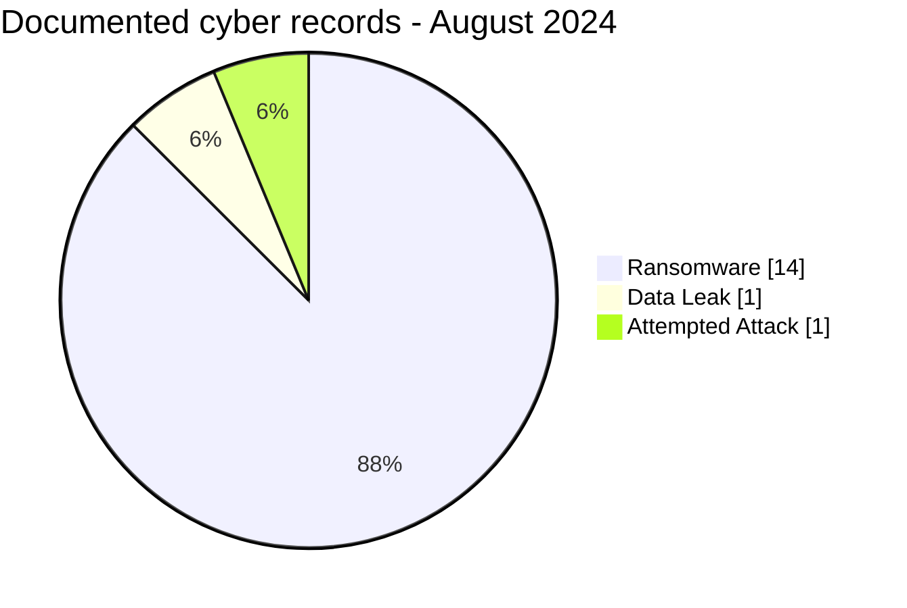
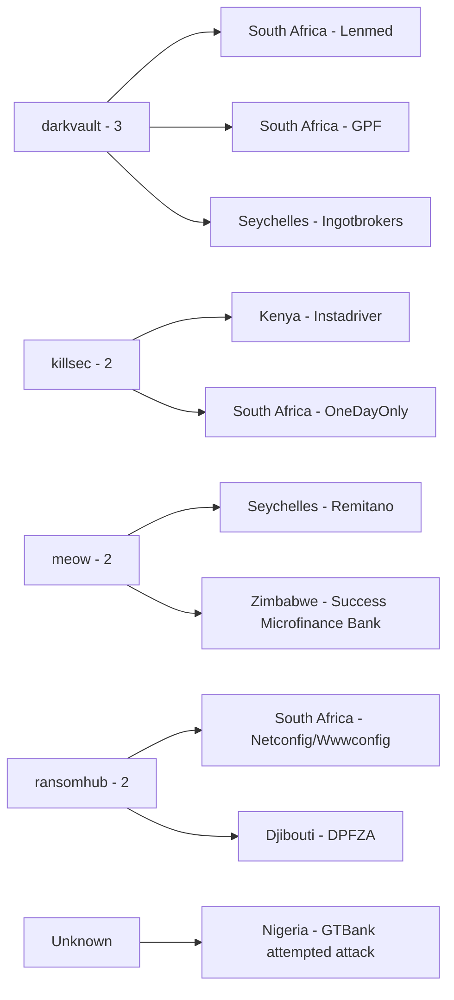
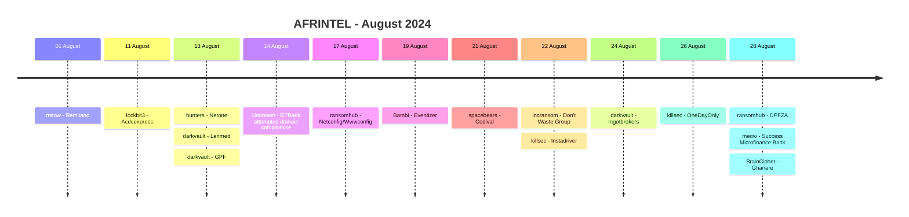

# AFRINTEL CTI Report - August 2024

👉🏾 [Version française](./README_FR.md)

## 1. Executive summary

AFRINTEL documents **16 cyber records across 9 African countries** in August 2024.

Of these, **15 fall within the six-type AFRINTEL incident taxonomy**: **14 Ransomware** and **1 Data Leak**. A sixteenth record, **GTBank in Nigeria**, is a victim-confirmed **attempted website-domain compromise** tracked separately because the available evidence does not support assigning it to Ransomware, Data Leak, Access Sale, DDoS, Defacement or Operational Fraud.

South Africa accounts for six core ransomware records. Seychelles and Zimbabwe account for two each. With the added GTBank record, Nigeria enters the August geographic coverage as a ninth country. `darkvault` is the most visible ransomware actor with three publications.

Two organizations had already appeared earlier in 2024 under different ransomware actor names: **Remitano** in April and **Lenmed** in May. The available evidence does not establish whether the later claims represent a new compromise, reuse, resale, shared material or inaccurate attribution. **Eventizer** remains the only August Data Leak with a visible sample.

👉🏾 [View the full victim list](./victims.md)

### 1.1 Month-over-month comparison

| Indicator | July 2024 | August 2024 | Change |
|---|---:|---:|---:|
| Total documented cyber records | 11 | **16** | **+5 (+45.5%)** |
| Core six-type incidents | 11 | **15** | **+4 (+36.4%)** |
| Ransomware | 7 | **14** | **+7 (+100.0%)** |
| Data Leak | 4 | **1** | **-3 (-75.0%)** |
| Access Sale | 0 | **0** | Stable |
| DDoS | 0 | **0** | Stable |
| Defacement | 0 | **0** | Stable |
| Operational Fraud | 0 | **0** | Stable |
| Attempted Attack - tracked separately | 0 | **1** | New |

August shows a strong increase in ransomware publication visibility, from 7 to 14 records. Data Leak falls from 4 to 1 because July included three recirculated Algerian datasets. The GTBank attempted attack is shown separately and does not alter the six-type taxonomy.

## 2. Methodology

- **Period:** 1-31 August 2024.
- **Source of truth:** harmonized `victims_FR.md` / `victims.md`.
- **Counting:** each card is one documented cyber record.
- **Core taxonomy:** Ransomware, Data Leak, Access Sale, DDoS, Defacement, Operational Fraud.
- **Taxonomy exception:** GTBank is retained because it is one of the validated retrospective missing records, but it is not forced into a six-type category unsupported by the evidence.
- **Double claims:** repeated organizations under different actors are tracked as separate claims when the evidence does not establish that they are the same publication or same underlying compromise.
- Claim volume is not treated as confirmed compromise volume.

## 3. Global overview

### 3.1 Record distribution

| Classification | Records | Share |
|---|---:|---:|
| Ransomware | **14** | **87.5%** |
| Data Leak | **1** | **6.3%** |
| Attempted Attack - taxonomy exception | **1** | **6.3%** |
| Access Sale | 0 | 0.0% |
| DDoS | 0 | 0.0% |
| Defacement | 0 | 0.0% |
| Operational Fraud | 0 | 0.0% |
| **Total documented records** | **16** | **100%** |

### 3.2 Country distribution

| Country | Ransomware | Data Leak | Attempted Attack | Total |
|---|---:|---:|---:|---:|
| 🇿🇦 South Africa | 6 | 0 | 0 | **6** |
| 🇸🇨 Seychelles | 2 | 0 | 0 | **2** |
| 🇿🇼 Zimbabwe | 2 | 0 | 0 | **2** |
| 🇨🇮 Côte d'Ivoire | 1 | 0 | 0 | 1 |
| 🇩🇯 Djibouti | 1 | 0 | 0 | 1 |
| 🇬🇭 Ghana | 1 | 0 | 0 | 1 |
| 🇰🇪 Kenya | 1 | 0 | 0 | 1 |
| 🇹🇳 Tunisia | 0 | 1 | 0 | 1 |
| 🇳🇬 Nigeria | 0 | 0 | 1 | 1 |
| **Total** | **14** | **1** | **1** | **16** |

### 3.3 Regional distribution

| Region | Ransomware | Data Leak | Attempted Attack | Total |
|---|---:|---:|---:|---:|
| Southern Africa | 8 | 0 | 0 | **8** |
| West Africa | 2 | 0 | 1 | **3** |
| East Africa | 2 | 0 | 0 | **2** |
| Indian Ocean | 2 | 0 | 0 | **2** |
| North Africa | 0 | 1 | 0 | **1** |
| **Total** | **14** | **1** | **1** | **16** |

### 3.4 Harmonized sector distribution

| Sector | Records | Share |
|---|---:|---:|
| Finance / Banking | **5** | **31.3%** |
| Retail / E-commerce | **4** | **25.0%** |
| Telecommunications | 2 | 12.5% |
| Professional / Business Services | 2 | 12.5% |
| Healthcare / Medical | 1 | 6.3% |
| Government / Administration | 1 | 6.3% |
| Technology / IT | 1 | 6.3% |
| **Total** | **16** | **100%** |

### 3.5 Actors / groups

| Actor / Group | Records |
|---|---:|
| darkvault | **3** |
| meow | 2 |
| ransomhub | 2 |
| killsec | 2 |
| hunters | 1 |
| lockbit3 | 1 |
| Bambi | 1 |
| spacebears | 1 |
| incransom | 1 |
| BrainCipher | 1 |
| Unknown | 1 |
| **Total** | **16** |

`Unknown` corresponds to the victim-confirmed GTBank attempted attack. No attacker attribution is established.

## 4. Detailed analysis

### 4.1 Ransomware - 14 records

The fourteen ransomware publications cover South Africa, Seychelles, Zimbabwe, Côte d'Ivoire, Djibouti, Ghana and Kenya.

All fourteen remain `Claim - Unverified` in the supplied victim corpus. No accessible technical sample or public DFIR evidence in those cards establishes a common intrusion chain, confirmed encryption or exfiltration scope.

`darkvault` is the most visible actor with three publications. `killsec`, `meow` and `ransomhub` appear twice each. These counts measure visibility and do not establish campaign coordination.

Two records require lifecycle attention:

- **Remitano** was already claimed in April by `incransom` and appears again in August under `meow`.
- **Lenmed** was already claimed in May by `lockbit3` and appears again in August under `darkvault`.

The supplied evidence does not establish whether the later claims correspond to separate compromises, reuse of an earlier claim, data resale or another relationship.

### 4.2 Data Leak - Eventizer

Eventizer is the only Data Leak record in August. The visible sample contains contact and account-context fields. The actor advertises approximately **60,000 records**, but the sample does not establish the total volume, completeness, provenance or direct technical connection to Eventizer.

AFRINTEL retains `Medium` confidence and does not reproduce raw personal records.

### 4.3 GTBank - victim-confirmed attempted attack

GTBank confirmed an isolated attempt to compromise its website domain on **14 August 2024**. The event coincided with temporary website disruption.

The bank stated that the attempt was unsuccessful, the website had not been cloned and customer information was not stored on the website. The available evidence therefore does **not** support classifying the event as a confirmed Data Leak, Ransomware, DDoS, Defacement, Access Sale or Operational Fraud incident.

AFRINTEL retains the record as a confirmed attempted attack outside the six-type core taxonomy. The actor and technical access method remain unknown.

## 5. Key findings and intelligence gaps

- August contains **16 documented cyber records**, of which **15 belong to the six-type taxonomy**.
- Ransomware publication visibility doubles from 7 in July to **14 in August**.
- South Africa accounts for **6 records**, or 37.5% of the full August corpus.
- Finance / Banking is the largest harmonized sector with **5 records**, including GTBank.
- Remitano and Lenmed require lifecycle monitoring because each had already appeared under another ransomware actor.
- Eventizer provides the month's only visible Data Leak sample.
- GTBank has stronger victim-confirmed evidence than the ransomware listings, but the confirmed event is an unsuccessful attempt rather than a successful breach.
- Public DFIR evidence remains insufficient to resolve the ransomware double claims or establish a common attack chain.

## 6. Contextual MITRE ATT&CK mapping

| Status | Technique | Application |
|---|---|---|
| Preventive | T1486 - Data Encrypted for Impact | Relevant to ransomware detection; encryption is not confirmed for the fourteen leak-site claims. |
| Preventive | T1490 - Inhibit System Recovery | Backup-resilience monitoring; behavior not established in the supplied August evidence. |
| Contextual | T1213 - Data from Information Repositories | Relevant to the structured account/contact exposure represented by Eventizer. |
| Not mapped | GTBank access path | No ATT&CK technique is asserted because the technical mechanism behind the attempted domain compromise is not established. |

## 7. Recommendations

- Keep successful compromise, criminal claim and unsuccessful attempted attack as separate analytical states.
- For double-claimed victims, preserve a publication/evidence timeline and compare later samples without assuming data sharing or a second intrusion.
- Finance and retail organizations should prioritize privileged access, fraud monitoring, abnormal exports and identity-protection controls.
- Domain owners should enforce phishing-resistant MFA at registrars, registry locks where appropriate, strict DNS change control and alerting on unauthorized changes.
- Monitor later victim statements, technical reports and sample releases that could change confidence or lifecycle status.

## 8. Timeline

## 9. Conclusion

August 2024 is the largest AFRINTEL monthly corpus observed so far in the corrected January-August sequence, with **16 documented cyber records across 9 African countries**. Fifteen of those records fall inside the six-type AFRINTEL incident taxonomy, comprising **14 Ransomware and 1 Data Leak**, while GTBank is retained separately as a **victim-confirmed attempted attack**.

Compared with July, total documented records rise from 11 to 16, an increase of **45.5%**. The strongest numerical change is Ransomware, which doubles from 7 to 14 publications. Data Leak falls from 4 to 1, partly because July's leak count contained three older Algerian datasets recirculated during that month. The month-to-month comparison therefore reflects changes in collection composition as much as changes in raw volume.

The ransomware concentration is substantial but evidentially weak. Fourteen organizations appear on leak sites, yet the supplied cards do not provide public DFIR evidence establishing a shared intrusion chain, confirmed encryption or exfiltration scope. DarkVault is the most visible actor with three publications, but actor frequency alone is insufficient to infer a coordinated campaign. The repeated claims against Remitano and Lenmed further complicate attribution: without matching technical artifacts or victim timelines, reuse, resale, a second intrusion and inaccurate attribution all remain unresolved possibilities rather than conclusions.

Eventizer provides the only visible data sample in the month's core taxonomy. Its structured contact and account-context fields support a real exposure signal, but the claimed 60,000-record volume and full provenance remain unverified. GTBank presents the opposite evidential profile: the victim itself confirms an attempted cyber event and temporary website impact, while also stating that the attempt failed and that customer data was not compromised. Treating that event as a successful breach would therefore be less accurate than preserving it as a separate attempted-attack record.

August consequently reinforces a central AFRINTEL principle: **publication volume, incident success, attribution and evidence maturity are different dimensions**. The defensible conclusion is that August produced a sharp increase in ransomware visibility, one sampled Data Leak and one confirmed but unsuccessful domain-compromise attempt. Follow-up should prioritize victim confirmations, DFIR findings, later leak samples and lifecycle correlation, particularly for organizations claimed by multiple ransomware actors.

**AFRINTEL** - TLP:CLEAR
