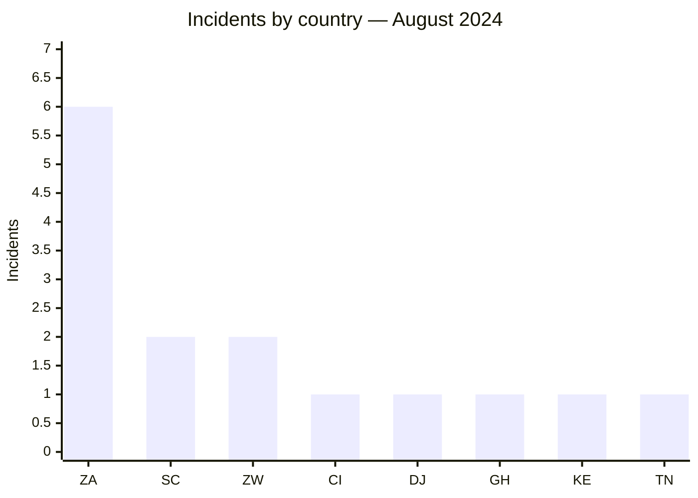
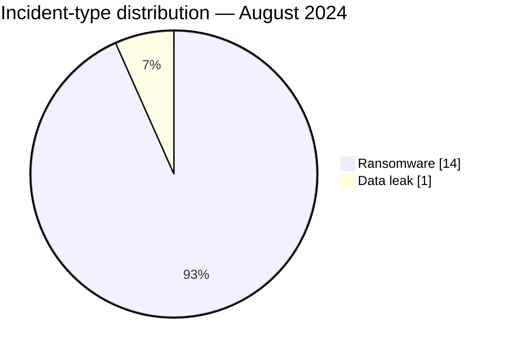

# AFRINTEL CTI Report — August 2024

👉🏾 [Version française](./README_FR.md)

## 1. Executive summary

August 2024 reaches **15 incidents**, comprising **14 ransomware claims** and **1 data leak**. South Africa accounts for six publications, well ahead of Seychelles and Zimbabwe with two each. DarkVault is the most visible actor with three incidents.

Two organizations had already been published under different actor names: Remitano in April and Lenmed in May. These double claims may reflect several scenarios — sharing, resale, reuse of a claim, or inaccurate attribution — but no public source resolves the issue. Eventizer is the month's only data leak with a visible sample.

See [victims.md](./victims.md).

## 2. Methodology

This report covers publications assigned to August 2024. An organization is counted once within the month even if it appeared earlier. Double claims are treated as an attribution issue without inferring data transfer or cooperation between actors.

Statistics derive from the **15 incidents** in [victims.md](./victims.md), synchronized with [victims_FR.md](./victims_FR.md).

## 3. Global overview

| Indicator | Value |
|---|---:|
| Incidents / Countries | **15 / 8** |
| Ransomware | **14** |
| Data leaks | **1** |
| Access sales / Defacement | **0 / 0** |
| Identified double claims | **2** |

### Country ranking

| Country | Total | Ransomware | Data leak |
|---|---:|---:|---:|
| 🇿🇦 South Africa | 6 | 6 | 0 |
| 🇸🇨 Seychelles | 2 | 2 | 0 |
| 🇿🇼 Zimbabwe | 2 | 2 | 0 |
| 🇨🇮 Côte d’Ivoire | 1 | 1 | 0 |
| 🇩🇯 Djibouti | 1 | 1 | 0 |
| 🇬🇭 Ghana | 1 | 1 | 0 |
| 🇰🇪 Kenya | 1 | 1 | 0 |
| 🇹🇳 Tunisia | 1 | 0 | 1 |
| **Total** | **15** | **14** | **1** |

### Regional distribution

| Region | Total | Ransomware | Data leak |
|---|---:|---:|---:|
| Southern Africa | 8 | 8 | 0 |
| West Africa | 2 | 2 | 0 |
| East Africa | 2 | 2 | 0 |
| Indian Ocean | 2 | 2 | 0 |
| North Africa | 1 | 0 | 1 |
| **Total** | **15** | **14** | **1** |

### Normalized sector distribution

| Sector | Incidents | Share |
|---|---:|---:|
| Finance / Banking | 4 | 26.7% |
| Retail / E-commerce | 4 | 26.7% |
| Telecommunications | 2 | 13.3% |
| Professional / Business Services | 2 | 13.3% |
| Healthcare / Medical | 1 | 6.7% |
| Government / Administration | 1 | 6.7% |
| Technology / IT | 1 | 6.7% |
| **Total** | **15** | **100%** |

### Most visible actors

| Actor | Incidents |
|---|---:|
| DarkVault | 3 |
| KillSec | 2 |
| Meow | 2 |
| RansomHub | 2 |
| Six other actors or sources | 1 each |

## 4. Detailed analysis by incident type

### 4.1 Ransomware

The fourteen publications primarily cover finance, retail, and telecommunications. South Africa's concentration is robust in the corpus, but the publications do not demonstrate a single campaign. Remitano and Lenmed should be tracked as double claims whose technical relationship remains unknown.

### 4.2 Data leak

The Eventizer publication contains contact and account-context fields. The 60,000-record volume is actor-claimed; the sample does not establish completeness. No raw personal data is reproduced.

## 5. Sectoral impact

Finance and retail account for more than half the corpus. They combine continuity, fraud, and phishing risks. Telecommunications adds an infrastructure concern, while the publication involving a Djiboutian authority increases the sensitivity of the public-sector element.

## 6. Threat actor profile and risk assessment

| Scope | Level | Rationale |
|---|---|---|
| 🇿🇦 South Africa | 🔴 High | Six claims across five sectors |
| 🇸🇨 Seychelles / 🇿🇼 Zimbabwe | 🔴 High | Two financial or telecom publications each |
| 🇩🇯 Djibouti | 🔴 High | Publication involving a public authority |
| Other countries | 🟠 Medium | One publication each |

## 7. Key trends and intelligence gaps

- **Observed — high confidence:** 14 of 15 incidents are ransomware claims.
- **Observed — high confidence:** South Africa accounts for 40% of the corpus.
- **Observed — high confidence:** Remitano and Lenmed had previously been published by other actors.
- **Gap:** no public DFIR report was identified in the sources reviewed to explain the double claims.
- **Gap:** the full Eventizer volume and any relationship between actors remain unknown.
- **Collection need:** publication chronology, victim confirmation, and non-intrusive comparison of available samples.

## 8. Contextual MITRE ATT&CK mapping

| Status | Technique | Use |
|---|---|---|
| Preventive | T1486 — Data Encrypted for Impact | Encryption detection; not confirmed in the claims |
| Preventive | T1490 — Inhibit System Recovery | Backup monitoring |
| Preventive | T1567 — Exfiltration Over Web Service | Transfer controls; Eventizer channel not observed |

## 9. Recommendations

- **Finance and retail:** monitor fraud, credential reuse, and unusual exports.
- **Telecommunications:** separate administration planes and test continuity procedures.
- **Public sector:** strengthen privileged accounts and logging.
- **Double-claimed victims:** maintain an evidence timeline and compare artifacts without presuming their origin.

## 10. SOC and tactical recommendations

| Qualification | Action |
|---|---|
| **Observed** | Correlate publication dates and named assets; no common intrusion chain is established. |
| **Assumption** | Hunt for accounts, infrastructure, or archives shared across double claims. |
| **Preventive** | Detect mass encryption, backup deletion, bulk exports, and abnormal outbound transfers. |

## 11. Strategic recommendations

| Priority | Qualification | Measure |
|---:|---|---|
| 1 | **Observed** | Prioritize South African organizations and the finance, retail, and telecom sectors. |
| 2 | **Assumption** | Examine sharing or resale as unconfirmed explanations for double claims. |
| 3 | **Preventive** | Standardize ASM, phishing-resistant MFA, and isolated immutable backups. |

## 12. Conclusion

August is the densest month of 2024 to date, but visible activity must remain separate from confirmed compromise. Double claims complicate attribution, while Eventizer provides the only directly actionable signal on data content. Validation matters more than speculation about relationships between groups.

**AFRINTEL — TLP:CLEAR**

[AFRINTEL repository](https://github.com/Hatchepsoute/AFRINTEL)
