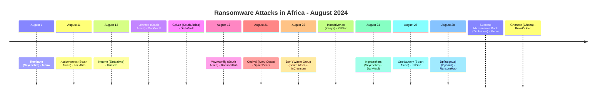
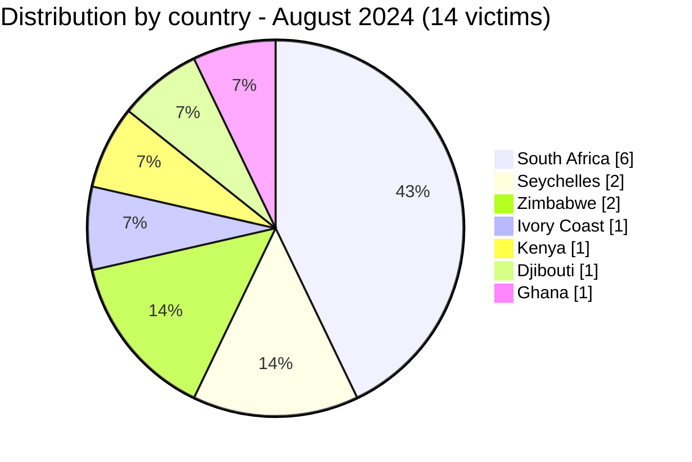

[](https://github.com/Hatchepsoute/AFRINTEL)


# CTI Report - August 2024: Record month with 14 victims and 2 double claims

👉🏾 [Version française disponible ici](./README_FR.md)

### 1. Executive summary

August 2024 is the **most active month of the year** with **14 documented victims** across 7 countries. The month includes **2 double claims** by distinct ransomware groups (Remitano and Lenmed), each previously claimed by different actors. DarkVault leads with 3 claims. Nine distinct groups are active simultaneously.

👉🏾 [Victims list](./victims.md)

**Key figures:**
- 🔹 **14 victims** identified (including 2 double claims by distinct groups)
- 🔹 **9 active groups**: DarkVault (3), KillSec (2), Meow (2), RansomHub (2), LockBit3 (1), Hunters (1), SpaceBears (1), InCransom (1), BrainCipher (1)
- 🔹 **Countries affected**: South Africa (6), Seychelles (2), Zimbabwe (2), Ivory Coast (1), Kenya (1), Djibouti (1), Ghana (1)
- 🔹 **Sectors**: Finance, Retail/Distribution, Telecommunications, Healthcare, Government, Technologies

---

### 2. Attack timeline

| Date | Victim | Country | Ransomware group | Note |
|------|--------|---------|-----------------|------|
| August 1 | Remitano | Seychelles | Meow | ⚠️ Double claim (April 2024 - InCransom) |
| August 11 | Acdcexpress | South Africa | LockBit3 | |
| August 13 | Netone | Zimbabwe | Hunters | |
| August 13 | Lenmed | South Africa | DarkVault | ⚠️ Double claim (May 2024 - LockBit3) |
| August 13 | Gpf.za | South Africa | DarkVault | |
| August 17 | Wwwconfig (Netconfig) | South Africa | RansomHub | |
| August 21 | Codival | Ivory Coast | SpaceBears | |
| August 22 | Don't Waste Group | South Africa | InCransom | |
| August 22 | Instadriver.co | Kenya | KillSec | |
| August 24 | Ingotbrokers | Seychelles | DarkVault | |
| August 26 | Onedayonly | South Africa | KillSec | |
| August 28 | Dpfza.gov.dj | Djibouti | RansomHub | |
| August 28 | Success Microfinance Bank | Zimbabwe | Meow | |
| August 28 | Ghanare | Ghana | BrainCipher | |



---

### 3. Victim analysis

#### 3.1 By country

| Country | Number of attacks |
|---------|-----------------|
| South Africa | 6 |
| Seychelles | 2 |
| Zimbabwe | 2 |
| Ivory Coast | 1 |
| Kenya | 1 |
| Djibouti | 1 |
| Ghana | 1 |



#### 3.2 By sector

| Sector | Count |
|--------|-------|
| Finance / Banking | 3 |
| Retail / Distribution | 3 |
| Telecommunications | 2 |
| Healthcare services | 1 |
| Government administration | 1 |
| Technologies | 1 |
| Services | 1 |
| Financial organizations | 1 |
| E-commerce | 1 |

```mermaid
xychart-beta
    title "Targeted Sectors - August 2024"
    x-axis ["Finance", "Retail", "Telecom", "Healthcare", "Government", "Tech", "Services", "E-commerce"]
    y-axis "Number of attacks" 0 to 4
    bar [3, 3, 2, 1, 1, 1, 1, 1]
```

#### 3.3 Ransomware groups

| Ransomware group | Number of attacks |
|-----------------|-----------------|
| DarkVault | 3 |
| KillSec | 2 |
| Meow | 2 |
| RansomHub | 2 |
| LockBit3 | 1 |
| Hunters | 1 |
| SpaceBears | 1 |
| InCransom | 1 |
| BrainCipher | 1 |

```mermaid
gantt
    title Active Ransomware Groups - August 2024
    dateFormat X
    axisFormat %s
    section DarkVault
    DarkVault : 0, 3
    section KillSec
    KillSec : 0, 2
    section Meow
    Meow : 0, 2
    section RansomHub
    RansomHub : 0, 2
    section LockBit3
    LockBit3 : 0, 1
    section Hunters
    Hunters : 0, 1
    section SpaceBears
    SpaceBears : 0, 1
    section InCransom
    InCransom : 0, 1
    section BrainCipher
    BrainCipher : 0, 1
```



---

### 4. Key observations

- **Record month**: 14 victims is the highest monthly count in 2024, representing nearly double the January-February average.
- **2 confirmed double claims**: Remitano (Seychelles, crypto exchange) and Lenmed (South Africa, healthcare) were each previously claimed by different groups, suggesting data resale or independent compromise of the same targets.
- **DarkVault dominates**: the group claims 3 South African victims in a single day (August 13), indicating a coordinated campaign.
- **BrainCipher first appearance** in Africa: the group claims Ghanare (Ghana, tech sector), marking its continental debut.
- **Government targeted in Djibouti**: Dpfza.gov.dj (Djibouti Port Free Zone Authority), strategic infrastructure for East African logistics.
- **Telecom sector**: Netone (Zimbabwe, major MNO) and Wwwconfig/Netconfig (South Africa) reflect sustained interest in connectivity infrastructure.

---

```mermaid
xychart-beta
    title "Monthly Evolution of Attacks (Jan - Aug 2024)"
    x-axis ["Jan", "Feb", "Mar", "Apr", "May", "Jun", "Jul", "Aug"]
    y-axis "Number of attacks" 0 to 16
    bar [3, 5, 7, 5, 8, 3, 7, 14]
```

### 5. Recommendations

| Domain | Recommended action |
|--------|--------------------|
| Healthcare | Strengthen access controls, monitor for reinfection (double-claim pattern), prepare IR plan. |
| Finance / Banking | Enforce MFA, audit data access logs, monitor for dark web data resale. |
| Telecommunications | Segment core network infrastructure, harden NOC/management interfaces. |
| Government | Patch critical systems, enforce least-privilege access, monitor DNS anomalies. |
| All organizations | Track DarkVault, Meow, and BrainCipher as highly active groups, review their TTPs and IOCs. |

---

*Report generated from AFRINTEL OSINT data. Free distribution (TLP:CLEAR)*
