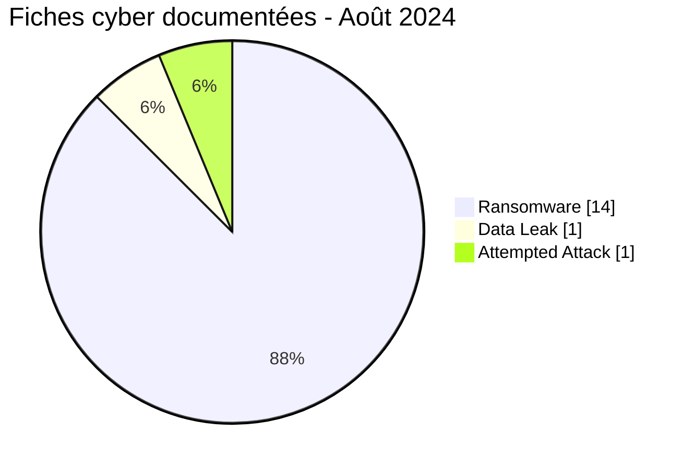
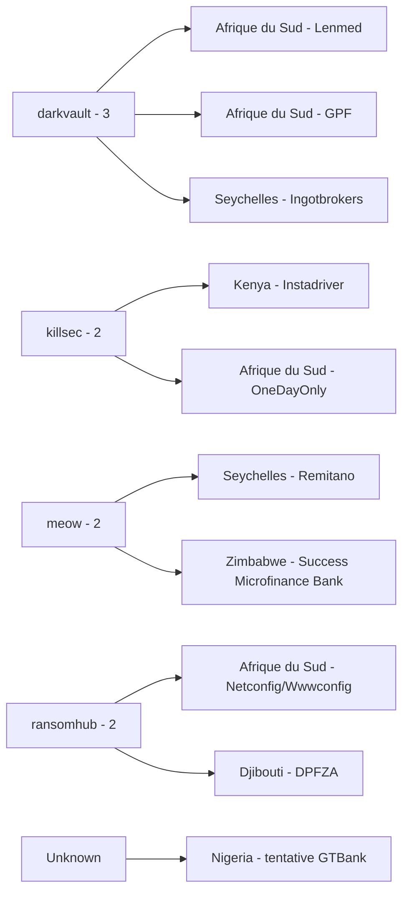
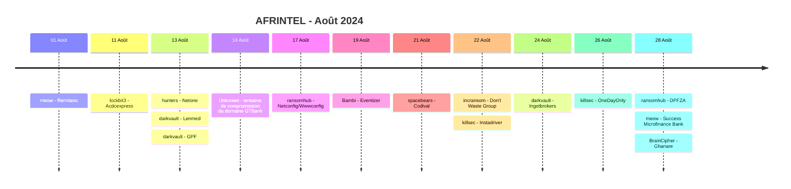

# Rapport CTI AFRINTEL - Août 2024

👉🏾 [English version](./README.md)

## 1. Résumé exécutif

AFRINTEL documente **16 fiches cyber dans 9 pays africains** en août 2024.

Parmi elles, **15 relèvent de la taxonomie AFRINTEL à six types** : **14 Ransomware** et **1 Data Leak**. Une seizième fiche, **GTBank au Nigeria**, correspond à une **tentative de compromission de domaine web confirmée par la victime** et suivie séparément, car les éléments disponibles ne permettent pas de la classer comme Ransomware, Data Leak, Access Sale, DDoS, Defacement ou Operational Fraud.

L'Afrique du Sud concentre six fiches ransomware. Les Seychelles et le Zimbabwe en comptent deux chacun. Avec l'ajout de GTBank, le Nigeria entre dans la couverture géographique d'août comme neuvième pays. `darkvault` est l'acteur ransomware le plus visible avec trois publications.

Deux organisations étaient déjà apparues plus tôt en 2024 sous d'autres noms de groupes ransomware : **Remitano** en avril et **Lenmed** en mai. Les éléments disponibles ne permettent pas d'établir si les publications ultérieures correspondent à une nouvelle compromission, une réutilisation, une revente, un partage de matériel ou une attribution erronée. **Eventizer** reste le seul Data Leak d'août disposant d'un échantillon visible.

👉🏾 [Voir la liste complète des victimes](./victims_FR.md)

### 1.1 Comparaison avec le mois précédent

| Indicateur | Juillet 2024 | Août 2024 | Évolution |
|---|---:|---:|---:|
| Total fiches cyber documentées | 11 | **16** | **+5 (+45,5 %)** |
| Incidents de la taxonomie à six types | 11 | **15** | **+4 (+36,4 %)** |
| Ransomware | 7 | **14** | **+7 (+100,0 %)** |
| Data Leak | 4 | **1** | **-3 (-75,0 %)** |
| Access Sale | 0 | **0** | Stable |
| DDoS | 0 | **0** | Stable |
| Defacement | 0 | **0** | Stable |
| Operational Fraud | 0 | **0** | Stable |
| Attempted Attack - suivi séparé | 0 | **1** | Nouveau |

Août montre une forte hausse de la visibilité ransomware, de 7 à 14 fiches. Les Data Leak passent de 4 à 1, car juillet comprenait notamment trois jeux de données algériens anciens remis en circulation. La tentative GTBank est présentée séparément et ne modifie pas la taxonomie à six types.

## 2. Méthodologie

- **Période :** 1er au 31 août 2024.
- **Source de vérité :** couple harmonisé `victims_FR.md` / `victims.md`.
- **Comptage :** chaque fiche représente un événement cyber documenté.
- **Taxonomie principale :** Ransomware, Data Leak, Access Sale, DDoS, Defacement, Operational Fraud.
- **Exception de taxonomie :** GTBank est conservé car il fait partie des incidents rétrospectifs validés comme manquants, mais n'est pas forcé dans une catégorie non étayée.
- **Doubles revendications :** une organisation publiée sous différents acteurs est suivie comme revendications distinctes lorsque les preuves ne permettent pas d'établir qu'il s'agit de la même publication ou du même compromis sous-jacent.
- Le volume de revendications n'est pas assimilé à un volume de compromissions confirmées.

## 3. Vue globale

### 3.1 Répartition des fiches

| Classification | Fiches | Part |
|---|---:|---:|
| Ransomware | **14** | **87,5 %** |
| Data Leak | **1** | **6,3 %** |
| Attempted Attack - exception de taxonomie | **1** | **6,3 %** |
| Access Sale | 0 | 0,0 % |
| DDoS | 0 | 0,0 % |
| Defacement | 0 | 0,0 % |
| Operational Fraud | 0 | 0,0 % |
| **Total fiches documentées** | **16** | **100 %** |

### 3.2 Répartition par pays

| Pays | Ransomware | Data Leak | Attempted Attack | Total |
|---|---:|---:|---:|---:|
| 🇿🇦 Afrique du Sud | 6 | 0 | 0 | **6** |
| 🇸🇨 Seychelles | 2 | 0 | 0 | **2** |
| 🇿🇼 Zimbabwe | 2 | 0 | 0 | **2** |
| 🇨🇮 Côte d'Ivoire | 1 | 0 | 0 | 1 |
| 🇩🇯 Djibouti | 1 | 0 | 0 | 1 |
| 🇬🇭 Ghana | 1 | 0 | 0 | 1 |
| 🇰🇪 Kenya | 1 | 0 | 0 | 1 |
| 🇹🇳 Tunisie | 0 | 1 | 0 | 1 |
| 🇳🇬 Nigeria | 0 | 0 | 1 | 1 |
| **Total** | **14** | **1** | **1** | **16** |

### 3.3 Répartition régionale

| Région | Ransomware | Data Leak | Attempted Attack | Total |
|---|---:|---:|---:|---:|
| Afrique australe | 8 | 0 | 0 | **8** |
| Afrique de l'Ouest | 2 | 0 | 1 | **3** |
| Afrique de l'Est | 2 | 0 | 0 | **2** |
| Océan Indien | 2 | 0 | 0 | **2** |
| Afrique du Nord | 0 | 1 | 0 | **1** |
| **Total** | **14** | **1** | **1** | **16** |

### 3.4 Répartition sectorielle harmonisée

| Secteur | Fiches | Part |
|---|---:|---:|
| Finance / Banking | **5** | **31,3 %** |
| Retail / E-commerce | **4** | **25,0 %** |
| Telecommunications | 2 | 12,5 % |
| Professional / Business Services | 2 | 12,5 % |
| Healthcare / Medical | 1 | 6,3 % |
| Government / Administration | 1 | 6,3 % |
| Technology / IT | 1 | 6,3 % |
| **Total** | **16** | **100 %** |

### 3.5 Acteurs / groupes

| Acteur / Groupe | Fiches |
|---|---:|
| darkvault | **3** |
| meow | 2 |
| ransomhub | 2 |
| killsec | 2 |
| hunters | 1 |
| lockbit3 | 1 |
| Bambi | 1 |
| spacebears | 1 |
| incransom | 1 |
| BrainCipher | 1 |
| Unknown | 1 |
| **Total** | **16** |

`Unknown` correspond à la tentative GTBank confirmée par la victime. Aucune attribution d'attaquant n'est établie.

## 4. Analyse détaillée

### 4.1 Ransomware - 14 fiches

Les quatorze publications ransomware couvrent l'Afrique du Sud, les Seychelles, le Zimbabwe, la Côte d'Ivoire, Djibouti, le Ghana et le Kenya.

Les quatorze restent `Claim - Unverified` dans le corpus victimes fourni. Aucun échantillon technique accessible ni élément DFIR public dans ces fiches ne permet d'établir une chaîne d'intrusion commune, un chiffrement confirmé ou l'étendue d'une exfiltration.

`darkvault` est l'acteur le plus visible avec trois publications. `killsec`, `meow` et `ransomhub` apparaissent deux fois chacun. Ces volumes mesurent la visibilité et ne démontrent pas une coordination de campagne.

Deux fiches nécessitent un suivi de cycle de vie :

- **Remitano** avait déjà été revendiqué en avril par `incransom` et réapparaît en août sous `meow`.
- **Lenmed** avait déjà été revendiqué en mai par `lockbit3` et réapparaît en août sous `darkvault`.

Les éléments fournis ne permettent pas de déterminer si les revendications ultérieures correspondent à des compromissions séparées, à la réutilisation d'une ancienne revendication, à une revente de données ou à une autre relation.

### 4.2 Data Leak - Eventizer

Eventizer constitue l'unique fiche Data Leak d'août. L'échantillon visible comporte des champs de contact et de contexte de comptes. L'acteur annonce environ **60 000 enregistrements**, mais l'échantillon ne permet pas d'établir le volume total, l'exhaustivité, la provenance ou le rattachement technique direct à Eventizer.

AFRINTEL maintient donc un niveau `Medium` et ne reproduit aucun enregistrement personnel brut.

### 4.3 GTBank - tentative d'attaque confirmée par la victime

GTBank a confirmé une tentative isolée de compromission de son domaine web le **14 août 2024**. L'événement a coïncidé avec une indisponibilité temporaire du site.

La banque a déclaré que la tentative avait échoué, que le site n'avait pas été cloné et que les informations clients n'étaient pas stockées sur le site. Les éléments disponibles ne permettent donc **pas** de classer le dossier comme Data Leak, Ransomware, DDoS, Defacement, Access Sale ou Operational Fraud confirmé.

AFRINTEL conserve la fiche comme tentative d'attaque confirmée, hors de la taxonomie principale à six types. L'acteur et la méthode technique d'accès restent inconnus.

## 5. Principaux constats et lacunes

- Août contient **16 fiches cyber documentées**, dont **15 relèvent de la taxonomie à six types**.
- La visibilité des publications Ransomware double, passant de 7 en juillet à **14 en août**.
- L'Afrique du Sud représente **6 fiches**, soit 37,5 % du corpus complet d'août.
- Finance / Banking est le premier secteur harmonisé avec **5 fiches**, en incluant GTBank.
- Remitano et Lenmed nécessitent un suivi de cycle de vie car chacun avait déjà été publié par un autre acteur ransomware.
- Eventizer fournit le seul échantillon visible de Data Leak du mois.
- GTBank repose sur une confirmation victime plus solide que les listings ransomware, mais l'événement confirmé correspond à une tentative échouée et non à une compromission réussie.
- Les éléments DFIR publics restent insuffisants pour résoudre les doubles revendications ransomware ou établir une chaîne d'attaque commune.

## 6. Cartographie MITRE ATT&CK contextuelle

| Statut | Technique | Application |
|---|---|---|
| Préventif | T1486 - Data Encrypted for Impact | Pertinent pour la détection ransomware ; chiffrement non confirmé pour les quatorze revendications. |
| Préventif | T1490 - Inhibit System Recovery | Surveillance de la résilience des sauvegardes ; comportement non établi dans les éléments d'août fournis. |
| Contextuel | T1213 - Data from Information Repositories | Pertinent pour l'exposition structurée de contacts et de contexte de comptes observée chez Eventizer. |
| Non cartographié | Chemin d'accès GTBank | Aucune technique ATT&CK n'est attribuée car le mécanisme technique de la tentative de compromission du domaine n'est pas établi. |

## 7. Recommandations

- Conserver séparément compromission réussie, revendication criminelle et tentative d'attaque échouée.
- Pour les victimes doublement revendiquées, préserver une chronologie des publications et des preuves et comparer les futurs échantillons sans présumer d'un partage de données ou d'une seconde intrusion.
- Les secteurs finance et commerce doivent prioriser les accès privilégiés, la surveillance de fraude, les exports anormaux et la protection des identités.
- Les propriétaires de domaines doivent imposer une MFA résistante au phishing chez les registrars, utiliser des mécanismes de verrouillage adaptés, contrôler strictement les changements DNS et alerter sur toute modification non autorisée.
- Surveiller les futures déclarations victimes, rapports techniques et échantillons susceptibles de modifier le niveau de confiance ou le statut de cycle de vie des fiches d'août.

## 8. Chronologie

## 9. Conclusion

Août 2024 constitue le corpus mensuel AFRINTEL le plus volumineux observé jusqu'ici dans la séquence corrigée de janvier à août, avec **16 fiches cyber documentées dans 9 pays africains**. Quinze de ces fiches relèvent de la taxonomie AFRINTEL à six types, avec **14 Ransomware et 1 Data Leak**, tandis que GTBank est conservé séparément comme **tentative d'attaque confirmée par la victime**.

Par rapport à juillet, le nombre total de fiches documentées passe de 11 à 16, soit une hausse de **45,5 %**. La principale évolution numérique concerne les Ransomware, qui doublent de 7 à 14 publications. Les Data Leak passent de 4 à 1, notamment parce que le total de juillet comprenait trois jeux de données algériens plus anciens remis en circulation durant ce mois. La comparaison mensuelle reflète donc autant une évolution de la composition de la collecte qu'une évolution du volume brut.

La concentration ransomware est importante mais la maturité des preuves reste faible. Quatorze organisations apparaissent sur des leak sites, alors que les fiches fournies ne contiennent pas d'éléments DFIR publics établissant une chaîne d'intrusion commune, un chiffrement confirmé ou l'étendue d'une exfiltration. DarkVault est l'acteur le plus visible avec trois publications, mais la fréquence d'un acteur ne suffit pas à démontrer une campagne coordonnée. Les revendications répétées concernant Remitano et Lenmed compliquent encore l'attribution : sans artefacts techniques comparables ni chronologies confirmées par les victimes, réutilisation, revente, seconde intrusion ou attribution erronée restent des hypothèses et non des conclusions.

Eventizer fournit le seul échantillon de données visible dans la taxonomie principale du mois. Les champs structurés de contact et de contexte de comptes constituent un signal d'exposition concret, mais le volume revendiqué de 60 000 enregistrements et la provenance complète restent non vérifiés. GTBank présente un profil de preuve inverse : la victime elle-même confirme un événement cyber et une perturbation temporaire du site, tout en précisant que la tentative a échoué et qu'aucune donnée client n'a été compromise. Présenter ce dossier comme une violation réussie serait donc moins exact que de le conserver comme tentative d'attaque distincte.

Août renforce ainsi un principe central d'AFRINTEL : **volume de publications, réussite de l'incident, attribution et maturité des preuves sont des dimensions différentes**. La conclusion défendable est qu'août connaît une forte hausse de la visibilité ransomware, un Data Leak avec échantillon et une tentative de compromission de domaine confirmée mais échouée. Le suivi doit prioriser les confirmations victimes, les résultats DFIR, les nouveaux échantillons et la corrélation de cycle de vie, en particulier pour les organisations revendiquées par plusieurs acteurs ransomware.

**AFRINTEL** - TLP:CLEAR
