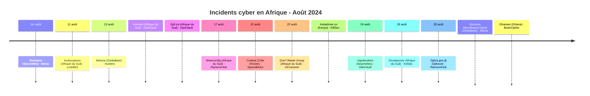
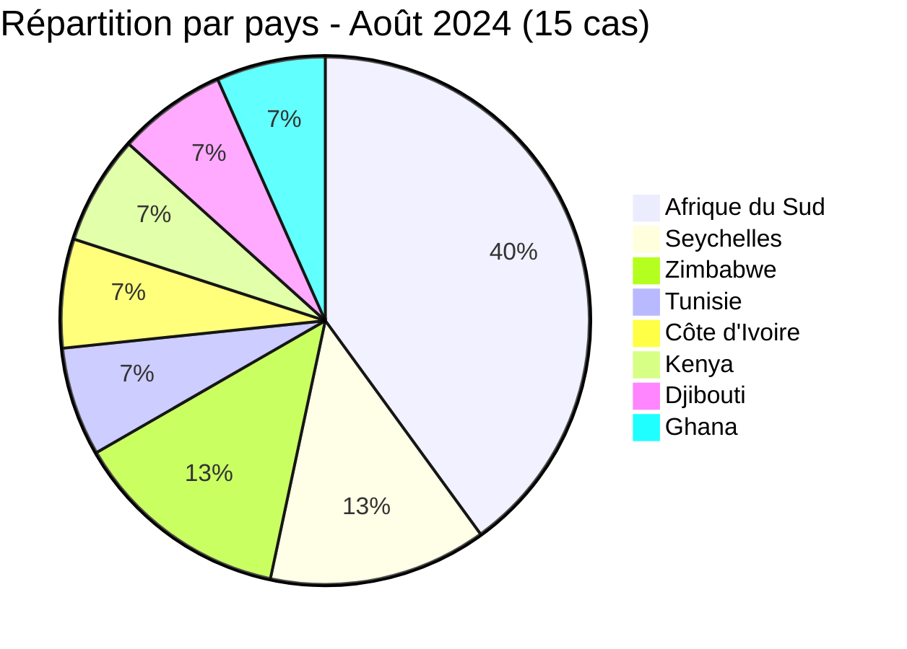

[](https://github.com/Hatchepsoute/AFRINTEL)


# Rapport CTI - Août 2024 : Mois record avec 15 cas (14 revendications ransomware et 1 fuite de données) et 2 double-claims

👉🏾 [English version available here](./README.md)

### 1. Résumé exécutif

Août 2024 est le **mois le plus actif de l'année** avec **15 cas** documentés dans 8 pays. Le mois inclut **2 double-claims** par des groupes ransomware distincts (Remitano et Lenmed), chacun préalablement revendiqué par d'autres acteurs. DarkVault mène avec 3 revendications. Neuf groupes distincts sont actifs simultanément.

👉🏾 [Liste des victimes](./victims_FR.md)

**Chiffres clés :**
- 🔹 **15 cas** identifiés (14 revendications ransomware et 1 fuite de données ; dont 2 double-claims)
- 🔹 **9 groupes actifs** : DarkVault (3), KillSec (2), Meow (2), RansomHub (2), LockBit3 (1), Hunters (1), SpaceBears (1), InCransom (1), BrainCipher (1)
- 🔹 **Pays touchés** : Afrique du Sud (6), Seychelles (2), Zimbabwe (2), Tunisie (1), Côte d'Ivoire (1), Kenya (1), Djibouti (1), Ghana (1)
- 🔹 **Secteurs** : Finance, Retail/Distribution, Télécommunications, Santé, Gouvernement, Technologies, Événementiel / Plateformes numériques

### Vue agrégée mensuelle de l’exposition

La vue CTI mensuelle regroupe les fuites de données et les ventes d’accès sous **exposition des données** : **1 fiches** (6.7% du corpus mensuel). Les fiches sources restent la référence ; une vente d’accès ne prouve pas à elle seule l’exfiltration de données.

---

### 2. Chronologie des attaques

| Date | Victime | Pays | Groupe ransomware | Note |
|------|---------|------|-------------------|------|
| 1er août | Remitano | Seychelles | Meow | ⚠️ Double-claim (avril 2024 - InCransom) |
| 11 août | Acdcexpress | Afrique du Sud | LockBit3 | |
| 13 août | Netone | Zimbabwe | Hunters | |
| 13 août | Lenmed | Afrique du Sud | DarkVault | ⚠️ Double-claim (mai 2024 - LockBit3) |
| 13 août | Gpf.za | Afrique du Sud | DarkVault | |
| 17 août | Wwwconfig (Netconfig) | Afrique du Sud | RansomHub | |
| 19 août | Eventizer | Tunisie | Bambi | Fuite de données |
| 21 août | Codival | Côte d'Ivoire | SpaceBears | |
| 22 août | Don't Waste Group | Afrique du Sud | InCransom | |
| 22 août | Instadriver.co | Kenya | KillSec | |
| 24 août | Ingotbrokers | Seychelles | DarkVault | |
| 26 août | Onedayonly | Afrique du Sud | KillSec | |
| 28 août | Dpfza.gov.dj | Djibouti | RansomHub | |
| 28 août | Success Microfinance Bank | Zimbabwe | Meow | |
| 28 août | Ghanare | Ghana | BrainCipher | |



---

### 3. Analyse des victimes

#### 3.1 Par pays

| Pays | Nombre d'attaques |
|------|-----------------|
| Afrique du Sud | 6 |
| Seychelles | 2 |
| Zimbabwe | 2 |
| Tunisie | 1 |
| Côte d'Ivoire | 1 |
| Kenya | 1 |
| Djibouti | 1 |
| Ghana | 1 |



#### 3.2 Par secteur

| Secteur | Nombre |
|---------|--------|
| Finance / Banque | 3 |
| Retail / Distribution | 3 |
| Télécommunications | 2 |
| Services de santé | 1 |
| Administration publique | 1 |
| Technologies | 1 |
| Services | 1 |
| Organismes financiers | 1 |
| E-commerce | 1 |
| Événementiel / Plateforme numérique | 1 |

```mermaid
xychart-beta
    title "Secteurs ciblés - Août 2024"
    x-axis ["Finance", "Retail", "Télécom", "Santé", "Gouvernement", "Tech", "Services", "E-commerce", "Événementiel"]
    y-axis "Nombre d'attaques" 0 to 4
    bar [3, 3, 2, 1, 1, 1, 1, 1, 1]
```

#### 3.3 Groupes ransomware

| Groupe ransomware | Nombre d'attaques |
|-----------------|-----------------|
| DarkVault | 3 |
| KillSec | 2 |
| Meow | 2 |
| RansomHub | 2 |
| LockBit3 | 1 |
| Hunters | 1 |
| SpaceBears | 1 |
| InCransom | 1 |
| BrainCipher | 1 |

```mermaid
gantt
    title Groupes ransomware actifs - Août 2024
    dateFormat X
    axisFormat %s
    section DarkVault
    DarkVault : 0, 3
    section KillSec
    KillSec : 0, 2
    section Meow
    Meow : 0, 2
    section RansomHub
    RansomHub : 0, 2
    section LockBit3
    LockBit3 : 0, 1
    section Hunters
    Hunters : 0, 1
    section SpaceBears
    SpaceBears : 0, 1
    section InCransom
    InCransom : 0, 1
    section BrainCipher
    BrainCipher : 0, 1
```



---

### 4. Points d'attention

- **Mois record** : 15 cas est le nombre mensuel le plus élevé de 2024, représentant presque le double de la moyenne janvier-février.
- **2 double-claims confirmés** : Remitano (Seychelles, crypto) et Lenmed (Afrique du Sud, santé) ont chacun été revendiqués précédemment par des groupes différents, suggérant une revente de données ou une compromission indépendante des mêmes cibles.
- **DarkVault en tête** : le groupe revendique 3 victimes sud-africaines en une seule journée (13 août), indiquant une campagne coordonnée.
- **Première apparition de BrainCipher** en Afrique : le groupe revendique Ghanare (Ghana, tech), marquant son entrée sur le continent.
- **Gouvernement ciblé à Djibouti** : Dpfza.gov.dj (Djibouti Port Free Zone Authority), infrastructure stratégique pour la logistique est-africaine.
- **Fuite Eventizer** : un échantillon de champs de contact et de contexte de comptes a été publié, mais le volume revendiqué de 60 000 enregistrements et son exhaustivité restent non vérifiés.
- **Secteur télécom** : Netone (Zimbabwe, opérateur mobile majeur) et Wwwconfig/Netconfig (Afrique du Sud) reflètent un intérêt soutenu pour les infrastructures de connectivité.

---

```mermaid
xychart-beta
    title "Évolution mensuelle des attaques (Jan - Août 2024)"
    x-axis ["Jan", "Fév", "Mar", "Avr", "Mai", "Juin", "Juil", "Août"]
    y-axis "Nombre d'attaques" 0 to 16
    bar [3, 5, 7, 5, 8, 3, 7, 15]
```

### 5. Recommandations

| Domaine | Action recommandée |
|---------|--------------------|
| Santé | Renforcer les contrôles d'accès, surveiller les réinfections (pattern double-claim), préparer un plan de réponse aux incidents. |
| Finance / Banque | Imposer le MFA, auditer les journaux d'accès aux données, surveiller la revente sur le dark web. |
| Télécommunications | Segmenter l'infrastructure réseau cœur, durcir les interfaces de gestion/NOC. |
| Gouvernement | Corriger les systèmes critiques, appliquer le principe du moindre privilège, surveiller les anomalies DNS. |
| Toutes organisations | Suivre DarkVault, Meow et BrainCipher comme groupes très actifs, analyser leurs TTPs et IOCs. |

---

*Rapport généré à partir des données OSINT AFRINTEL. Diffusion libre (TLP:CLEAR)*
