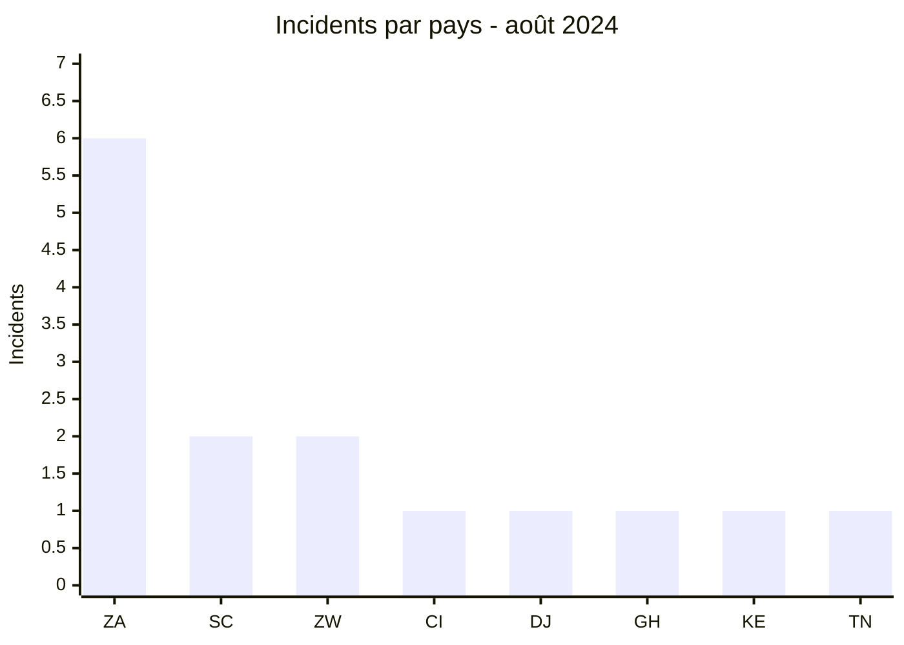
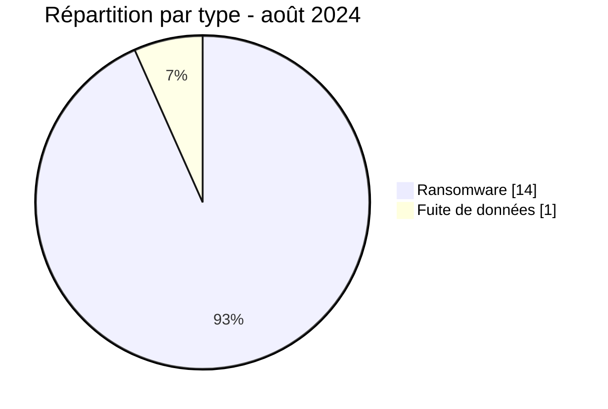

# Rapport CTI AFRINTEL - Août 2024

👉🏾 [English version](./README.md)

## 1. Résumé exécutif

Août 2024 atteint **15 incidents**, dont **14 revendications ransomware** et **1 fuite de données**. L’Afrique du Sud concentre six publications, loin devant les Seychelles et le Zimbabwe avec deux chacune. DarkVault est l’acteur le plus visible avec trois incidents.

Deux organisations avaient déjà été publiées sous un autre nom d’acteur : Remitano en avril et Lenmed en mai. Ces doubles revendications peuvent correspondre à plusieurs scénarios - partage, revente, réutilisation d’une revendication ou attribution inexacte - mais aucune source publique ne permet de trancher. Eventizer constitue la seule fuite de données du mois avec un échantillon visible.

Voir [victims_FR.md](./victims_FR.md).

## 2. Méthodologie

Le rapport couvre les publications classées en août 2024. Une organisation est comptée une fois dans le mois, même si elle avait été publiée auparavant. Les doubles revendications sont signalées comme un problème d’attribution, sans déduire un transfert de données ou une coopération entre acteurs.

Les statistiques dérivent des **15 incidents** de [victims_FR.md](./victims_FR.md), synchronisés avec [victims.md](./victims.md).

## 3. Vue globale

| Indicateur | Valeur |
|---|---:|
| Incidents / Pays | **15 / 8** |
| Ransomware | **14** |
| Fuites de données | **1** |
| Ventes d’accès / Défacement | **0 / 0** |
| Doubles revendications identifiées | **2** |

### Classement par pays

| Pays | Total | Ransomware | Fuite |
|---|---:|---:|---:|
| 🇿🇦 Afrique du Sud | 6 | 6 | 0 |
| 🇸🇨 Seychelles | 2 | 2 | 0 |
| 🇿🇼 Zimbabwe | 2 | 2 | 0 |
| 🇨🇮 Côte d’Ivoire | 1 | 1 | 0 |
| 🇩🇯 Djibouti | 1 | 1 | 0 |
| 🇬🇭 Ghana | 1 | 1 | 0 |
| 🇰🇪 Kenya | 1 | 1 | 0 |
| 🇹🇳 Tunisie | 1 | 0 | 1 |
| **Total** | **15** | **14** | **1** |

### Répartition régionale

| Région | Total | Ransomware | Fuite |
|---|---:|---:|---:|
| Afrique australe | 8 | 8 | 0 |
| Afrique de l’Ouest | 2 | 2 | 0 |
| Afrique de l’Est | 2 | 2 | 0 |
| Océan Indien | 2 | 2 | 0 |
| Afrique du Nord | 1 | 0 | 1 |
| **Total** | **15** | **14** | **1** |

### Répartition sectorielle normalisée

| Secteur | Incidents | Part |
|---|---:|---:|
| Finance / Banque | 4 | 26,7 % |
| Commerce / E-commerce | 4 | 26,7 % |
| Télécommunications | 2 | 13,3 % |
| Services professionnels / Entreprises | 2 | 13,3 % |
| Santé / Médical | 1 | 6,7 % |
| Gouvernement / Administration | 1 | 6,7 % |
| Technologies / Informatique | 1 | 6,7 % |
| **Total** | **15** | **100 %** |

### Acteurs les plus visibles

| Acteur | Incidents |
|---|---:|
| DarkVault | 3 |
| KillSec | 2 |
| Meow | 2 |
| RansomHub | 2 |
| Six autres acteurs ou sources | 1 chacun |

## 4. Analyse détaillée par type d’incident

### 4.1 Ransomware

Les quatorze publications couvrent surtout la finance, le commerce et les télécommunications. La concentration sud-africaine est robuste dans le corpus, mais les publications ne démontrent pas une campagne unique. Remitano et Lenmed doivent être suivies comme doubles revendications dont la relation technique reste inconnue.

### 4.2 Fuite de données

La publication Eventizer contient des champs de contact et de contexte de compte. Le volume de 60 000 enregistrements est revendiqué ; l’échantillon ne permet pas d’en confirmer l’exhaustivité. Aucune donnée personnelle brute n’est reproduite.

## 5. Impact sectoriel

La finance et le commerce regroupent plus de la moitié du corpus. Ils présentent un risque combiné de continuité, fraude et hameçonnage. Les télécommunications ajoutent un enjeu d’infrastructure, tandis que la publication visant une autorité djiboutienne augmente la sensibilité du volet public.

## 6. Profil des acteurs et évaluation du risque

| Périmètre | Niveau | Justification |
|---|---|---|
| 🇿🇦 Afrique du Sud | 🔴 Élevé | Six revendications dans cinq secteurs |
| 🇸🇨 Seychelles / 🇿🇼 Zimbabwe | 🔴 Élevé | Deux publications financières ou télécoms chacune |
| 🇩🇯 Djibouti | 🔴 Élevé | Publication visant une autorité publique |
| Autres pays | 🟠 Moyen | Une publication chacun |

## 7. Tendances et lacunes de renseignement

- **Observé - confiance élevée :** 14 incidents sur 15 sont des revendications ransomware.
- **Observé - confiance élevée :** l’Afrique du Sud concentre 40 % du corpus.
- **Observé - confiance élevée :** Remitano et Lenmed avaient déjà été publiées par d’autres acteurs.
- **Lacune :** aucun rapport DFIR public n’a été identifié dans les sources consultées pour expliquer les doubles revendications.
- **Lacune :** le volume complet d’Eventizer et la relation entre acteurs restent inconnus.
- **Collecte attendue :** chronologie des publications, confirmations victimes et comparaison non intrusive des échantillons disponibles.

## 8. Cartographie MITRE ATT&CK contextuelle

| Statut | Technique | Utilisation |
|---|---|---|
| Préventif | T1486 - Data Encrypted for Impact | Détection du chiffrement ; non confirmé dans les revendications |
| Préventif | T1490 - Inhibit System Recovery | Surveillance des sauvegardes |
| Préventif | T1567 - Exfiltration Over Web Service | Contrôle des transferts ; canal Eventizer non observé |

## 9. Recommandations

- **Finance et commerce :** surveiller fraude, réutilisation d’identifiants et exports inhabituels.
- **Télécommunications :** séparer les plans d’administration et tester les procédures de continuité.
- **Secteur public :** renforcer les comptes privilégiés et la journalisation.
- **Victimes doublement revendiquées :** préserver une chronologie de preuves et comparer les artefacts sans présumer leur origine.

## 10. Recommandations SOC et tactiques

| Qualification | Action |
|---|---|
| **Observé** | Corréler les dates de publication et les actifs nommés ; aucune chaîne d’intrusion commune n’est établie. |
| **Hypothèse** | Rechercher des comptes, infrastructures ou archives communes aux doubles revendications. |
| **Préventif** | Détecter chiffrement massif, suppression de sauvegardes, exports volumineux et transferts sortants anormaux. |

## 11. Recommandations stratégiques

| Priorité | Qualification | Mesure |
|---:|---|---|
| 1 | **Observé** | Prioriser les organisations sud-africaines et les secteurs finance, commerce et télécoms. |
| 2 | **Hypothèse** | Étudier partage ou revente comme scénarios non confirmés des doubles revendications. |
| 3 | **Préventif** | Généraliser ASM, MFA résistante au phishing et sauvegardes immuables isolées. |

## 12. Conclusion

Août est le mois le plus dense de 2024 à ce stade, mais sa lecture exige de séparer activité visible et compromission confirmée. Les doubles revendications compliquent l’attribution, tandis qu’Eventizer apporte le seul signal directement exploitable sur la nature des données. La priorité est la validation, pas la spéculation sur les relations entre groupes.

**AFRINTEL - TLP:CLEAR**

[Dépôt AFRINTEL](https://github.com/Hatchepsoute/AFRINTEL)
