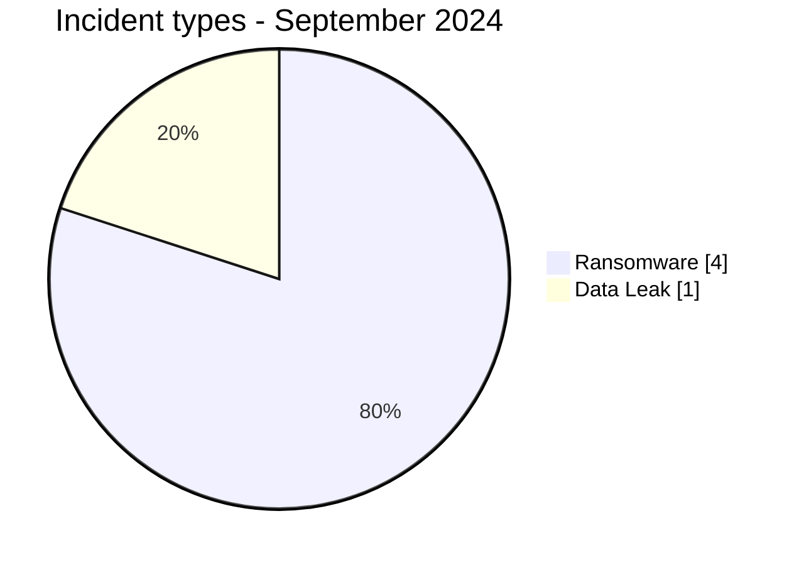
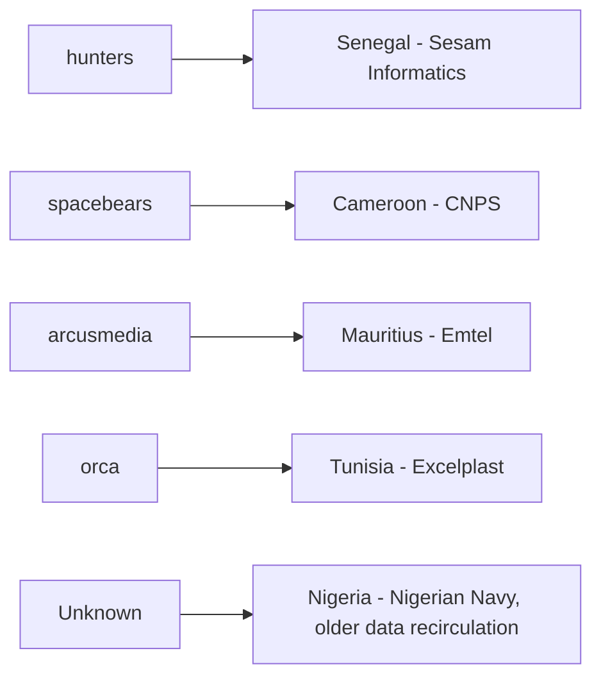
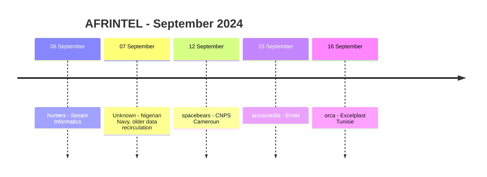

# AFRINTEL CTI Report - September 2024

👉🏾 [Version française](./README_FR.md)

## 1. Executive summary

September 2024 contains **5 documented incident records across 5 African countries**: **4 Ransomware** and **1 Data Leak**. No Access Sale, DDoS, Defacement or Operational Fraud record is present in the validated September corpus.

The month is highly dispersed. Cameroon, Mauritius, Nigeria, Senegal and Tunisia each account for one record, and no ransomware actor appears more than once. Each of the five harmonized sectors also appears once.

The Nigerian Navy publication is the most sensitive record by subject matter, but the source itself dates the claimed leak to **8 November 2020**. AFRINTEL therefore treats the September 2024 appearance as renewed observation or recirculation of older material, not as evidence of a new September intrusion. The four ransomware records remain unverified claims without public DFIR evidence in the supplied corpus.

👉🏾 [View the full victim list](./victims.md)

### 1.1 Month-over-month comparison

| Indicator | August 2024 | September 2024 | Change |
|---|---:|---:|---:|
| Total documented cyber records | 16 | **5** | **-11 (-68.8%)** |
| Core six-type incidents | 15 | **5** | **-10 (-66.7%)** |
| Ransomware | 14 | **4** | **-10 (-71.4%)** |
| Data Leak | 1 | **1** | **0 (stable)** |
| Access Sale | 0 | **0** | Stable |
| DDoS | 0 | **0** | Stable |
| Defacement | 0 | **0** | Stable |
| Operational Fraud | 0 | **0** | Stable |
| Attempted Attack - tracked separately | 1 | **0** | **-1 (-100.0%)** |

September is markedly smaller than the corrected August corpus. Ransomware publication visibility falls from 14 to 4, while Data Leak remains at one record. The comparison must be read with the August GTBank exception in mind: August contained 16 documented cyber records but only 15 within the six-type taxonomy.

## 2. Methodology

- **Period:** 1-30 September 2024.
- **Source of truth:** harmonized `victims_FR.md` / `victims.md`.
- **Counting:** one harmonized card equals one documented incident record.
- **Taxonomy:** Ransomware, Data Leak, Access Sale, DDoS, Defacement, Operational Fraud.
- **Retrospective correction registry:** none of the 10 identified missing 2024 incidents belongs to September, so no additional record is injected into this month.
- **Data recirculation:** the Nigerian Navy entry is counted as a September publication/data-circulation record while preserving its source-claimed 2020 leak date.
- **Actor/source separation:** `NizaarFarah` is retained as source context, not as a confirmed intrusion actor.
- Technical behavior is not treated as observed solely because it is commonly associated with a named ransomware group.

## 3. Global overview

### 3.1 Incident-type distribution

| Incident type | Records | Share |
|---|---:|---:|
| Ransomware | **4** | **80.0%** |
| Data Leak | **1** | **20.0%** |
| Access Sale | 0 | 0.0% |
| DDoS | 0 | 0.0% |
| Defacement | 0 | 0.0% |
| Operational Fraud | 0 | 0.0% |
| **Total** | **5** | **100%** |

### 3.2 Country distribution

| Country | Ransomware | Data Leak | Total |
|---|---:|---:|---:|
| 🇨🇲 Cameroon | 1 | 0 | 1 |
| 🇲🇺 Mauritius | 1 | 0 | 1 |
| 🇳🇬 Nigeria | 0 | 1 | 1 |
| 🇸🇳 Senegal | 1 | 0 | 1 |
| 🇹🇳 Tunisia | 1 | 0 | 1 |
| **Total** | **4** | **1** | **5** |

### 3.3 Regional distribution

| Region | Ransomware | Data Leak | Total |
|---|---:|---:|---:|
| West Africa | 1 | 1 | **2** |
| Central Africa | 1 | 0 | 1 |
| North Africa | 1 | 0 | 1 |
| Indian Ocean | 1 | 0 | 1 |
| **Total** | **4** | **1** | **5** |

### 3.4 Harmonized sector distribution

| Sector | Records | Share |
|---|---:|---:|
| Technology / IT | 1 | 20.0% |
| Government / Administration | 1 | 20.0% |
| Telecommunications | 1 | 20.0% |
| Manufacturing / Industry | 1 | 20.0% |
| Defense / Security | 1 | 20.0% |
| **Total** | **5** | **100%** |

### 3.5 Actors / groups

| Actor / Group | Records |
|---|---:|
| hunters | 1 |
| spacebears | 1 |
| arcusmedia | 1 |
| orca | 1 |
| Unknown | 1 |
| **Total** | **5** |

> `Unknown` corresponds to the Nigerian Navy Data Leak. `NizaarFarah` is documented separately as the source account visible in the publication and is not treated as a confirmed intrusion actor.

## 4. Detailed analysis

### 4.1 Ransomware - 4 records

The four ransomware records concern **Sesam Informatics**, **CNPS Cameroun**, **Emtel** and **Excelplast Tunisie**.

All four retain `Claim - Unverified` and `Low` confidence. The supplied September corpus does not contain a public DFIR report, accessible data sample or independent victim confirmation for these ransomware publications. AFRINTEL therefore does not infer encryption, exfiltration, operational disruption, initial access or a shared campaign.

The four records cover four countries, four sectors and four different ransomware actors. That dispersion provides no defensible basis for identifying a dominant ransomware group, preferred sector or common intrusion chain in September.

### 4.2 Data Leak - Nigerian Navy

The Nigerian Navy record differs from the ransomware claims because a screenshot shows references to documents, equipment and advertised account-related material. The publication claims **1,200 email logins**, approximately **300 files** and a **228.4 MB archive**.

Those figures remain source claims. AFRINTEL did not collect or reproduce the underlying files or credentials, so authenticity, completeness and present-day credential validity are not established.

Most importantly, the source states a leak date of **8 November 2020**. The September 2024 entry therefore measures renewed criminal circulation or renewed observation of older material rather than a newly established September intrusion.

## 5. Key findings and intelligence gaps

- September contains **5 records across 5 countries**, making the monthly corpus geographically dispersed.
- Ransomware accounts for **4 of 5 records (80.0%)**, but all four are unverified claims.
- No ransomware actor appears more than once.
- No harmonized sector appears more than once.
- The Nigerian Navy case is the only record with visible sample material, but its underlying leak is source-dated to 2020.
- The validity of the advertised Nigerian Navy account material, the completeness of the archive and the current circulation status remain unresolved.
- Public victim confirmation and DFIR evidence remain key collection gaps for the four ransomware claims.

## 6. Contextual MITRE ATT&CK mapping

| Status | Technique | Application |
|---|---|---|
| Preventive | T1486 - Data Encrypted for Impact | Relevant to ransomware monitoring; encryption is not confirmed in the four September claims. |
| Preventive | T1490 - Inhibit System Recovery | Relevant backup-resilience control; behavior is not observed in the supplied corpus. |
| Contextual / conditional | T1078 - Valid Accounts | Relevant only if advertised Nigerian Navy credentials are valid; validity is not established. |
| Contextual | T1213 - Data from Information Repositories | Relevant to the risks associated with recirculated document repositories, without asserting the original access method. |

## 7. Recommendations

- Treat recirculated historical data separately from newly established compromise activity.
- For the Nigerian Navy case, verify whether referenced accounts remain active and invalidate affected credentials if institutional validation confirms exposure.
- For the four ransomware claims, preserve authentication, endpoint, remote-access and backup telemetry around the publication dates.
- Monitor later victim statements, leak-site samples and technical reporting before raising confidence.
- Avoid inferring a common campaign from a five-record corpus in which every actor and sector appears only once.

## 8. Timeline

## 9. Conclusion

September 2024 closes with **5 documented incident records across 5 African countries**, comprising **4 Ransomware claims and 1 Data Leak**. Compared with the corrected August corpus, total documented cyber records fall from 16 to 5, a decrease of **68.8%**. Looking strictly at the six-type AFRINTEL taxonomy, the comparison is 15 to 5, or **-66.7%**. Ransomware publication visibility falls from 14 to 4, while Data Leak remains stable at one record.

This sharp reduction should not be interpreted as evidence that cyber risk across Africa fell by the same proportion. August was an unusually dense publication month, while September contains only five highly dispersed records. The September corpus covers five different countries, five sectors and five actor/source positions, which makes broad conclusions about coordinated targeting or a common campaign unsupported.

The month's most sensitive publication, Nigerian Navy, also illustrates why chronology matters. The source itself dates the claimed leak to November 2020. Its presence in September 2024 therefore demonstrates the **persistence and recirculation of older potentially sensitive material**, not a newly demonstrated September compromise. The visible screenshot provides more documentary context than the ransomware claims, but it still does not establish the authenticity of every advertised file, the current validity of the claimed email logins or the completeness of the 228.4 MB archive.

The four ransomware records provide the opposite profile: they are current September publications but have limited evidence maturity. Each remains an unverified claim, and the supplied corpus provides no public DFIR evidence establishing encryption, exfiltration, operational disruption or a common intrusion chain. No ransomware actor repeats, so the data does not support identifying a dominant group for the month.

The defensible CTI reading is therefore that September combines **lower publication volume, weak evidence maturity for current ransomware claims, and continued exposure risk from older data recirculation**. AFRINTEL should continue to distinguish publication date, claimed leak date, victim confirmation and technical validation. This separation prevents historical data resurfacing in criminal channels from being misread as a new breach while preserving its ongoing relevance for credential exposure, intelligence monitoring and defensive response.

**AFRINTEL** - TLP:CLEAR
