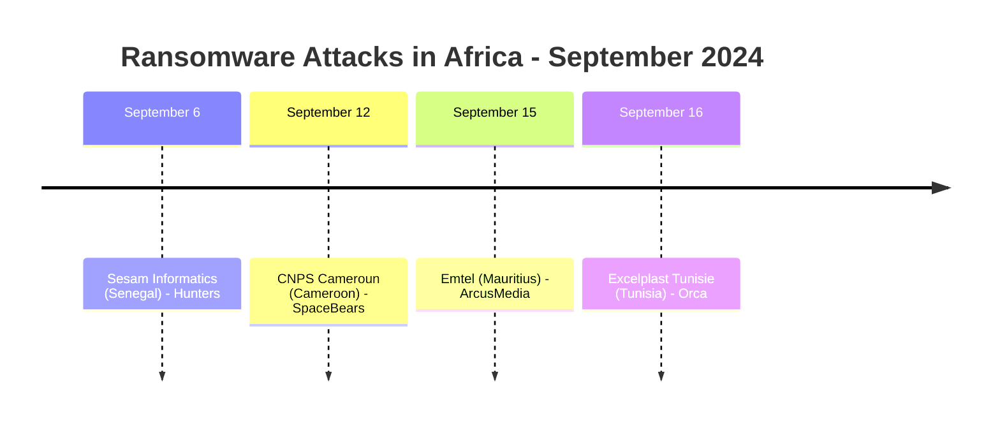
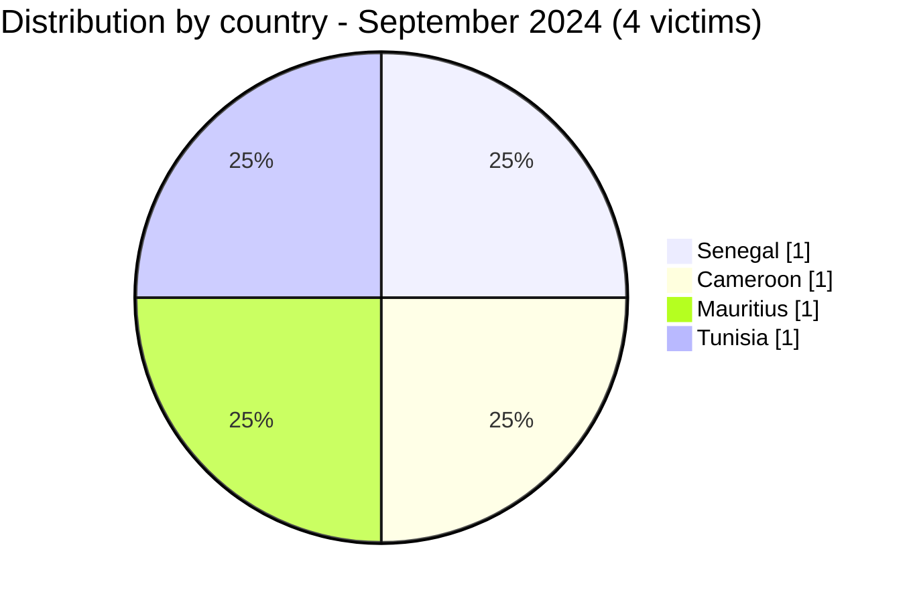

[](https://github.com/Hatchepsoute/AFRINTEL)


# CTI Report - September 2024: Quiet month with 4 victims across 4 countries

👉🏾 [Version française disponible ici](./README_FR.md)

### 1. Executive summary

September 2024 records **4 documented ransomware victims** across 4 distinct countries, the lowest monthly count since January 2024. Each attack involves a different ransomware group, suggesting independent opportunistic campaigns rather than a coordinated wave. West and Central Africa appear for the first time in a single month alongside North Africa and Indian Ocean targets.

👉🏾 [Victims list](./victims.md)

**Key figures:**
- 🔹 **4 victims** identified
- 🔹 **4 active groups**: Hunters (1), SpaceBears (1), ArcusMedia (1), Orca (1)
- 🔹 **Countries affected**: Senegal (1), Cameroon (1), Mauritius (1), Tunisia (1)
- 🔹 **Sectors**: Technologies, Government/Social Security, Telecommunications, Manufacturing

---

### 2. Attack timeline

| Date | Victim | Country | Ransomware group |
|------|--------|---------|-----------------|
| September 6 | Sesam Informatics | Senegal | Hunters |
| September 12 | CNPS Cameroun | Cameroon | SpaceBears |
| September 15 | Emtel | Mauritius | ArcusMedia |
| September 16 | Excelplast Tunisie | Tunisia | Orca |



---

### 3. Victim analysis

#### 3.1 By country

| Country | Number of attacks |
|---------|-----------------|
| Senegal | 1 |
| Cameroon | 1 |
| Mauritius | 1 |
| Tunisia | 1 |



#### 3.2 By sector

| Sector | Count |
|--------|-------|
| Technologies | 1 |
| Government / Social Security | 1 |
| Telecommunications | 1 |
| Manufacturing (Plastics) | 1 |

```mermaid
xychart-beta
    title "Targeted Sectors - September 2024"
    x-axis ["Technologies", "Government", "Telecom", "Manufacturing"]
    y-axis "Number of attacks" 0 to 2
    bar [1, 1, 1, 1]
```

#### 3.3 Ransomware groups

| Ransomware group | Number of attacks |
|-----------------|-----------------|
| Hunters | 1 |
| SpaceBears | 1 |
| ArcusMedia | 1 |
| Orca | 1 |

---

### 4. Key observations

- **Sharp activity drop**: after August's record of 14 victims, September falls back to 4, the largest single-month decline of the year. This may reflect summer campaign fatigue or a tactical pause by major groups.
- **CNPS Cameroon, social security targeted**: SpaceBears claims the national social security body of Cameroon, a sensitive institution holding employment and social benefit records for millions of workers.
- **Emtel (Mauritius)**: ArcusMedia's claim against the leading Mauritian telecom operator signals growing interest in Indian Ocean island connectivity providers.
- **Geographic diversity**: 4 victims in 4 different countries with 4 different groups, no dominant actor this month.
- **Orca first African appearance**: the group claims Excelplast Tunisie, marking its first documented claim on the African continent.

---

```mermaid
xychart-beta
    title "Monthly Evolution of Attacks (Jan - Sep 2024)"
    x-axis ["Jan", "Feb", "Mar", "Apr", "May", "Jun", "Jul", "Aug", "Sep"]
    y-axis "Number of attacks" 0 to 16
    bar [3, 5, 7, 5, 8, 3, 7, 14, 4]
```

### 5. Recommendations

| Domain | Recommended action |
|--------|--------------------|
| Government / Social security | Audit access to citizen databases, enforce MFA on all administrative portals, monitor for bulk data exfiltration. |
| Telecommunications | Harden management interfaces, segment core network from IT, monitor for subscriber data compromise. |
| Manufacturing | Review internet-facing systems exposure, enforce endpoint protection on production networks. |
| All organizations | Track ArcusMedia and Orca as emerging groups with new African activity. |

---

*Report from AFRINTEL OSINT data . Free distribution (TLP:CLEAR)*
