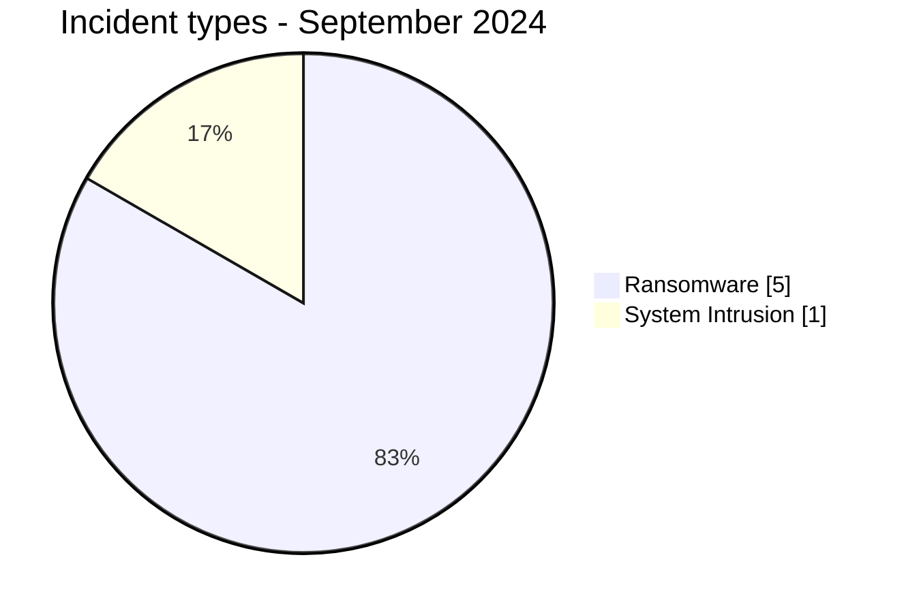

# AFRINTEL CTI Report - Cyber Threats in Africa - September 2024

👉🏾 [Version française](./README_FR.md)

## 1. Executive summary

In September 2024, AFRINTEL retains **6 canonical cyber incidents across 6 countries**. The month is led by **Ransomware (5, 83.3%)** followed by **System Intrusion (1, 16.7%)**. Leading countries are **Senegal (1)**, **Cameroon (1)**, **Mauritius (1)**. Leading sectors are **Government / Administration (2)**, **Technology / IT (1)**, **Telecommunications (1)**. Most frequent actor/group labels are `Unknown` (2), `hunters` (1), `spacebears` (1). `Unknown` means missing attribution, not an actor.

### 1.1 Month-over-month study

| Indicator | August 2024 | September 2024 | Change |
|---|---|---|---|
| Total | 16 | 6 | -10 (-62.5%) |
| Ransomware | 14 | 5 | -9 (-64.3%) |
| Data Leak | 1 | 0 | -1 (-100.0%) |
| Access Sale | 0 | 0 | Stable |
| DDoS | 0 | 0 | Stable |
| Defacement | 0 | 0 | Stable |
| Account Takeover | 0 | 0 | Stable |
| System Intrusion | 1 | 1 | Stable |
| Malware | 0 | 0 | Stable |
| Operational Fraud | 0 | 0 | Stable |

### 1.2 Comparative analysis

Monthly volume **decreases by 10 incident(s)**. Structural changes are: Ransomware 14->5 (-9), Data Leak 1->0 (-1). This describes the documented corpus and does not necessarily equal the change in real compromises across the continent.

## 2. Methodology

- One canonical incident equals one event retained in the 2024 year.
- Historical discoveries/republications are preserved separately and do not inflate 2024 statistics.
- Incident date or best-supported window takes precedence; AFRINTEL discovery date remains separate.
- Nine AFRINTEL types are used; attempts are represented by status, never by an `Attempted Attack` type.
- Coordinated DDoS is counted by campaign.
- Type, status, confidence, impact, attribution, and source remain separate.

## 3. Incident-type distribution

| Type | Records | Share |
|---|---|---|
| Ransomware | 5 | 83.3% |
| Data Leak | 0 | 0.0% |
| Access Sale | 0 | 0.0% |
| DDoS | 0 | 0.0% |
| Defacement | 0 | 0.0% |
| Account Takeover | 0 | 0.0% |
| System Intrusion | 1 | 16.7% |
| Malware | 0 | 0.0% |
| Operational Fraud | 0 | 0.0% |

## 4. Country x type

| Country | Total | Ransomware | Data Leak | Access Sale | DDoS | Defacement | Account Takeover | System Intrusion | Malware | Operational Fraud |
|---|---|---|---|---|---|---|---|---|---|---|
| Senegal | 1 | 1 | 0 | 0 | 0 | 0 | 0 | 0 | 0 | 0 |
| Cameroon | 1 | 1 | 0 | 0 | 0 | 0 | 0 | 0 | 0 | 0 |
| Mauritius | 1 | 1 | 0 | 0 | 0 | 0 | 0 | 0 | 0 | 0 |
| Angola | 1 | 1 | 0 | 0 | 0 | 0 | 0 | 0 | 0 | 0 |
| Tunisia | 1 | 1 | 0 | 0 | 0 | 0 | 0 | 0 | 0 | 0 |
| Mozambique | 1 | 0 | 0 | 0 | 0 | 0 | 0 | 1 | 0 | 0 |

## 5. Regional distribution

| Region | Records | Share |
|---|---|---|
| Southern Africa | 2 | 33.3% |
| West Africa | 1 | 16.7% |
| Central Africa | 1 | 16.7% |
| Indian Ocean | 1 | 16.7% |
| North Africa | 1 | 16.7% |

## 6. Sector distribution

| Sector | Records | Share |
|---|---|---|
| Government / Administration | 2 | 33.3% |
| Technology / IT | 1 | 16.7% |
| Telecommunications | 1 | 16.7% |
| Aviation | 1 | 16.7% |
| Manufacturing / Industry | 1 | 16.7% |

## 7. Actors / groups

| Actor / Group | Records | Share |
|---|---|---|
| Unknown | 2 | 33.3% |
| hunters | 1 | 16.7% |
| spacebears | 1 | 16.7% |
| arcusmedia | 1 | 16.7% |
| orca | 1 | 16.7% |

## 8. Evidence maturity

| Evidence position | Records | Share |
|---|---|---|
| Claim - Unverified | 4 | 66.7% |
| Confirmed | 2 | 33.3% |

### Confidence

| Confidence | Records | Share |
|---|---|---|
| Low | 4 | 66.7% |
| Very High | 2 | 33.3% |

## 9. Timeline

```mermaid
timeline
    title AFRINTEL - September 2024
    6 Septembre 2024 : Sesam Informatics
- **Acteur / Groupe -** hunters
- **Secteur -** Technology / IT
- **Site web -** [sesam-informatics.com](https -//www.sesam-informatics.com)
- **Statut -** Claim - Unverified
- **Type d'incident -** Ransomware
- **Niveau de confiance -** Low
- **Niveau d'impact -** Level 2
- **Description victime -** Sesam Informatics est une entreprise sénégalaise de technologies et de services logiciels opérant dans les solutions numériques et le développement informatique.
- **Note de fiabilité -** Le corpus fourni pour septembre documente une publication ransomware, mais ne fournit ni rapport DFIR public, ni échantillon de données, ni confirmation indépendante de la victime permettant d'établir une compromission réussie.
- **Analyse -** AFRINTEL enregistre la publication comme une revendication ransomware. Les éléments fournis ne permettent pas d'établir un chiffrement, une perturbation opérationnelle, l'étendue d'une exfiltration, l'accès initial ou une réponse confirmée de la victime. La fiche reste donc `Claim - Unverified`.

----------------------------
    12 Septembre 2024 : CNPS Cameroun
- **Acteur / Groupe -** spacebears
- **Secteur -** Government / Administration
- **Site web -** [cnps.cm](https -//www.cnps.cm)
- **Statut -** Claim - Unverified
- **Type d'incident -** Ransomware
- **Niveau de confiance -** Low
- **Niveau d'impact -** Level 3
- **Description victime -** La Caisse Nationale de Prévoyance Sociale (CNPS) du Cameroun est l'organisme public chargé de la gestion de la sécurité sociale et des prestations sociales des travailleurs.
- **Note de fiabilité -** Le corpus fourni pour septembre documente une publication ransomware, mais ne fournit ni rapport DFIR public, ni échantillon de données, ni confirmation indépendante de la victime permettant d'établir une compromission réussie.
- **Analyse -** AFRINTEL enregistre la publication comme une revendication ransomware. Les éléments fournis ne permettent pas d'établir un chiffrement, une perturbation opérationnelle, l'étendue d'une exfiltration, l'accès initial ou une réponse confirmée de la victime. La fiche reste donc `Claim - Unverified`.

----------------------------
    15 Septembre 2024 : Emtel
- **Acteur / Groupe -** arcusmedia
- **Secteur -** Telecommunications
- **Site web -** [emtel.com](https -//www.emtel.com)
- **Statut -** Claim - Unverified
- **Type d'incident -** Ransomware
- **Niveau de confiance -** Low
- **Niveau d'impact -** Level 3
- **Description victime -** Emtel est un opérateur mobile mauricien fournissant des infrastructures de télécommunications, des services voix, des données haut débit et des services numériques.
- **Note de fiabilité -** Le corpus fourni pour septembre documente une publication ransomware, mais ne fournit ni rapport DFIR public, ni échantillon de données, ni confirmation indépendante de la victime permettant d'établir une compromission réussie.
- **Analyse -** AFRINTEL enregistre la publication comme une revendication ransomware. Les éléments fournis ne permettent pas d'établir un chiffrement, une perturbation opérationnelle, l'étendue d'une exfiltration, l'accès initial ou une réponse confirmée de la victime. La fiche reste donc `Claim - Unverified`.

----------------------------
    15 Septembre 2024 : TAAG - Linhas Aéreas de Angola
- **Date de l'incident -** 15 Septembre 2024
- **Date de publication initiale / source retenue -** 16 septembre 2024
- **Date de découverte AFRINTEL -** 23 août 2026 - audit rétrospectif
- **Précision chronologique -** Incident le 15 septembre ; communication TAAG le 16 ; qualification ransomware confirmée rétrospectivement par l'autorité.
- **Acteur / Groupe -** Unknown
- **Secteur -** Aviation
- **Site web -** [taag.com](https -//www.taag.com/)
- **Statut -** Authority Confirmed
- **Type d'incident -** Ransomware
- **Niveau de confiance -** Very High
- **Niveau d'impact -** Level 4
- **Analyse -** TAAG a confirmé une cyberattaque et des perturbations de services internes. L'Agência de Protecção de Dados a ensuite qualifié explicitement l'événement du 15 septembre 2024 de ransomware. Les vols et la billetterie n'ont pas été interrompus selon les sources de l'audit. AFRINTEL conserve l'incident en septembre 2024 et distingue la date de confirmation réglementaire de la date de l'attaque.
- **Sources publiques -** [Agência de Protecção de Dados](https -//apd.ao/ao/gca/index.php?id=218&preview=1) | [VOA Português](https -//www.voaportugues.com/a/ataque-cibern%C3%A9tico-n%C3%A3o-paralisa-opera%C3%A7%C3%B5es-da-taag/7787321.html) | [Portal de TI Angola](https -//pti.ao/ataque-cibernetico-a-taag-afectou-dados-contabilisticos-da-empresa/)

----------------------------
    16 Septembre 2024 : Excelplast Tunisie
- **Acteur / Groupe -** orca
- **Secteur -** Manufacturing / Industry
- **Site web -** [excelplastunisie.com](https -//www.excelplastunisie.com)
- **Statut -** Claim - Unverified
- **Type d'incident -** Ransomware
- **Niveau de confiance -** Low
- **Niveau d'impact -** Level 2
- **Description victime -** Excelplast Tunisie est une entreprise manufacturière tunisienne spécialisée dans la production de plastique, la transformation des matières premières et l'emballage.
- **Note de fiabilité -** Le corpus fourni pour septembre documente une publication ransomware, mais ne fournit ni rapport DFIR public, ni échantillon de données, ni confirmation indépendante de la victime permettant d'établir une compromission réussie.
- **Analyse -** AFRINTEL enregistre la publication comme une revendication ransomware. Les éléments fournis ne permettent pas d'établir un chiffrement, une perturbation opérationnelle, l'étendue d'une exfiltration, l'accès initial ou une réponse confirmée de la victime. La fiche reste donc `Claim - Unverified`.

----------------------------
    28 Septembre 2024 : Comissão Nacional de Eleições (CNE)
- **Date de l'incident -** 28 Septembre 2024
- **Date de publication initiale / source retenue -** 30 septembre 2024
- **Date de découverte AFRINTEL -** 23 août 2026 - audit rétrospectif
- **Précision chronologique -** Date exacte rapportée comme samedi 28 septembre par la CNE/Lusa.
- **Acteur / Groupe -** Unknown
- **Secteur -** Government / Administration
- **Site web -** [cne.org.mz](https -//www.cne.org.mz/)
- **Statut -** Victim Confirmed
- **Type d'incident -** System Intrusion
- **Niveau de confiance -** Very High
- **Niveau d'impact -** Level 3
- **Analyse -** Les pages web de la CNE ont été ciblées le 28 septembre. L'organisme a déclaré avoir repris le contrôle, renforcé la sécurité et conservé l'intégrité des données. Les sources décrivent aussi une tentative ultérieure de diffusion d'un lien malveillant utilisant l'identité visuelle électorale. Les éléments ne permettent pas de conclure à un DDoS ou à un défacement classique ; AFRINTEL retient `System Intrusion` sans inférer de Data Leak.
- **Sources publiques -** [Club of Mozambique](https -//clubofmozambique.com/news/mozambique-elections-election-data-safe-despite-cyber-attack-watch/) | [AMAN Alliance / Lusa](https -//www.aman-alliance.org/Home/ContentDetail/80863) | [KonBriefing](https -//konbriefing.com/en-topics/cyber-attacks-2024.html)

----------------------------
```

## 10. CTI analysis by type

### Ransomware - 5

**5 record(s) (83.3%).** Leading countries: Senegal (1), Cameroon (1), Mauritius (1). Conclusions remain limited to documented evidence; the incident type does not justify inferring an unobserved vector or impact.

### System Intrusion - 1

**1 record(s) (16.7%).** Leading countries: Mozambique (1). Conclusions remain limited to documented evidence; the incident type does not justify inferring an unobserved vector or impact.

## 11. Priority incidents for review

| Country | Organization | Type | Status | Impact | Confidence |
|---|---|---|---|---|---|
| Angola | TAAG - Linhas Aéreas de Angola
- **Date de l'incident:** 15 Septembre 2024
- **Date de publication initiale / source retenue:** 16 septembre 2024
- **Date de découverte AFRINTEL:** 23 août 2026 - audit rétrospectif
- **Précision chronologique:** Incident le 15 septembre ; communication TAAG le 16 ; qualification ransomware confirmée rétrospectivement par l'autorité.
- **Acteur / Groupe:** Unknown
- **Secteur:** Aviation
- **Site web:** [taag.com](https://www.taag.com/)
- **Statut:** Authority Confirmed
- **Type d'incident:** Ransomware
- **Niveau de confiance:** Very High
- **Niveau d'impact:** Level 4
- **Analyse:** TAAG a confirmé une cyberattaque et des perturbations de services internes. L'Agência de Protecção de Dados a ensuite qualifié explicitement l'événement du 15 septembre 2024 de ransomware. Les vols et la billetterie n'ont pas été interrompus selon les sources de l'audit. AFRINTEL conserve l'incident en septembre 2024 et distingue la date de confirmation réglementaire de la date de l'attaque.
- **Sources publiques:** [Agência de Protecção de Dados](https://apd.ao/ao/gca/index.php?id=218&preview=1) | [VOA Português](https://www.voaportugues.com/a/ataque-cibern%C3%A9tico-n%C3%A3o-paralisa-opera%C3%A7%C3%B5es-da-taag/7787321.html) | [Portal de TI Angola](https://pti.ao/ataque-cibernetico-a-taag-afectou-dados-contabilisticos-da-empresa/)

---------------------------- | Ransomware | Authority Confirmed | Level 4 | Very High |
| Mozambique | Comissão Nacional de Eleições (CNE)
- **Date de l'incident:** 28 Septembre 2024
- **Date de publication initiale / source retenue:** 30 septembre 2024
- **Date de découverte AFRINTEL:** 23 août 2026 - audit rétrospectif
- **Précision chronologique:** Date exacte rapportée comme samedi 28 septembre par la CNE/Lusa.
- **Acteur / Groupe:** Unknown
- **Secteur:** Government / Administration
- **Site web:** [cne.org.mz](https://www.cne.org.mz/)
- **Statut:** Victim Confirmed
- **Type d'incident:** System Intrusion
- **Niveau de confiance:** Very High
- **Niveau d'impact:** Level 3
- **Analyse:** Les pages web de la CNE ont été ciblées le 28 septembre. L'organisme a déclaré avoir repris le contrôle, renforcé la sécurité et conservé l'intégrité des données. Les sources décrivent aussi une tentative ultérieure de diffusion d'un lien malveillant utilisant l'identité visuelle électorale. Les éléments ne permettent pas de conclure à un DDoS ou à un défacement classique ; AFRINTEL retient `System Intrusion` sans inférer de Data Leak.
- **Sources publiques:** [Club of Mozambique](https://clubofmozambique.com/news/mozambique-elections-election-data-safe-despite-cyber-attack-watch/) | [AMAN Alliance / Lusa](https://www.aman-alliance.org/Home/ContentDetail/80863) | [KonBriefing](https://konbriefing.com/en-topics/cyber-attacks-2024.html)

---------------------------- | System Intrusion | Victim Confirmed | Level 3 | Very High |
| Cameroon | CNPS Cameroun
- **Acteur / Groupe:** spacebears
- **Secteur:** Government / Administration
- **Site web:** [cnps.cm](https://www.cnps.cm)
- **Statut:** Claim - Unverified
- **Type d'incident:** Ransomware
- **Niveau de confiance:** Low
- **Niveau d'impact:** Level 3
- **Description victime:** La Caisse Nationale de Prévoyance Sociale (CNPS) du Cameroun est l'organisme public chargé de la gestion de la sécurité sociale et des prestations sociales des travailleurs.
- **Note de fiabilité:** Le corpus fourni pour septembre documente une publication ransomware, mais ne fournit ni rapport DFIR public, ni échantillon de données, ni confirmation indépendante de la victime permettant d'établir une compromission réussie.
- **Analyse:** AFRINTEL enregistre la publication comme une revendication ransomware. Les éléments fournis ne permettent pas d'établir un chiffrement, une perturbation opérationnelle, l'étendue d'une exfiltration, l'accès initial ou une réponse confirmée de la victime. La fiche reste donc `Claim - Unverified`.

---------------------------- | Ransomware | Claim - Unverified | Level 3 | Low |
| Mauritius | Emtel
- **Acteur / Groupe:** arcusmedia
- **Secteur:** Telecommunications
- **Site web:** [emtel.com](https://www.emtel.com)
- **Statut:** Claim - Unverified
- **Type d'incident:** Ransomware
- **Niveau de confiance:** Low
- **Niveau d'impact:** Level 3
- **Description victime:** Emtel est un opérateur mobile mauricien fournissant des infrastructures de télécommunications, des services voix, des données haut débit et des services numériques.
- **Note de fiabilité:** Le corpus fourni pour septembre documente une publication ransomware, mais ne fournit ni rapport DFIR public, ni échantillon de données, ni confirmation indépendante de la victime permettant d'établir une compromission réussie.
- **Analyse:** AFRINTEL enregistre la publication comme une revendication ransomware. Les éléments fournis ne permettent pas d'établir un chiffrement, une perturbation opérationnelle, l'étendue d'une exfiltration, l'accès initial ou une réponse confirmée de la victime. La fiche reste donc `Claim - Unverified`.

---------------------------- | Ransomware | Claim - Unverified | Level 3 | Low |
| Senegal | Sesam Informatics
- **Acteur / Groupe:** hunters
- **Secteur:** Technology / IT
- **Site web:** [sesam-informatics.com](https://www.sesam-informatics.com)
- **Statut:** Claim - Unverified
- **Type d'incident:** Ransomware
- **Niveau de confiance:** Low
- **Niveau d'impact:** Level 2
- **Description victime:** Sesam Informatics est une entreprise sénégalaise de technologies et de services logiciels opérant dans les solutions numériques et le développement informatique.
- **Note de fiabilité:** Le corpus fourni pour septembre documente une publication ransomware, mais ne fournit ni rapport DFIR public, ni échantillon de données, ni confirmation indépendante de la victime permettant d'établir une compromission réussie.
- **Analyse:** AFRINTEL enregistre la publication comme une revendication ransomware. Les éléments fournis ne permettent pas d'établir un chiffrement, une perturbation opérationnelle, l'étendue d'une exfiltration, l'accès initial ou une réponse confirmée de la victime. La fiche reste donc `Claim - Unverified`.

---------------------------- | Ransomware | Claim - Unverified | Level 2 | Low |

> Structured selection based on impact, status, and confidence; not an absolute severity ranking.

## 12. Intelligence gaps and corrections

- initial-access vector often unknown;
- technical compromise date may differ from publication date;
- claimed volumes are rarely fully verifiable;
- technical attribution is often limited to the publication account;
- historical republications are tracked separately.

## 13. Recommendations

- phishing-resistant MFA, PAM, and least privilege;
- segmentation, immutable backups, and restoration testing;
- centralized EDR/IAM/VPN/WAF/DNS/cloud/application logging;
- detection of mass exports, unusual archives, and outbound transfers;
- separate preservation of incident, initial-publication, repost, and AFRINTEL discovery dates.

## 14. Conclusion

September 2024 contains **6 canonical incidents**. Month-over-month comparison uses the same taxonomy and chronology rules, except January where December 2023 remains `N/A` because no equivalent re-audit has been completed.

👉🏾 [Canonical victims](./victims.md)

**AFRINTEL** - TLP:CLEAR
