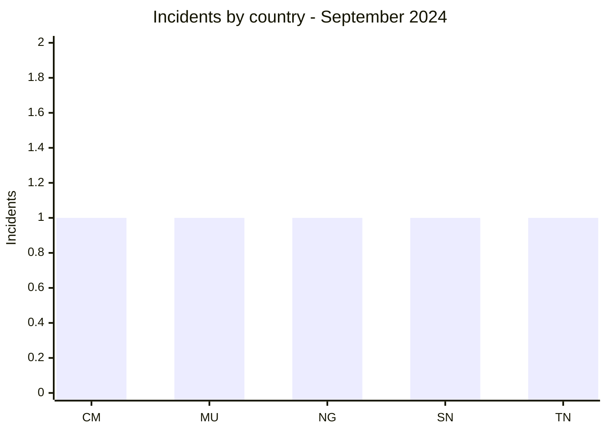
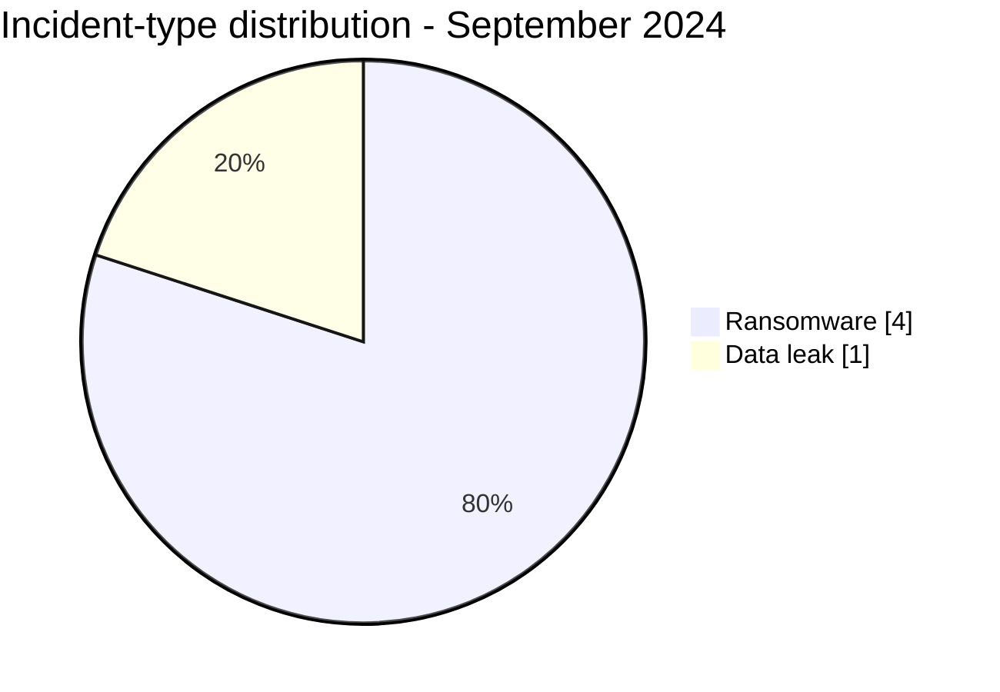

# AFRINTEL CTI Report - September 2024

👉🏾 [Version française](./README_FR.md)

## 1. Executive summary

September 2024 contains **5 incidents** across five countries: **4 ransomware claims** and **1 data leak**. No actor appears more than once. West Africa records two incidents; Central Africa, North Africa, and the Indian Ocean record one each.

The Nigerian Navy publication is the most sensitive case, but it refers to a leak dated November 8, 2020, by the source. It should therefore be read as recirculation or renewed observation of older content, not as an intrusion that occurred in September 2024.

See [victims.md](./victims.md).

## 2. Methodology

This report covers publications assigned to September 2024. AFRINTEL's discovery date is kept separate from the leak date stated by the source. The five incidents are deduplicated by organization and the older republication is explicitly identified.

Statistics derive from [victims.md](./victims.md), synchronized with [victims_FR.md](./victims_FR.md).

## 3. Global overview

| Indicator | Value |
|---|---:|
| Incidents / Countries | **5 / 5** |
| Ransomware | **4** |
| Data leaks | **1** |
| Access sales / Defacement | **0 / 0** |

### Country ranking

| Country | Total | Ransomware | Data leak |
|---|---:|---:|---:|
| 🇨🇲 Cameroon | 1 | 1 | 0 |
| 🇲🇺 Mauritius | 1 | 1 | 0 |
| 🇳🇬 Nigeria | 1 | 0 | 1 |
| 🇸🇳 Senegal | 1 | 1 | 0 |
| 🇹🇳 Tunisia | 1 | 1 | 0 |
| **Total** | **5** | **4** | **1** |

### Regional distribution

| Region | Total | Ransomware | Data leak |
|---|---:|---:|---:|
| West Africa | 2 | 1 | 1 |
| Central Africa | 1 | 1 | 0 |
| North Africa | 1 | 1 | 0 |
| Indian Ocean | 1 | 1 | 0 |
| **Total** | **5** | **4** | **1** |

### Normalized sector distribution

| Sector | Incidents | Share |
|---|---:|---:|
| Technology / IT | 1 | 20% |
| Government / Administration | 1 | 20% |
| Telecommunications | 1 | 20% |
| Manufacturing / Industry | 1 | 20% |
| Defense / Security | 1 | 20% |
| **Total** | **5** | **100%** |

### Actors and sources

| Actor or source | Incidents |
|---|---:|
| Arcus Media, Hunters, Orca, SpaceBears, NizaarFarah | 1 each |

## 4. Detailed analysis by incident type

### 4.1 Ransomware

Sesam Informatics, CNPS Cameroon, Emtel, and Excelplast were published by four different actors. Their sectors and countries are not coherent enough to support a shared campaign or targeting conclusion.

### 4.2 Data leak

The Nigerian Navy source displays references to files and credentials, but AFRINTEL did not collect or reproduce the underlying content. Its age reduces the case's value as a measure of new activity without removing the risk posed by recirculated sensitive data.

## 5. Sectoral impact

Each sector appears once. Defense carries the highest sensitivity, while telecommunications and social security add continuity and personal-data concerns. The small corpus requires individual handling of each case.

## 6. Threat actor profile and risk assessment

| Scope | Level | Rationale |
|---|---|---|
| 🇳🇬 Nigeria | 🔴 High | Older publication attributed to a military institution |
| 🇨🇲 Cameroon / 🇲🇺 Mauritius | 🟠 Medium | Social security and telecommunications |
| 🇸🇳 Senegal / 🇹🇳 Tunisia | 🟡 Low to medium | One claim each with no public sample |

## 7. Key trends and intelligence gaps

- **Observed - high confidence:** five incidents, five countries, and five distinct actors or sources.
- **Observed - high confidence:** the Nigerian Navy leak is source-dated to 2020.
- **Gap:** no public DFIR report was identified in the sources reviewed for the four ransomware claims.
- **Gap:** authenticity, scope, and current circulation of the Nigerian Navy data remain unknown.
- **Collection need:** renewed observation of the publication, institutional confirmation, and technical indicators.

## 8. Contextual MITRE ATT&CK mapping

| Status | Technique | Use |
|---|---|---|
| Preventive | T1486 - Data Encrypted for Impact | Encryption detection; not confirmed |
| Preventive | T1490 - Inhibit System Recovery | Recovery-mechanism monitoring |
| Assumption | T1078 - Valid Accounts | Risk linked to advertised credentials; validity unknown |

## 9. Recommendations

- **Defense:** invalidate exposed accounts if the leak is confirmed and monitor republication.
- **Telecommunications:** segment administration and test continuity.
- **Social security:** monitor record access and prepare notification procedures.
- **All organizations:** preserve logs and test backups.

## 10. SOC and tactical recommendations

| Qualification | Action |
|---|---|
| **Observed** | Monitor cited accounts and domains; no intrusion TTP is confirmed. |
| **Assumption** | Hunt for reuse of older credentials and abnormal logins to exposed services. |
| **Preventive** | Detect mass encryption, backup inhibition, exports, and unusual outbound transfers. |

## 11. Strategic recommendations

| Priority | Qualification | Measure |
|---:|---|---|
| 1 | **Observed** | Treat Nigerian Navy republication as a risk from potentially reusable older data. |
| 2 | **Assumption** | Assess identity exposure without assuming current credential validity. |
| 3 | **Preventive** | Deploy phishing-resistant MFA, password rotation, and immutable backups. |

## 12. Conclusion

September is low-volume and highly dispersed. Its main lesson is not increased threat activity but the persistence of older data in criminal circulation. Response should separate ransomware resilience from durable invalidation of exposed credentials.

**AFRINTEL - TLP:CLEAR**

[AFRINTEL repository](https://github.com/Hatchepsoute/AFRINTEL)
