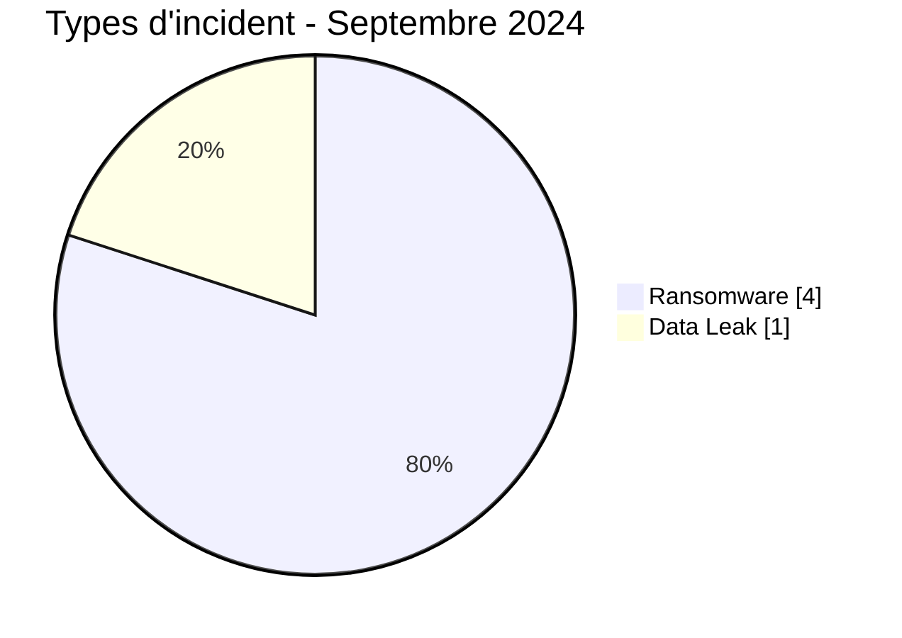
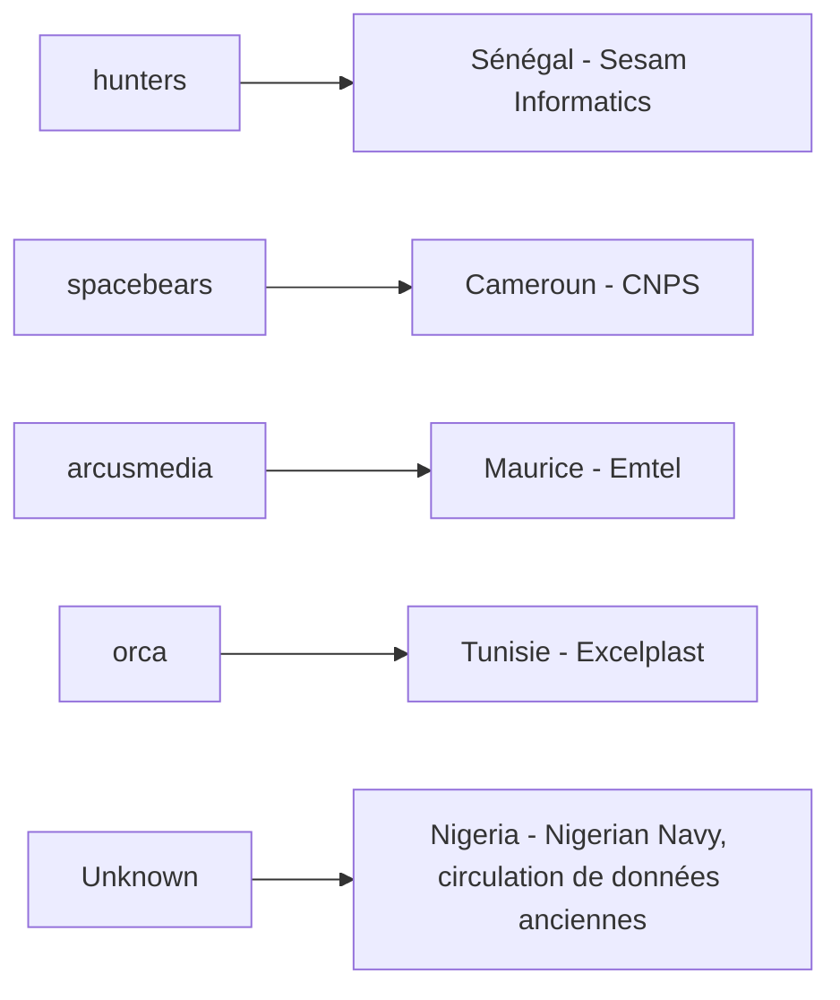
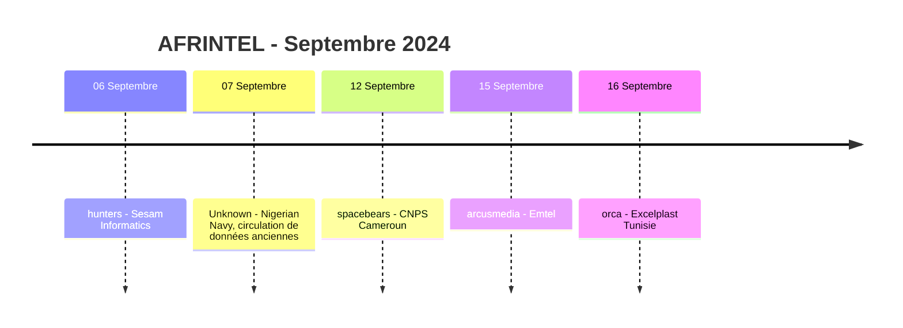

# Rapport CTI AFRINTEL - Septembre 2024

👉🏾 [English version](./README.md)

## 1. Résumé exécutif

Septembre 2024 contient **5 fiches incident documentées dans 5 pays africains** : **4 Ransomware** et **1 Data Leak**. Aucun Access Sale, DDoS, Defacement ou Operational Fraud n'est présent dans le corpus validé de septembre.

Le mois est fortement dispersé. Le Cameroun, Maurice, le Nigeria, le Sénégal et la Tunisie comptent chacun une fiche, et aucun acteur ransomware n'apparaît plus d'une fois. Chacun des cinq secteurs harmonisés apparaît également une seule fois.

La publication Nigerian Navy constitue le dossier le plus sensible par sa nature, mais la source elle-même date la fuite revendiquée du **8 novembre 2020**. AFRINTEL traite donc son apparition en septembre 2024 comme une nouvelle observation ou une remise en circulation de matériel ancien, et non comme la preuve d'une nouvelle intrusion en septembre. Les quatre fiches ransomware restent des revendications non vérifiées sans élément DFIR public dans le corpus fourni.

👉🏾 [Voir la liste complète des victimes](./victims_FR.md)

### 1.1 Comparaison avec le mois précédent

| Indicateur | Août 2024 | Septembre 2024 | Évolution |
|---|---:|---:|---:|
| Total fiches cyber documentées | 16 | **5** | **-11 (-68,8 %)** |
| Incidents de la taxonomie à six types | 15 | **5** | **-10 (-66,7 %)** |
| Ransomware | 14 | **4** | **-10 (-71,4 %)** |
| Data Leak | 1 | **1** | **0 (stable)** |
| Access Sale | 0 | **0** | Stable |
| DDoS | 0 | **0** | Stable |
| Defacement | 0 | **0** | Stable |
| Operational Fraud | 0 | **0** | Stable |
| Attempted Attack - suivi séparé | 1 | **0** | **-1 (-100,0 %)** |

Septembre est nettement moins volumineux que le corpus corrigé d'août. La visibilité des publications Ransomware passe de 14 à 4, tandis que les Data Leak restent à une fiche. Le comparatif doit tenir compte de l'exception GTBank d'août : ce mois comptait 16 fiches cyber documentées, mais 15 seulement dans la taxonomie à six types.

## 2. Méthodologie

- **Période :** 1er au 30 septembre 2024.
- **Source de vérité :** couple harmonisé `victims_FR.md` / `victims.md`.
- **Comptage :** une fiche harmonisée correspond à un incident documenté.
- **Taxonomie :** Ransomware, Data Leak, Access Sale, DDoS, Defacement, Operational Fraud.
- **Registre de corrections rétrospectives :** aucun des 10 incidents manquants identifiés en 2024 ne concerne septembre ; aucune fiche supplémentaire n'est injectée.
- **Circulation de données :** la fiche Nigerian Navy est comptée comme publication/circulation de données en septembre tout en conservant la date de fuite 2020 revendiquée par la source.
- **Séparation acteur/source :** `NizaarFarah` est conservé comme contexte de source et non comme acteur d'intrusion confirmé.
- Un comportement technique n'est pas considéré comme observé uniquement parce qu'il est généralement associé à un groupe ransomware nommé.

## 3. Vue globale

### 3.1 Répartition par type d'incident

| Type d'incident | Fiches | Part |
|---|---:|---:|
| Ransomware | **4** | **80,0 %** |
| Data Leak | **1** | **20,0 %** |
| Access Sale | 0 | 0,0 % |
| DDoS | 0 | 0,0 % |
| Defacement | 0 | 0,0 % |
| Operational Fraud | 0 | 0,0 % |
| **Total** | **5** | **100 %** |

### 3.2 Répartition par pays

| Pays | Ransomware | Data Leak | Total |
|---|---:|---:|---:|
| 🇨🇲 Cameroun | 1 | 0 | 1 |
| 🇲🇺 Maurice | 1 | 0 | 1 |
| 🇳🇬 Nigeria | 0 | 1 | 1 |
| 🇸🇳 Sénégal | 1 | 0 | 1 |
| 🇹🇳 Tunisie | 1 | 0 | 1 |
| **Total** | **4** | **1** | **5** |

### 3.3 Répartition régionale

| Région | Ransomware | Data Leak | Total |
|---|---:|---:|---:|
| Afrique de l'Ouest | 1 | 1 | **2** |
| Afrique centrale | 1 | 0 | 1 |
| Afrique du Nord | 1 | 0 | 1 |
| Océan Indien | 1 | 0 | 1 |
| **Total** | **4** | **1** | **5** |

### 3.4 Répartition sectorielle harmonisée

| Secteur | Fiches | Part |
|---|---:|---:|
| Technology / IT | 1 | 20,0 % |
| Government / Administration | 1 | 20,0 % |
| Telecommunications | 1 | 20,0 % |
| Manufacturing / Industry | 1 | 20,0 % |
| Defense / Security | 1 | 20,0 % |
| **Total** | **5** | **100 %** |

### 3.5 Acteurs / groupes

| Acteur / Groupe | Fiches |
|---|---:|
| hunters | 1 |
| spacebears | 1 |
| arcusmedia | 1 |
| orca | 1 |
| Unknown | 1 |
| **Total** | **5** |

> `Unknown` correspond au Data Leak Nigerian Navy. `NizaarFarah` est documenté séparément comme le compte source visible dans la publication et n'est pas considéré comme un acteur d'intrusion confirmé.

## 4. Analyse détaillée

### 4.1 Ransomware - 4 fiches

Les quatre fiches ransomware concernent **Sesam Informatics**, **CNPS Cameroun**, **Emtel** et **Excelplast Tunisie**.

Les quatre conservent le statut `Claim - Unverified` et un niveau de confiance `Low`. Le corpus fourni pour septembre ne contient ni rapport DFIR public, ni échantillon de données accessible, ni confirmation indépendante de victime pour ces publications ransomware. AFRINTEL ne déduit donc ni chiffrement, ni exfiltration, ni perturbation opérationnelle, ni accès initial, ni campagne commune.

Les quatre fiches couvrent quatre pays, quatre secteurs et quatre acteurs ransomware différents. Cette dispersion ne permet pas d'identifier de manière défendable un groupe dominant, un secteur privilégié ou une chaîne d'intrusion commune en septembre.

### 4.2 Data Leak - Nigerian Navy

La fiche Nigerian Navy se distingue des revendications ransomware parce qu'une capture montre des références à des documents, des équipements et du matériel présenté comme lié à des comptes. La publication revendique **1 200 identifiants e-mail**, environ **300 fichiers** et une archive de **228,4 Mo**.

Ces volumes restent des revendications de la source. AFRINTEL n'a ni collecté ni reproduit les fichiers ou identifiants sous-jacents ; l'authenticité, l'exhaustivité et la validité actuelle des identifiants ne sont donc pas établies.

Surtout, la source indique une date de fuite au **8 novembre 2020**. La fiche de septembre 2024 mesure donc une nouvelle circulation ou une nouvelle observation d'un matériel ancien et non une nouvelle intrusion établie en septembre.

## 5. Principaux constats et lacunes

- Septembre contient **5 fiches dans 5 pays**, ce qui traduit un corpus géographiquement dispersé.
- Les Ransomware représentent **4 fiches sur 5 (80,0 %)**, mais les quatre restent des revendications non vérifiées.
- Aucun acteur ransomware n'apparaît plus d'une fois.
- Aucun secteur harmonisé n'apparaît plus d'une fois.
- Nigerian Navy est le seul dossier disposant d'un échantillon visible, mais la fuite sous-jacente est datée de 2020 par la source.
- La validité des éléments de comptes annoncés, l'exhaustivité de l'archive et le statut actuel de circulation restent non résolus.
- Confirmation des victimes et éléments DFIR publics restent des besoins de collecte majeurs pour les quatre revendications ransomware.

## 6. Cartographie MITRE ATT&CK contextuelle

| Statut | Technique | Application |
|---|---|---|
| Préventif | T1486 - Data Encrypted for Impact | Pertinent pour la surveillance ransomware ; chiffrement non confirmé dans les quatre revendications de septembre. |
| Préventif | T1490 - Inhibit System Recovery | Contrôle pertinent de résilience des sauvegardes ; comportement non observé dans le corpus fourni. |
| Contextuel / conditionnel | T1078 - Valid Accounts | Pertinent uniquement si les identifiants Nigerian Navy annoncés sont valides ; cette validité n'est pas établie. |
| Contextuel | T1213 - Data from Information Repositories | Pertinent pour le risque lié à la remise en circulation de référentiels documentaires, sans affirmer la méthode d'accès initiale. |

## 7. Recommandations

- Traiter séparément les données historiques remises en circulation et les nouvelles compromissions établies.
- Pour Nigerian Navy, vérifier si les comptes référencés sont encore actifs et invalider les identifiants concernés si une validation institutionnelle confirme l'exposition.
- Pour les quatre revendications ransomware, préserver les journaux d'authentification, endpoints, accès distants et sauvegardes autour des dates de publication.
- Surveiller les futures déclarations des victimes, échantillons de leak sites et rapports techniques avant d'élever le niveau de confiance.
- Éviter de déduire une campagne commune à partir d'un corpus de cinq fiches où chaque acteur et chaque secteur n'apparaît qu'une fois.

## 8. Chronologie

## 9. Conclusion

Septembre 2024 se clôt sur **5 fiches incident documentées dans 5 pays africains**, réparties entre **4 revendications Ransomware et 1 Data Leak**. Par rapport au corpus corrigé d'août, le nombre total de fiches cyber documentées passe de 16 à 5, soit une baisse de **68,8 %**. En se limitant strictement à la taxonomie AFRINTEL à six types, la comparaison passe de 15 à 5, soit **-66,7 %**. La visibilité ransomware recule de 14 à 4 publications, tandis que les Data Leak restent stables à une fiche.

Cette forte baisse ne permet pas d'affirmer que le risque cyber en Afrique a diminué dans les mêmes proportions. Août constituait un mois particulièrement dense en publications, alors que septembre ne comporte que cinq fiches très dispersées. Le corpus couvre cinq pays, cinq secteurs et cinq positions acteur/source différentes, ce qui ne permet pas d'étayer une conclusion sur un ciblage coordonné ou une campagne commune.

Le dossier le plus sensible du mois, Nigerian Navy, montre également pourquoi la chronologie doit rester centrale dans l'analyse. La source date elle-même la fuite revendiquée de novembre 2020. Sa présence en septembre 2024 démontre donc surtout la **persistance et la remise en circulation potentielle de données anciennes**, et non une nouvelle compromission démontrée en septembre. La capture fournit davantage de contexte documentaire que les revendications ransomware, mais elle ne permet toujours pas de confirmer l'authenticité de tous les fichiers annoncés, la validité actuelle des identifiants e-mail ou l'exhaustivité de l'archive de 228,4 Mo.

Les quatre dossiers ransomware présentent le profil inverse : leurs publications sont bien contemporaines de septembre, mais leur maturité de preuve reste faible. Chacun demeure une revendication non vérifiée et le corpus fourni ne contient aucun élément DFIR public permettant d'établir un chiffrement, une exfiltration, une perturbation opérationnelle ou une chaîne d'intrusion commune. Aucun acteur ransomware ne se répète, ce qui ne permet pas d'identifier un groupe dominant pour le mois.

La lecture CTI la plus défendable est donc que septembre combine **un volume de publications nettement inférieur, une faible maturité de preuve pour les revendications ransomware actuelles et un risque persistant lié à la remise en circulation de données anciennes**. AFRINTEL doit continuer à distinguer date de publication, date de fuite revendiquée, confirmation victime et validation technique. Cette séparation évite qu'un contenu historique réapparu dans les circuits criminels soit interprété comme une nouvelle violation, tout en conservant sa pertinence pour l'exposition d'identités, la veille et la réponse défensive.

**AFRINTEL** - TLP:CLEAR
