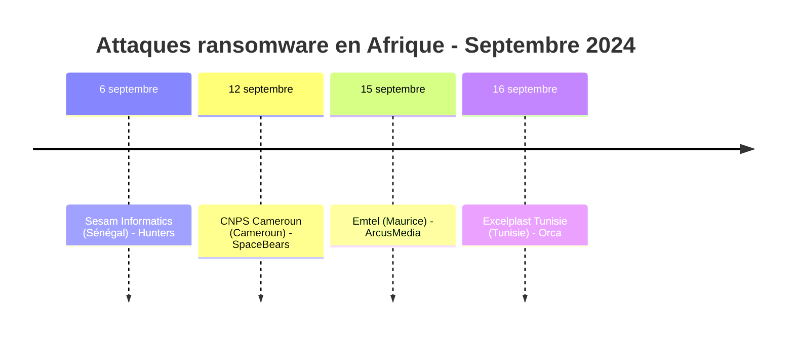
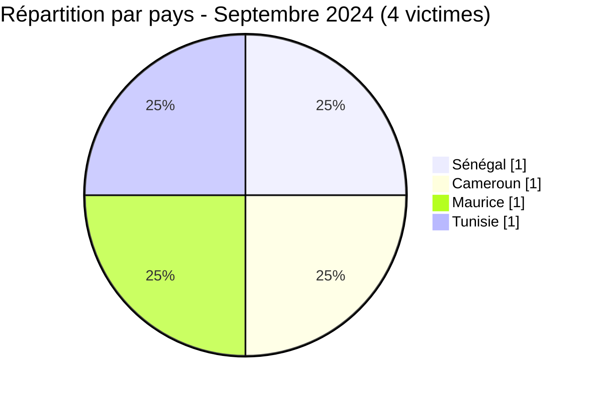

[](https://github.com/Hatchepsoute/AFRINTEL)


# Rapport CTI - Septembre 2024 : Mois calme avec 4 victimes dans 4 pays

👉🏾 [English version available here](./README.md)

### 1. Résumé exécutif

Septembre 2024 enregistre **4 victimes** documentées d'attaques par ransomware dans 4 pays distincts, le nombre mensuel le plus bas depuis janvier 2024. Chaque attaque implique un groupe ransomware différent, suggérant des campagnes opportunistes indépendantes plutôt qu'une vague coordonnée. L'Afrique de l'Ouest, l'Afrique centrale, l'Afrique du Nord et l'océan Indien apparaissent simultanément pour la première fois dans un même mois.

👉🏾 [Liste des victimes](./victims_FR.md)

**Chiffres clés :**
- 🔹 **4 victimes** identifiées
- 🔹 **4 groupes actifs** : Hunters (1), SpaceBears (1), ArcusMedia (1), Orca (1)
- 🔹 **Pays touchés** : Sénégal (1), Cameroun (1), Maurice (1), Tunisie (1)
- 🔹 **Secteurs** : Technologies, Gouvernement/Sécurité sociale, Télécommunications, Industrie

---

### 2. Chronologie des attaques

| Date | Victime | Pays | Groupe ransomware |
|------|---------|------|-------------------|
| 6 septembre | Sesam Informatics | Sénégal | Hunters |
| 12 septembre | CNPS Cameroun | Cameroun | SpaceBears |
| 15 septembre | Emtel | Maurice | ArcusMedia |
| 16 septembre | Excelplast Tunisie | Tunisie | Orca |



---

### 3. Analyse des victimes

#### 3.1 Par pays

| Pays | Nombre d'attaques |
|------|-----------------|
| Sénégal | 1 |
| Cameroun | 1 |
| Maurice | 1 |
| Tunisie | 1 |



#### 3.2 Par secteur

| Secteur | Nombre |
|---------|--------|
| Technologies | 1 |
| Gouvernement / Sécurité sociale | 1 |
| Télécommunications | 1 |
| Industrie manufacturière (Plasturgie) | 1 |

```mermaid
xychart-beta
    title "Secteurs ciblés - Septembre 2024"
    x-axis ["Technologies", "Gouvernement", "Télécom", "Industrie"]
    y-axis "Nombre d'attaques" 0 to 2
    bar [1, 1, 1, 1]
```

#### 3.3 Groupes ransomware

| Groupe ransomware | Nombre d'attaques |
|-----------------|-----------------|
| Hunters | 1 |
| SpaceBears | 1 |
| ArcusMedia | 1 |
| Orca | 1 |

---

### 4. Points d'attention

- **Forte baisse d'activité** : après le record d'août (14 victimes), septembre retombe à 4, la plus grande baisse mensuelle de l'année. Cela peut refléter une fatigue des campagnes estivales ou une pause tactique des grands groupes.
- **CNPS Cameroun - sécurité sociale ciblée** : SpaceBears revendique l'organisme national de sécurité sociale du Cameroun, une institution sensible détenant les dossiers d'emploi et de prestations sociales de millions de travailleurs.
- **Emtel (Maurice)** : la revendication d'ArcusMedia contre le principal opérateur télécom mauricien signale un intérêt croissant pour les fournisseurs de connectivité des îles de l'océan Indien.
- **Diversité géographique** : 4 victimes dans 4 pays différents avec 4 groupes différents, aucun acteur dominant ce mois-ci.
- **Première apparition d'Orca en Afrique** : le groupe revendique Excelplast Tunisie, marquant sa première revendication documentée sur le continent africain.

---

```mermaid
xychart-beta
    title "Évolution mensuelle des attaques (Jan - Sep 2024)"
    x-axis ["Jan", "Fév", "Mar", "Avr", "Mai", "Juin", "Juil", "Août", "Sep"]
    y-axis "Nombre d'attaques" 0 to 16
    bar [3, 5, 7, 5, 8, 3, 7, 14, 4]
```

### 5. Recommandations

| Domaine | Action recommandée |
|---------|--------------------|
| Gouvernement / Sécurité sociale | Auditer les accès aux bases de données citoyens, imposer le MFA sur tous les portails administratifs, surveiller les exfiltrations massives. |
| Télécommunications | Durcir les interfaces de gestion, segmenter le réseau cœur du SI, surveiller les compromissions de données abonnés. |
| Industrie manufacturière | Revoir l'exposition des systèmes sur Internet, renforcer la protection endpoint sur les réseaux de production. |
| Toutes organisations | Suivre ArcusMedia et Orca comme groupes émergents avec une nouvelle activité africaine. |

---

*Rapport produit à partir des données OSINT AFRINTEL . Diffusion libre (TLP:CLEAR)*
