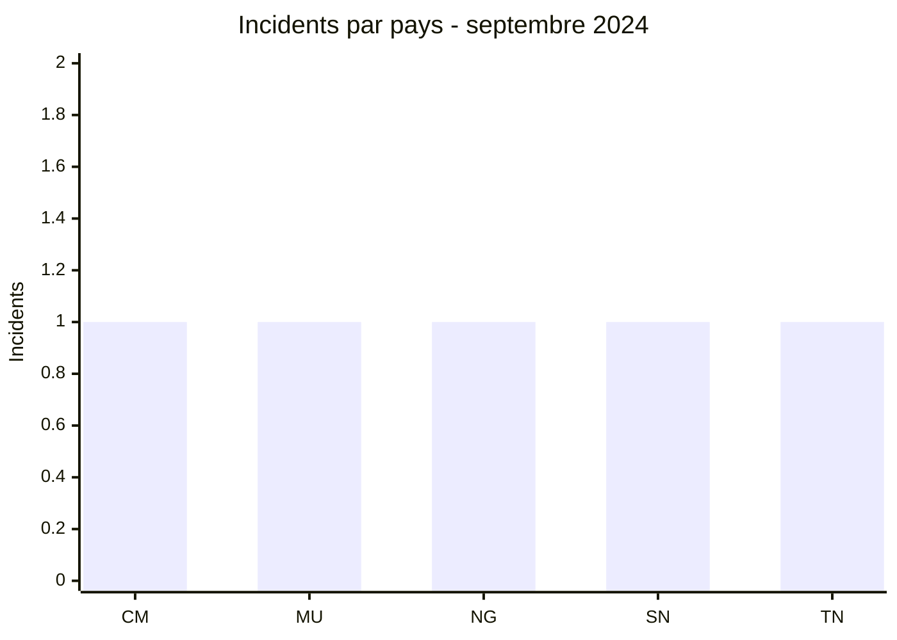
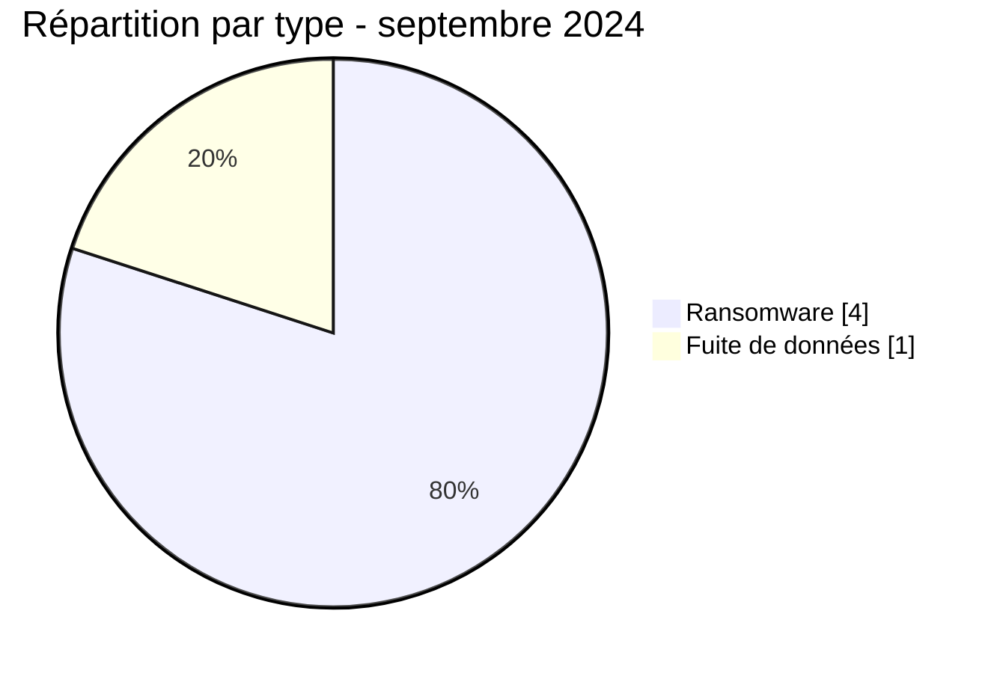

# Rapport CTI AFRINTEL - Septembre 2024

👉🏾 [English version](./README.md)

## 1. Résumé exécutif

Septembre 2024 rassemble **5 incidents** répartis dans cinq pays : **4 revendications ransomware** et **1 fuite de données**. Aucun acteur n’apparaît plus d’une fois. L’Afrique de l’Ouest compte deux incidents ; l’Afrique centrale, l’Afrique du Nord et l’océan Indien en comptent un chacun.

La publication visant la Nigerian Navy est le cas le plus sensible, mais elle renvoie à une fuite revendiquée au 8 novembre 2020. Elle doit donc être lue comme une remise en circulation ou une nouvelle observation d’un contenu ancien, et non comme une intrusion survenue en septembre 2024.

Voir [victims_FR.md](./victims_FR.md).

## 2. Méthodologie

Le rapport couvre les publications classées en septembre 2024. La date de découverte dans AFRINTEL est distinguée de la date de fuite annoncée par la source. Les cinq incidents sont dédupliqués par organisation et la republication ancienne reste explicitement signalée.

Les statistiques dérivent de [victims_FR.md](./victims_FR.md), synchronisé avec [victims.md](./victims.md).

## 3. Vue globale

| Indicateur | Valeur |
|---|---:|
| Incidents / Pays | **5 / 5** |
| Ransomware | **4** |
| Fuites de données | **1** |
| Ventes d’accès / Défacement | **0 / 0** |

### Classement par pays

| Pays | Total | Ransomware | Fuite |
|---|---:|---:|---:|
| 🇨🇲 Cameroun | 1 | 1 | 0 |
| 🇲🇺 Maurice | 1 | 1 | 0 |
| 🇳🇬 Nigeria | 1 | 0 | 1 |
| 🇸🇳 Sénégal | 1 | 1 | 0 |
| 🇹🇳 Tunisie | 1 | 1 | 0 |
| **Total** | **5** | **4** | **1** |

### Répartition régionale

| Région | Total | Ransomware | Fuite |
|---|---:|---:|---:|
| Afrique de l’Ouest | 2 | 1 | 1 |
| Afrique centrale | 1 | 1 | 0 |
| Afrique du Nord | 1 | 1 | 0 |
| Océan Indien | 1 | 1 | 0 |
| **Total** | **5** | **4** | **1** |

### Répartition sectorielle normalisée

| Secteur | Incidents | Part |
|---|---:|---:|
| Technologies / Informatique | 1 | 20 % |
| Gouvernement / Administration | 1 | 20 % |
| Télécommunications | 1 | 20 % |
| Industrie / Fabrication | 1 | 20 % |
| Défense / Sécurité | 1 | 20 % |
| **Total** | **5** | **100 %** |

### Acteurs et sources

| Acteur ou source | Incidents |
|---|---:|
| Arcus Media, Hunters, Orca, SpaceBears, NizaarFarah | 1 chacun |

## 4. Analyse détaillée par type d’incident

### 4.1 Ransomware

Sesam Informatics, la CNPS Cameroun, Emtel et Excelplast ont été publiés par quatre acteurs distincts. Les secteurs et pays ne forment pas un ensemble suffisamment cohérent pour conclure à une campagne ou à un ciblage commun.

### 4.2 Fuite de données

La source associée à la Nigerian Navy affiche des références à des fichiers et identifiants, mais AFRINTEL n’a ni collecté ni reproduit le contenu sous-jacent. La date ancienne réduit la valeur de l’incident pour mesurer une activité nouvelle, sans supprimer le risque de republication de données sensibles.

## 5. Impact sectoriel

Chaque secteur apparaît une seule fois. La défense présente la sensibilité la plus élevée ; les télécommunications et la sécurité sociale ajoutent un enjeu de continuité et de données personnelles. Le volume réduit impose de traiter ces cas individuellement.

## 6. Profil des acteurs et évaluation du risque

| Périmètre | Niveau | Justification |
|---|---|---|
| 🇳🇬 Nigeria | 🔴 Élevé | Publication ancienne attribuée à une institution militaire |
| 🇨🇲 Cameroun / 🇲🇺 Maurice | 🟠 Moyen | Sécurité sociale et télécommunications |
| 🇸🇳 Sénégal / 🇹🇳 Tunisie | 🟡 Faible à moyen | Une revendication sans échantillon public chacune |

## 7. Tendances et lacunes de renseignement

- **Observé - confiance élevée :** cinq incidents, cinq pays et cinq acteurs ou sources distincts.
- **Observé - confiance élevée :** la fuite Nigerian Navy est datée de 2020 par la source.
- **Lacune :** aucun rapport DFIR public n’a été identifié dans les sources consultées pour les quatre revendications ransomware.
- **Lacune :** l’authenticité, la portée et la circulation actuelle des données attribuées à la Nigerian Navy restent inconnues.
- **Collecte attendue :** nouvelle observation de la publication, confirmation institutionnelle et indicateurs techniques.

## 8. Cartographie MITRE ATT&CK contextuelle

| Statut | Technique | Utilisation |
|---|---|---|
| Préventif | T1486 - Data Encrypted for Impact | Détection du chiffrement ; non confirmé |
| Préventif | T1490 - Inhibit System Recovery | Surveillance des mécanismes de restauration |
| Hypothèse | T1078 - Valid Accounts | Risque lié aux identifiants revendiqués ; validité inconnue |

## 9. Recommandations

- **Défense :** invalider les comptes exposés si la fuite est confirmée et surveiller les republications.
- **Télécommunications :** segmenter l’administration et tester la continuité.
- **Sécurité sociale :** surveiller les accès aux dossiers et préparer la notification.
- **Toutes les organisations :** préserver les journaux et tester les sauvegardes.

## 10. Recommandations SOC et tactiques

| Qualification | Action |
|---|---|
| **Observé** | Surveiller les comptes et domaines cités ; aucune TTP d’intrusion n’est confirmée. |
| **Hypothèse** | Rechercher la réutilisation d’identifiants anciens et les connexions anormales aux services exposés. |
| **Préventif** | Détecter chiffrement massif, inhibition des sauvegardes, exports et transferts sortants inhabituels. |

## 11. Recommandations stratégiques

| Priorité | Qualification | Mesure |
|---:|---|---|
| 1 | **Observé** | Traiter la republication Nigerian Navy comme un risque de données anciennes toujours exploitables. |
| 2 | **Hypothèse** | Vérifier l’exposition des identités sans présumer leur validité actuelle. |
| 3 | **Préventif** | Déployer MFA résistante au phishing, rotation des mots de passe et sauvegardes immuables. |

## 12. Conclusion

Septembre est peu volumineux et très dispersé. Sa principale leçon n’est pas une hausse de menace, mais la persistance possible de données anciennes dans les circuits criminels. La réponse doit distinguer résilience ransomware et invalidation durable des identifiants exposés.

**AFRINTEL - TLP:CLEAR**

[Dépôt AFRINTEL](https://github.com/Hatchepsoute/AFRINTEL)
