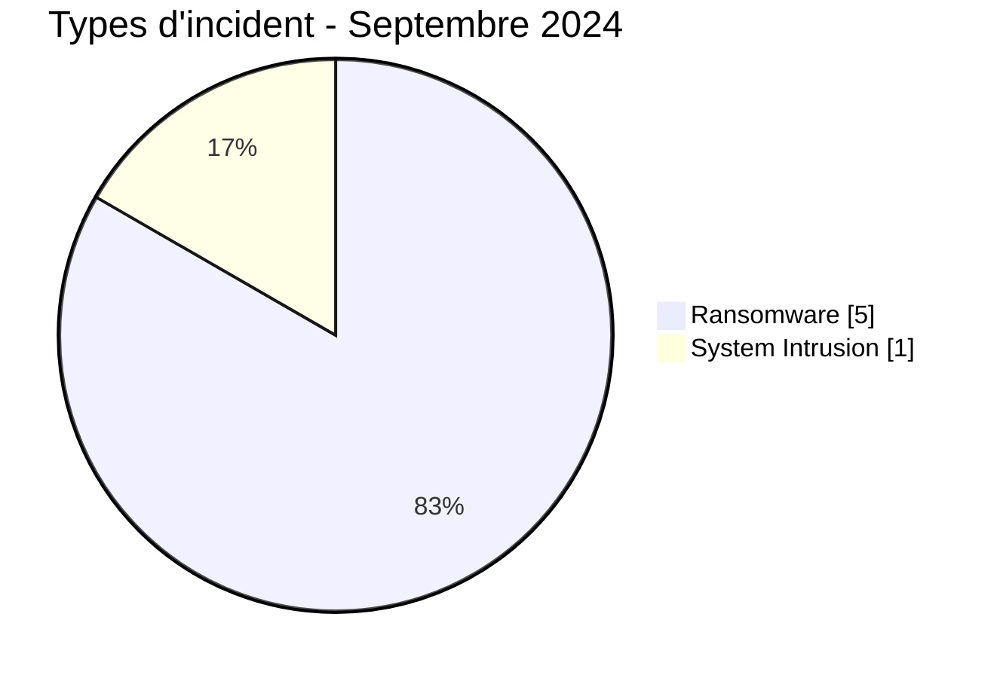

# Rapport CTI AFRINTEL - Cybermenaces en Afrique - Septembre 2024

👉🏾 [English version](./README.md)

## 1. Synthèse exécutive

En Septembre 2024, AFRINTEL retient **6 cyberincidents canoniques dans 6 pays**. Le mois est dominé par **Ransomware (5, 83,3 %)** puis **System Intrusion (1, 16,7 %)**. Les pays les plus représentés sont **Sénégal (1)**, **Cameroun (1)**, **Maurice (1)**. Les secteurs les plus visibles sont **Gouvernement / Administration (2)**, **Technologie / IT (1)**, **Télécommunications (1)**. Les labels acteur/groupe les plus fréquents sont `Unknown` (2), `hunters` (1), `spacebears` (1). `Unknown` désigne une absence d'attribution, pas un groupe.

La maturité de preuve est répartie entre **Claim - Unverified: 4**, **Confirmed: 2**. Les claims ne sont pas convertis en confirmations sans preuve supplémentaire.

### 1.1 Étude comparative avec le mois précédent

| Indicateur | Août 2024 | Septembre 2024 | Évolution |
|---|---|---|---|
| Total | 16 | 6 | -10 (-62,5 %) |
| Ransomware | 14 | 5 | -9 (-64,3 %) |
| Data Leak | 1 | 0 | -1 (-100,0 %) |
| Access Sale | 0 | 0 | Stable |
| DDoS | 0 | 0 | Stable |
| Defacement | 0 | 0 | Stable |
| Account Takeover | 0 | 0 | Stable |
| System Intrusion | 1 | 1 | Stable |
| Malware | 0 | 0 | Stable |
| Operational Fraud | 0 | 0 | Stable |

### 1.2 Analyse comparative

Le volume mensuel **diminue de 10 incident(s)**. Les variations structurantes sont : Ransomware 14->5 (-9), Data Leak 1->0 (-1). Cette variation décrit le corpus documenté, pas nécessairement une variation équivalente du nombre réel de compromissions sur le continent.

## 2. Méthodologie

- Un incident canonique correspond à un événement retenu dans le millésime 2024.
- Les découvertes/republications historiques sont conservées séparément et ne gonflent pas les statistiques 2024.
- La date d'incident ou la meilleure fenêtre soutenue prime ; la date de découverte AFRINTEL reste distincte.
- Les 9 types AFRINTEL sont utilisés ; une tentative est représentée par le statut, jamais par un type `Attempted Attack`.
- Un DDoS coordonné est compté par campagne.
- Type, statut, confiance, impact, attribution et source restent distincts.

## 3. Répartition par type d'incident

| Type | Fiches | Part |
|---|---|---|
| Ransomware | 5 | 83,3 % |
| Data Leak | 0 | 0,0 % |
| Access Sale | 0 | 0,0 % |
| DDoS | 0 | 0,0 % |
| Defacement | 0 | 0,0 % |
| Account Takeover | 0 | 0,0 % |
| System Intrusion | 1 | 16,7 % |
| Malware | 0 | 0,0 % |
| Operational Fraud | 0 | 0,0 % |

## 4. Pays x type

| Pays | Total | Ransomware | Data Leak | Access Sale | DDoS | Defacement | Account Takeover | System Intrusion | Malware | Operational Fraud |
|---|---|---|---|---|---|---|---|---|---|---|
| Sénégal | 1 | 1 | 0 | 0 | 0 | 0 | 0 | 0 | 0 | 0 |
| Cameroun | 1 | 1 | 0 | 0 | 0 | 0 | 0 | 0 | 0 | 0 |
| Maurice | 1 | 1 | 0 | 0 | 0 | 0 | 0 | 0 | 0 | 0 |
| Angola | 1 | 1 | 0 | 0 | 0 | 0 | 0 | 0 | 0 | 0 |
| Tunisie | 1 | 1 | 0 | 0 | 0 | 0 | 0 | 0 | 0 | 0 |
| Mozambique | 1 | 0 | 0 | 0 | 0 | 0 | 0 | 1 | 0 | 0 |

## 5. Répartition régionale

| Région | Fiches | Part |
|---|---|---|
| Afrique australe | 2 | 33,3 % |
| Afrique de l'Ouest | 1 | 16,7 % |
| Afrique centrale | 1 | 16,7 % |
| Océan Indien | 1 | 16,7 % |
| Afrique du Nord | 1 | 16,7 % |

## 6. Répartition sectorielle

| Secteur | Fiches | Part |
|---|---|---|
| Gouvernement / Administration | 2 | 33,3 % |
| Technologie / IT | 1 | 16,7 % |
| Télécommunications | 1 | 16,7 % |
| Aviation | 1 | 16,7 % |
| Industrie / Fabrication | 1 | 16,7 % |

## 7. Acteurs / groupes

| Acteur / Groupe | Fiches | Part |
|---|---|---|
| Unknown | 2 | 33,3 % |
| hunters | 1 | 16,7 % |
| spacebears | 1 | 16,7 % |
| arcusmedia | 1 | 16,7 % |
| orca | 1 | 16,7 % |

## 8. Maturité des preuves

| Position de preuve | Fiches | Part |
|---|---|---|
| Claim - Unverified | 4 | 66,7 % |
| Confirmed | 2 | 33,3 % |

### Confiance

| Confiance | Fiches | Part |
|---|---|---|
| Low | 4 | 66,7 % |
| Very High | 2 | 33,3 % |

## 9. Chronologie

```mermaid
timeline
    title AFRINTEL - Septembre 2024
    6 Septembre 2024 : Sesam Informatics
- **Acteur / Groupe -** hunters
- **Secteur -** Technology / IT
- **Site web -** [sesam-informatics.com](https -//www.sesam-informatics.com)
- **Statut -** Claim - Unverified
- **Type d'incident -** Ransomware
- **Niveau de confiance -** Low
- **Niveau d'impact -** Level 2
- **Description victime -** Sesam Informatics est une entreprise sénégalaise de technologies et de services logiciels opérant dans les solutions numériques et le développement informatique.
- **Note de fiabilité -** Le corpus fourni pour septembre documente une publication ransomware, mais ne fournit ni rapport DFIR public, ni échantillon de données, ni confirmation indépendante de la victime permettant d'établir une compromission réussie.
- **Analyse -** AFRINTEL enregistre la publication comme une revendication ransomware. Les éléments fournis ne permettent pas d'établir un chiffrement, une perturbation opérationnelle, l'étendue d'une exfiltration, l'accès initial ou une réponse confirmée de la victime. La fiche reste donc `Claim - Unverified`.

----------------------------
    12 Septembre 2024 : CNPS Cameroun
- **Acteur / Groupe -** spacebears
- **Secteur -** Government / Administration
- **Site web -** [cnps.cm](https -//www.cnps.cm)
- **Statut -** Claim - Unverified
- **Type d'incident -** Ransomware
- **Niveau de confiance -** Low
- **Niveau d'impact -** Level 3
- **Description victime -** La Caisse Nationale de Prévoyance Sociale (CNPS) du Cameroun est l'organisme public chargé de la gestion de la sécurité sociale et des prestations sociales des travailleurs.
- **Note de fiabilité -** Le corpus fourni pour septembre documente une publication ransomware, mais ne fournit ni rapport DFIR public, ni échantillon de données, ni confirmation indépendante de la victime permettant d'établir une compromission réussie.
- **Analyse -** AFRINTEL enregistre la publication comme une revendication ransomware. Les éléments fournis ne permettent pas d'établir un chiffrement, une perturbation opérationnelle, l'étendue d'une exfiltration, l'accès initial ou une réponse confirmée de la victime. La fiche reste donc `Claim - Unverified`.

----------------------------
    15 Septembre 2024 : Emtel
- **Acteur / Groupe -** arcusmedia
- **Secteur -** Telecommunications
- **Site web -** [emtel.com](https -//www.emtel.com)
- **Statut -** Claim - Unverified
- **Type d'incident -** Ransomware
- **Niveau de confiance -** Low
- **Niveau d'impact -** Level 3
- **Description victime -** Emtel est un opérateur mobile mauricien fournissant des infrastructures de télécommunications, des services voix, des données haut débit et des services numériques.
- **Note de fiabilité -** Le corpus fourni pour septembre documente une publication ransomware, mais ne fournit ni rapport DFIR public, ni échantillon de données, ni confirmation indépendante de la victime permettant d'établir une compromission réussie.
- **Analyse -** AFRINTEL enregistre la publication comme une revendication ransomware. Les éléments fournis ne permettent pas d'établir un chiffrement, une perturbation opérationnelle, l'étendue d'une exfiltration, l'accès initial ou une réponse confirmée de la victime. La fiche reste donc `Claim - Unverified`.

----------------------------
    15 Septembre 2024 : TAAG - Linhas Aéreas de Angola
- **Date de l'incident -** 15 Septembre 2024
- **Date de publication initiale / source retenue -** 16 septembre 2024
- **Date de découverte AFRINTEL -** 23 août 2026 - audit rétrospectif
- **Précision chronologique -** Incident le 15 septembre ; communication TAAG le 16 ; qualification ransomware confirmée rétrospectivement par l'autorité.
- **Acteur / Groupe -** Unknown
- **Secteur -** Aviation
- **Site web -** [taag.com](https -//www.taag.com/)
- **Statut -** Authority Confirmed
- **Type d'incident -** Ransomware
- **Niveau de confiance -** Very High
- **Niveau d'impact -** Level 4
- **Analyse -** TAAG a confirmé une cyberattaque et des perturbations de services internes. L'Agência de Protecção de Dados a ensuite qualifié explicitement l'événement du 15 septembre 2024 de ransomware. Les vols et la billetterie n'ont pas été interrompus selon les sources de l'audit. AFRINTEL conserve l'incident en septembre 2024 et distingue la date de confirmation réglementaire de la date de l'attaque.
- **Sources publiques -** [Agência de Protecção de Dados](https -//apd.ao/ao/gca/index.php?id=218&preview=1) | [VOA Português](https -//www.voaportugues.com/a/ataque-cibern%C3%A9tico-n%C3%A3o-paralisa-opera%C3%A7%C3%B5es-da-taag/7787321.html) | [Portal de TI Angola](https -//pti.ao/ataque-cibernetico-a-taag-afectou-dados-contabilisticos-da-empresa/)

----------------------------
    16 Septembre 2024 : Excelplast Tunisie
- **Acteur / Groupe -** orca
- **Secteur -** Manufacturing / Industry
- **Site web -** [excelplastunisie.com](https -//www.excelplastunisie.com)
- **Statut -** Claim - Unverified
- **Type d'incident -** Ransomware
- **Niveau de confiance -** Low
- **Niveau d'impact -** Level 2
- **Description victime -** Excelplast Tunisie est une entreprise manufacturière tunisienne spécialisée dans la production de plastique, la transformation des matières premières et l'emballage.
- **Note de fiabilité -** Le corpus fourni pour septembre documente une publication ransomware, mais ne fournit ni rapport DFIR public, ni échantillon de données, ni confirmation indépendante de la victime permettant d'établir une compromission réussie.
- **Analyse -** AFRINTEL enregistre la publication comme une revendication ransomware. Les éléments fournis ne permettent pas d'établir un chiffrement, une perturbation opérationnelle, l'étendue d'une exfiltration, l'accès initial ou une réponse confirmée de la victime. La fiche reste donc `Claim - Unverified`.

----------------------------
    28 Septembre 2024 : Comissão Nacional de Eleições (CNE)
- **Date de l'incident -** 28 Septembre 2024
- **Date de publication initiale / source retenue -** 30 septembre 2024
- **Date de découverte AFRINTEL -** 23 août 2026 - audit rétrospectif
- **Précision chronologique -** Date exacte rapportée comme samedi 28 septembre par la CNE/Lusa.
- **Acteur / Groupe -** Unknown
- **Secteur -** Government / Administration
- **Site web -** [cne.org.mz](https -//www.cne.org.mz/)
- **Statut -** Victim Confirmed
- **Type d'incident -** System Intrusion
- **Niveau de confiance -** Very High
- **Niveau d'impact -** Level 3
- **Analyse -** Les pages web de la CNE ont été ciblées le 28 septembre. L'organisme a déclaré avoir repris le contrôle, renforcé la sécurité et conservé l'intégrité des données. Les sources décrivent aussi une tentative ultérieure de diffusion d'un lien malveillant utilisant l'identité visuelle électorale. Les éléments ne permettent pas de conclure à un DDoS ou à un défacement classique ; AFRINTEL retient `System Intrusion` sans inférer de Data Leak.
- **Sources publiques -** [Club of Mozambique](https -//clubofmozambique.com/news/mozambique-elections-election-data-safe-despite-cyber-attack-watch/) | [AMAN Alliance / Lusa](https -//www.aman-alliance.org/Home/ContentDetail/80863) | [KonBriefing](https -//konbriefing.com/en-topics/cyber-attacks-2024.html)

----------------------------
```

## 10. Analyse CTI par type

### Ransomware - 5

**5 fiche(s) (83,3 %).** Principaux pays : Sénégal (1), Cameroun (1), Maurice (1). Les conclusions restent limitées aux éléments documentés ; le type ne permet pas d'inférer un vecteur ou un impact non observé.

### System Intrusion - 1

**1 fiche(s) (16,7 %).** Principaux pays : Mozambique (1). Les conclusions restent limitées aux éléments documentés ; le type ne permet pas d'inférer un vecteur ou un impact non observé.

## 11. Incidents prioritaires pour revue

| Pays | Organisation | Type | Statut | Impact | Confiance |
|---|---|---|---|---|---|
| Angola | TAAG - Linhas Aéreas de Angola
- **Date de l'incident:** 15 Septembre 2024
- **Date de publication initiale / source retenue:** 16 septembre 2024
- **Date de découverte AFRINTEL:** 23 août 2026 - audit rétrospectif
- **Précision chronologique:** Incident le 15 septembre ; communication TAAG le 16 ; qualification ransomware confirmée rétrospectivement par l'autorité.
- **Acteur / Groupe:** Unknown
- **Secteur:** Aviation
- **Site web:** [taag.com](https://www.taag.com/)
- **Statut:** Authority Confirmed
- **Type d'incident:** Ransomware
- **Niveau de confiance:** Very High
- **Niveau d'impact:** Level 4
- **Analyse:** TAAG a confirmé une cyberattaque et des perturbations de services internes. L'Agência de Protecção de Dados a ensuite qualifié explicitement l'événement du 15 septembre 2024 de ransomware. Les vols et la billetterie n'ont pas été interrompus selon les sources de l'audit. AFRINTEL conserve l'incident en septembre 2024 et distingue la date de confirmation réglementaire de la date de l'attaque.
- **Sources publiques:** [Agência de Protecção de Dados](https://apd.ao/ao/gca/index.php?id=218&preview=1) | [VOA Português](https://www.voaportugues.com/a/ataque-cibern%C3%A9tico-n%C3%A3o-paralisa-opera%C3%A7%C3%B5es-da-taag/7787321.html) | [Portal de TI Angola](https://pti.ao/ataque-cibernetico-a-taag-afectou-dados-contabilisticos-da-empresa/)

---------------------------- | Ransomware | Authority Confirmed | Level 4 | Very High |
| Mozambique | Comissão Nacional de Eleições (CNE)
- **Date de l'incident:** 28 Septembre 2024
- **Date de publication initiale / source retenue:** 30 septembre 2024
- **Date de découverte AFRINTEL:** 23 août 2026 - audit rétrospectif
- **Précision chronologique:** Date exacte rapportée comme samedi 28 septembre par la CNE/Lusa.
- **Acteur / Groupe:** Unknown
- **Secteur:** Government / Administration
- **Site web:** [cne.org.mz](https://www.cne.org.mz/)
- **Statut:** Victim Confirmed
- **Type d'incident:** System Intrusion
- **Niveau de confiance:** Very High
- **Niveau d'impact:** Level 3
- **Analyse:** Les pages web de la CNE ont été ciblées le 28 septembre. L'organisme a déclaré avoir repris le contrôle, renforcé la sécurité et conservé l'intégrité des données. Les sources décrivent aussi une tentative ultérieure de diffusion d'un lien malveillant utilisant l'identité visuelle électorale. Les éléments ne permettent pas de conclure à un DDoS ou à un défacement classique ; AFRINTEL retient `System Intrusion` sans inférer de Data Leak.
- **Sources publiques:** [Club of Mozambique](https://clubofmozambique.com/news/mozambique-elections-election-data-safe-despite-cyber-attack-watch/) | [AMAN Alliance / Lusa](https://www.aman-alliance.org/Home/ContentDetail/80863) | [KonBriefing](https://konbriefing.com/en-topics/cyber-attacks-2024.html)

---------------------------- | System Intrusion | Victim Confirmed | Level 3 | Very High |
| Cameroun | CNPS Cameroun
- **Acteur / Groupe:** spacebears
- **Secteur:** Government / Administration
- **Site web:** [cnps.cm](https://www.cnps.cm)
- **Statut:** Claim - Unverified
- **Type d'incident:** Ransomware
- **Niveau de confiance:** Low
- **Niveau d'impact:** Level 3
- **Description victime:** La Caisse Nationale de Prévoyance Sociale (CNPS) du Cameroun est l'organisme public chargé de la gestion de la sécurité sociale et des prestations sociales des travailleurs.
- **Note de fiabilité:** Le corpus fourni pour septembre documente une publication ransomware, mais ne fournit ni rapport DFIR public, ni échantillon de données, ni confirmation indépendante de la victime permettant d'établir une compromission réussie.
- **Analyse:** AFRINTEL enregistre la publication comme une revendication ransomware. Les éléments fournis ne permettent pas d'établir un chiffrement, une perturbation opérationnelle, l'étendue d'une exfiltration, l'accès initial ou une réponse confirmée de la victime. La fiche reste donc `Claim - Unverified`.

---------------------------- | Ransomware | Claim - Unverified | Level 3 | Low |
| Maurice | Emtel
- **Acteur / Groupe:** arcusmedia
- **Secteur:** Telecommunications
- **Site web:** [emtel.com](https://www.emtel.com)
- **Statut:** Claim - Unverified
- **Type d'incident:** Ransomware
- **Niveau de confiance:** Low
- **Niveau d'impact:** Level 3
- **Description victime:** Emtel est un opérateur mobile mauricien fournissant des infrastructures de télécommunications, des services voix, des données haut débit et des services numériques.
- **Note de fiabilité:** Le corpus fourni pour septembre documente une publication ransomware, mais ne fournit ni rapport DFIR public, ni échantillon de données, ni confirmation indépendante de la victime permettant d'établir une compromission réussie.
- **Analyse:** AFRINTEL enregistre la publication comme une revendication ransomware. Les éléments fournis ne permettent pas d'établir un chiffrement, une perturbation opérationnelle, l'étendue d'une exfiltration, l'accès initial ou une réponse confirmée de la victime. La fiche reste donc `Claim - Unverified`.

---------------------------- | Ransomware | Claim - Unverified | Level 3 | Low |
| Sénégal | Sesam Informatics
- **Acteur / Groupe:** hunters
- **Secteur:** Technology / IT
- **Site web:** [sesam-informatics.com](https://www.sesam-informatics.com)
- **Statut:** Claim - Unverified
- **Type d'incident:** Ransomware
- **Niveau de confiance:** Low
- **Niveau d'impact:** Level 2
- **Description victime:** Sesam Informatics est une entreprise sénégalaise de technologies et de services logiciels opérant dans les solutions numériques et le développement informatique.
- **Note de fiabilité:** Le corpus fourni pour septembre documente une publication ransomware, mais ne fournit ni rapport DFIR public, ni échantillon de données, ni confirmation indépendante de la victime permettant d'établir une compromission réussie.
- **Analyse:** AFRINTEL enregistre la publication comme une revendication ransomware. Les éléments fournis ne permettent pas d'établir un chiffrement, une perturbation opérationnelle, l'étendue d'une exfiltration, l'accès initial ou une réponse confirmée de la victime. La fiche reste donc `Claim - Unverified`.

---------------------------- | Ransomware | Claim - Unverified | Level 2 | Low |

> Sélection structurée selon impact, statut et confiance ; ce n'est pas un classement absolu de gravité.

## 12. Intelligence gaps et corrections

- vecteur d'accès initial souvent inconnu ;
- date technique de compromission parfois différente de la date de publication ;
- volumes revendiqués rarement vérifiables intégralement ;
- attribution technique souvent limitée au compte de publication ;
- republications historiques suivies séparément.

## 13. Recommandations

- MFA résistante au phishing, PAM et moindre privilège ;
- segmentation, sauvegardes immuables et tests de restauration ;
- centralisation EDR/IAM/VPN/WAF/DNS/cloud/applications ;
- détection des exports massifs, archives inhabituelles et transferts sortants ;
- conservation séparée des dates d'incident, publication initiale, repost et découverte AFRINTEL.

## 14. Conclusion

Septembre 2024 contient **6 incidents canoniques**. La comparaison avec le mois précédent est calculée sur la même taxonomie et les mêmes règles chronologiques, sauf janvier où décembre 2023 reste `N/A` faute de réaudit homogène.

👉🏾 [Victimes canoniques](./victims_FR.md)

**AFRINTEL** - TLP:CLEAR
