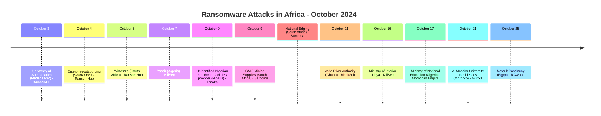
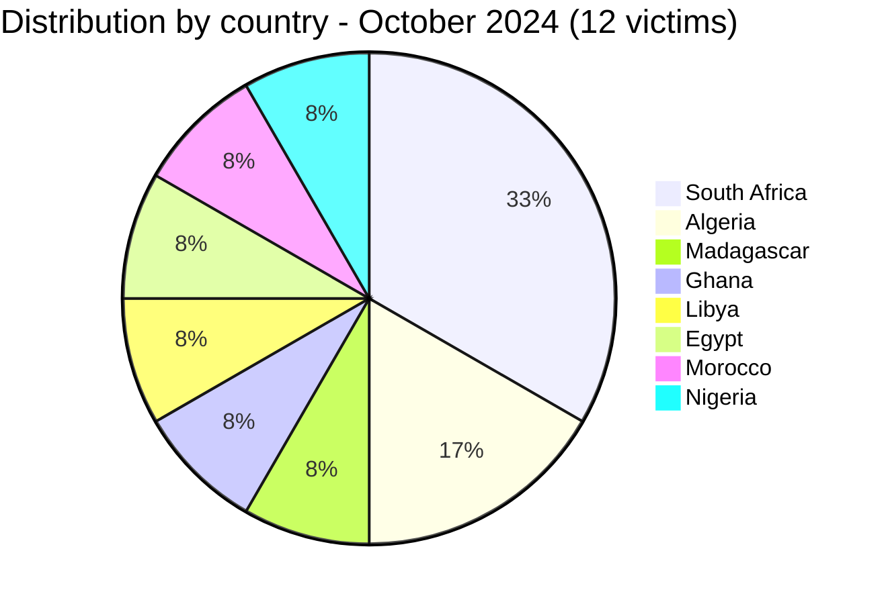

[](https://github.com/Hatchepsoute/AFRINTEL)


# CTI Report - October 2024: South Africa concentration and energy infrastructure hit in Ghana

👉🏾 [Version française disponible ici](./README_FR.md)

### 1. Executive summary

October 2024 records **12 documented victims** across 8 countries. South Africa is the dominant target with 4 victims. The month features two notable attacks: **Ghana's Volta River Authority** (national electricity producer) claimed by BlackSuit, and **Libya's Ministry of Interior** targeted by KillSec. RansomHub and Sarcoma each strike twice, consolidating their presence on the continent, while Algeria's Ministry of National Education is the subject of a recirculated data-sample claim attributed to Moroccan Empire. An unconfirmed forum listing also surfaced for **Madagascar's University of Antananarivo**, offered by the account RainbowBF on the Breached platform; the underlying content remained paywalled and inaccessible to AFRINTEL.

👉🏾 [Victims list](./victims.md)

**Key figures:**
- 🔹 **12 victims** identified
- 🔹 **9 active actors/groups**: RansomHub (2), Sarcoma (2), KillSec (2), BlackSuit (1), RAWorld (1), bxxxx1 (1), Tanaka (1), Moroccan Empire (1), RainbowBF (1)
- 🔹 **Countries affected**: South Africa (4), Algeria (2), Madagascar (1), Ghana (1), Libya (1), Egypt (1), Morocco (1), Nigeria (1)
- 🔹 **Sectors**: Education (3), IT Consulting, Tech/Mobility, Mining/Industrial (2), Energy, Government (2), Legal, Healthcare

---

### 2. Attack timeline

| Date | Victim | Country | Ransomware group |
|------|--------|---------|-----------------|
| October 3 | University of Antananarivo | Madagascar | RainbowBF |
| October 4 | Enterpriseoutsourcing | South Africa | RansomHub |
| October 5 | Winwinza | South Africa | RansomHub |
| October 7 | Yassir | Algeria | KillSec |
| October 9 | Unidentified Nigerian healthcare facilities provider | Nigeria | Tanaka |
| October 9 | GMG Mining Supplies | South Africa | Sarcoma |
| October 9 | National Edging | South Africa | Sarcoma |
| October 11 | Volta River Authority (VRA) | Ghana | BlackSuit |
| October 16 | Ministry of Interior (moi.gov.ly) | Libya | KillSec |
| October 17 | Ministry of National Education (education.gov.dz) | Algeria | Moroccan Empire |
| October 21 | Al Massira University Residences | Morocco | bxxxx1 |
| October 25 | Matouk Bassiouny | Egypt | RAWorld |



---

### 3. Victim analysis

#### 3.1 By country

| Country | Number of attacks |
|---------|-----------------|
| South Africa | 4 |
| Algeria | 2 |
| Madagascar | 1 |
| Ghana | 1 |
| Libya | 1 |
| Egypt | 1 |
| Morocco | 1 |
| Nigeria | 1 |



#### 3.2 By sector

| Sector | Count |
|--------|-------|
| Education | 3 |
| IT Consulting | 1 |
| Mining / Industrial | 2 |
| Tech / Mobility | 1 |
| Energy / Electricity | 1 |
| Government | 2 |
| Legal Consulting | 1 |
| Healthcare / Medical | 1 |

```mermaid
xychart-beta
    title "Targeted Sectors - October 2024"
    x-axis ["Education", "IT Consulting", "Mining/Industrial", "Tech", "Energy", "Government", "Legal", "Healthcare"]
    y-axis "Number of attacks" 0 to 3
    bar [3, 1, 2, 1, 1, 2, 1, 1]
```

#### 3.3 Ransomware groups

| Ransomware group | Number of attacks |
|-----------------|-----------------|
| RansomHub | 2 |
| Sarcoma | 2 |
| KillSec | 2 |
| BlackSuit | 1 |
| RAWorld | 1 |
| bxxxx1 | 1 |
| Tanaka | 1 |
| Moroccan Empire | 1 |
| RainbowBF | 1 |

```mermaid
gantt
    title Active Ransomware Groups - October 2024
    dateFormat X
    axisFormat %s
    section RansomHub
    RansomHub : 0, 2
    section Sarcoma
    Sarcoma : 0, 2
    section KillSec
    KillSec : 0, 2
    section BlackSuit
    BlackSuit : 0, 1
    section RAWorld
    RAWorld : 0, 1
    section bxxxx1
    bxxxx1 : 0, 1
    section Tanaka
    Tanaka : 0, 1
    section Moroccan Empire
    Moroccan Empire : 0, 1
    section RainbowBF
    RainbowBF : 0, 1
```



---

### 4. Key observations

- **University of Antananarivo (Madagascar)**: an unconfirmed "database access" listing posted by the account RainbowBF on the Breached forum on October 3. The content was paywalled behind the forum's credit system and inaccessible to AFRINTEL; no sample, scope or authenticity could be assessed, and the claim is retained as unverified.
- **South Africa remains the leading target**: 4 out of 12 victims are South African, 2 from RansomHub and 2 from Sarcoma in coordinated same-day strikes (October 9). Mining supply chain appears specifically targeted.
- **Volta River Authority (Ghana)**: BlackSuit claims Ghana's main electricity producer a direct attack on critical national energy infrastructure supplying hydroelectric and thermal power.
- **Yassir (Algeria)**: KillSec targets one of Africa's fastest-growing super-apps (VTC, delivery, grocery) with operations across Algeria and international markets. Significant user data exposure risk.
- **Libya Ministry of Interior**: KillSec claims the Libyan government's interior ministry, an extremely sensitive target with potential national security implications.
- **Law firm targeted (Egypt)**: RAWorld claims Matouk Bassiouny, a top Cairo law firm a high-value target for confidential legal and corporate documents.
- **Sarcoma emergence**: the group claims two South African victims on the same day (October 9), suggesting active prospection in the country.
- **Ministry of National Education (Algeria)**: a recirculated claim, originally dated October 6, 2022 and attributed to Moroccan Empire, is reposted by AmeliaBeaumont on October 17 and links to a dump first shared in September 2023. The sample includes plaintext credentials alongside identity and schooling data for an alleged 90,000 students; the total volume was not independently verified.
- **Student accommodation exposure (Morocco)**: the bxxxx1 publication includes email addresses and claims control-panel access, but the access method and direct administrative compromise are not technically demonstrated.

---

```mermaid
xychart-beta
    title "Monthly Evolution of Attacks (Jan - Oct 2024)"
    x-axis ["Jan", "Feb", "Mar", "Apr", "May", "Jun", "Jul", "Aug", "Sep", "Oct"]
    y-axis "Number of attacks" 0 to 16
    bar [3, 5, 7, 5, 8, 3, 7, 14, 4, 12]
```

### 5. Recommendations

| Domain | Recommended action |
|--------|--------------------|
| Energy / Electricity | Assess BlackSuit TTPs, enforce network segmentation between SCADA and corporate IT, implement backup power control systems. |
| Mining & Supply chain | Audit supplier access controls, monitor for data staging and exfiltration, review Sarcoma IOCs. |
| Government | Treat any claims against ministries as critical implement zero-trust access for sensitive systems. |
| Education / Student accommodation | Enforce MFA for administration panels, review privileged sessions, protect applicant contact data, and prepare phishing notifications. |
| Higher education | Monitor cybercriminal forums for institutional database listings, even when paywalled, and validate exposure through incident response rather than dismissing unverifiable claims. |
| Tech platforms / Super-apps | Protect user databases with encryption at rest, enforce data minimization, prepare breach notification procedures. |
| Legal firms | Restrict access to client files, enforce DLP, treat legal data as high-value target equivalent to financial data. |

---

*Report from AFRINTEL OSINT data. Free distribution (TLP:CLEAR)*
