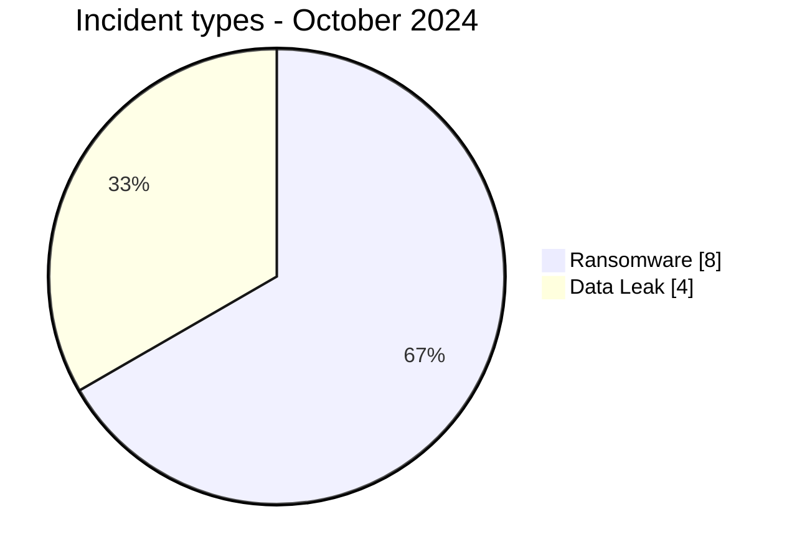
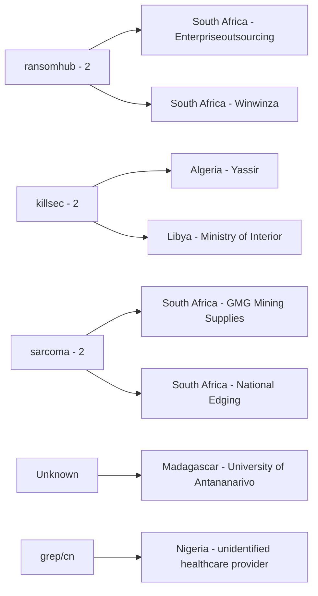
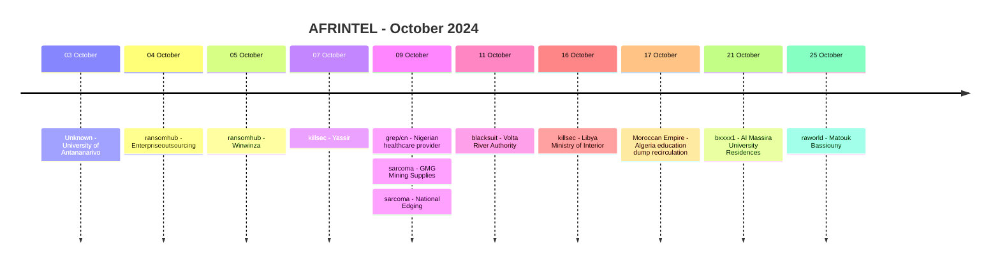

# AFRINTEL CTI Report - October 2024

👉🏾 [Version française](./README_FR.md)

## 1. Executive summary

October 2024 contains **12 documented incident records across 8 African countries**: **8 Ransomware** and **4 Data Leak**. No Access Sale, DDoS, Defacement or Operational Fraud record is present in the validated October corpus.

South Africa records four incidents, Algeria two, and six other countries one each. North Africa accounts for five records and Southern Africa four. Education / University is the most represented harmonized sector with **4 of 12 records (33.3%)**.

The month is notable less for a single dominant threat actor than for its wide variation in evidence quality. Seven ransomware entries remain low-confidence, unverified claims. National Edging, also listed as ransomware, has a locally reviewed sample strongly supporting an internal compromise. Among the Data Leak records, the Nigerian healthcare case, Algeria's Ministry of National Education and Al Massira provide visible samples, while the University of Antananarivo material remained inaccessible behind the forum's credit system.

👉🏾 [View the full victim list](./victims.md)

### 1.1 Month-over-month comparison

| Indicator | September 2024 | October 2024 | Change |
|---|---:|---:|---:|
| Total incidents | 5 | **12** | **+7 (+140.0%)** |
| Ransomware | 4 | **8** | **+4 (+100.0%)** |
| Data Leak | 1 | **4** | **+3 (+300.0%)** |
| Access Sale | 0 | **0** | Stable |
| DDoS | 0 | **0** | Stable |
| Defacement | 0 | **0** | Stable |
| Operational Fraud | 0 | **0** | Stable |

October's observed corpus is **2.4 times the size of September's**. Ransomware publication visibility doubles and Data Leak rises from one to four. This is an increase in AFRINTEL's documented corpus, not proof that the real number of successful compromises across Africa increased by the same proportion.

## 2. Methodology

- **Period:** 1-31 October 2024.
- **Source of truth:** harmonized `victims_FR.md` / `victims.md`.
- **Counting:** one harmonized card equals one documented incident record.
- **Taxonomy:** Ransomware, Data Leak, Access Sale, DDoS, Defacement, Operational Fraud.
- **Retrospective correction registry:** none of the 10 identified missing 2024 incidents belongs to October.
- **Locked content:** AFRINTEL does not purchase or unlock paywalled forum content; inaccessible material does not increase confidence.
- **Actor/source separation:** forum publishers and repost accounts are kept separate from intrusion actors when the source itself distinguishes those roles.
- **Reposts:** the Algerian Ministry of National Education record preserves its claimed 2022 leak date and later repost chronology rather than treating October 2024 as a new intrusion date.

## 3. Global overview

### 3.1 Incident-type distribution

| Incident type | Records | Share |
|---|---:|---:|
| Ransomware | **8** | **66.7%** |
| Data Leak | **4** | **33.3%** |
| Access Sale | 0 | 0.0% |
| DDoS | 0 | 0.0% |
| Defacement | 0 | 0.0% |
| Operational Fraud | 0 | 0.0% |
| **Total** | **12** | **100%** |

### 3.2 Country distribution

| Country | Ransomware | Data Leak | Total |
|---|---:|---:|---:|
| 🇿🇦 South Africa | 4 | 0 | **4** |
| 🇩🇿 Algeria | 1 | 1 | **2** |
| 🇬🇭 Ghana | 1 | 0 | 1 |
| 🇱🇾 Libya | 1 | 0 | 1 |
| 🇲🇬 Madagascar | 0 | 1 | 1 |
| 🇲🇦 Morocco | 0 | 1 | 1 |
| 🇳🇬 Nigeria | 0 | 1 | 1 |
| 🇪🇬 Egypt | 1 | 0 | 1 |
| **Total** | **8** | **4** | **12** |

### 3.3 Regional distribution

| Region | Ransomware | Data Leak | Total |
|---|---:|---:|---:|
| North Africa | 3 | 2 | **5** |
| Southern Africa | 4 | 0 | **4** |
| West Africa | 1 | 1 | **2** |
| Indian Ocean | 0 | 1 | **1** |
| **Total** | **8** | **4** | **12** |

### 3.4 Harmonized sector distribution

| Sector | Records | Share |
|---|---:|---:|
| Education / University | **4** | **33.3%** |
| Technology / IT | 2 | 16.7% |
| Manufacturing / Industry | 2 | 16.7% |
| Healthcare / Medical | 1 | 8.3% |
| Energy / Utilities | 1 | 8.3% |
| Government / Administration | 1 | 8.3% |
| Legal / Justice | 1 | 8.3% |
| **Total** | **12** | **100%** |

### 3.5 Actors / groups

| Actor / Group | Records |
|---|---:|
| ransomhub | **2** |
| killsec | **2** |
| sarcoma | **2** |
| Unknown | 1 |
| grep/cn | 1 |
| blacksuit | 1 |
| Moroccan Empire | 1 |
| bxxxx1 | 1 |
| raworld | 1 |
| **Total** | **12** |

> `Unknown` corresponds to the University of Antananarivo record. `RainbowBF` is retained as source context because the supplied evidence identifies it as the forum account publishing the locked claim. In the Nigerian healthcare case, `Tanaka` is retained as the publication source while the post attributes the leak to `grep/cn`.

## 4. Detailed analysis

### 4.1 Ransomware - 8 records

The ransomware records concern **Enterpriseoutsourcing**, **Winwinza**, **Yassir**, **GMG Mining Supplies**, **National Edging**, **Volta River Authority**, **Libya's Ministry of Interior** and **Matouk Bassiouny**.

Seven remain `Claim - Unverified` with `Low` confidence. The supplied corpus contains no public DFIR material confirming encryption, operational disruption, exfiltration scope or a common attack chain for those seven records.

**National Edging** is the exception in evidence maturity. AFRINTEL reviewed a local document sample containing multiple full identity documents, signed contractual material, corporate travel documentation and logistics records tied directly to the company's domain and corporate identity. These elements support `Very High` confidence in a genuine internal compromise. They do **not**, by themselves, establish ransomware encryption, initial access or the complete exfiltration volume.

The presence of two `ransomhub`, two `killsec` and two `sarcoma` publications is observable, but the available material does not demonstrate shared infrastructure, common access vectors or coordinated campaigns.

### 4.2 Data Leak - 4 records

**University of Antananarivo:** the forum listing was visible, but the underlying database-access material remained locked behind the platform's credit system. No database export or record sample was reviewed, so the claim remains `Low` confidence and unverified.

**Unidentified Nigerian healthcare provider:** the publication advertises approximately **130,000 patient records**, while the locally supplied workbook contains **84 data rows**. The sample supports a healthcare-data exposure claim, but does not establish the advertised volume, provider identity, full facility scope, acquisition method or completeness.

**Algerian Ministry of National Education:** the October post republishes material attributed to `Moroccan Empire` and linked to a claimed **6 October 2022** leak, with the dump also referenced as having been shared in September 2023. The visible SQL/CSV structure includes identity, schooling and account-related fields. The underlying analysis explicitly supports `High` confidence in authentic access to a ministry or affiliated educational database, while the claimed total of approximately **90,000 students** remains unverified beyond the observed sample.

**Al Massira University Residences:** the visible sample contains email addresses associated with accommodation enquiries or applications. No password, identity number, telephone number, student document or financial information is visible. The actor claims control-panel access, but the screenshot does not establish the technical access method or a total record count.

## 5. Key findings and intelligence gaps

- October rises from **5 to 12 records**, but publication growth must remain distinct from confirmed compromise growth.
- Education / University accounts for **4 of 12 records (33.3%)**, the month's clearest sector concentration.
- South Africa records **4 ransomware publications**, including National Edging, the strongest evidence-backed compromise in the month.
- Seven of the eight ransomware records remain low-confidence claims.
- Three Data Leak records contain visible samples; the Antananarivo case remains inaccessible and low-confidence.
- The Nigerian healthcare dataset confirms only 84 locally reviewed rows, not the advertised approximately 130,000.
- The Algeria education dataset is a prolonged recirculation case linked by the source to an older 2022 leak.
- Public DFIR evidence remains insufficient to establish a common ransomware intrusion pattern across the month.

## 6. Contextual MITRE ATT&CK mapping

| Status | Technique | Application |
|---|---|---|
| Preventive | T1486 - Data Encrypted for Impact | Relevant to ransomware monitoring; encryption is not confirmed for the October listings. |
| Contextual | T1213 - Data from Information Repositories | Relevant to the structured education and healthcare datasets visible in Data Leak samples. |
| Preventive | T1567 - Exfiltration Over Web Service | Relevant outbound-data monitoring; exfiltration channels are not established in the supplied evidence. |
| Conditional | T1078 - Valid Accounts | Relevant to exposed or claimed account material, but not asserted as the initial-access mechanism without technical evidence. |

## 7. Recommendations

- Prioritize education identity controls, phishing-resistant MFA and review of administrator, staff and student accounts.
- For National Edging, treat the internal-document exposure as a high-confidence compromise indicator while separating it from unconfirmed ransomware mechanics.
- For the Nigerian healthcare case, identify the exact provider and affected facilities before external notification or scope statements.
- For older education dumps, verify whether exposed credentials remain active and monitor recirculation without calling it a new intrusion.
- For energy, government and industrial organizations, preserve authentication, endpoint, remote-access and backup telemetry around claim dates.

## 8. Timeline

## 9. Conclusion

October 2024 closes with **12 documented incident records across 8 African countries**, comprising **8 Ransomware and 4 Data Leak**. Compared with September, the AFRINTEL corpus grows from 5 to 12 records, an increase of **140.0%**. Ransomware publications double from 4 to 8, while Data Leak increases from 1 to 4.

The increase is significant at collection level, but the month's evidence does not support interpreting it as a 140% rise in successful cyber compromises across Africa. October combines records with very different levels of substantiation: seven low-confidence ransomware claims, one ransomware-listed organization with a highly convincing internal document sample, three Data Leak records with visible evidence, and one locked database-access claim for which the underlying material could not be examined.

Education is the clearest structural feature of the month, accounting for **one third of the corpus**. Yet even within that sector, the evidence profiles differ substantially. The University of Antananarivo case remains an inaccessible claim; Winwinza is an unverified ransomware publication; Al Massira exposes only email addresses in the visible sample; and the Algerian Ministry of National Education case involves an older dataset whose recirculation continued into 2024. Treating all four as equivalent "new breaches" would erase important differences in chronology and evidence maturity.

National Edging is the strongest compromise signal in October. The reviewed material ties internal identity, contractual, travel and logistics documents to the organization with `Very High` confidence. That supports a genuine internal data compromise, but not every part of the associated ransomware narrative: encryption, initial access and complete exfiltration scope remain unestablished. This distinction is central to keeping evidence confidence separate from threat-actor branding.

The Nigerian healthcare record provides another useful example of disciplined scope control. A publication advertises roughly 130,000 patient records, but the locally reviewed workbook contains only 84 rows. AFRINTEL can therefore describe the fields and exposure represented by the sample while refusing to elevate the advertised total to a confirmed figure.

The most defensible CTI assessment is that October reflects **greater publication visibility, a real concentration around education, and unusually heterogeneous evidence maturity**. Follow-up should prioritize victim confirmation, identification of the Nigerian healthcare provider, continued monitoring of the older Algerian education dataset, and technical validation of ransomware claims. Maintaining this evidence hierarchy prevents inaccessible posts, visible samples, historical recirculation and technically confirmed compromise indicators from being treated as equivalent events.

**AFRINTEL** - TLP:CLEAR
