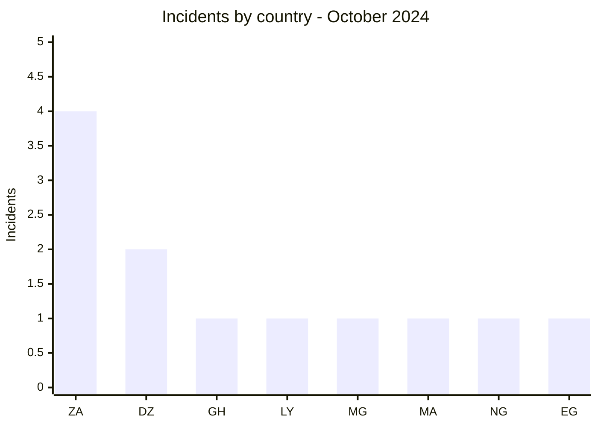
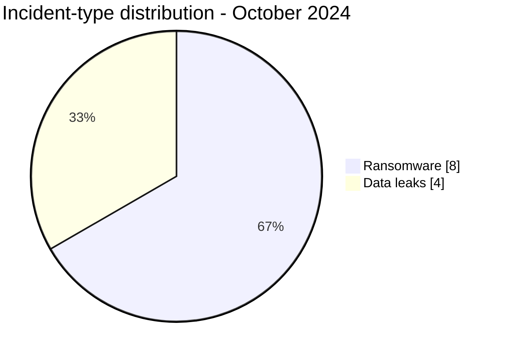

# AFRINTEL CTI Report - October 2024

👉🏾 [Version française](./README_FR.md)

## 1. Executive summary

October 2024 contains **12 incidents**: **8 ransomware claims** and **4 data leaks**. South Africa ranks first with four publications and Algeria records two. North Africa accounts for five incidents, followed by Southern Africa with four.

The corpus combines a notable volume of education incidents with publications affecting energy, government, and industry. National Edging is the best-supported case in AFRINTEL's monthly data, while the University of Antananarivo publication remained inaccessible behind a forum credit system. This evidentiary difference must remain visible.

See [victims.md](./victims.md).

## 2. Methodology

This report covers publications assigned to October 2024. Paywalled or locked material is not purchased, and its existence does not increase confidence. Reposts, such as the Algerian Ministry of Education case, are kept separate from a new intrusion.

Statistics derive from the **12 incidents** in [victims.md](./victims.md), synchronized with [victims_FR.md](./victims_FR.md).

## 3. Global overview

| Indicator | Value |
|---|---:|
| Incidents / Countries | **12 / 8** |
| Ransomware | **8** |
| Data leaks | **4** |
| Access sales / Defacement | **0 / 0** |

### Country ranking

| Country | Total | Ransomware | Data leak |
|---|---:|---:|---:|
| 🇿🇦 South Africa | 4 | 4 | 0 |
| 🇩🇿 Algeria | 2 | 1 | 1 |
| 🇬🇭 Ghana | 1 | 1 | 0 |
| 🇱🇾 Libya | 1 | 1 | 0 |
| 🇲🇬 Madagascar | 1 | 0 | 1 |
| 🇲🇦 Morocco | 1 | 0 | 1 |
| 🇳🇬 Nigeria | 1 | 0 | 1 |
| 🇪🇬 Egypt | 1 | 1 | 0 |
| **Total** | **12** | **8** | **4** |

### Regional distribution

| Region | Total | Ransomware | Data leak |
|---|---:|---:|---:|
| North Africa | 5 | 3 | 2 |
| Southern Africa | 4 | 4 | 0 |
| West Africa | 2 | 1 | 1 |
| Indian Ocean | 1 | 0 | 1 |
| **Total** | **12** | **8** | **4** |

### Normalized sector distribution

| Sector | Incidents | Share |
|---|---:|---:|
| Education / University | 4 | 33.3% |
| Technology / IT | 2 | 16.7% |
| Manufacturing / Industry | 2 | 16.7% |
| Healthcare / Medical | 1 | 8.3% |
| Oil & Energy | 1 | 8.3% |
| Government / Administration | 1 | 8.3% |
| Legal / Justice | 1 | 8.3% |
| **Total** | **12** | **100%** |

### Most visible actors

| Actor | Incidents |
|---|---:|
| KillSec | 2 |
| RansomHub | 2 |
| Sarcoma | 2 |
| Six other actors or sources | 1 each |

## 4. Detailed analysis by incident type

### 4.1 Ransomware

The eight publications include IT providers, a school, a mobility platform, two industrial suppliers, Volta River Authority, Libya's Ministry of Interior, and a law firm. Their presence in one month does not demonstrate a common attack chain. National Edging has more substantial evidence than the other cases.

### 4.2 Data leaks

The four leaks concern the University of Antananarivo, an unidentified healthcare provider in Nigeria, Algeria's Ministry of Education, and Al Massira university residences. The Madagascar case remains low-confidence because the content was inaccessible; the others contain visible samples or indicators of varying scope.

## 5. Sectoral impact

Education accounts for one third of the corpus across schools, universities, student accommodation, and national administration. Risks concern identities, academic records, and institutional accounts. Energy and Libya's interior ministry have high potential impact by function, even without public evidence of disruption.

## 6. Threat actor profile and risk assessment

| Scope | Level | Rationale |
|---|---|---|
| 🇿🇦 South Africa | 🔴 High | Four publications, including two industrial cases |
| 🇩🇿 Algeria | 🔴 High | Ransomware and an education-ministry leak |
| 🇬🇭 Ghana / 🇱🇾 Libya | 🔴 High | National energy and interior ministry |
| Other countries | 🟠 Medium | One leak per country, with varying evidence |

## 7. Key trends and intelligence gaps

- **Observed - high confidence:** education accounts for 4 of 12 incidents.
- **Observed - high confidence:** South Africa contains all industrial publications for the month.
- **Gap:** no public DFIR report was identified in the sources reviewed for the ransomware cases.
- **Gap:** University of Antananarivo content was inaccessible and cannot be qualified.
- **Collection need:** institution confirmation, repost chronology, and service status for VRA and Libya's interior ministry.

## 8. Contextual MITRE ATT&CK mapping

| Status | Technique | Use |
|---|---|---|
| Preventive | T1486 - Data Encrypted for Impact | Encryption detection; not confirmed |
| Preventive | T1567 - Exfiltration Over Web Service | Transfer monitoring; channels not observed |
| Assumption | T1078 - Valid Accounts | Risk to assess in education and government environments |

## 9. Recommendations

- **Education:** require phishing-resistant MFA and review student, staff, and administrator accounts.
- **Energy and government:** segment essential systems and test continuity plans.
- **Industry:** separate IT from production and control third-party access.
- **Healthcare:** identify the exact organization before notification or public communication.

## 10. SOC and tactical recommendations

| Qualification | Action |
|---|---|
| **Observed** | Monitor the cited organizations and domains; evidentiary depth varies significantly. |
| **Assumption** | Hunt for credential reuse, abnormal remote access, and database exports. |
| **Preventive** | Detect mass encryption, backup deletion, obfuscated PowerShell, and atypical outbound transfers. |

## 11. Strategic recommendations

| Priority | Qualification | Measure |
|---:|---|---|
| 1 | **Observed** | Prioritize education and public services represented in the corpus. |
| 2 | **Assumption** | Assess identity risks without presenting an access vector as established. |
| 3 | **Preventive** | Reduce external exposure and isolate critical backups. |

## 12. Conclusion

October combines a real education concentration with incidents supported by very different evidence. The report does not place a locked publication, a visible sample, and a ransomware claim without telemetry on the same footing. This evidence hierarchy is essential for sound prioritization.

**AFRINTEL - TLP:CLEAR**

[AFRINTEL repository](https://github.com/Hatchepsoute/AFRINTEL)
