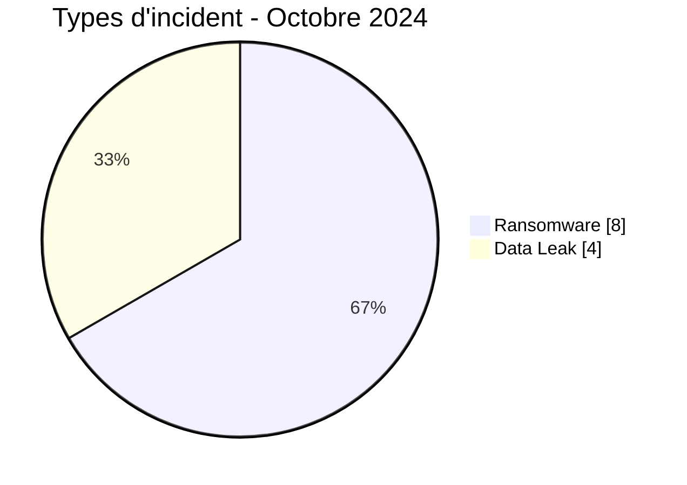
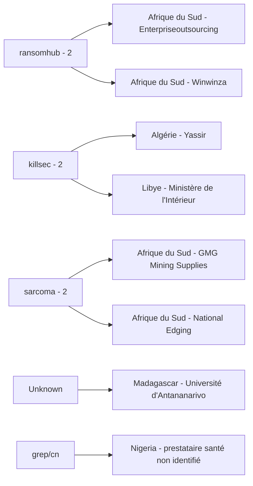
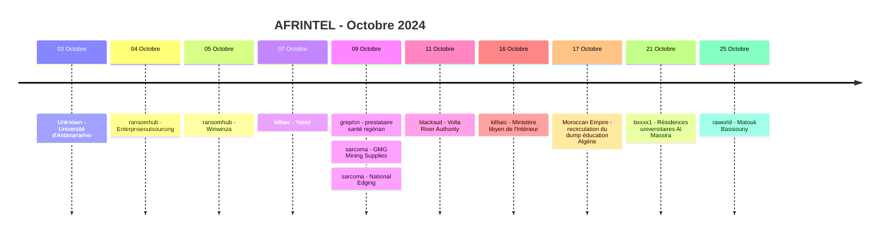

# Rapport CTI AFRINTEL - Octobre 2024

👉🏾 [English version](./README.md)

## 1. Résumé exécutif

Octobre 2024 contient **12 fiches incident documentées dans 8 pays africains** : **8 Ransomware** et **4 Data Leak**. Aucun Access Sale, DDoS, Defacement ou Operational Fraud n'est présent dans le corpus validé d'octobre.

L'Afrique du Sud compte quatre incidents, l'Algérie deux, et six autres pays une fiche chacun. L'Afrique du Nord représente cinq fiches et l'Afrique australe quatre. Education / University est le secteur harmonisé le plus représenté avec **4 fiches sur 12 (33,3 %)**.

Le mois se distingue moins par un acteur unique dominant que par une forte variation de la qualité des preuves. Sept entrées ransomware restent des revendications non vérifiées à faible confiance. National Edging, également listé comme ransomware, dispose d'un échantillon local examiné qui soutient fortement une compromission interne. Parmi les Data Leak, le cas santé nigérian, le Ministère algérien de l'Éducation Nationale et Al Massira disposent d'échantillons visibles, tandis que le contenu University of Antananarivo est resté inaccessible derrière le système de crédits du forum.

👉🏾 [Voir la liste complète des victimes](./victims_FR.md)

### 1.1 Comparaison avec le mois précédent

| Indicateur | Septembre 2024 | Octobre 2024 | Évolution |
|---|---:|---:|---:|
| Total incidents | 5 | **12** | **+7 (+140,0 %)** |
| Ransomware | 4 | **8** | **+4 (+100,0 %)** |
| Data Leak | 1 | **4** | **+3 (+300,0 %)** |
| Access Sale | 0 | **0** | Stable |
| DDoS | 0 | **0** | Stable |
| Defacement | 0 | **0** | Stable |
| Operational Fraud | 0 | **0** | Stable |

Le corpus observé d'octobre représente **2,4 fois celui de septembre**. La visibilité ransomware double et les Data Leak passent de un à quatre. Cette progression concerne le corpus documenté par AFRINTEL et ne prouve pas que le nombre réel de compromissions réussies en Afrique a progressé dans les mêmes proportions.

## 2. Méthodologie

- **Période :** 1er au 31 octobre 2024.
- **Source de vérité :** couple harmonisé `victims_FR.md` / `victims.md`.
- **Comptage :** une fiche harmonisée correspond à un incident documenté.
- **Taxonomie :** Ransomware, Data Leak, Access Sale, DDoS, Defacement, Operational Fraud.
- **Registre de corrections rétrospectives :** aucun des 10 incidents manquants identifiés en 2024 ne concerne octobre.
- **Contenu verrouillé :** AFRINTEL n'achète ni ne débloque les contenus payants de forums ; un contenu inaccessible n'augmente pas le niveau de confiance.
- **Séparation acteur/source :** les comptes de publication et de republication sont distingués des acteurs d'intrusion lorsque la source elle-même sépare ces rôles.
- **Republications :** la fiche du Ministère algérien de l'Éducation Nationale conserve la date de fuite revendiquée en 2022 et la chronologie des republications ultérieures au lieu de traiter octobre 2024 comme une nouvelle date d'intrusion.

## 3. Vue globale

### 3.1 Répartition par type d'incident

| Type d'incident | Fiches | Part |
|---|---:|---:|
| Ransomware | **8** | **66,7 %** |
| Data Leak | **4** | **33,3 %** |
| Access Sale | 0 | 0,0 % |
| DDoS | 0 | 0,0 % |
| Defacement | 0 | 0,0 % |
| Operational Fraud | 0 | 0,0 % |
| **Total** | **12** | **100 %** |

### 3.2 Répartition par pays

| Pays | Ransomware | Data Leak | Total |
|---|---:|---:|---:|
| 🇿🇦 Afrique du Sud | 4 | 0 | **4** |
| 🇩🇿 Algérie | 1 | 1 | **2** |
| 🇬🇭 Ghana | 1 | 0 | 1 |
| 🇱🇾 Libye | 1 | 0 | 1 |
| 🇲🇬 Madagascar | 0 | 1 | 1 |
| 🇲🇦 Maroc | 0 | 1 | 1 |
| 🇳🇬 Nigeria | 0 | 1 | 1 |
| 🇪🇬 Égypte | 1 | 0 | 1 |
| **Total** | **8** | **4** | **12** |

### 3.3 Répartition régionale

| Région | Ransomware | Data Leak | Total |
|---|---:|---:|---:|
| Afrique du Nord | 3 | 2 | **5** |
| Afrique australe | 4 | 0 | **4** |
| Afrique de l'Ouest | 1 | 1 | **2** |
| Océan Indien | 0 | 1 | **1** |
| **Total** | **8** | **4** | **12** |

### 3.4 Répartition sectorielle harmonisée

| Secteur | Fiches | Part |
|---|---:|---:|
| Education / University | **4** | **33,3 %** |
| Technology / IT | 2 | 16,7 % |
| Manufacturing / Industry | 2 | 16,7 % |
| Healthcare / Medical | 1 | 8,3 % |
| Energy / Utilities | 1 | 8,3 % |
| Government / Administration | 1 | 8,3 % |
| Legal / Justice | 1 | 8,3 % |
| **Total** | **12** | **100 %** |

### 3.5 Acteurs / groupes

| Acteur / Groupe | Fiches |
|---|---:|
| ransomhub | **2** |
| killsec | **2** |
| sarcoma | **2** |
| Unknown | 1 |
| grep/cn | 1 |
| blacksuit | 1 |
| Moroccan Empire | 1 |
| bxxxx1 | 1 |
| raworld | 1 |
| **Total** | **12** |

> `Unknown` correspond à l'Université d'Antananarivo. `RainbowBF` est conservé comme contexte de source car les éléments fournis l'identifient comme le compte du forum ayant publié la revendication verrouillée. Pour le dossier santé nigérian, `Tanaka` reste le compte de publication tandis que le post attribue la fuite à `grep/cn`.

## 4. Analyse détaillée

### 4.1 Ransomware - 8 fiches

Les fiches ransomware concernent **Enterpriseoutsourcing**, **Winwinza**, **Yassir**, **GMG Mining Supplies**, **National Edging**, **Volta River Authority**, le **Ministère libyen de l'Intérieur** et **Matouk Bassiouny**.

Sept conservent le statut `Claim - Unverified` avec un niveau de confiance `Low`. Le corpus fourni ne contient aucun élément DFIR public permettant de confirmer pour ces sept dossiers un chiffrement, une perturbation opérationnelle, l'étendue d'une exfiltration ou une chaîne d'attaque commune.

**National Edging** constitue l'exception en matière de maturité de preuve. AFRINTEL a examiné un échantillon local comprenant plusieurs documents d'identité complets, du matériel contractuel signé, de la documentation de voyage d'entreprise et des dossiers logistiques directement rattachés au domaine et à l'identité de l'organisation. Ces éléments soutiennent un niveau `Very High` quant à l'existence d'une compromission interne réelle. Ils n'établissent cependant pas, à eux seuls, le chiffrement ransomware, l'accès initial ou le volume complet d'exfiltration.

La présence de deux publications `ransomhub`, deux `killsec` et deux `sarcoma` est observable, mais le matériel disponible ne démontre ni infrastructure partagée, ni vecteur d'accès commun, ni campagne coordonnée.

### 4.2 Data Leak - 4 fiches

**Université d'Antananarivo :** la publication du forum était visible, mais le contenu sous-jacent relatif à l'accès à la base est resté verrouillé derrière le système de crédits. Aucun export de base ni échantillon d'enregistrements n'a été examiné ; la revendication reste donc non vérifiée à faible confiance.

**Prestataire de santé nigérian non identifié :** la publication annonce environ **130 000 dossiers patients**, alors que le classeur local fourni contient **84 lignes de données**. L'échantillon soutient une revendication d'exposition de données de santé, mais ne permet pas d'établir le volume annoncé, l'identité du prestataire, l'ensemble des établissements concernés, la méthode d'acquisition ou l'exhaustivité.

**Ministère algérien de l'Éducation Nationale :** le post d'octobre republie du matériel attribué à `Moroccan Empire` et lié à une fuite revendiquée au **6 octobre 2022**, le dump étant également référencé comme partagé en septembre 2023. La structure SQL/CSV visible contient des champs d'identité, de scolarité et de comptes. L'analyse source soutient explicitement un niveau `High` concernant l'authenticité d'un accès à une base du ministère ou d'un établissement affilié, tandis que le total revendiqué d'environ **90 000 élèves** reste non vérifié au-delà de l'échantillon observé.

**Résidences universitaires Al Massira :** l'échantillon visible contient des adresses e-mail associées à des demandes ou recherches de logement. Aucun mot de passe, numéro d'identité, numéro de téléphone, document étudiant ou donnée financière n'est visible. L'acteur affirme un accès au panneau de contrôle, mais la capture ne permet pas d'établir la méthode technique ni un nombre total d'enregistrements.

## 5. Principaux constats et lacunes

- Octobre passe de **5 à 12 fiches**, mais croissance des publications et croissance des compromissions confirmées doivent rester distinctes.
- Education / University représente **4 fiches sur 12 (33,3 %)**, la concentration sectorielle la plus nette du mois.
- L'Afrique du Sud compte **4 publications ransomware**, dont National Edging, dossier de compromission le mieux étayé du mois.
- Sept des huit dossiers ransomware restent des revendications à faible confiance.
- Trois Data Leak comportent des échantillons visibles ; Antananarivo reste inaccessible et à faible confiance.
- Le jeu de données santé nigérian ne confirme localement que 84 lignes examinées, et non les quelque 130 000 annoncées.
- Le dataset algérien de l'éducation correspond à une recirculation prolongée associée par la source à une fuite plus ancienne de 2022.
- Les éléments DFIR publics restent insuffisants pour établir un mode opératoire ransomware commun au mois.

## 6. Cartographie MITRE ATT&CK contextuelle

| Statut | Technique | Application |
|---|---|---|
| Préventif | T1486 - Data Encrypted for Impact | Pertinent pour la surveillance ransomware ; chiffrement non confirmé pour les listings d'octobre. |
| Contextuel | T1213 - Data from Information Repositories | Pertinent pour les jeux de données structurés éducation et santé visibles dans les Data Leak. |
| Préventif | T1567 - Exfiltration Over Web Service | Pertinent pour la surveillance des sorties ; canaux d'exfiltration non établis dans les preuves fournies. |
| Conditionnel | T1078 - Valid Accounts | Pertinent pour les éléments de comptes exposés ou revendiqués, sans être présenté comme mécanisme d'accès initial sans preuve technique. |

## 7. Recommandations

- Prioriser les contrôles d'identité du secteur éducatif, la MFA résistante au phishing et la revue des comptes administrateurs, personnels et étudiants.
- Pour National Edging, traiter l'exposition documentaire interne comme indicateur de compromission à haute confiance tout en la séparant des mécanismes ransomware non confirmés.
- Pour le cas santé nigérian, identifier le prestataire exact et les établissements touchés avant toute communication de périmètre.
- Pour les anciens dumps éducatifs, vérifier si les identifiants exposés sont encore actifs et surveiller la recirculation sans la présenter comme une nouvelle intrusion.
- Pour les secteurs énergie, administration et industrie, préserver les journaux d'authentification, endpoints, accès distants et sauvegardes autour des dates de revendication.

## 8. Chronologie

## 9. Conclusion

Octobre 2024 se clôt sur **12 fiches incident documentées dans 8 pays africains**, réparties entre **8 Ransomware et 4 Data Leak**. Par rapport à septembre, le corpus AFRINTEL passe de 5 à 12 fiches, soit une hausse de **140,0 %**. Les publications Ransomware doublent de 4 à 8, tandis que les Data Leak passent de 1 à 4.

Cette progression est importante au niveau de la collecte, mais les preuves du mois ne permettent pas de l'interpréter comme une hausse de 140 % des compromissions cyber réussies en Afrique. Octobre combine des dossiers disposant de niveaux de preuve très différents : sept revendications ransomware à faible confiance, une organisation listée par un groupe ransomware avec un échantillon interne particulièrement convaincant, trois Data Leak accompagnés d'éléments visibles et une revendication d'accès à une base dont le contenu n'a pas pu être examiné.

L'éducation constitue la caractéristique structurelle la plus nette du mois avec **un tiers du corpus**. Pourtant, même dans ce secteur, les profils de preuve diffèrent fortement. L'Université d'Antananarivo reste une revendication inaccessible ; Winwinza est une publication ransomware non vérifiée ; Al Massira ne montre que des adresses e-mail dans l'échantillon visible ; et le cas du Ministère algérien de l'Éducation Nationale concerne un jeu de données plus ancien dont la recirculation se poursuit en 2024. Présenter ces quatre dossiers comme quatre "nouvelles violations" équivalentes supprimerait des différences essentielles de chronologie et de maturité de preuve.

National Edging représente le signal de compromission le plus solide d'octobre. Les documents examinés rattachent avec un niveau `Very High` des éléments internes d'identité, contractuels, de voyage et de logistique à l'organisation. Cela soutient l'existence d'une compromission interne réelle, mais pas toutes les composantes de la narration ransomware associée : le chiffrement, l'accès initial et le volume complet d'exfiltration restent non établis. Cette distinction est essentielle pour séparer le niveau de confiance dans la compromission de l'étiquette du groupe malveillant.

Le dossier santé nigérian fournit un autre exemple de contrôle rigoureux du périmètre. Une publication annonce environ 130 000 dossiers patients, alors que le classeur examiné localement ne comporte que 84 lignes. AFRINTEL peut donc documenter les catégories de champs et l'exposition représentée par l'échantillon sans transformer le volume annoncé en chiffre confirmé.

L'évaluation CTI la plus défendable est qu'octobre reflète **une visibilité de publication plus forte, une concentration réelle autour de l'éducation et une maturité de preuve particulièrement hétérogène**. Le suivi doit prioriser les confirmations victimes, l'identification du prestataire de santé nigérian, la surveillance continue du dataset éducatif algérien ancien et la validation technique des revendications ransomware. Maintenir cette hiérarchie de preuve évite de placer au même niveau publications verrouillées, échantillons visibles, recirculation historique et indicateurs de compromission fortement étayés.

**AFRINTEL** - TLP:CLEAR
