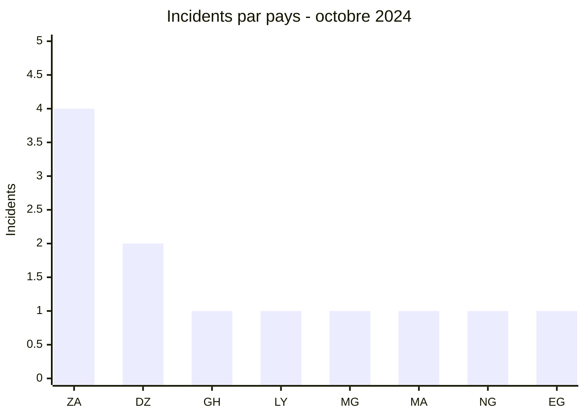
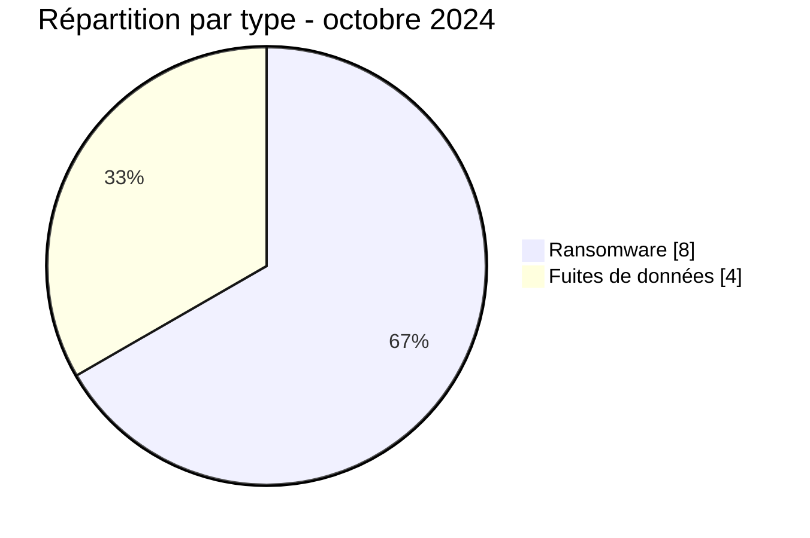

# Rapport CTI AFRINTEL - Octobre 2024

👉🏾 [English version](./README.md)

## 1. Résumé exécutif

Octobre 2024 compte **12 incidents** : **8 revendications ransomware** et **4 fuites de données**. L’Afrique du Sud arrive en tête avec quatre publications ; l’Algérie en compte deux. L’Afrique du Nord représente cinq incidents, devant l’Afrique australe avec quatre.

Le corpus associe un volume notable d’incidents éducatifs à des publications touchant l’énergie, l’administration et l’industrie. National Edging est le cas le mieux étayé du mois dans les données AFRINTEL, tandis que la publication University of Antananarivo est restée inaccessible derrière le système de crédits du forum. Cette différence de preuve doit rester visible dans l’analyse.

Voir [victims_FR.md](./victims_FR.md).

## 2. Méthodologie

Le rapport couvre les publications classées en octobre 2024. Les contenus payants ou verrouillés ne sont pas achetés et leur existence ne relève pas le niveau de confiance. Les republications, comme celle du ministère algérien de l’Éducation, sont distinguées d’une intrusion nouvelle.

Les statistiques dérivent des **12 incidents** de [victims_FR.md](./victims_FR.md), synchronisés avec [victims.md](./victims.md).

## 3. Vue globale

| Indicateur | Valeur |
|---|---:|
| Incidents / Pays | **12 / 8** |
| Ransomware | **8** |
| Fuites de données | **4** |
| Ventes d’accès / Défacement | **0 / 0** |

### Classement par pays

| Pays | Total | Ransomware | Fuite |
|---|---:|---:|---:|
| 🇿🇦 Afrique du Sud | 4 | 4 | 0 |
| 🇩🇿 Algérie | 2 | 1 | 1 |
| 🇬🇭 Ghana | 1 | 1 | 0 |
| 🇱🇾 Libye | 1 | 1 | 0 |
| 🇲🇬 Madagascar | 1 | 0 | 1 |
| 🇲🇦 Maroc | 1 | 0 | 1 |
| 🇳🇬 Nigeria | 1 | 0 | 1 |
| 🇪🇬 Égypte | 1 | 1 | 0 |
| **Total** | **12** | **8** | **4** |

### Répartition régionale

| Région | Total | Ransomware | Fuite |
|---|---:|---:|---:|
| Afrique du Nord | 5 | 3 | 2 |
| Afrique australe | 4 | 4 | 0 |
| Afrique de l’Ouest | 2 | 1 | 1 |
| Océan Indien | 1 | 0 | 1 |
| **Total** | **12** | **8** | **4** |

### Répartition sectorielle normalisée

| Secteur | Incidents | Part |
|---|---:|---:|
| Éducation / Université | 4 | 33,3 % |
| Technologies / Informatique | 2 | 16,7 % |
| Industrie / Fabrication | 2 | 16,7 % |
| Santé / Médical | 1 | 8,3 % |
| Pétrole / Énergie | 1 | 8,3 % |
| Gouvernement / Administration | 1 | 8,3 % |
| Juridique / Justice | 1 | 8,3 % |
| **Total** | **12** | **100 %** |

### Acteurs les plus visibles

| Acteur | Incidents |
|---|---:|
| KillSec | 2 |
| RansomHub | 2 |
| Sarcoma | 2 |
| Six autres acteurs ou sources | 1 chacun |

## 4. Analyse détaillée par type d’incident

### 4.1 Ransomware

Les huit publications incluent des prestataires IT, une école, une plateforme de mobilité, deux fournisseurs industriels, la Volta River Authority, le ministère libyen de l’Intérieur et un cabinet juridique. Leur présence le même mois ne démontre pas de chaîne d’attaque commune. National Edging dispose d’éléments plus substantiels que les autres cas.

### 4.2 Fuites de données

Les quatre fuites concernent l’Université d’Antananarivo, un prestataire médical non identifié au Nigeria, le ministère algérien de l’Éducation et les résidences universitaires Al Massira. Le cas malgache reste de faible confiance faute d’accès au contenu ; les autres présentent des échantillons ou éléments visibles de portée variable.

## 5. Impact sectoriel

L’éducation représente un tiers du corpus et combine écoles, universités, hébergement étudiant et administration nationale. Les risques portent sur les identités, dossiers scolaires et comptes institutionnels. L’énergie et l’intérieur libyen présentent un impact potentiel élevé par fonction, même sans preuve publique d’interruption.

## 6. Profil des acteurs et évaluation du risque

| Périmètre | Niveau | Justification |
|---|---|---|
| 🇿🇦 Afrique du Sud | 🔴 Élevé | Quatre publications, dont deux industrielles |
| 🇩🇿 Algérie | 🔴 Élevé | Ransomware et fuite visant l’éducation nationale |
| 🇬🇭 Ghana / 🇱🇾 Libye | 🔴 Élevé | Énergie nationale et ministère de l’Intérieur |
| Autres pays | 🟠 Moyen | Une fuite par pays, preuve variable |

## 7. Tendances et lacunes de renseignement

- **Observé - confiance élevée :** l’éducation représente 4 incidents sur 12.
- **Observé - confiance élevée :** l’Afrique du Sud concentre toutes les publications industrielles du mois.
- **Lacune :** aucun rapport DFIR public n’a été identifié dans les sources consultées pour les cas ransomware.
- **Lacune :** le contenu University of Antananarivo était inaccessible et ne peut pas être qualifié.
- **Collecte attendue :** confirmation des établissements, chronologie des republications et état des services VRA et ministère libyen.

## 8. Cartographie MITRE ATT&CK contextuelle

| Statut | Technique | Utilisation |
|---|---|---|
| Préventif | T1486 - Data Encrypted for Impact | Détection du chiffrement ; non confirmé |
| Préventif | T1567 - Exfiltration Over Web Service | Contrôle des transferts ; canaux non observés |
| Hypothèse | T1078 - Valid Accounts | Risque à examiner pour les environnements éducatifs et publics |

## 9. Recommandations

- **Éducation :** imposer MFA résistante au phishing et revoir les comptes étudiants, personnels et administrateurs.
- **Énergie et administration :** segmenter les systèmes essentiels et tester les plans de continuité.
- **Industrie :** séparer IT et production, puis contrôler les accès prestataires.
- **Santé :** vérifier l’identité exacte de l’organisation avant notification ou communication.

## 10. Recommandations SOC et tactiques

| Qualification | Action |
|---|---|
| **Observé** | Surveiller les organisations et domaines cités ; la profondeur de preuve varie fortement. |
| **Hypothèse** | Rechercher réutilisation d’identifiants, accès distants anormaux et exports de bases. |
| **Préventif** | Détecter chiffrement massif, suppression de sauvegardes, scripts PowerShell obfusqués et transferts sortants atypiques. |

## 11. Recommandations stratégiques

| Priorité | Qualification | Mesure |
|---:|---|---|
| 1 | **Observé** | Prioriser l’éducation et les services publics présents dans le corpus. |
| 2 | **Hypothèse** | Vérifier les risques d’identité sans présenter un vecteur d’accès comme établi. |
| 3 | **Préventif** | Réduire la surface externe et isoler les sauvegardes critiques. |

## 12. Conclusion

Octobre associe une concentration éducative réelle à des incidents de portée très différente. Le rapport ne met pas sur le même plan une publication verrouillée, un échantillon visible et une revendication ransomware sans télémétrie. Cette hiérarchie de preuve est indispensable pour prioriser correctement la réponse.

**AFRINTEL - TLP:CLEAR**

[Dépôt AFRINTEL](https://github.com/Hatchepsoute/AFRINTEL)
