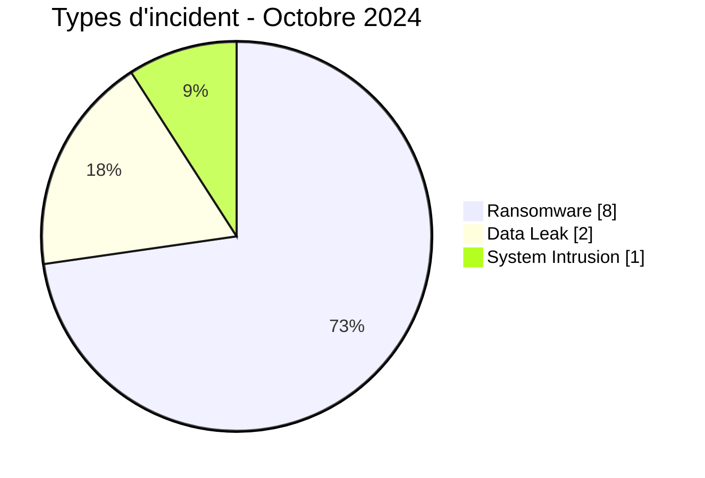

# Rapport CTI AFRINTEL - Cybermenaces en Afrique - Octobre 2024

👉🏾 [English version](./README.md)

## 1. Synthèse exécutive

En Octobre 2024, AFRINTEL retient **11 cyberincidents canoniques dans 8 pays**. Le mois est dominé par **Ransomware (8, 72,7 %)** puis **Data Leak (2, 18,2 %)**. Les pays les plus représentés sont **Afrique du Sud (4)**, **Madagascar (1)**, **Algérie (1)**. Les secteurs les plus visibles sont **Éducation / Université (3)**, **Technologie / IT (2)**, **Industrie / Fabrication (2)**. Les labels acteur/groupe les plus fréquents sont `ransomhub` (2), `killsec` (2), `sarcoma` (2). `Unknown` désigne une absence d'attribution, pas un groupe.

La maturité de preuve est répartie entre **Claim - Unverified: 8**, **Claim - Data Sample Published: 3**. Les claims ne sont pas convertis en confirmations sans preuve supplémentaire.

### 1.1 Étude comparative avec le mois précédent

| Indicateur | Septembre 2024 | Octobre 2024 | Évolution |
|---|---|---|---|
| Total | 6 | 11 | +5 (+83,3 %) |
| Ransomware | 5 | 8 | +3 (+60,0 %) |
| Data Leak | 0 | 2 | +2 (nouveau) |
| Access Sale | 0 | 0 | Stable |
| DDoS | 0 | 0 | Stable |
| Defacement | 0 | 0 | Stable |
| Account Takeover | 0 | 0 | Stable |
| System Intrusion | 1 | 1 | Stable |
| Malware | 0 | 0 | Stable |
| Operational Fraud | 0 | 0 | Stable |

### 1.2 Analyse comparative

Le volume mensuel **augmente de 5 incident(s)**. Les variations structurantes sont : Ransomware 5->8 (+3), Data Leak 0->2 (+2). Cette variation décrit le corpus documenté, pas nécessairement une variation équivalente du nombre réel de compromissions sur le continent.

## 2. Méthodologie

- Un incident canonique correspond à un événement retenu dans le millésime 2024.
- Les découvertes/republications historiques sont conservées séparément et ne gonflent pas les statistiques 2024.
- La date d'incident ou la meilleure fenêtre soutenue prime ; la date de découverte AFRINTEL reste distincte.
- Les 9 types AFRINTEL sont utilisés ; une tentative est représentée par le statut, jamais par un type `Attempted Attack`.
- Un DDoS coordonné est compté par campagne.
- Type, statut, confiance, impact, attribution et source restent distincts.

## 3. Répartition par type d'incident

| Type | Fiches | Part |
|---|---|---|
| Ransomware | 8 | 72,7 % |
| Data Leak | 2 | 18,2 % |
| Access Sale | 0 | 0,0 % |
| DDoS | 0 | 0,0 % |
| Defacement | 0 | 0,0 % |
| Account Takeover | 0 | 0,0 % |
| System Intrusion | 1 | 9,1 % |
| Malware | 0 | 0,0 % |
| Operational Fraud | 0 | 0,0 % |

## 4. Pays x type

| Pays | Total | Ransomware | Data Leak | Access Sale | DDoS | Defacement | Account Takeover | System Intrusion | Malware | Operational Fraud |
|---|---|---|---|---|---|---|---|---|---|---|
| Afrique du Sud | 4 | 4 | 0 | 0 | 0 | 0 | 0 | 0 | 0 | 0 |
| Madagascar | 1 | 0 | 0 | 0 | 0 | 0 | 0 | 1 | 0 | 0 |
| Algérie | 1 | 1 | 0 | 0 | 0 | 0 | 0 | 0 | 0 | 0 |
| Nigeria | 1 | 0 | 1 | 0 | 0 | 0 | 0 | 0 | 0 | 0 |
| Ghana | 1 | 1 | 0 | 0 | 0 | 0 | 0 | 0 | 0 | 0 |
| Libye | 1 | 1 | 0 | 0 | 0 | 0 | 0 | 0 | 0 | 0 |
| Maroc | 1 | 0 | 1 | 0 | 0 | 0 | 0 | 0 | 0 | 0 |
| Égypte | 1 | 1 | 0 | 0 | 0 | 0 | 0 | 0 | 0 | 0 |

## 5. Répartition régionale

| Région | Fiches | Part |
|---|---|---|
| Afrique australe | 4 | 36,4 % |
| Afrique du Nord | 4 | 36,4 % |
| Afrique de l'Ouest | 2 | 18,2 % |
| Océan Indien | 1 | 9,1 % |

## 6. Répartition sectorielle

| Secteur | Fiches | Part |
|---|---|---|
| Éducation / Université | 3 | 27,3 % |
| Technologie / IT | 2 | 18,2 % |
| Industrie / Fabrication | 2 | 18,2 % |
| Santé / Médical | 1 | 9,1 % |
| Énergie / Services publics | 1 | 9,1 % |
| Gouvernement / Administration | 1 | 9,1 % |
| Juridique / Justice | 1 | 9,1 % |

## 7. Acteurs / groupes

| Acteur / Groupe | Fiches | Part |
|---|---|---|
| ransomhub | 2 | 18,2 % |
| killsec | 2 | 18,2 % |
| sarcoma | 2 | 18,2 % |
| Unknown | 1 | 9,1 % |
| grep/cn | 1 | 9,1 % |
| blacksuit | 1 | 9,1 % |
| bxxxx1 | 1 | 9,1 % |
| raworld | 1 | 9,1 % |

## 8. Maturité des preuves

| Position de preuve | Fiches | Part |
|---|---|---|
| Claim - Unverified | 8 | 72,7 % |
| Claim - Data Sample Published | 3 | 27,3 % |

### Confiance

| Confiance | Fiches | Part |
|---|---|---|
| Low | 8 | 72,7 % |
| Medium | 2 | 18,2 % |
| Very High | 1 | 9,1 % |

## 9. Chronologie

```mermaid
timeline
    title AFRINTEL - Octobre 2024
    3 Octobre 2024 : Université d'Antananarivo (univ-antananarivo.mg)
- **Type d'incident -** System Intrusion
- **Note de taxonomie -** La publication observée revendique un accès à une base de données, mais le contenu est verrouillé et aucun échantillon n'était accessible. `System Intrusion` est retenu comme claim d'accès non autorisé ; aucune fuite de données n'est confirmée.
- **Acteur / Groupe -** Unknown
- **Contexte source -** RainbowBF est le compte du forum affiché comme ayant publié la revendication d'accès à une base verrouillée.
- **Secteur -** Education / University
- **Site web -** [univ-antananarivo.mg](https -//www.univ-antananarivo.mg)
- **Statut -** Claim - Unverified
- **Niveau de confiance -** Low
- **Niveau d'impact -** Level 3
- **Description victime -** L'Université d'Antananarivo est la plus ancienne et la plus grande université publique de Madagascar, regroupant plusieurs facultés et instituts d'enseignement supérieur dans la région de la capitale.
- **Analyse  -** AFRINTEL a examiné une publication sur la plateforme Breached, postée par le compte RainbowBF le 3 octobre 2024, intitulée « Madagascar univ-antananarivo.mg Database Access » et classée sous la catégorie de contenu « Breached » de la plateforme. Le contenu sous-jacent est verrouillé derrière le système de crédits internes du forum et n'a pas été débloqué par AFRINTEL ; aucun export de base de données, capture d'écran d'enregistrements ni autre échantillon vérifiable n'était accessible lors de la collecte. AFRINTEL traite ceci comme une revendication non confirmée d'accès à une base de données et ne confirme ni l'existence, ni le périmètre, ni l'authenticité d'une quelconque donnée sous-jacente. Les catégories de données potentiellement concernées et l'impact ne peuvent actuellement pas être évalués car le contenu sous-jacent n'était pas accessible. AFRINTEL ne reproduit aucun contenu de la publication au-delà de son titre et de ses métadonnées.

----------------------------
    4 Octobre 2024 : Enterpriseoutsourcing
- **Acteur / Groupe -** ransomhub
- **Secteur -** Technology / IT
- **Site web -** [enterpriseoutsourcing.com](https -//www.enterpriseoutsourcing.com)
- **Statut -** Claim - Unverified
- **Type d'incident -** Ransomware
- **Niveau de confiance -** Low
- **Niveau d'impact -** Level 2
- **Description victime -** Enterpriseoutsourcing est une organisation sud-africaine opérant dans le secteur du conseil en technologies de l'information.

----------------------------

- **Note de fiabilité -** La fiche documente une publication ransomware, mais le matériel fourni ne contient ni échantillon technique ni rapport DFIR public permettant de confirmer le chiffrement, l'exfiltration ou une perturbation opérationnelle.
    5 Octobre 2024 : Winwinza
- **Acteur / Groupe -** ransomhub
- **Secteur -** Education / University
- **Site web -** [winwinza.com](https -//www.winwinza.com)
- **Statut -** Claim - Unverified
- **Type d'incident -** Ransomware
- **Niveau de confiance -** Low
- **Niveau d'impact -** Level 3
- **Description victime -** Winwinza est une organisation sud-africaine opérant dans le secteur de l'éducation.

----------------------------

- **Note de fiabilité -** La fiche documente une publication ransomware, mais le matériel fourni ne contient ni échantillon technique ni rapport DFIR public permettant de confirmer le chiffrement, l'exfiltration ou une perturbation opérationnelle.
    7 Octobre 2024 : Yassir
- **Acteur / Groupe -** killsec
- **Secteur -** Technology / IT
- **Site web -** [yassir.com](https -//www.yassir.com)
- **Statut -** Claim - Unverified
- **Type d'incident -** Ransomware
- **Niveau de confiance -** Low
- **Niveau d'impact -** Level 2
- **Description victime -** Yassir est une super-app algérienne fournissant des services de VTC, livraison, courses et services numériques en Algérie et sur des marchés régionaux.

----------------------------

- **Note de fiabilité -** La fiche documente une publication ransomware, mais le matériel fourni ne contient ni échantillon technique ni rapport DFIR public permettant de confirmer le chiffrement, l'exfiltration ou une perturbation opérationnelle.
    9 Octobre 2024 : Prestataire non identifié d’établissements de santé
- **Acteur / Groupe -** grep/cn
- **Contexte source -** La publication du 9 octobre a été postée par Tanaka et attribue la fuite à grep/cn.
- **Secteur -** Healthcare / Medical
- **Site web -** Non identifié
- **Statut -** Claim - Data Sample Published
- **Niveau de confiance -** Medium
- **Niveau d'impact -** Level 3
- **Type d'incident -** Data Leak
- **Description victime -** La source décrit un prestataire nigérian non identifié opérant plusieurs établissements de santé. Le nom de l’organisation et les établissements concernés n’ont pas pu être établis à partir des éléments disponibles.
- **Analyse  -** Une publication du forum attribuée à Tanaka et datée du 9 octobre 2024 affirme qu’environ 130 000 dossiers de patients provenant de plusieurs établissements de santé nigérians ont été divulgués par l’acteur grep/cn. Le classeur local fourni pour analyse contient 84 lignes de données, et non 129 825 ou 130 000 lignes ; le volume annoncé ne peut donc pas être confirmé indépendamment à partir du fichier disponible. Le classeur contient des champs relatifs à des patients, notamment des noms, identifiants, numéros de téléphone, âge, dates de naissance, sexe, statut matrimonial et identifiants liés aux établissements ; les enregistrements bruts n’ont pas été reproduits. Les éléments soutiennent une revendication d’exposition de données de santé à fort impact potentiel, mais le prestataire exact, le périmètre des établissements, le mode d’obtention, l’exhaustivité et le volume total restent inconnus.
    9 Octobre 2024 : GMG Mining Supplies
- **Acteur / Groupe -** sarcoma
- **Secteur -** Manufacturing / Industry
- **Site web -** [gmgminingsupplies.com](https -//www.gmgminingsupplies.com)
- **Statut -** Claim - Unverified
- **Type d'incident -** Ransomware
- **Niveau de confiance -** Low
- **Niveau d'impact -** Level 2
- **Description victime -** GMG Mining Machines and Supplies est une entreprise sud-africaine spécialisée dans la fourniture, reconstruction et location d'équipements miniers, machines mobiles sans rail, pièces et services associés.

----------------------------

- **Note de fiabilité -** La fiche documente une publication ransomware, mais le matériel fourni ne contient ni échantillon technique ni rapport DFIR public permettant de confirmer le chiffrement, l'exfiltration ou une perturbation opérationnelle.
    9 Octobre 2024 : National Edging
- **Acteur / Groupe -** sarcoma
- **Secteur -** Manufacturing / Industry
- **Site web -** [nationaledging.com](https -//www.nationaledging.com)
- **Statut -** Claim - Data Sample Published
- **Type d'incident -** Ransomware
- **Niveau de confiance -** Very High
- **Niveau d'impact -** Level 3
- **Description victime -** National Edging est une entreprise sud-africaine spécialisée dans la fourniture de chants, adhésifs, matériaux de finition et composants industriels pour les secteurs du meuble, de la cuisine et de l'agencement.
- **Analyse  -** AFRINTEL a examiné un échantillon local de documents cohérents avec la revendication du cybercriminel sarcoma, comprenant des scans complets de passeports d'au moins trois personnes (deux ressortissants sud-africains et un ressortissant indien titulaire d'un permis de résidence aux Émirats arabes unis), un contrat signé avec Freitan Group of Companies (Pty) Ltd portant la signature d'un directeur financier, un formulaire de réservation de voyage d'entreprise référençant l'entité juridique National Converting Agencies (Pty) Ltd, une adresse email au domaine nationaledging.co.za ainsi qu'un passeport et un numéro d'identité sud-africains, et un bon de livraison documentant un envoi de produits de chant et de colle entre succursales de l'entreprise (Gauteng) avec une collecte ultérieure référencée au Zimbabwe. La référence directe au domaine nationaledging.co.za, associée à une identité d'entreprise cohérente (National Converting Agencies/National Edging), à du matériel contractuel signé et à plusieurs documents d'identité complets, soutient une évaluation à très haute confiance d'une compromission interne réelle. L'exposition de données complètes de passeport et d'identité nationale pour plusieurs personnes, ainsi que de contrats signés et de dossiers logistiques s'étendant à une chaîne d'approvisionnement transfrontalière (Zimbabwe), crée un risque important de fraude à l'identité, de falsification de documents et d'ingénierie sociale ciblée contre les employés, partenaires commerciaux et voyageurs associés à l'entreprise. AFRINTEL ne reproduit aucun nom, numéro de passeport, numéro d'identité, date de naissance ni coordonnée issus de l'échantillon examiné.

----------------------------

- **Note de fiabilité -** La fiche documente une publication ransomware, mais le matériel fourni ne contient ni échantillon technique ni rapport DFIR public permettant de confirmer le chiffrement, l'exfiltration ou une perturbation opérationnelle.
- **Qualification de la preuve -** L'échantillon examiné soutient fortement une compromission de données internes associée à National Edging. Il n'établit pas indépendamment un chiffrement ransomware, la méthode d'accès initiale ni le volume complet d'exfiltration.
    11 Octobre 2024 : Volta River Authority (VRA)
- **Acteur / Groupe -** blacksuit
- **Secteur -** Energy / Utilities
- **Site web -** [vra.com](https -//www.vra.com)
- **Statut -** Claim - Unverified
- **Type d'incident -** Ransomware
- **Niveau de confiance -** Low
- **Niveau d'impact -** Level 3
- **Description victime -** La Volta River Authority (VRA) est le principal producteur public d'électricité du Ghana, responsable de centrales hydroélectriques, thermiques et d'infrastructures énergétiques stratégiques du pays.

----------------------------

- **Note de fiabilité -** La fiche documente une publication ransomware, mais le matériel fourni ne contient ni échantillon technique ni rapport DFIR public permettant de confirmer le chiffrement, l'exfiltration ou une perturbation opérationnelle.
    16 Octobre 2024 : Ministère de l'Intérieur (moi.gov.ly)
- **Acteur / Groupe -** killsec
- **Secteur -** Government / Administration
- **Site web -** [moi.gov.ly](https -//www.moi.gov.ly)
- **Statut -** Claim - Unverified
- **Type d'incident -** Ransomware
- **Niveau de confiance -** Low
- **Niveau d'impact -** Level 3
- **Description victime -** Le Ministère de l'Intérieur libyen est l'institution gouvernementale chargée de la sécurité intérieure, des forces de police et de la gestion des affaires administratives sécuritaires du pays.

----------------------------

- **Note de fiabilité -** La fiche documente une publication ransomware, mais le matériel fourni ne contient ni échantillon technique ni rapport DFIR public permettant de confirmer le chiffrement, l'exfiltration ou une perturbation opérationnelle.
    21 Octobre 2024 : Résidences universitaires Al Massira
- **Acteur / Groupe -** bxxxx1
- **Secteur -** Education / University
- **Site web -** [ruam.ma](https -//ruam.ma)
- **Statut -** Claim - Data Sample Published
- **Niveau de confiance -** Medium
- **Niveau d'impact -** Level 3
- **Type d'incident -** Data Leak

- **Description  -**
  Les Résidences universitaires Al Massira proposent des logements destinés aux étudiants à Kénitra. Le réseau comprend notamment les résidences Al Massira 1, Al Massira 2 et Al Massira 3, situées à proximité des établissements universitaires de la ville.

- **Analyse  -**
  Une publication attribuée à bxxxx1 sur un forum cybercriminel présente des adresses électroniques associées à des personnes ayant recherché ou demandé un hébergement auprès des Résidences universitaires Al Massira. L’acteur affirme avoir obtenu les données après s’être connecté au panneau de contrôle de `ruam.ma`, ce qui suggère la compromission possible d’un compte d’administration ou d’une interface de gestion ; la capture ne contient toutefois aucune preuve technique permettant d’identifier la méthode d’accès. L’échantillon visible contient uniquement des adresses électroniques, principalement issues de services de messagerie publics, avec quelques domaines universitaires, administratifs ou professionnels. Aucun mot de passe, numéro d’identité, numéro de téléphone, document étudiant ou renseignement financier n’est visible. La publication indique une extraction en octobre 2024 et comporte un lien vers un fichier texte ainsi qu’un mot de passe d’archive ou d’accès, qu’AFRINTEL ne reproduit pas. Aucun nombre total d’adresses, volume de fichier, prix ou délai n’est indiqué, et la capture ne permet pas d’établir si la liste visible est complète. Les adresses peuvent alimenter des campagnes de phishing imitant les services de logement étudiant, de fausses notifications d’admission ou de paiement et des listes de cibles pour le password spraying. Aucun mot de passe n’étant visible, une prise de contrôle directe de compte ne peut pas être déduite de l’échantillon.

----------------------------
    25 Octobre 2024 : Matouk Bassiouny
- **Acteur / Groupe -** raworld
- **Secteur -** Legal / Justice
- **Site web -** [matoukbassiouny.com](https -//www.matoukbassiouny.com)
- **Statut -** Claim - Unverified
- **Type d'incident -** Ransomware
- **Niveau de confiance -** Low
- **Niveau d'impact -** Level 2
- **Description victime -** Matouk Bassiouny est un important cabinet d'avocats égyptien basé au Caire, reconnu pour le droit des affaires, l'arbitrage, le contentieux et le conseil juridique.

----------------------------

- **Note de fiabilité -** La fiche documente une publication ransomware, mais le matériel fourni ne contient ni échantillon technique ni rapport DFIR public permettant de confirmer le chiffrement, l'exfiltration ou une perturbation opérationnelle.
```

## 10. Analyse CTI par type

### Ransomware - 8

**8 fiche(s) (72,7 %).** Principaux pays : Afrique du Sud (4), Algérie (1), Ghana (1). Les conclusions restent limitées aux éléments documentés ; le type ne permet pas d'inférer un vecteur ou un impact non observé.

### Data Leak - 2

**2 fiche(s) (18,2 %).** Principaux pays : Nigeria (1), Maroc (1). Les conclusions restent limitées aux éléments documentés ; le type ne permet pas d'inférer un vecteur ou un impact non observé.

### System Intrusion - 1

**1 fiche(s) (9,1 %).** Principaux pays : Madagascar (1). Les conclusions restent limitées aux éléments documentés ; le type ne permet pas d'inférer un vecteur ou un impact non observé.

## 11. Incidents prioritaires pour revue

| Pays | Organisation | Type | Statut | Impact | Confiance |
|---|---|---|---|---|---|
| Afrique du Sud | National Edging
- **Acteur / Groupe:** sarcoma
- **Secteur:** Manufacturing / Industry
- **Site web:** [nationaledging.com](https://www.nationaledging.com)
- **Statut:** Claim - Data Sample Published
- **Type d'incident:** Ransomware
- **Niveau de confiance:** Very High
- **Niveau d'impact:** Level 3
- **Description victime:** National Edging est une entreprise sud-africaine spécialisée dans la fourniture de chants, adhésifs, matériaux de finition et composants industriels pour les secteurs du meuble, de la cuisine et de l'agencement.
- **Analyse :** AFRINTEL a examiné un échantillon local de documents cohérents avec la revendication du cybercriminel sarcoma, comprenant des scans complets de passeports d'au moins trois personnes (deux ressortissants sud-africains et un ressortissant indien titulaire d'un permis de résidence aux Émirats arabes unis), un contrat signé avec Freitan Group of Companies (Pty) Ltd portant la signature d'un directeur financier, un formulaire de réservation de voyage d'entreprise référençant l'entité juridique National Converting Agencies (Pty) Ltd, une adresse email au domaine nationaledging.co.za ainsi qu'un passeport et un numéro d'identité sud-africains, et un bon de livraison documentant un envoi de produits de chant et de colle entre succursales de l'entreprise (Gauteng) avec une collecte ultérieure référencée au Zimbabwe. La référence directe au domaine nationaledging.co.za, associée à une identité d'entreprise cohérente (National Converting Agencies/National Edging), à du matériel contractuel signé et à plusieurs documents d'identité complets, soutient une évaluation à très haute confiance d'une compromission interne réelle. L'exposition de données complètes de passeport et d'identité nationale pour plusieurs personnes, ainsi que de contrats signés et de dossiers logistiques s'étendant à une chaîne d'approvisionnement transfrontalière (Zimbabwe), crée un risque important de fraude à l'identité, de falsification de documents et d'ingénierie sociale ciblée contre les employés, partenaires commerciaux et voyageurs associés à l'entreprise. AFRINTEL ne reproduit aucun nom, numéro de passeport, numéro d'identité, date de naissance ni coordonnée issus de l'échantillon examiné.

----------------------------

- **Note de fiabilité:** La fiche documente une publication ransomware, mais le matériel fourni ne contient ni échantillon technique ni rapport DFIR public permettant de confirmer le chiffrement, l'exfiltration ou une perturbation opérationnelle.
- **Qualification de la preuve:** L'échantillon examiné soutient fortement une compromission de données internes associée à National Edging. Il n'établit pas indépendamment un chiffrement ransomware, la méthode d'accès initiale ni le volume complet d'exfiltration. | Ransomware | Claim - Data Sample Published | Level 3 | Very High |
| Nigeria | Prestataire non identifié d’établissements de santé
- **Acteur / Groupe:** grep/cn
- **Contexte source:** La publication du 9 octobre a été postée par Tanaka et attribue la fuite à grep/cn.
- **Secteur:** Healthcare / Medical
- **Site web:** Non identifié
- **Statut:** Claim - Data Sample Published
- **Niveau de confiance:** Medium
- **Niveau d'impact:** Level 3
- **Type d'incident:** Data Leak
- **Description victime:** La source décrit un prestataire nigérian non identifié opérant plusieurs établissements de santé. Le nom de l’organisation et les établissements concernés n’ont pas pu être établis à partir des éléments disponibles.
- **Analyse :** Une publication du forum attribuée à Tanaka et datée du 9 octobre 2024 affirme qu’environ 130 000 dossiers de patients provenant de plusieurs établissements de santé nigérians ont été divulgués par l’acteur grep/cn. Le classeur local fourni pour analyse contient 84 lignes de données, et non 129 825 ou 130 000 lignes ; le volume annoncé ne peut donc pas être confirmé indépendamment à partir du fichier disponible. Le classeur contient des champs relatifs à des patients, notamment des noms, identifiants, numéros de téléphone, âge, dates de naissance, sexe, statut matrimonial et identifiants liés aux établissements ; les enregistrements bruts n’ont pas été reproduits. Les éléments soutiennent une revendication d’exposition de données de santé à fort impact potentiel, mais le prestataire exact, le périmètre des établissements, le mode d’obtention, l’exhaustivité et le volume total restent inconnus. | Data Leak | Claim - Data Sample Published | Level 3 | Medium |
| Maroc | Résidences universitaires Al Massira
- **Acteur / Groupe:** bxxxx1
- **Secteur:** Education / University
- **Site web:** [ruam.ma](https://ruam.ma)
- **Statut:** Claim - Data Sample Published
- **Niveau de confiance:** Medium
- **Niveau d'impact:** Level 3
- **Type d'incident:** Data Leak

- **Description :**
  Les Résidences universitaires Al Massira proposent des logements destinés aux étudiants à Kénitra. Le réseau comprend notamment les résidences Al Massira 1, Al Massira 2 et Al Massira 3, situées à proximité des établissements universitaires de la ville.

- **Analyse :**
  Une publication attribuée à bxxxx1 sur un forum cybercriminel présente des adresses électroniques associées à des personnes ayant recherché ou demandé un hébergement auprès des Résidences universitaires Al Massira. L’acteur affirme avoir obtenu les données après s’être connecté au panneau de contrôle de `ruam.ma`, ce qui suggère la compromission possible d’un compte d’administration ou d’une interface de gestion ; la capture ne contient toutefois aucune preuve technique permettant d’identifier la méthode d’accès. L’échantillon visible contient uniquement des adresses électroniques, principalement issues de services de messagerie publics, avec quelques domaines universitaires, administratifs ou professionnels. Aucun mot de passe, numéro d’identité, numéro de téléphone, document étudiant ou renseignement financier n’est visible. La publication indique une extraction en octobre 2024 et comporte un lien vers un fichier texte ainsi qu’un mot de passe d’archive ou d’accès, qu’AFRINTEL ne reproduit pas. Aucun nombre total d’adresses, volume de fichier, prix ou délai n’est indiqué, et la capture ne permet pas d’établir si la liste visible est complète. Les adresses peuvent alimenter des campagnes de phishing imitant les services de logement étudiant, de fausses notifications d’admission ou de paiement et des listes de cibles pour le password spraying. Aucun mot de passe n’étant visible, une prise de contrôle directe de compte ne peut pas être déduite de l’échantillon.

---------------------------- | Data Leak | Claim - Data Sample Published | Level 3 | Medium |
| Madagascar | Université d'Antananarivo (univ-antananarivo.mg)
- **Type d'incident:** System Intrusion
- **Note de taxonomie:** La publication observée revendique un accès à une base de données, mais le contenu est verrouillé et aucun échantillon n'était accessible. `System Intrusion` est retenu comme claim d'accès non autorisé ; aucune fuite de données n'est confirmée.
- **Acteur / Groupe:** Unknown
- **Contexte source:** RainbowBF est le compte du forum affiché comme ayant publié la revendication d'accès à une base verrouillée.
- **Secteur:** Education / University
- **Site web:** [univ-antananarivo.mg](https://www.univ-antananarivo.mg)
- **Statut:** Claim - Unverified
- **Niveau de confiance:** Low
- **Niveau d'impact:** Level 3
- **Description victime:** L'Université d'Antananarivo est la plus ancienne et la plus grande université publique de Madagascar, regroupant plusieurs facultés et instituts d'enseignement supérieur dans la région de la capitale.
- **Analyse :** AFRINTEL a examiné une publication sur la plateforme Breached, postée par le compte RainbowBF le 3 octobre 2024, intitulée « Madagascar univ-antananarivo.mg Database Access » et classée sous la catégorie de contenu « Breached » de la plateforme. Le contenu sous-jacent est verrouillé derrière le système de crédits internes du forum et n'a pas été débloqué par AFRINTEL ; aucun export de base de données, capture d'écran d'enregistrements ni autre échantillon vérifiable n'était accessible lors de la collecte. AFRINTEL traite ceci comme une revendication non confirmée d'accès à une base de données et ne confirme ni l'existence, ni le périmètre, ni l'authenticité d'une quelconque donnée sous-jacente. Les catégories de données potentiellement concernées et l'impact ne peuvent actuellement pas être évalués car le contenu sous-jacent n'était pas accessible. AFRINTEL ne reproduit aucun contenu de la publication au-delà de son titre et de ses métadonnées.

---------------------------- | System Intrusion | Claim - Unverified | Level 3 | Low |
| Afrique du Sud | Winwinza
- **Acteur / Groupe:** ransomhub
- **Secteur:** Education / University
- **Site web:** [winwinza.com](https://www.winwinza.com)
- **Statut:** Claim - Unverified
- **Type d'incident:** Ransomware
- **Niveau de confiance:** Low
- **Niveau d'impact:** Level 3
- **Description victime:** Winwinza est une organisation sud-africaine opérant dans le secteur de l'éducation.

----------------------------

- **Note de fiabilité:** La fiche documente une publication ransomware, mais le matériel fourni ne contient ni échantillon technique ni rapport DFIR public permettant de confirmer le chiffrement, l'exfiltration ou une perturbation opérationnelle. | Ransomware | Claim - Unverified | Level 3 | Low |

> Sélection structurée selon impact, statut et confiance ; ce n'est pas un classement absolu de gravité.

## 12. Intelligence gaps et corrections

- vecteur d'accès initial souvent inconnu ;
- date technique de compromission parfois différente de la date de publication ;
- volumes revendiqués rarement vérifiables intégralement ;
- attribution technique souvent limitée au compte de publication ;
- republications historiques suivies séparément.

## 13. Recommandations

- MFA résistante au phishing, PAM et moindre privilège ;
- segmentation, sauvegardes immuables et tests de restauration ;
- centralisation EDR/IAM/VPN/WAF/DNS/cloud/applications ;
- détection des exports massifs, archives inhabituelles et transferts sortants ;
- conservation séparée des dates d'incident, publication initiale, repost et découverte AFRINTEL.

## 14. Conclusion

Octobre 2024 contient **11 incidents canoniques**. La comparaison avec le mois précédent est calculée sur la même taxonomie et les mêmes règles chronologiques, sauf janvier où décembre 2023 reste `N/A` faute de réaudit homogène.

👉🏾 [Victimes canoniques](./victims_FR.md)

**AFRINTEL** - TLP:CLEAR
