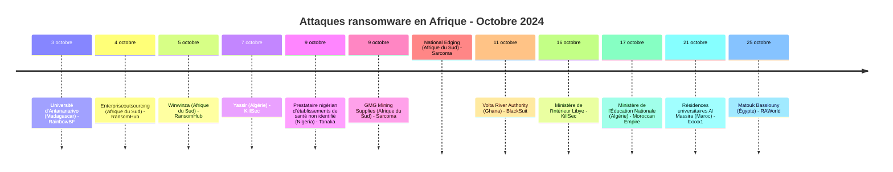
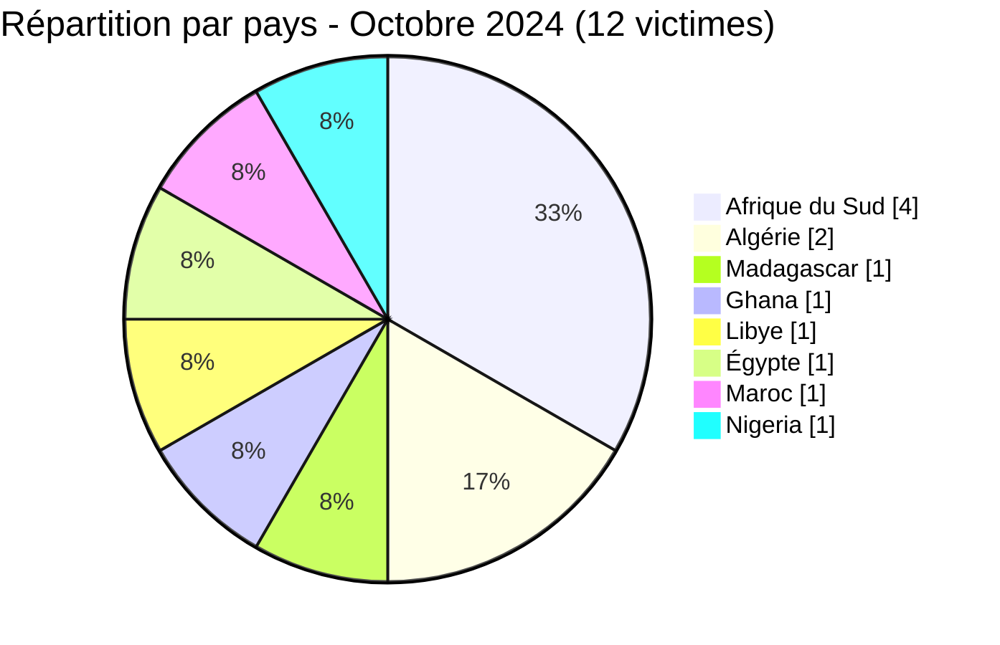

[](https://github.com/Hatchepsoute/AFRINTEL)


# Rapport CTI - Octobre 2024 : Concentration en Afrique du Sud et énergie touchée au Ghana

👉🏾 [English version available here](./README.md)

### 1. Résumé exécutif

Octobre 2024 enregistre **12 victimes** documentées dans 8 pays. L'Afrique du Sud est la cible dominante avec 4 victimes. Le mois est marqué par deux attaques notables : la **Volta River Authority du Ghana** (producteur national d'électricité) revendiquée par BlackSuit, et le **Ministère de l'Intérieur libyen** ciblé par KillSec. RansomHub et Sarcoma frappent chacun deux fois, consolidant leur présence sur le continent, tandis que le Ministère de l'Éducation Nationale algérien fait l'objet d'une revendication avec échantillon, attribuée à Moroccan Empire et remise en circulation. Une publication non confirmée est également apparue pour l'**Université d'Antananarivo** (Madagascar), proposée par le compte RainbowBF sur la plateforme Breached ; le contenu sous-jacent est resté verrouillé et inaccessible pour AFRINTEL.

👉🏾 [Liste des victimes](./victims_FR.md)

**Chiffres clés :**
- 🔹 **12 victimes** identifiées
- 🔹 **9 acteurs/groupes actifs** : RansomHub (2), Sarcoma (2), KillSec (2), BlackSuit (1), RAWorld (1), bxxxx1 (1), Tanaka (1), Moroccan Empire (1), RainbowBF (1)
- 🔹 **Pays touchés** : Afrique du Sud (4), Algérie (2), Madagascar (1), Ghana (1), Libye (1), Égypte (1), Maroc (1), Nigeria (1)
- 🔹 **Secteurs** : Éducation (3), Conseil IT, Tech/Mobilité, Mines/Industrie (2), Énergie, Gouvernement (2), Juridique, Santé

---

### 2. Chronologie des attaques

| Date | Victime | Pays | Groupe ransomware |
|------|---------|------|-------------------|
| 3 octobre | Université d'Antananarivo | Madagascar | RainbowBF |
| 4 octobre | Enterpriseoutsourcing | Afrique du Sud | RansomHub |
| 5 octobre | Winwinza | Afrique du Sud | RansomHub |
| 7 octobre | Yassir | Algérie | KillSec |
| 9 octobre | Prestataire nigérian d’établissements de santé non identifié | Nigeria | Tanaka |
| 9 octobre | GMG Mining Supplies | Afrique du Sud | Sarcoma |
| 9 octobre | National Edging | Afrique du Sud | Sarcoma |
| 11 octobre | Volta River Authority (VRA) | Ghana | BlackSuit |
| 16 octobre | Ministère de l'Intérieur (moi.gov.ly) | Libye | KillSec |
| 17 octobre | Ministère de l'Éducation Nationale (education.gov.dz) | Algérie | Moroccan Empire |
| 21 octobre | Résidences universitaires Al Massira | Maroc | bxxxx1 |
| 25 octobre | Matouk Bassiouny | Égypte | RAWorld |



---

### 3. Analyse des victimes

#### 3.1 Par pays

| Pays | Nombre d'attaques |
|------|-----------------|
| Afrique du Sud | 4 |
| Algérie | 2 |
| Madagascar | 1 |
| Ghana | 1 |
| Libye | 1 |
| Égypte | 1 |
| Maroc | 1 |
| Nigeria | 1 |



#### 3.2 Par secteur

| Secteur | Nombre |
|---------|--------|
| Éducation | 3 |
| Conseil IT | 1 |
| Mines / Industrie | 2 |
| Tech / Mobilité | 1 |
| Énergie / Électricité | 1 |
| Gouvernement | 2 |
| Conseil juridique | 1 |
| Santé / Services médicaux | 1 |

```mermaid
xychart-beta
    title "Secteurs ciblés - Octobre 2024"
    x-axis ["Éducation", "Conseil IT", "Mines/Industrie", "Tech", "Énergie", "Gouvernement", "Juridique", "Santé"]
    y-axis "Nombre d'attaques" 0 to 3
    bar [3, 1, 2, 1, 1, 2, 1, 1]
```

#### 3.3 Groupes ransomware

| Groupe ransomware | Nombre d'attaques |
|-----------------|-----------------|
| RansomHub | 2 |
| Sarcoma | 2 |
| KillSec | 2 |
| BlackSuit | 1 |
| RAWorld | 1 |
| bxxxx1 | 1 |
| Tanaka | 1 |
| Moroccan Empire | 1 |
| RainbowBF | 1 |

---

### 4. Points d'attention

- **Université d'Antananarivo (Madagascar)** : une publication non confirmée de type « accès à une base de données » postée par le compte RainbowBF sur le forum Breached le 3 octobre. Le contenu était verrouillé derrière le système de crédits du forum et inaccessible pour AFRINTEL ; aucun échantillon, périmètre ou authenticité n'a pu être évalué, et la revendication est conservée comme non vérifiée.
- **L'Afrique du Sud reste la principale cible** : 4 des 12 victimes sont sud-africaines, 2 de RansomHub et 2 de Sarcoma en frappes simultanées le même jour (9 octobre). La chaîne d'approvisionnement minière semble spécifiquement ciblée.
- **Volta River Authority (Ghana)** : BlackSuit revendique le principal producteur d'électricité du Ghana, une attaque directe contre une infrastructure nationale critique fournissant l'énergie hydroélectrique et thermique.
- **Yassir (Algérie)** : KillSec cible l'une des super-apps à la croissance la plus rapide d'Afrique (VTC, livraison, courses) avec des opérations en Algérie et sur des marchés internationaux. Risque significatif d'exposition des données utilisateurs.
- **Ministère de l'Intérieur libyen** : KillSec revendique le ministère gouvernemental libyen, une cible extrêmement sensible aux implications potentielles en matière de sécurité nationale.
- **Cabinet d'avocats ciblé (Égypte)** : RAWorld revendique Matouk Bassiouny, un grand cabinet du Caire, cible de haute valeur pour des documents juridiques et d'entreprise confidentiels.
- **Émergence de Sarcoma** : le groupe revendique deux victimes sud-africaines le même jour (9 octobre), suggérant une prospection active dans le pays.
- **Ministère de l'Éducation Nationale (Algérie)** : une revendication remise en circulation, initialement datée du 6 octobre 2022 et attribuée à Moroccan Empire, est republiée par AmeliaBeaumont le 17 octobre et renvoie vers un dump partagé pour la première fois en septembre 2023. L'échantillon comporte des identifiants en clair ainsi que des données d'identité et de scolarité pour environ 90 000 élèves revendiqués ; le volume total n'a pas été vérifié indépendamment.
- **Exposition de l’hébergement étudiant (Maroc)** : la publication de bxxxx1 contient des adresses électroniques et revendique un accès au panneau de contrôle, sans démonstration technique de la méthode d’accès ni d’une compromission administrative directe.

---

```mermaid
xychart-beta
    title "Évolution mensuelle des attaques (Jan - Oct 2024)"
    x-axis ["Jan", "Fév", "Mar", "Avr", "Mai", "Juin", "Juil", "Août", "Sep", "Oct"]
    y-axis "Nombre d'attaques" 0 to 16
    bar [3, 5, 7, 5, 8, 3, 7, 14, 4, 12]
```

### 5. Recommandations

| Domaine | Action recommandée |
|---------|--------------------|
| Énergie / Électricité | Analyser les TTPs de BlackSuit, renforcer la segmentation réseau entre SCADA et SI d'entreprise, implémenter des systèmes de contrôle de sauvegarde. |
| Mines & Chaîne d'approvisionnement | Auditer les contrôles d'accès fournisseurs, surveiller la mise en scène et l'exfiltration de données, revoir les IOCs de Sarcoma. |
| Gouvernement | Traiter toute revendication contre des ministères comme critique, implémenter un accès zero-trust pour les systèmes sensibles. |
| Éducation / Hébergement étudiant | Imposer la MFA sur les panneaux d'administration, revoir les sessions privilégiées, protéger les coordonnées des candidats et préparer les notifications de phishing. |
| Enseignement supérieur | Surveiller les forums cybercriminels pour toute publication de base de données institutionnelle, même verrouillée, et valider l'exposition par une réponse à incident plutôt que d'écarter les revendications non vérifiables. |
| Plateformes tech / Super-apps | Protéger les bases de données utilisateurs avec le chiffrement au repos, appliquer la minimisation des données, préparer les procédures de notification de violation. |
| Cabinets d'avocats | Restreindre l'accès aux dossiers clients, enforcer la DLP, traiter les données juridiques comme une cible à haute valeur équivalente aux données financières. |

---

*Rapport produit à partir des données OSINT AFRINTEL. Diffusion libre (TLP:CLEAR)*
