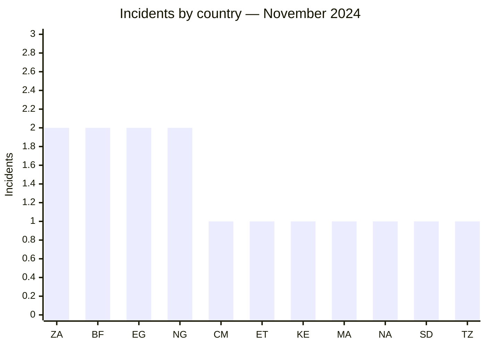
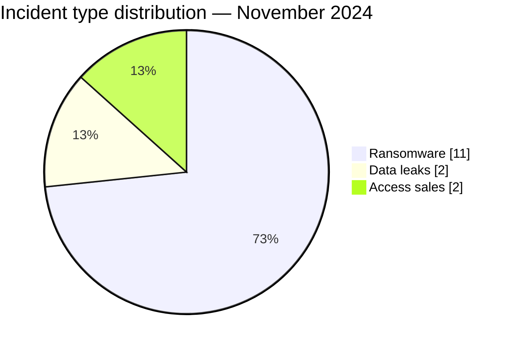

# AFRINTEL CTI Report — November 2024

👉🏾 [Version française](./README_FR.md)

## 1. Executive summary

November 2024 comprises **15 incidents across 11 countries**: **11 ransomware claims**, **2 data leaks**, and **2 access sales**. No country dominates the dataset: South Africa, Burkina Faso, Egypt, and Nigeria each account for two incidents. East Africa and West Africa record four incidents each.

The month is defined less by a single geographic centre than by the range of targets. Publications include a tax authority, two public-health systems, two insurers, and several industrial organisations. Three cases include a published sample in AFRINTEL’s data; the others remain assessed from the actor publication and the material visible at collection time.

See [victims.md](./victims.md).

## 2. Methodology

This report covers incidents classified from 1 to 30 November 2024. Collection draws on actor leak sites, criminal forums, and OSINT sources monitored by AFRINTEL. Victim listings, leaks, and access sales are counted separately by nature; an access sale does not prove that the access was used or that data was exfiltrated.

All statistics derive from the **15 incidents** in [victims.md](./victims.md), synchronised with [victims_FR.md](./victims_FR.md). No raw personal data is reproduced.

## 3. Global overview

| Indicator | Value |
|---|---:|
| Incidents / Countries | **15 / 11** |
| Ransomware | **11** |
| Data leaks | **2** |
| Access sales / Defacement | **2 / 0** |

### Country ranking

| Country | Total | Ransomware | Leak | Access sale |
|---|---:|---:|---:|---:|
| 🇿🇦 South Africa | 2 | 1 | 1 | 0 |
| 🇧🇫 Burkina Faso | 2 | 0 | 0 | 2 |
| 🇪🇬 Egypt | 2 | 2 | 0 | 0 |
| 🇳🇬 Nigeria | 2 | 2 | 0 | 0 |
| 🇨🇲 Cameroon | 1 | 1 | 0 | 0 |
| 🇪🇹 Ethiopia | 1 | 1 | 0 | 0 |
| 🇰🇪 Kenya | 1 | 1 | 0 | 0 |
| 🇲🇦 Morocco | 1 | 0 | 1 | 0 |
| 🇳🇦 Namibia | 1 | 1 | 0 | 0 |
| 🇸🇩 Sudan | 1 | 1 | 0 | 0 |
| 🇹🇿 Tanzania | 1 | 1 | 0 | 0 |
| **Total** | **15** | **11** | **2** | **2** |

### Regional distribution

| Region | Total | Ransomware | Leak | Access sale |
|---|---:|---:|---:|---:|
| East Africa | 4 | 4 | 0 | 0 |
| West Africa | 4 | 2 | 0 | 2 |
| Southern Africa | 3 | 2 | 1 | 0 |
| North Africa | 3 | 2 | 1 | 0 |
| Central Africa | 1 | 1 | 0 | 0 |
| **Total** | **15** | **11** | **2** | **2** |

### Normalised sector distribution

| Sector | Incidents | Share |
|---|---:|---:|
| Manufacturing / Industry | 3 | 20.0% |
| Finance / Banking | 2 | 13.3% |
| Healthcare / Medical | 2 | 13.3% |
| Professional / Business Services | 2 | 13.3% |
| Technology / IT | 2 | 13.3% |
| Agriculture / Agribusiness | 1 | 6.7% |
| Aviation | 1 | 6.7% |
| Education / University | 1 | 6.7% |
| Government / Administration | 1 | 6.7% |
| **Total** | **15** | **100%** |

### Most visible actors

| Actor | Incidents | Predominant activity |
|---|---:|---|
| KillSec | 3 | Ransomware |
| RansomHub | 2 | Ransomware |
| Sentap | 2 | Access sale |
| Eight other actors or sources | 1 each | Ransomware or leak |

## 4. Detailed analysis by incident type

### 4.1 Ransomware

The 11 ransomware publications are distributed among nine groups. KillSec accounts for three and RansomHub for two. The Sumitomo Rubber South Africa publication includes a sample; the material collected for the Egyptian Tax Authority and Kenana Sugar Company cases does not provide technical evidence confirming the claimed scope.

### 4.2 Data leaks and access sales

The PPOTTS publication includes a data sample. The ACAO case is a repost of an earlier claim referring to approximately 800 files, with no visible sample at collection time; it should not be interpreted as a newly dated intrusion in November. Sentap separately offered access associated with two Burkinabè public-health systems. One offer included a sample, but neither the current validity nor the use of the advertised access is established.

## 5. Sectoral impact

Manufacturing leads the month with three incidents. Finance, public health, professional services, and technology each account for two. Potential impact is highest in tax, healthcare, and insurance environments, where exposure could involve personal or financial information. This sensitivity does not confirm the content claimed by the actors.

## 6. Threat actor profile and risk assessment

| Scope | Level | Rationale |
|---|---|---|
| 🇧🇫 Burkina Faso | 🔴 High | Two access sales involving public-health systems |
| 🇪🇬 Egypt | 🔴 High | Two ransomware claims, including the tax authority |
| 🇿🇦 South Africa | 🔴 High | One ransomware case with a sample and one leak with a sample |
| 🇳🇬 Nigeria | 🟠 Medium | Two ransomware claims without public technical evidence |
| Other countries | 🟠 Medium | One incident per country, with varying evidence depth |

## 7. Key trends and intelligence gaps

- **Observed — high confidence:** the dataset spans 11 countries; no country exceeds two incidents.
- **Observed — high confidence:** ransomware, leaks, and access sales coexist and require distinct response priorities.
- **Observed — medium confidence:** three incidents include a published sample, which does not automatically validate the full claimed volumes.
- **Major intelligence gap:** no public DFIR report was identified in the consulted sources to establish access vectors, lateral movement, or exfiltration mechanisms.
- **Gap:** the validity of Sentap’s advertised accesses and the original date of the ACAO data remain unknown.
- **Collection requirement:** seek institutional confirmation, date reposted data, and monitor any subsequent use of the advertised access.

## 8. Contextual MITRE ATT&CK mapping

| Qualification | Technique | Defensive use |
|---|---|---|
| Assumption — medium confidence | T1078 — Valid Accounts | Scenario to examine for access sales; not observed in the sources |
| Preventive | T1486 — Data Encrypted for Impact | Detect high-volume file writes and renames associated with encryption |
| Preventive | T1490 — Inhibit System Recovery | Alert on shadow-copy deletion and backup modification |
| Preventive | T1567 — Exfiltration Over Web Service | Monitor unusual outbound transfers; channel not established |

## 9. Recommendations

- **Public health and tax administration:** review privileged accounts, constrain third-party access, and log bulk exports.
- **Insurance:** control document repositories, encrypt sensitive data, and test notification procedures.
- **Manufacturing:** segment office, industrial, and contractor environments.
- **All organisations:** review exposed remote access and require phishing-resistant MFA.

## 10. SOC and tactical recommendations

| Qualification | Action |
|---|---|
| **Observed** | Track the named organisations and domains without treating a criminal publication as confirmation of intrusion. |
| **Assumption** | Hunt for remote logins from unusual infrastructure, new accounts, and privilege escalation. |
| **Preventive** | Detect LSASS dumping, obfuscated PowerShell, backup deletion, and abnormal use of transfer tools such as Rclone. |

## 11. Strategic recommendations

| Priority | Qualification | Measure |
|---:|---|---|
| 1 | **Observed** | Prioritise the public-health and tax systems present in the dataset. |
| 2 | **Assumption** | Treat advertised access as potentially valid until internally checked, without concluding that it was exploited. |
| 3 | **Preventive** | Reduce the external attack surface, close unnecessary RDP exposure, and isolate critical backups. |

## 12. Conclusion

November has the broadest geographic spread in the 2024 dataset, but it does not represent a single campaign. The incidents differ in both evidence and nature. Operational priority should go to environments where business criticality and the available evidence intersect: public health, taxation, insurance, and manufacturing.

**AFRINTEL — TLP:CLEAR**

[AFRINTEL repository](https://github.com/Hatchepsoute/AFRINTEL)
