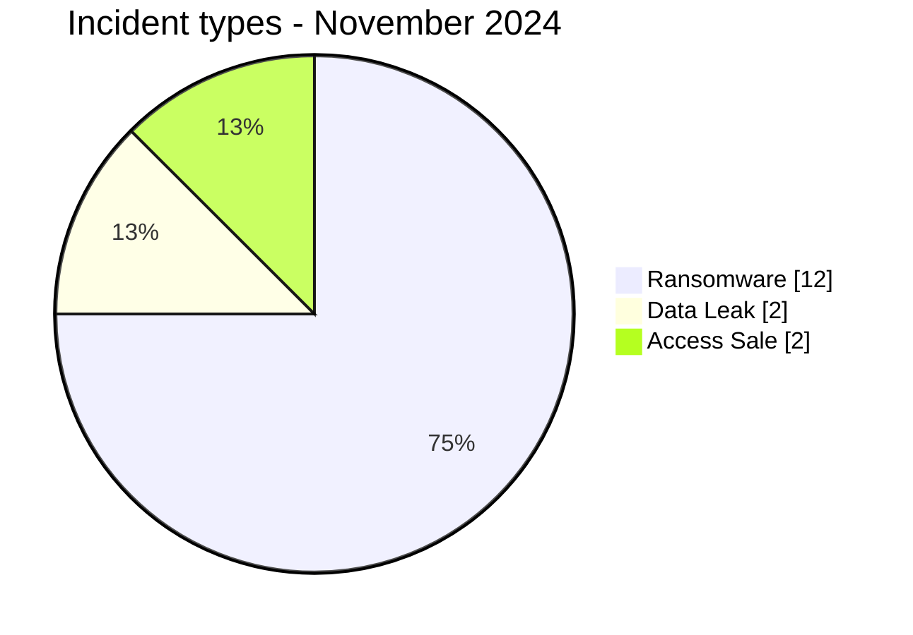
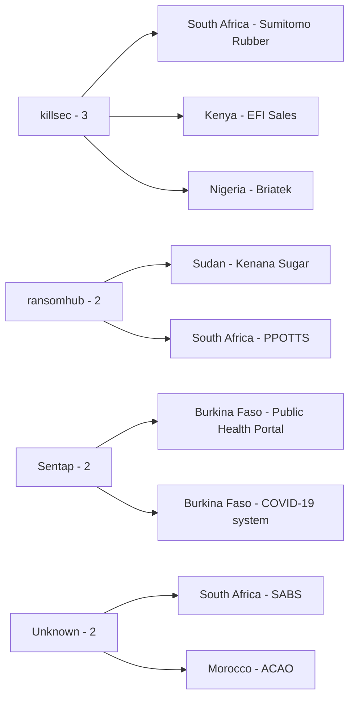
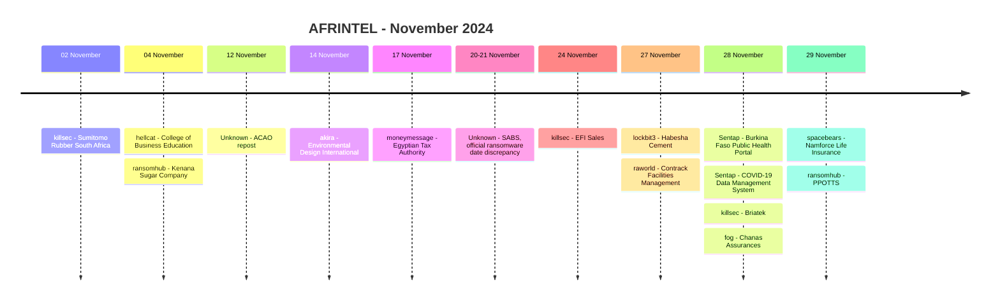

# AFRINTEL CTI Report - November 2024

👉🏾 [Version française](./README_FR.md)

## 1. Executive summary

The corrected November 2024 AFRINTEL corpus contains **16 documented incident records across 11 African countries**: **12 Ransomware**, **2 Data Leak** and **2 Access Sale**. No DDoS, Defacement or Operational Fraud record is present.

The retrospective correction adds the **South African Bureau of Standards (SABS)**. Unlike most leak-site ransomware publications in the month, the SABS case is supported by official South African government and parliamentary material confirming ransomware-driven system encryption and major operational disruption. Official sources disagree by one day on whether the event occurred on 20 or 21 November; AFRINTEL preserves the date as **20-21 November 2024**.

South Africa now records three incidents. Burkina Faso, Egypt and Nigeria record two each, while seven other countries account for one each. The month remains geographically broad rather than dominated by a single country.

👉🏾 [View the full victim list](./victims.md)

### 1.1 Month-over-month comparison

| Indicator | October 2024 | November 2024 | Change |
|---|---:|---:|---:|
| Total incidents | 12 | **16** | **+4 (+33.3%)** |
| Ransomware | 8 | **12** | **+4 (+50.0%)** |
| Data Leak | 4 | **2** | **-2 (-50.0%)** |
| Access Sale | 0 | **2** | **+2 (from 0)** |
| DDoS | 0 | **0** | Stable |
| Defacement | 0 | **0** | Stable |
| Operational Fraud | 0 | **0** | Stable |

November records **33.3% more documented incidents** than October. The rise is driven by four additional Ransomware records and the appearance of two Access Sale records, while Data Leak falls from four to two.

## 2. Methodology

- **Period:** 1-30 November 2024.
- **Source of truth:** harmonized `victims_FR.md` / `victims.md`.
- **Counting:** one harmonized card equals one documented incident record.
- **Taxonomy:** Ransomware, Data Leak, Access Sale, DDoS, Defacement, Operational Fraud.
- **Retrospective correction:** SABS is one of the validated missing 2024 incidents and is added to November.
- **SABS chronology:** official sources differ by one day, so AFRINTEL records the event as 20-21 November rather than silently choosing one source.
- **Access Sale rule:** an advertised access does not prove the access is currently valid, has been used, or resulted in exfiltration.
- **Actor/source separation:** ACAO is `Unknown`; Hxp7 is retained only as the reposting account.
- Criminal claims, published samples, victim confirmations and government-confirmed incidents remain distinct evidence states.

## 3. Global overview

### 3.1 Incident-type distribution

| Incident type | Records | Share |
|---|---:|---:|
| Ransomware | **12** | **75.0%** |
| Data Leak | **2** | **12.5%** |
| Access Sale | **2** | **12.5%** |
| DDoS | 0 | 0.0% |
| Defacement | 0 | 0.0% |
| Operational Fraud | 0 | 0.0% |
| **Total** | **16** | **100%** |

### 3.2 Country distribution

| Country | Ransomware | Data Leak | Access Sale | Total |
|---|---:|---:|---:|---:|
| 🇿🇦 South Africa | 2 | 1 | 0 | **3** |
| 🇧🇫 Burkina Faso | 0 | 0 | 2 | **2** |
| 🇪🇬 Egypt | 2 | 0 | 0 | **2** |
| 🇳🇬 Nigeria | 2 | 0 | 0 | **2** |
| 🇨🇲 Cameroon | 1 | 0 | 0 | 1 |
| 🇪🇹 Ethiopia | 1 | 0 | 0 | 1 |
| 🇰🇪 Kenya | 1 | 0 | 0 | 1 |
| 🇲🇦 Morocco | 0 | 1 | 0 | 1 |
| 🇳🇦 Namibia | 1 | 0 | 0 | 1 |
| 🇸🇩 Sudan | 1 | 0 | 0 | 1 |
| 🇹🇿 Tanzania | 1 | 0 | 0 | 1 |
| **Total** | **12** | **2** | **2** | **16** |

### 3.3 Regional distribution

| Region | Ransomware | Data Leak | Access Sale | Total |
|---|---:|---:|---:|---:|
| East Africa | 4 | 0 | 0 | **4** |
| West Africa | 2 | 0 | 2 | **4** |
| Southern Africa | 3 | 1 | 0 | **4** |
| North Africa | 2 | 1 | 0 | **3** |
| Central Africa | 1 | 0 | 0 | **1** |
| **Total** | **12** | **2** | **2** | **16** |

### 3.4 Harmonized sector distribution

| Sector | Records | Share |
|---|---:|---:|
| Manufacturing / Industry | 3 | 18.8% |
| Government / Administration | 2 | 12.5% |
| Finance / Banking | 2 | 12.5% |
| Healthcare / Medical | 2 | 12.5% |
| Professional / Business Services | 2 | 12.5% |
| Technology / IT | 2 | 12.5% |
| Agriculture / Agribusiness | 1 | 6.3% |
| Aviation | 1 | 6.3% |
| Education / University | 1 | 6.3% |
| **Total** | **16** | **100%** |

### 3.5 Actors / groups

| Actor / Group | Records |
|---|---:|
| killsec | **3** |
| ransomhub | 2 |
| Sentap | 2 |
| Unknown | 2 |
| hellcat | 1 |
| akira | 1 |
| moneymessage | 1 |
| lockbit3 | 1 |
| raworld | 1 |
| fog | 1 |
| spacebears | 1 |
| **Total** | **16** |

The two `Unknown` entries are SABS and ACAO. In the ACAO case, Hxp7 is retained as repost context, not as a confirmed intrusion actor.

## 4. Detailed analysis

### 4.1 Ransomware - 12 records

The corrected ransomware corpus contains twelve records. Ten of the original eleven ransomware publications remain low-confidence, unverified claims without public DFIR material establishing encryption, access vector or exfiltration scope.

**Sumitomo Rubber South Africa** has much stronger evidence. AFRINTEL reviewed a local archive of approximately **239,600 PDF files, roughly 23 GB uncompressed**, containing company-branded customer account statements and SAP-linked transaction references. The material strongly supports a genuine large-scale internal-data compromise at `Very High` confidence. It does not independently establish the initial-access mechanism or every ransomware behavior associated with the actor publication.

**SABS** is stronger still in a different evidential dimension because the ransomware impact is officially confirmed. Government and parliamentary material state that systems were encrypted, audit data became inaccessible, financial reporting was delayed, virtual machines and applications required extensive rebuilding, and later audit reporting described a complete shutdown of business applications with prolonged recovery. The attacker remains `Unknown`, and no affected-record count, monetary loss or exfiltrated-data volume is established in the reviewed official material.

### 4.2 Data Leak - 2 records

**ACAO** is a repost of an earlier database-compromise claim mentioning approximately **800 files**. No sample was visible in the observed November publication, so authenticity, scope and original compromise date remain unresolved. Hxp7 is retained as repost context rather than an intrusion actor.

**PPOTTS** contains eight reviewed screenshots showing sensitive documents, including educational, pathology and personal-credential material. The sample supports recording a published exposure, but the screenshots do not establish whether the records originated directly from PPOTTS, a customer environment, a third-party system or a wider dataset.

### 4.3 Access Sale - 2 records

Both Access Sale records concern Burkina Faso public-health systems and are attributed to **Sentap**.

The general public-health portal offer contains no verifiable domain, technical access proof or data sample and remains `Low` confidence.

The COVID-19 data-management system includes screenshots of dashboard metrics, vaccination summaries and historical results, with approximately **3.795 million records claimed**. The sample supports the existence of a dashboard-like environment, but does not establish the current validity of the advertised access, the authenticity or completeness of all records, or whether the access was ever used by a buyer.

The two offers remain separate because the supplied evidence does not demonstrate that they are the same system.

## 5. Key findings and intelligence gaps

- The corrected November corpus rises from **15 to 16 records** after adding SABS.
- Ransomware rises from **11 to 12 records**, and SABS materially strengthens the month because encryption and operational disruption are officially confirmed.
- South Africa becomes the leading country with **3 records**.
- Three regions now contain four records each: East, West and Southern Africa.
- Sumitomo Rubber provides strong sample-based evidence of internal-data compromise; SABS provides strong official confirmation of ransomware operational impact.
- The two Burkina Faso Access Sale claims require verification of current access validity before any conclusion about exploitation.
- PPOTTS sample provenance remains unresolved.
- ACAO is a repost and should not be represented as a newly dated November intrusion.
- Access vectors, attacker identity for SABS, and exfiltration scope remain major intelligence gaps.

## 6. Contextual MITRE ATT&CK mapping

| Qualification | Technique | Defensive use |
|---|---|---|
| Observed for SABS | T1486 - Data Encrypted for Impact | System encryption is officially confirmed for SABS. |
| Preventive | T1490 - Inhibit System Recovery | Monitor backup deletion and recovery-system modification; not established as observed in SABS. |
| Assumption | T1078 - Valid Accounts | Scenario to investigate for access sales; not observed in the supplied evidence. |
| Preventive | T1567 - Exfiltration Over Web Service | Monitor unusual outbound transfer; channels are not established. |

## 7. Recommendations

- For SABS-like confirmed ransomware events, preserve recovery evidence and separately track encryption, unavailable data, rebuilding and any later evidence of exfiltration.
- Public-health systems should urgently verify whether the advertised accesses remain valid, rotate exposed privileged credentials if confirmed and correlate recent administrative sessions.
- Tax and insurance organizations should strengthen privileged-access monitoring, document-repository controls and abnormal export detection.
- Manufacturing organizations should segment enterprise IT, production and contractor access and test recovery from isolated backups.
- For all criminal publications, preserve claim chronology and do not convert advertised volume or actor attribution into confirmed fact without supporting evidence.

## 8. Timeline

## 9. Conclusion

November 2024 closes with **16 documented incident records across 11 African countries**, comprising **12 Ransomware, 2 Data Leak and 2 Access Sale**. Compared with October, the corrected monthly corpus increases from 12 to 16 records, or **33.3%**. Ransomware rises from 8 to 12, Data Leak falls from 4 to 2, and Access Sale appears with two records.

The addition of SABS changes more than the monthly count. It adds one of the strongest operationally confirmed ransomware events in the 2024 corpus. Unlike a leak-site listing, the SABS record is supported by official material confirming system encryption, loss of access to information needed for audit activities, delayed financial reporting, extensive rebuilding and prolonged disruption of business applications. At the same time, the evidence does not identify the attacker, establish the initial-access vector or confirm a data-exfiltration volume. Preserving those boundaries prevents a strong confirmation of operational impact from being extended into unsupported attribution or data-loss claims.

Sumitomo Rubber South Africa provides a different but equally important evidence profile. Its large locally reviewed archive strongly supports an internal-data compromise and demonstrates potential exposure of account and transaction material across export relationships. Yet that sample does not automatically validate every ransomware mechanic claimed by the actor. November therefore contains both **officially confirmed ransomware impact** and **high-confidence sample-based compromise evidence**, alongside numerous low-confidence criminal claims.

The two Access Sale records add another analytical dimension. They concern public-health environments in Burkina Faso, including one dashboard sample with a claimed 3.795 million records. Their presence is operationally important because valid privileged access could create immediate risk, but neither publication proves that the access remained valid, was purchased or was used to exfiltrate data. The correct response priority is internal validation, not assumption of exploitation.

Geographically, the corrected corpus remains broad: 11 countries are represented, South Africa leads with three records, and East, West and Southern Africa each account for four. This distribution does not support a single regional campaign narrative. Sectorally, manufacturing remains first with three records, while government, finance, healthcare, professional services and technology each appear twice.

The most defensible CTI interpretation is therefore that November combines **greater ransomware volume, unusually strong evidence in a small number of cases, and emerging access-sale risk against public-health systems**. The evidence hierarchy matters more than raw counts: SABS is government-confirmed, Sumitomo is strongly sample-supported, the Burkina Faso access offers remain unverified or partially sampled, and many other ransomware entries are still criminal claims without public DFIR support. AFRINTEL should continue to track each record through its evidence lifecycle rather than allowing all sixteen records to imply the same degree of compromise certainty.

**AFRINTEL** - TLP:CLEAR
