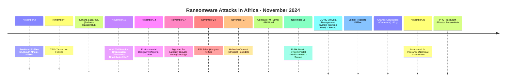
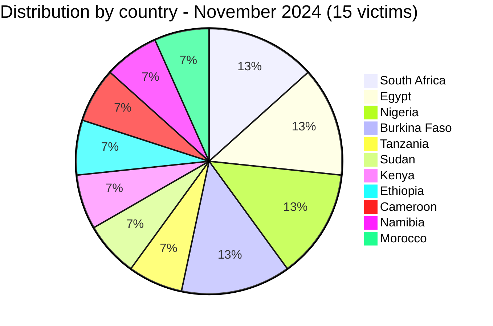

[](https://github.com/Hatchepsoute/AFRINTEL)


# CTI Report - November 2024: 15 victims across 11 countries, the broadest geographic spread of the year

👉🏾 [Version française disponible ici](./README_FR.md)

### 1. Executive summary

November 2024 records **15 documented victims** across 11 countries, tying August for the highest monthly count of the year. South Africa, Egypt, Nigeria and Burkina Faso each sustain 2 claims, and KillSec leads among ransomware groups with 3. The month sees the Egyptian Tax Authority (ETA) targeted, a direct claim against sovereign fiscal infrastructure, and the first appearance of the Fog and Hellcat ransomware groups on the continent. Two Burkina Faso government health-data claims and a reposted claim concerning Morocco's Arab Civil Aviation Organization (ACAO) round out a month marked by public-sector and international-organization targeting.

👉🏾 [Victims list](./victims.md)

**Key figures:**
- 🔹 **15 victims** identified
- 🔹 **11 active actors/groups**: KillSec (3), RansomHub (2), Sentap (2), RAWorld (1), Hellcat (1), Akira (1), MoneyMessage (1), LockBit3 (1), Fog (1), SpaceBears (1), Unattributed/Hxp7 repost (1)
- 🔹 **Countries affected**: South Africa (2), Egypt (2), Nigeria (2), Burkina Faso (2), Tanzania (1), Sudan (1), Kenya (1), Ethiopia (1), Cameroon (1), Namibia (1), Morocco (1)
- 🔹 **Sectors**: Manufacturing, Education, Agribusiness, Engineering, Government/Finance, Retail, Heavy Industry, Business Services, IT Consulting, Insurance, Aviation/Intergovernmental Organization, Healthcare/Public Health

---

### 2. Attack timeline

| Date | Victim | Country | Ransomware group |
|------|--------|---------|-----------------|
| November 2 | Sumitomo Rubber South Africa | South Africa | KillSec |
| November 4 | College of Business Education (CBE) | Tanzania | Hellcat |
| November 4 | Kenana Sugar Company | Sudan | RansomHub |
| November 12 | Arab Civil Aviation Organization (ACAO) | Morocco | Unattributed (reposted by Hxp7) |
| November 14 | Environmental Design International | Nigeria | Akira |
| November 17 | Egyptian Tax Authority (ETA) | Egypt | MoneyMessage |
| November 24 | EFI Sales | Kenya | KillSec |
| November 27 | Habesha Cement | Ethiopia | LockBit3 |
| November 27 | Contrack Facilities Management | Egypt | RAWorld |
| November 28 | Burkina Faso Public Health System Portal | Burkina Faso | Sentap |
| November 28 | Government COVID-19 Data Management System | Burkina Faso | Sentap |
| November 28 | Briatek | Nigeria | KillSec |
| November 28 | Chanas Assurances S.A. | Cameroon | Fog |
| November 29 | Namforce Life Insurance | Namibia | SpaceBears |
| November 29 | PPOTTS | South Africa | RansomHub |



---

### 3. Victim analysis

#### 3.1 By country

| Country | Number of attacks |
|---------|-----------------|
| South Africa | 2 |
| Egypt | 2 |
| Nigeria | 2 |
| Burkina Faso | 2 |
| Tanzania | 1 |
| Sudan | 1 |
| Kenya | 1 |
| Ethiopia | 1 |
| Cameroon | 1 |
| Namibia | 1 |
| Morocco | 1 |



#### 3.2 By sector

| Sector | Count |
|--------|-------|
| IT Consulting / Technology | 2 |
| Insurance | 2 |
| Healthcare / Public Health | 2 |
| Manufacturing | 1 |
| Education | 1 |
| Agriculture / Agribusiness | 1 |
| Engineering Consulting | 1 |
| Government / Tax Administration | 1 |
| Retail / Distribution | 1 |
| Heavy Industry | 1 |
| Business Services | 1 |
| Aviation / Intergovernmental Organization | 1 |

```mermaid
xychart-beta
    title "Targeted Sectors - November 2024"
    x-axis ["IT/Tech", "Insurance", "Healthcare", "Manufacturing", "Education", "Agriculture", "Engineering", "Government", "Retail", "Heavy Ind.", "Biz Services", "Aviation"]
    y-axis "Number of attacks" 0 to 3
    bar [2, 2, 2, 1, 1, 1, 1, 1, 1, 1, 1, 1]
```

#### 3.3 Ransomware groups

| Ransomware group | Number of attacks |
|-----------------|-----------------|
| KillSec | 3 |
| RansomHub | 2 |
| RAWorld | 1 |
| Hellcat | 1 |
| Akira | 1 |
| MoneyMessage | 1 |
| LockBit3 | 1 |
| Fog | 1 |
| SpaceBears | 1 |

Note: Sentap (Burkina Faso, 2 access-sale claims) and the unattributed ACAO repost are actor/group claims outside the ransomware taxonomy and are excluded from this table; they are counted in the key figures above.

---

### 4. Key observations

- **Egyptian Tax Authority (ETA)**: MoneyMessage's claim against Egypt's sovereign tax administration represents one of the most sensitive government targets of 2024, a breach could expose tax records, corporate filings, and citizen fiscal data for millions.
- **KillSec leads with 3 claims**: the group strikes South Africa (manufacturing), Kenya (distribution), and Nigeria (IT consulting) across three weeks  its most active month on the continent.
- **Hellcat African debut**: the group claims the College of Business Education in Tanzania, its first documented African victim.
- **Fog first African claim**: Chanas Assurances (Cameroon) marks Fog's debut on the continent  a group known for targeting VPN vulnerabilities.
- **Insurance sector**: two insurance companies hit in one month (Chanas Assurances, Namforce Life Insurance), holders of large personal and financial policyholder datasets.
- **Arab Civil Aviation Organization (Morocco)**: a forum repost references an earlier claim against the ACAO database, citing around 800 files but showing no data sample. AFRINTEL could not assess the content or authenticity of the alleged database and records this as an unverified claim.
- **Burkina Faso public-health claims**: Sentap advertises two related but separately recorded claims, a public-health system portal and a government COVID-19 data-management system said to hold roughly 3.795 million records. No verifiable domain or independent confirmation was available for either claim; AFRINTEL does not reproduce personal records.
- **Broadest geographic spread of the year**: 11 distinct countries in a single month, spanning West, East, Central, North, and Southern Africa.

---

```mermaid
xychart-beta
    title "Monthly Evolution of Attacks (Jan - Nov 2024)"
    x-axis ["Jan", "Feb", "Mar", "Apr", "May", "Jun", "Jul", "Aug", "Sep", "Oct", "Nov"]
    y-axis "Number of attacks" 0 to 16
    bar [3, 5, 7, 5, 8, 3, 7, 14, 4, 8, 15]
```

### 5. Recommendations

| Domain | Recommended action |
|--------|--------------------|
| Government / Tax authorities | Isolate fiscal databases, enforce privileged access management, monitor for bulk record extraction. |
| Insurance companies | Encrypt policyholder databases, audit third-party access, implement data loss prevention. |
| IT Consulting | Enforce zero-trust for client environment access, monitor for credential reuse from prior breaches. |
| Education | Patch Hellcat-associated vulnerabilities (often phishing + credential theft), harden student data portals. |
| All organizations | Track Fog's VPN exploitation pattern, audit Fortinet/Cisco VPN configurations urgently. |

---

*Report from AFRINTEL OSINT data. Free distribution (TLP:CLEAR)*
