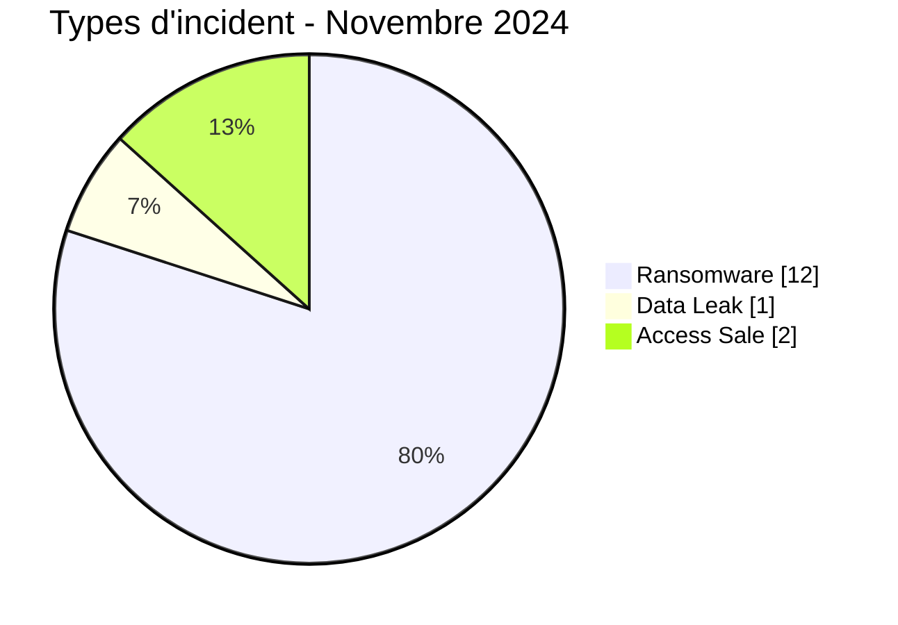

# Rapport CTI AFRINTEL - Cybermenaces en Afrique - Novembre 2024

👉🏾 [English version](./README.md)

## 1. Synthèse exécutive

En Novembre 2024, AFRINTEL retient **15 cyberincidents canoniques dans 10 pays**. Le mois est dominé par **Ransomware (12, 80,0 %)** puis **Access Sale (2, 13,3 %)**. Les pays les plus représentés sont **Afrique du Sud (3)**, **Nigeria (2)**, **Égypte (2)**. Les secteurs les plus visibles sont **Industrie / Fabrication (3)**, **Services professionnels / Business (2)**, **Gouvernement / Administration (2)**. Les labels acteur/groupe les plus fréquents sont `killsec` (3), `ransomhub` (2), `Sentap` (2). `Unknown` désigne une absence d'attribution, pas un groupe.

La maturité de preuve est répartie entre **Claim - Unverified: 11**, **Claim - Data Sample Published: 3**, **Confirmed: 1**. Les claims ne sont pas convertis en confirmations sans preuve supplémentaire.

### 1.1 Étude comparative avec le mois précédent

| Indicateur | Octobre 2024 | Novembre 2024 | Évolution |
|---|---|---|---|
| Total | 11 | 15 | +4 (+36,4 %) |
| Ransomware | 8 | 12 | +4 (+50,0 %) |
| Data Leak | 2 | 1 | -1 (-50,0 %) |
| Access Sale | 0 | 2 | +2 (nouveau) |
| DDoS | 0 | 0 | Stable |
| Defacement | 0 | 0 | Stable |
| Account Takeover | 0 | 0 | Stable |
| System Intrusion | 1 | 0 | -1 (-100,0 %) |
| Malware | 0 | 0 | Stable |
| Operational Fraud | 0 | 0 | Stable |

### 1.2 Analyse comparative

Le volume mensuel **augmente de 4 incident(s)**. Les variations structurantes sont : Ransomware 8->12 (+4), Access Sale 0->2 (+2), System Intrusion 1->0 (-1), Data Leak 2->1 (-1). Cette variation décrit le corpus documenté, pas nécessairement une variation équivalente du nombre réel de compromissions sur le continent.

## 2. Méthodologie

- Un incident canonique correspond à un événement retenu dans le millésime 2024.
- Les découvertes/republications historiques sont conservées séparément et ne gonflent pas les statistiques 2024.
- La date d'incident ou la meilleure fenêtre soutenue prime ; la date de découverte AFRINTEL reste distincte.
- Les 9 types AFRINTEL sont utilisés ; une tentative est représentée par le statut, jamais par un type `Attempted Attack`.
- Un DDoS coordonné est compté par campagne.
- Type, statut, confiance, impact, attribution et source restent distincts.

## 3. Répartition par type d'incident

| Type | Fiches | Part |
|---|---|---|
| Ransomware | 12 | 80,0 % |
| Data Leak | 1 | 6,7 % |
| Access Sale | 2 | 13,3 % |
| DDoS | 0 | 0,0 % |
| Defacement | 0 | 0,0 % |
| Account Takeover | 0 | 0,0 % |
| System Intrusion | 0 | 0,0 % |
| Malware | 0 | 0,0 % |
| Operational Fraud | 0 | 0,0 % |

## 4. Pays x type

| Pays | Total | Ransomware | Data Leak | Access Sale | DDoS | Defacement | Account Takeover | System Intrusion | Malware | Operational Fraud |
|---|---|---|---|---|---|---|---|---|---|---|
| Afrique du Sud | 3 | 2 | 1 | 0 | 0 | 0 | 0 | 0 | 0 | 0 |
| Nigeria | 2 | 2 | 0 | 0 | 0 | 0 | 0 | 0 | 0 | 0 |
| Égypte | 2 | 2 | 0 | 0 | 0 | 0 | 0 | 0 | 0 | 0 |
| Burkina Faso | 2 | 0 | 0 | 2 | 0 | 0 | 0 | 0 | 0 | 0 |
| Tanzanie | 1 | 1 | 0 | 0 | 0 | 0 | 0 | 0 | 0 | 0 |
| Soudan | 1 | 1 | 0 | 0 | 0 | 0 | 0 | 0 | 0 | 0 |
| Kenya | 1 | 1 | 0 | 0 | 0 | 0 | 0 | 0 | 0 | 0 |
| Éthiopie | 1 | 1 | 0 | 0 | 0 | 0 | 0 | 0 | 0 | 0 |
| Cameroun | 1 | 1 | 0 | 0 | 0 | 0 | 0 | 0 | 0 | 0 |
| Namibie | 1 | 1 | 0 | 0 | 0 | 0 | 0 | 0 | 0 | 0 |

## 5. Répartition régionale

| Région | Fiches | Part |
|---|---|---|
| Afrique australe | 4 | 26,7 % |
| Afrique de l'Est | 4 | 26,7 % |
| Afrique de l'Ouest | 4 | 26,7 % |
| Afrique du Nord | 2 | 13,3 % |
| Afrique centrale | 1 | 6,7 % |

## 6. Répartition sectorielle

| Secteur | Fiches | Part |
|---|---|---|
| Industrie / Fabrication | 3 | 20,0 % |
| Services professionnels / Business | 2 | 13,3 % |
| Gouvernement / Administration | 2 | 13,3 % |
| Santé / Médical | 2 | 13,3 % |
| Technologie / IT | 2 | 13,3 % |
| Finance / Banque | 2 | 13,3 % |
| Éducation / Université | 1 | 6,7 % |
| Agriculture / Agro-industrie | 1 | 6,7 % |

## 7. Acteurs / groupes

| Acteur / Groupe | Fiches | Part |
|---|---|---|
| killsec | 3 | 20,0 % |
| ransomhub | 2 | 13,3 % |
| Sentap | 2 | 13,3 % |
| hellcat | 1 | 6,7 % |
| akira | 1 | 6,7 % |
| moneymessage | 1 | 6,7 % |
| Unknown | 1 | 6,7 % |
| lockbit3 | 1 | 6,7 % |
| raworld | 1 | 6,7 % |
| fog | 1 | 6,7 % |
| spacebears | 1 | 6,7 % |

## 8. Maturité des preuves

| Position de preuve | Fiches | Part |
|---|---|---|
| Claim - Unverified | 11 | 73,3 % |
| Claim - Data Sample Published | 3 | 20,0 % |
| Confirmed | 1 | 6,7 % |

### Confiance

| Confiance | Fiches | Part |
|---|---|---|
| Low | 11 | 73,3 % |
| Very High | 2 | 13,3 % |
| Medium | 2 | 13,3 % |

## 9. Chronologie

```mermaid
timeline
    title AFRINTEL - Novembre 2024
    2 Novembre 2024 : Sumitomo Rubber South Africa
- **Acteur / Groupe -** killsec
- **Secteur -** Manufacturing / Industry
- **Site web -** [srigroup.co.za](https -//www.srigroup.co.za)
- **Statut -** Claim - Data Sample Published
- **Type d'incident -** Ransomware
- **Niveau de confiance -** Very High
- **Niveau d'impact -** Level 4
- **Description victime -** Sumitomo Rubber South Africa est une entreprise de fabrication de pneumatiques opérant en Afrique du Sud et liée au groupe Sumitomo Rubber Industries.
- **Analyse -** AFRINTEL a examiné un échantillon local de l'archive associée à cette revendication, comprenant environ 239 600 fichiers PDF individuels (soit environ 23 Go non compressés), chacun nommé par un UUID aléatoire plutôt que par un nom de fichier d'origine. Les fichiers examinés par AFRINTEL sont des relevés de compte clients authentiques émis à en-tête de Sumitomo Rubber South Africa (Pty) Ltd, spécifiquement sa division « Export DQC - Africa East (USD) », listant l'historique des transactions par compte (références de facture SAP, dates, montants crédités et soldes courants) rattaché à un numéro de compte nommé et à un contact commercial export nommé, avec une adresse email au domaine srigroup.co.za. La cohérence de l'en-tête d'entreprise, des noms de contacts réels et de la numérotation des factures liée à SAP dans l'échantillon examiné, ainsi que le volume très important et le schéma de nommage par UUID cohérent avec un export en masse depuis une archive de gestion documentaire ou un ERP, soutiennent une évaluation à très haute confiance d'une compromission réelle et à grande échelle. Compte tenu de l'ampleur de l'archive et de sa couverture des comptes clients export de l'entreprise à l'échelle du continent, cet incident présente un risque de fraude à la facture à grande échelle, de compromission de messagerie professionnelle et d'exposition de renseignement concurrentiel s'étendant à la clientèle export de Sumitomo Rubber South Africa sur le continent. AFRINTEL ne reproduit aucun numéro de compte, nom de contact, adresse email, référence de facture ni montant financier issu du matériel examiné.

----------------------------

- **Qualification de la preuve -** L'archive examinée soutient fortement une compromission réelle et importante de données internes associée à Sumitomo Rubber South Africa. Elle n'établit pas indépendamment le vecteur d'accès initial, le comportement de chiffrement ransomware ni l'étendue complète d'une exfiltration distincte au-delà de l'archive examinée.
    4 Novembre 2024 : College of Business Education (CBE)
- **Acteur / Groupe -** hellcat
- **Secteur -** Education / University
- **Site web -** [cbe.ac.tz](https -//www.cbe.ac.tz)
- **Statut -** Claim - Unverified
- **Type d'incident -** Ransomware
- **Niveau de confiance -** Low
- **Niveau d'impact -** Level 3
- **Description victime -** Le College of Business Education (CBE) est un établissement tanzanien d'enseignement supérieur proposant des formations en commerce, gestion, comptabilité et domaines professionnels associés.

----------------------------
    4 Novembre 2024 : Kenana Sugar Company
- **Acteur / Groupe -** ransomhub
- **Secteur -** Agriculture / Agribusiness
- **Site web -** [kenanasugarcompany.com](https -//www.kenanasugarcompany.com)
- **Statut -** Claim - Unverified
- **Type d'incident -** Ransomware
- **Niveau de confiance -** Low
- **Niveau d'impact -** Level 2
- **Description victime -** Kenana Sugar Company est un important complexe agro-industriel soudanais spécialisé dans la culture de la canne à sucre, la production de sucre et les activités agricoles et industrielles associées.

----------------------------
    14 Novembre 2024 : Environmental Design International
- **Acteur / Groupe -** akira
- **Secteur -** Professional / Business Services
- **Site web -** [environmentaldesigninternational.com](http -//environmentaldesigninternational.com)
- **Statut -** Claim - Unverified
- **Type d'incident -** Ransomware
- **Niveau de confiance -** Low
- **Niveau d'impact -** Level 2
- **Description victime -** Environmental Design International est une entreprise nigériane d'ingénierie et de conseil ; la revendication mentionnait des documents d'ingénierie, financiers et personnels.

----------------------------
    17 Novembre 2024 : Egyptian Tax Authority (ETA)
- **Acteur / Groupe -** moneymessage
- **Secteur -** Government / Administration
- **Site web -** [eta.gov.eg](https -//www.eta.gov.eg)
- **Statut -** Claim - Unverified
- **Type d'incident -** Ransomware
- **Niveau de confiance -** Low
- **Niveau d'impact -** Level 3
- **Description victime -** L'Egyptian Tax Authority (ETA) est l'administration fiscale publique égyptienne chargée de la collecte des impôts, de la conformité, des services aux contribuables et de la gestion fiscale.

----------------------------
    20-21 Novembre 2024 - les sources officielles divergent d'un jour : South African Bureau of Standards (SABS)
- **Date de l'incident -** 20-21 novembre 2024 - les sources officielles divergent d'un jour
- **Date de publication initiale -** Divulgation officielle rétrospective ; première date publique exacte non établie dans les sources examinées
- **Date de correction AFRINTEL -** 23 août 2026
- **Acteur / Groupe -** Unknown
- **Secteur -** Government / Administration
- **Site web -** [sabs.co.za](https -//www.sabs.co.za/)
- **Statut -** Government Confirmed
- **Type d'incident -** Ransomware
- **Niveau de confiance -** Very High
- **Niveau d'impact -** Level 4
- **Note de divergence de date -** Une présentation officielle du SABS date l'incident du 20 novembre 2024, tandis qu'une lettre ministérielle ultérieure au Parlement indique le 21 novembre 2024. AFRINTEL conserve la plage de dates au lieu de choisir arbitrairement un seul jour.
- **Description victime -** Le SABS est l'organisme national sud-africain de normalisation, chargé notamment du développement des normes, des essais, de la certification et de services associés.
- **Analyse -** Des documents officiels sud-africains et parlementaires confirment que le SABS a subi en novembre 2024 une attaque ransomware ayant chiffré ses systèmes d'information et provoqué d'importantes perturbations opérationnelles. L'environnement chiffré a empêché l'accès aux données nécessaires aux travaux d'audit, retardé le reporting financier et nécessité une reconstruction importante des machines virtuelles et applications. Des éléments d'audit ultérieurs décrivent un arrêt complet des applications métier et une reprise prolongée. L'attaquant n'est pas identifié dans les sources officielles examinées. Aucun montant de perte financière, nombre d'enregistrements touchés ou volume confirmé de données exfiltrées n'est établi dans le matériel examiné.
- **Qualification de la preuve -** Le chiffrement et la perturbation opérationnelle sont confirmés par des sources gouvernementales. L'identité de l'attaquant, le vecteur d'accès initial et une éventuelle exfiltration de données restent non établis.
- **Sources publiques -** [the dtic / présentation SABS](https -//www.thedtic.gov.za/wp-content/uploads/Revised-SABS-Allegations-against-the-SABS.pdf) | [Lettre parlementaire](https -//www.parliament.gov.za/storage/app/media/Docs/atc/01ls62wgbe2fcfr3dgmfh2s7hbu5b7hej4.pdf)

----------------------------
    24 Novembre 2024 : EFI Sales
- **Acteur / Groupe -** killsec
- **Secteur -** Manufacturing / Industry
- **Site web -** [efisales.co.ke](https -//www.efisales.co.ke)
- **Statut -** Claim - Unverified
- **Type d'incident -** Ransomware
- **Niveau de confiance -** Low
- **Niveau d'impact -** Level 2
- **Description victime -** EFI Sales est une entreprise basée au Kenya dans le secteur de la distribution, associée à la fourniture d'équipements industriels et services connexes.

----------------------------
    27 Novembre 2024 : Habesha Cement
- **Acteur / Groupe -** lockbit3
- **Secteur -** Manufacturing / Industry
- **Site web -** [habeshacement.com](https -//www.habeshacement.com)
- **Statut -** Claim - Unverified
- **Type d'incident -** Ransomware
- **Niveau de confiance -** Low
- **Niveau d'impact -** Level 2
- **Description victime -** Habesha Cement est une cimenterie éthiopienne fondée en 2008, spécialisée dans la production de ciment et de matériaux de construction pour les infrastructures et le secteur immobilier.

----------------------------
    27 Novembre 2024 : Contrack Facilities Management
- **Acteur / Groupe -** raworld
- **Secteur -** Professional / Business Services
- **Site web -** [contrackfm.com](https -//www.contrackfm.com)
- **Statut -** Claim - Unverified
- **Type d'incident -** Ransomware
- **Niveau de confiance -** Low
- **Niveau d'impact -** Level 2
- **Description victime -** Contrack Facilities Management est une société égyptienne de facility management fournissant des services de maintenance, d'exploitation et de support pour les bâtiments et sites d'entreprise.

----------------------------
    28 Novembre 2024 : Portail du système de santé publique du Burkina Faso
- **Acteur / Groupe -** Sentap
- **Secteur -** Healthcare / Medical
- **Site web -** Not specified
- **Statut -** Claim - Unverified
- **Niveau de confiance -** Low
- **Niveau d'impact -** Level 3
- **Type d'incident -** Access Sale
- **Description -** Une publication décrit un portail public burkinabè qui pourrait gérer les informations du personnel de santé, le suivi des services sanitaires, les campagnes de vaccination, la planification des ressources et les communications internes.
- **Analyse -** La publication présente des fonctions potentielles et des catégories de données, mais ne fournit ni domaine vérifiable, ni preuve technique d’accès, ni échantillon. AFRINTEL l’enregistre comme une revendication non vérifiée de vente d’accès attribuée à Sentap. Un lien possible avec le système COVID-19 publié plus tard reste non démontré.

----------------------------
    28 Novembre 2024 : Système gouvernemental de gestion des données COVID-19
- **Acteur / Groupe -** Sentap
- **Secteur -** Healthcare / Medical
- **Site web -** Not specified
- **Statut -** Claim - Data Sample Published
- **Niveau de confiance -** Medium
- **Niveau d'impact -** Level 3
- **Type d'incident -** Access Sale
- **Description -** Une publication présente un tableau de bord gouvernemental burkinabè de gestion des données COVID-19 couvrant les résultats PCR/TDR, les vaccinations et les historiques.
- **Analyse -** Les captures montrent des indicateurs, des synthèses de vaccination et une interface historique, avec un total revendiqué d’environ 3,795 millions d’enregistrements. Le domaine, la provenance, l’exhaustivité et l’authenticité ne sont pas vérifiés indépendamment. AFRINTEL ne reproduit aucun enregistrement personnel. Cette revendication reste séparée du portail de santé publique.

----------------------------
    28 Novembre 2024 : Briatek
- **Acteur / Groupe -** killsec
- **Secteur -** Technology / IT
- **Site web -** [briatek.com.ng](https -//www.briatek.com.ng)
- **Statut -** Claim - Unverified
- **Type d'incident -** Ransomware
- **Niveau de confiance -** Low
- **Niveau d'impact -** Level 2
- **Description victime -** Briatek est une entreprise technologique nigériane spécialisée dans le conseil informatique, l'intégration logicielle et les solutions numériques pour les organisations.

----------------------------
    28 Novembre 2024 : Chanas Assurances S.A.
- **Acteur / Groupe -** fog
- **Secteur -** Finance / Banking
- **Site web -** [chanasassurances.com](https -//www.chanasassurances.com)
- **Statut -** Claim - Unverified
- **Type d'incident -** Ransomware
- **Niveau de confiance -** Low
- **Niveau d'impact -** Level 3
- **Description victime -** Chanas Assurances S.A. est une société camerounaise d'assurance opérant dans le secteur des services d'assurance.

----------------------------
    29 Novembre 2024 : Namforce Life Insurance
- **Acteur / Groupe -** spacebears
- **Secteur -** Finance / Banking
- **Site web -** [namforce.com.na](https -//www.namforce.com.na)
- **Statut -** Claim - Unverified
- **Type d'incident -** Ransomware
- **Niveau de confiance -** Low
- **Niveau d'impact -** Level 3
- **Description victime -** Namforce Life Insurance est une société namibienne spécialisée dans les produits d'assurance-vie, de protection financière et de gestion des risques pour les particuliers et les organisations.

----------------------------
    29 Novembre 2024 : PPOTTS
- **Acteur / Groupe -** ransomhub
- **Secteur -** Technology / IT
- **Site web -** [ppotts.com](https -//www.ppotts.com)
- **Statut -** Claim - Data Sample Published
- **Niveau de confiance -** Medium
- **Niveau d'impact -** Level 3
- **Type d'incident -** Data Leak
- **Analyse -** AFRINTEL a examiné huit captures d’écran issues de l’ensemble de preuves de RansomHub. Les éléments visibles comprennent un certificat du Uganda National Examinations Board, des résultats de laboratoire de pathologie sud-africains et des formulaires de divulgation de données d’identification contenant des informations sur des candidats et des entreprises. Le caractère sensible des documents est établi, mais les captures ne permettent pas de déterminer s’ils proviennent directement de PPOTTS, d’un environnement client, d’un système tiers ou d’un jeu de données plus large. Les éléments justifient l’enregistrement d’un échantillon publié, tout en maintenant l’attribution et la provenance des données sous analyse. AFRINTEL ne reproduit aucun nom, numéro d’identité, résultat médical ni coordonnée.
- **Description victime -** PPOTTS est une entreprise technologique sud-africaine opérant dans les logiciels, services numériques ou solutions technologiques d'entreprise.

----------------------------
```

## 10. Analyse CTI par type

### Ransomware - 12

**12 fiche(s) (80,0 %).** Principaux pays : Afrique du Sud (2), Nigeria (2), Égypte (2). Les conclusions restent limitées aux éléments documentés ; le type ne permet pas d'inférer un vecteur ou un impact non observé.

### Access Sale - 2

**2 fiche(s) (13,3 %).** Principaux pays : Burkina Faso (2). Les conclusions restent limitées aux éléments documentés ; le type ne permet pas d'inférer un vecteur ou un impact non observé.

### Data Leak - 1

**1 fiche(s) (6,7 %).** Principaux pays : Afrique du Sud (1). Les conclusions restent limitées aux éléments documentés ; le type ne permet pas d'inférer un vecteur ou un impact non observé.

## 11. Incidents prioritaires pour revue

| Pays | Organisation | Type | Statut | Impact | Confiance |
|---|---|---|---|---|---|
| Afrique du Sud | South African Bureau of Standards (SABS)
- **Date de l'incident:** 20-21 novembre 2024 - les sources officielles divergent d'un jour
- **Date de publication initiale:** Divulgation officielle rétrospective ; première date publique exacte non établie dans les sources examinées
- **Date de correction AFRINTEL:** 23 août 2026
- **Acteur / Groupe:** Unknown
- **Secteur:** Government / Administration
- **Site web:** [sabs.co.za](https://www.sabs.co.za/)
- **Statut:** Government Confirmed
- **Type d'incident:** Ransomware
- **Niveau de confiance:** Very High
- **Niveau d'impact:** Level 4
- **Note de divergence de date:** Une présentation officielle du SABS date l'incident du 20 novembre 2024, tandis qu'une lettre ministérielle ultérieure au Parlement indique le 21 novembre 2024. AFRINTEL conserve la plage de dates au lieu de choisir arbitrairement un seul jour.
- **Description victime:** Le SABS est l'organisme national sud-africain de normalisation, chargé notamment du développement des normes, des essais, de la certification et de services associés.
- **Analyse:** Des documents officiels sud-africains et parlementaires confirment que le SABS a subi en novembre 2024 une attaque ransomware ayant chiffré ses systèmes d'information et provoqué d'importantes perturbations opérationnelles. L'environnement chiffré a empêché l'accès aux données nécessaires aux travaux d'audit, retardé le reporting financier et nécessité une reconstruction importante des machines virtuelles et applications. Des éléments d'audit ultérieurs décrivent un arrêt complet des applications métier et une reprise prolongée. L'attaquant n'est pas identifié dans les sources officielles examinées. Aucun montant de perte financière, nombre d'enregistrements touchés ou volume confirmé de données exfiltrées n'est établi dans le matériel examiné.
- **Qualification de la preuve:** Le chiffrement et la perturbation opérationnelle sont confirmés par des sources gouvernementales. L'identité de l'attaquant, le vecteur d'accès initial et une éventuelle exfiltration de données restent non établis.
- **Sources publiques:** [the dtic / présentation SABS](https://www.thedtic.gov.za/wp-content/uploads/Revised-SABS-Allegations-against-the-SABS.pdf) | [Lettre parlementaire](https://www.parliament.gov.za/storage/app/media/Docs/atc/01ls62wgbe2fcfr3dgmfh2s7hbu5b7hej4.pdf)

---------------------------- | Ransomware | Government Confirmed | Level 4 | Very High |
| Afrique du Sud | Sumitomo Rubber South Africa
- **Acteur / Groupe:** killsec
- **Secteur:** Manufacturing / Industry
- **Site web:** [srigroup.co.za](https://www.srigroup.co.za)
- **Statut:** Claim - Data Sample Published
- **Type d'incident:** Ransomware
- **Niveau de confiance:** Very High
- **Niveau d'impact:** Level 4
- **Description victime:** Sumitomo Rubber South Africa est une entreprise de fabrication de pneumatiques opérant en Afrique du Sud et liée au groupe Sumitomo Rubber Industries.
- **Analyse:** AFRINTEL a examiné un échantillon local de l'archive associée à cette revendication, comprenant environ 239 600 fichiers PDF individuels (soit environ 23 Go non compressés), chacun nommé par un UUID aléatoire plutôt que par un nom de fichier d'origine. Les fichiers examinés par AFRINTEL sont des relevés de compte clients authentiques émis à en-tête de Sumitomo Rubber South Africa (Pty) Ltd, spécifiquement sa division « Export DQC - Africa East (USD) », listant l'historique des transactions par compte (références de facture SAP, dates, montants crédités et soldes courants) rattaché à un numéro de compte nommé et à un contact commercial export nommé, avec une adresse email au domaine srigroup.co.za. La cohérence de l'en-tête d'entreprise, des noms de contacts réels et de la numérotation des factures liée à SAP dans l'échantillon examiné, ainsi que le volume très important et le schéma de nommage par UUID cohérent avec un export en masse depuis une archive de gestion documentaire ou un ERP, soutiennent une évaluation à très haute confiance d'une compromission réelle et à grande échelle. Compte tenu de l'ampleur de l'archive et de sa couverture des comptes clients export de l'entreprise à l'échelle du continent, cet incident présente un risque de fraude à la facture à grande échelle, de compromission de messagerie professionnelle et d'exposition de renseignement concurrentiel s'étendant à la clientèle export de Sumitomo Rubber South Africa sur le continent. AFRINTEL ne reproduit aucun numéro de compte, nom de contact, adresse email, référence de facture ni montant financier issu du matériel examiné.

----------------------------

- **Qualification de la preuve:** L'archive examinée soutient fortement une compromission réelle et importante de données internes associée à Sumitomo Rubber South Africa. Elle n'établit pas indépendamment le vecteur d'accès initial, le comportement de chiffrement ransomware ni l'étendue complète d'une exfiltration distincte au-delà de l'archive examinée. | Ransomware | Claim - Data Sample Published | Level 4 | Very High |
| Burkina Faso | Système gouvernemental de gestion des données COVID-19
- **Acteur / Groupe:** Sentap
- **Secteur:** Healthcare / Medical
- **Site web:** Not specified
- **Statut:** Claim - Data Sample Published
- **Niveau de confiance:** Medium
- **Niveau d'impact:** Level 3
- **Type d'incident:** Access Sale
- **Description:** Une publication présente un tableau de bord gouvernemental burkinabè de gestion des données COVID-19 couvrant les résultats PCR/TDR, les vaccinations et les historiques.
- **Analyse:** Les captures montrent des indicateurs, des synthèses de vaccination et une interface historique, avec un total revendiqué d’environ 3,795 millions d’enregistrements. Le domaine, la provenance, l’exhaustivité et l’authenticité ne sont pas vérifiés indépendamment. AFRINTEL ne reproduit aucun enregistrement personnel. Cette revendication reste séparée du portail de santé publique.

---------------------------- | Access Sale | Claim - Data Sample Published | Level 3 | Medium |
| Afrique du Sud | PPOTTS
- **Acteur / Groupe:** ransomhub
- **Secteur:** Technology / IT
- **Site web:** [ppotts.com](https://www.ppotts.com)
- **Statut:** Claim - Data Sample Published
- **Niveau de confiance:** Medium
- **Niveau d'impact:** Level 3
- **Type d'incident:** Data Leak
- **Analyse:** AFRINTEL a examiné huit captures d’écran issues de l’ensemble de preuves de RansomHub. Les éléments visibles comprennent un certificat du Uganda National Examinations Board, des résultats de laboratoire de pathologie sud-africains et des formulaires de divulgation de données d’identification contenant des informations sur des candidats et des entreprises. Le caractère sensible des documents est établi, mais les captures ne permettent pas de déterminer s’ils proviennent directement de PPOTTS, d’un environnement client, d’un système tiers ou d’un jeu de données plus large. Les éléments justifient l’enregistrement d’un échantillon publié, tout en maintenant l’attribution et la provenance des données sous analyse. AFRINTEL ne reproduit aucun nom, numéro d’identité, résultat médical ni coordonnée.
- **Description victime:** PPOTTS est une entreprise technologique sud-africaine opérant dans les logiciels, services numériques ou solutions technologiques d'entreprise.

---------------------------- | Data Leak | Claim - Data Sample Published | Level 3 | Medium |
| Tanzanie | College of Business Education (CBE)
- **Acteur / Groupe:** hellcat
- **Secteur:** Education / University
- **Site web:** [cbe.ac.tz](https://www.cbe.ac.tz)
- **Statut:** Claim - Unverified
- **Type d'incident:** Ransomware
- **Niveau de confiance:** Low
- **Niveau d'impact:** Level 3
- **Description victime:** Le College of Business Education (CBE) est un établissement tanzanien d'enseignement supérieur proposant des formations en commerce, gestion, comptabilité et domaines professionnels associés.

---------------------------- | Ransomware | Claim - Unverified | Level 3 | Low |

> Sélection structurée selon impact, statut et confiance ; ce n'est pas un classement absolu de gravité.

## 12. Intelligence gaps et corrections

**ACAO :** le post du 12 novembre est explicitement marqué `[REPOST]`. Il reste une observation CTI mais n’ajoute aucune nouvelle fiche au total de novembre.

- vecteur d'accès initial souvent inconnu ;
- date technique de compromission parfois différente de la date de publication ;
- volumes revendiqués rarement vérifiables intégralement ;
- attribution technique souvent limitée au compte de publication ;
- republications historiques suivies séparément.

## 13. Recommandations

- MFA résistante au phishing, PAM et moindre privilège ;
- segmentation, sauvegardes immuables et tests de restauration ;
- centralisation EDR/IAM/VPN/WAF/DNS/cloud/applications ;
- détection des exports massifs, archives inhabituelles et transferts sortants ;
- conservation séparée des dates d'incident, publication initiale, repost et découverte AFRINTEL.

## 14. Conclusion

Novembre 2024 contient **15 incidents canoniques**. La comparaison avec le mois précédent est calculée sur la même taxonomie et les mêmes règles chronologiques, sauf janvier où décembre 2023 reste `N/A` faute de réaudit homogène.

👉🏾 [Victimes canoniques](./victims_FR.md)

**AFRINTEL** - TLP:CLEAR
