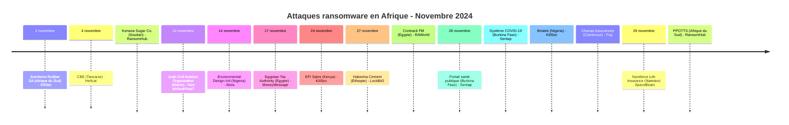
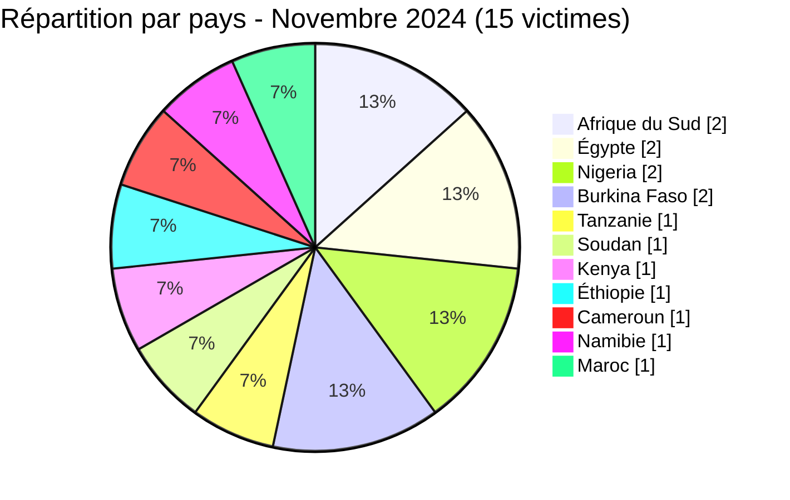

[](https://github.com/Hatchepsoute/AFRINTEL)


# Rapport CTI - Novembre 2024 : 15 victimes dans 11 pays, la plus large diffusion géographique de l'année

👉🏾 [English version available here](./README.md)

### 1. Résumé exécutif

Novembre 2024 enregistre **15 victimes** documentées dans 11 pays, à égalité avec août pour le plus haut total mensuel de l'année. L'Afrique du Sud, l'Égypte, le Nigeria et le Burkina Faso subissent chacun 2 revendications, et KillSec mène parmi les groupes ransomware avec 3. Le mois voit l'Autorité Fiscale Égyptienne (ETA) ciblée, une revendication directe contre des infrastructures fiscales souveraines, et la première apparition des groupes ransomware Fog et Hellcat sur le continent. Deux revendications burkinabè liées à des données de santé publique et une revendication republiée visant l'Arab Civil Aviation Organization (ACAO) au Maroc complètent un mois marqué par le ciblage du secteur public et des organisations internationales.

👉🏾 [Liste des victimes](./victims_FR.md)

**Chiffres clés :**
- 🔹 **15 victimes** identifiées
- 🔹 **11 acteurs/groupes actifs** : KillSec (3), RansomHub (2), Sentap (2), RAWorld (1), Hellcat (1), Akira (1), MoneyMessage (1), LockBit3 (1), Fog (1), SpaceBears (1), Non attribué/republié par Hxp7 (1)
- 🔹 **Pays touchés** : Afrique du Sud (2), Égypte (2), Nigeria (2), Burkina Faso (2), Tanzanie (1), Soudan (1), Kenya (1), Éthiopie (1), Cameroun (1), Namibie (1), Maroc (1)
- 🔹 **Secteurs** : Industrie, Éducation, Agroalimentaire, Ingénierie, Gouvernement/Finance, Distribution, Industrie lourde, Services, IT, Assurance, Aviation/Organisation intergouvernementale, Santé publique

---

### 2. Chronologie des attaques

| Date | Victime | Pays | Groupe ransomware |
|------|---------|------|-------------------|
| 2 novembre | Sumitomo Rubber South Africa | Afrique du Sud | KillSec |
| 4 novembre | College of Business Education (CBE) | Tanzanie | Hellcat |
| 4 novembre | Kenana Sugar Company | Soudan | RansomHub |
| 12 novembre | Arab Civil Aviation Organization (ACAO) | Maroc | Non attribué (republié par Hxp7) |
| 14 novembre | Environmental Design International | Nigeria | Akira |
| 17 novembre | Egyptian Tax Authority (ETA) | Égypte | MoneyMessage |
| 24 novembre | EFI Sales | Kenya | KillSec |
| 27 novembre | Habesha Cement | Éthiopie | LockBit3 |
| 27 novembre | Contrack Facilities Management | Égypte | RAWorld |
| 28 novembre | Portail du système de santé publique du Burkina Faso | Burkina Faso | Sentap |
| 28 novembre | Système gouvernemental de gestion des données COVID-19 | Burkina Faso | Sentap |
| 28 novembre | Briatek | Nigeria | KillSec |
| 28 novembre | Chanas Assurances S.A. | Cameroun | Fog |
| 29 novembre | Namforce Life Insurance | Namibie | SpaceBears |
| 29 novembre | PPOTTS | Afrique du Sud | RansomHub |



---

### 3. Analyse des victimes

#### 3.1 Par pays

| Pays | Nombre d'attaques |
|------|-----------------|
| Afrique du Sud | 2 |
| Égypte | 2 |
| Nigeria | 2 |
| Burkina Faso | 2 |
| Tanzanie | 1 |
| Soudan | 1 |
| Kenya | 1 |
| Éthiopie | 1 |
| Cameroun | 1 |
| Namibie | 1 |
| Maroc | 1 |



#### 3.2 Par secteur

| Secteur | Nombre |
|---------|--------|
| IT / Technologies | 2 |
| Assurance | 2 |
| Santé publique | 2 |
| Industrie manufacturière | 1 |
| Éducation | 1 |
| Agriculture / Agroalimentaire | 1 |
| Ingénierie / Conseil | 1 |
| Gouvernement / Administration fiscale | 1 |
| Distribution / Retail | 1 |
| Industrie lourde | 1 |
| Services aux entreprises | 1 |
| Aviation / Organisation intergouvernementale | 1 |

```mermaid
xychart-beta
    title "Secteurs ciblés - Novembre 2024"
    x-axis ["IT/Tech", "Assurance", "Santé", "Industrie", "Éducation", "Agriculture", "Ingénierie", "Gouvernement", "Distribution", "Ind. lourde", "Services", "Aviation"]
    y-axis "Nombre d'attaques" 0 to 3
    bar [2, 2, 2, 1, 1, 1, 1, 1, 1, 1, 1, 1]
```

#### 3.3 Groupes ransomware

| Groupe ransomware | Nombre d'attaques |
|-----------------|-----------------|
| KillSec | 3 |
| RansomHub | 2 |
| RAWorld | 1 |
| Hellcat | 1 |
| Akira | 1 |
| MoneyMessage | 1 |
| LockBit3 | 1 |
| Fog | 1 |
| SpaceBears | 1 |

Note : Sentap (Burkina Faso, 2 revendications de vente d'accès) et la revendication non attribuée concernant l'ACAO sont des revendications d'acteur/groupe hors taxonomie ransomware et ne figurent pas dans ce tableau ; elles sont comptabilisées dans les chiffres clés ci-dessus.

---

### 4. Points d'attention

- **Egyptian Tax Authority (ETA)** : la revendication de MoneyMessage contre l'administration fiscale souveraine de l'Égypte représente l'une des cibles gouvernementales les plus sensibles de 2024  une violation pourrait exposer les dossiers fiscaux, déclarations d'entreprises et données fiscales citoyennes de millions de personnes.
- **KillSec mène avec 3 revendications** : le groupe frappe l'Afrique du Sud (industrie), le Kenya (distribution) et le Nigeria (conseil IT) sur trois semaines son mois le plus actif sur le continent.
- **Débuts africains de Hellcat** : le groupe revendique le College of Business Education en Tanzanie, sa première victime africaine documentée.
- **Première revendication africaine de Fog** : Chanas Assurances (Cameroun) marque les débuts de Fog sur le continent, un groupe connu pour exploiter les vulnérabilités VPN.
- **Secteur assurance** : deux compagnies d'assurance touchées en un mois (Chanas Assurances, Namforce Life Insurance), détentrices de larges bases de données personnelles et financières des assurés.
- **Arab Civil Aviation Organization (Maroc)** : une republication sur un forum reprend une revendication antérieure visant la base de données de l'ACAO, mentionnant environ 800 fichiers mais sans échantillon visible. AFRINTEL n'a pas pu évaluer le contenu ni l'authenticité de la base revendiquée ; cette entrée reste une revendication non vérifiée.
- **Revendications de santé publique au Burkina Faso** : Sentap publie deux revendications distinctes mais liées, un portail du système de santé publique et un système gouvernemental de gestion des données COVID-19 annoncé à environ 3,795 millions d'enregistrements. Aucun domaine vérifiable ni confirmation indépendante n'était disponible pour l'une ou l'autre revendication ; AFRINTEL ne reproduit aucun enregistrement personnel.
- **Plus grande dispersion géographique de l'année** : 11 pays distincts en un seul mois, couvrant l'Afrique de l'Ouest, de l'Est, centrale, du Nord et australe.

---

```mermaid
xychart-beta
    title "Évolution mensuelle des attaques (Jan - Nov 2024)"
    x-axis ["Jan", "Fév", "Mar", "Avr", "Mai", "Juin", "Juil", "Août", "Sep", "Oct", "Nov"]
    y-axis "Nombre d'attaques" 0 to 16
    bar [3, 5, 7, 5, 8, 3, 7, 14, 4, 8, 15]
```

### 5. Recommandations

| Domaine | Action recommandée |
|---------|--------------------|
| Gouvernement / Administrations fiscales | Isoler les bases de données fiscales, enforcer la gestion des accès privilégiés, surveiller les extractions massives de dossiers. |
| Compagnies d'assurance | Chiffrer les bases de données assurés, auditer les accès tiers, implémenter la prévention des pertes de données. |
| Conseil IT | Enforcer le zero-trust pour les accès aux environnements clients, surveiller la réutilisation de credentials issus de violations antérieures. |
| Éducation | Corriger les vulnérabilités associées à Hellcat (souvent phishing + vol de credentials), durcir les portails de données étudiants. |
| Toutes organisations | Surveiller le pattern d'exploitation VPN de Fog, auditer d'urgence les configurations Fortinet/Cisco VPN. |

---

*Rapport produit à partir des données OSINT AFRINTEL . Diffusion libre (TLP:CLEAR)*
