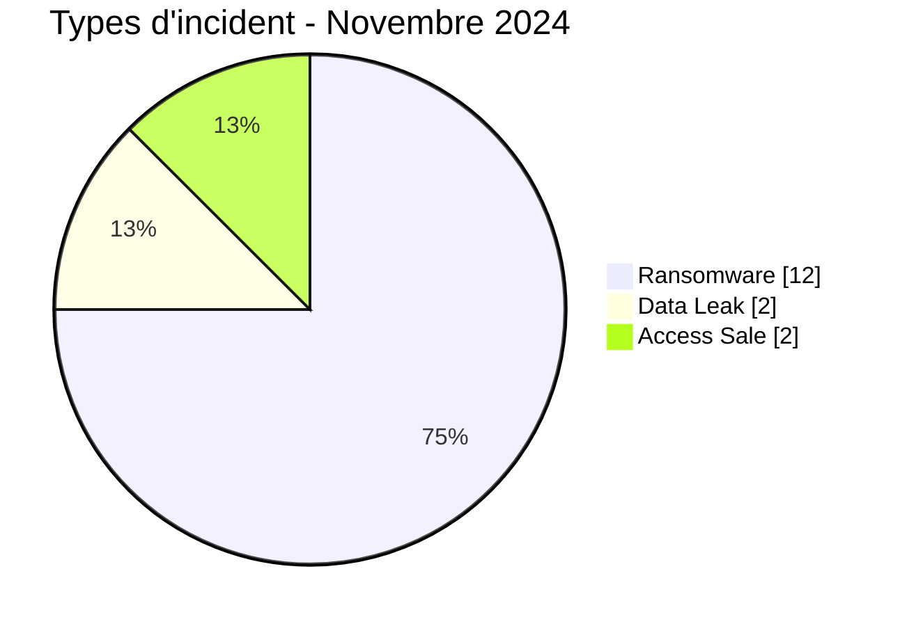
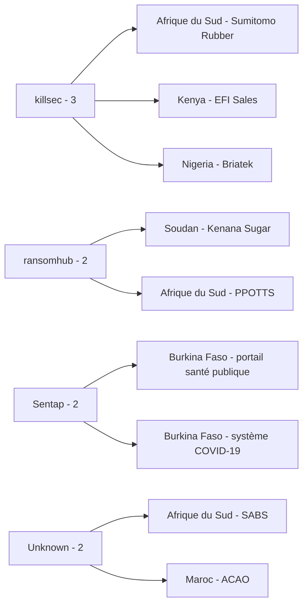
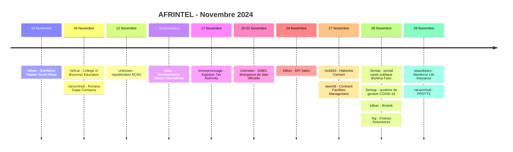

# Rapport CTI AFRINTEL - Novembre 2024

👉🏾 [English version](./README.md)

## 1. Résumé exécutif

Le corpus AFRINTEL corrigé de novembre 2024 contient **16 fiches incident documentées dans 11 pays africains** : **12 Ransomware**, **2 Data Leak** et **2 Access Sale**. Aucun DDoS, Defacement ou Operational Fraud n'est présent.

La correction rétrospective ajoute le **South African Bureau of Standards (SABS)**. Contrairement à la majorité des publications ransomware sur leak sites du mois, le dossier SABS repose sur des éléments officiels sud-africains et parlementaires confirmant un chiffrement des systèmes par ransomware et une perturbation opérationnelle majeure. Les sources officielles divergent d'un jour sur la date, 20 ou 21 novembre ; AFRINTEL conserve donc **20-21 novembre 2024**.

L'Afrique du Sud compte désormais trois incidents. Le Burkina Faso, l'Égypte et le Nigeria en comptent deux chacun, tandis que sept autres pays comptent une fiche chacun. Le mois reste donc caractérisé par une forte dispersion géographique plutôt que par la domination d'un seul pays.

👉🏾 [Voir la liste complète des victimes](./victims_FR.md)

### 1.1 Comparaison avec le mois précédent

| Indicateur | Octobre 2024 | Novembre 2024 | Évolution |
|---|---:|---:|---:|
| Total incidents | 12 | **16** | **+4 (+33,3 %)** |
| Ransomware | 8 | **12** | **+4 (+50,0 %)** |
| Data Leak | 4 | **2** | **-2 (-50,0 %)** |
| Access Sale | 0 | **2** | **+2 (depuis 0)** |
| DDoS | 0 | **0** | Stable |
| Defacement | 0 | **0** | Stable |
| Operational Fraud | 0 | **0** | Stable |

Novembre compte **33,3 % de fiches documentées supplémentaires** par rapport à octobre. La hausse provient de quatre Ransomware supplémentaires et de l'apparition de deux Access Sale, tandis que les Data Leak passent de quatre à deux.

## 2. Méthodologie

- **Période :** 1er au 30 novembre 2024.
- **Source de vérité :** couple harmonisé `victims_FR.md` / `victims.md`.
- **Comptage :** une fiche harmonisée correspond à un incident documenté.
- **Taxonomie :** Ransomware, Data Leak, Access Sale, DDoS, Defacement, Operational Fraud.
- **Correction rétrospective :** SABS fait partie des incidents 2024 validés comme manquants et est ajouté à novembre.
- **Chronologie SABS :** les sources officielles divergent d'un jour ; AFRINTEL enregistre donc 20-21 novembre au lieu de choisir silencieusement une seule source.
- **Règle Access Sale :** un accès proposé à la vente ne prouve ni qu'il est encore valide, ni qu'il a été utilisé, ni qu'une exfiltration a eu lieu.
- **Séparation acteur/source :** ACAO est `Unknown` ; Hxp7 reste uniquement documenté comme compte de republication.
- Revendications criminelles, échantillons publiés, confirmations victimes et incidents confirmés par des autorités restent des états de preuve distincts.

## 3. Vue globale

### 3.1 Répartition par type d'incident

| Type d'incident | Fiches | Part |
|---|---:|---:|
| Ransomware | **12** | **75,0 %** |
| Data Leak | **2** | **12,5 %** |
| Access Sale | **2** | **12,5 %** |
| DDoS | 0 | 0,0 % |
| Defacement | 0 | 0,0 % |
| Operational Fraud | 0 | 0,0 % |
| **Total** | **16** | **100 %** |

### 3.2 Répartition par pays

| Pays | Ransomware | Data Leak | Access Sale | Total |
|---|---:|---:|---:|---:|
| 🇿🇦 Afrique du Sud | 2 | 1 | 0 | **3** |
| 🇧🇫 Burkina Faso | 0 | 0 | 2 | **2** |
| 🇪🇬 Égypte | 2 | 0 | 0 | **2** |
| 🇳🇬 Nigeria | 2 | 0 | 0 | **2** |
| 🇨🇲 Cameroun | 1 | 0 | 0 | 1 |
| 🇪🇹 Éthiopie | 1 | 0 | 0 | 1 |
| 🇰🇪 Kenya | 1 | 0 | 0 | 1 |
| 🇲🇦 Maroc | 0 | 1 | 0 | 1 |
| 🇳🇦 Namibie | 1 | 0 | 0 | 1 |
| 🇸🇩 Soudan | 1 | 0 | 0 | 1 |
| 🇹🇿 Tanzanie | 1 | 0 | 0 | 1 |
| **Total** | **12** | **2** | **2** | **16** |

### 3.3 Répartition régionale

| Région | Ransomware | Data Leak | Access Sale | Total |
|---|---:|---:|---:|---:|
| Afrique de l'Est | 4 | 0 | 0 | **4** |
| Afrique de l'Ouest | 2 | 0 | 2 | **4** |
| Afrique australe | 3 | 1 | 0 | **4** |
| Afrique du Nord | 2 | 1 | 0 | **3** |
| Afrique centrale | 1 | 0 | 0 | **1** |
| **Total** | **12** | **2** | **2** | **16** |

### 3.4 Répartition sectorielle harmonisée

| Secteur | Fiches | Part |
|---|---:|---:|
| Manufacturing / Industry | 3 | 18,8 % |
| Government / Administration | 2 | 12,5 % |
| Finance / Banking | 2 | 12,5 % |
| Healthcare / Medical | 2 | 12,5 % |
| Professional / Business Services | 2 | 12,5 % |
| Technology / IT | 2 | 12,5 % |
| Agriculture / Agribusiness | 1 | 6,3 % |
| Aviation | 1 | 6,3 % |
| Education / University | 1 | 6,3 % |
| **Total** | **16** | **100 %** |

### 3.5 Acteurs / groupes

| Acteur / Groupe | Fiches |
|---|---:|
| killsec | **3** |
| ransomhub | 2 |
| Sentap | 2 |
| Unknown | 2 |
| hellcat | 1 |
| akira | 1 |
| moneymessage | 1 |
| lockbit3 | 1 |
| raworld | 1 |
| fog | 1 |
| spacebears | 1 |
| **Total** | **16** |

Les deux fiches `Unknown` correspondent à SABS et ACAO. Pour ACAO, Hxp7 est conservé comme contexte de republication et non comme acteur d'intrusion confirmé.

## 4. Analyse détaillée

### 4.1 Ransomware - 12 fiches

Le corpus ransomware corrigé contient douze fiches. Dix des onze publications ransomware d'origine restent des revendications non vérifiées à faible confiance, sans élément DFIR public établissant un chiffrement, un vecteur d'accès ou l'étendue d'une exfiltration.

**Sumitomo Rubber South Africa** dispose d'éléments beaucoup plus solides. AFRINTEL a examiné une archive locale d'environ **239 600 fichiers PDF, soit environ 23 Go non compressés**, contenant des relevés de comptes clients à l'identité de l'entreprise et des références de transactions liées à SAP. Le matériel soutient fortement une compromission réelle et importante de données internes avec un niveau `Very High`. Il n'établit pas indépendamment le mécanisme d'accès initial ni l'ensemble des comportements ransomware associés à la publication de l'acteur.

**SABS** présente une preuve encore plus forte sur un autre plan, puisque l'impact ransomware est officiellement confirmé. Des sources gouvernementales et parlementaires indiquent que les systèmes ont été chiffrés, que des données nécessaires aux travaux d'audit sont devenues inaccessibles, que le reporting financier a été retardé, que des machines virtuelles et applications ont dû être largement reconstruites et que des éléments d'audit ultérieurs décrivent un arrêt complet des applications métier avec une reprise prolongée. L'attaquant reste `Unknown` et aucun nombre d'enregistrements touchés, montant de perte ou volume de données exfiltrées n'est établi dans les sources officielles examinées.

### 4.2 Data Leak - 2 fiches

**ACAO** est une republication d'une revendication antérieure de compromission de base mentionnant environ **800 fichiers**. Aucun échantillon n'était visible dans la publication de novembre observée ; l'authenticité, le périmètre et la date d'origine restent donc non résolus. Hxp7 reste documenté comme contexte de republication et non comme acteur d'intrusion.

**PPOTTS** comporte huit captures examinées montrant des documents sensibles, notamment du matériel éducatif, de pathologie et d'identification. L'échantillon justifie l'enregistrement d'une exposition publiée, mais les captures ne permettent pas d'établir si les documents proviennent directement de PPOTTS, d'un environnement client, d'un système tiers ou d'un dataset plus large.

### 4.3 Access Sale - 2 fiches

Les deux Access Sale concernent des systèmes publics de santé au Burkina Faso et sont attribués à **Sentap**.

L'offre visant un portail général de santé publique ne fournit ni domaine vérifiable, ni preuve technique d'accès, ni échantillon ; elle reste à confiance `Low`.

Le système de gestion des données COVID-19 dispose de captures montrant des indicateurs de tableau de bord, des synthèses de vaccination et un historique de résultats, avec environ **3,795 millions d'enregistrements revendiqués**. L'échantillon soutient l'existence d'un environnement de type tableau de bord, mais n'établit ni la validité actuelle de l'accès vendu, ni l'authenticité ou l'exhaustivité de tous les enregistrements, ni l'utilisation de cet accès par un acheteur.

Les deux offres restent séparées car les éléments fournis ne démontrent pas qu'il s'agit du même système.

## 5. Principaux constats et lacunes

- Le corpus corrigé de novembre passe de **15 à 16 fiches** après l'ajout de SABS.
- Les Ransomware passent de **11 à 12**, et SABS renforce fortement la maturité de preuve du mois puisque le chiffrement et la perturbation opérationnelle sont officiellement confirmés.
- L'Afrique du Sud devient le premier pays avec **3 fiches**.
- Trois régions comptent désormais quatre fiches : Afrique de l'Est, Afrique de l'Ouest et Afrique australe.
- Sumitomo Rubber fournit une preuve forte par échantillon d'une compromission interne ; SABS fournit une confirmation officielle forte de l'impact ransomware.
- Les deux Access Sale du Burkina Faso exigent une vérification de la validité actuelle des accès avant toute conclusion sur leur exploitation.
- La provenance des échantillons PPOTTS reste non résolue.
- ACAO correspond à une republication et ne doit pas être présenté comme une nouvelle intrusion datée de novembre.
- Les vecteurs d'accès, l'identité de l'attaquant SABS et l'étendue d'une éventuelle exfiltration restent des lacunes majeures.

## 6. Cartographie MITRE ATT&CK contextuelle

| Qualification | Technique | Utilisation défensive |
|---|---|---|
| Observé pour SABS | T1486 - Data Encrypted for Impact | Le chiffrement des systèmes est officiellement confirmé pour SABS. |
| Préventif | T1490 - Inhibit System Recovery | Surveiller les suppressions de sauvegardes et modifications des mécanismes de reprise ; ce comportement n'est pas établi comme observé chez SABS. |
| Hypothèse | T1078 - Valid Accounts | Scénario à examiner pour les ventes d'accès ; non observé dans les éléments fournis. |
| Préventif | T1567 - Exfiltration Over Web Service | Surveiller les transferts sortants inhabituels ; canaux non établis. |

## 7. Recommandations

- Pour les incidents ransomware confirmés comparables à SABS, conserver séparément les preuves de chiffrement, données indisponibles, reconstruction, reprise et toute éventuelle preuve ultérieure d'exfiltration.
- Les systèmes publics de santé doivent vérifier rapidement si les accès proposés sont encore valides, faire tourner les identifiants privilégiés concernés si l'exposition est confirmée et corréler les sessions administratives récentes.
- Les administrations fiscales et assureurs doivent renforcer la surveillance des accès privilégiés, les contrôles des dépôts documentaires et la détection des exports anormaux.
- Les organisations industrielles doivent segmenter l'IT d'entreprise, les environnements de production et les accès prestataires, puis tester la restauration depuis des sauvegardes isolées.
- Pour toute publication criminelle, conserver la chronologie des revendications et ne pas transformer un volume annoncé ou une attribution en fait confirmé sans preuve correspondante.

## 8. Chronologie

## 9. Conclusion

Novembre 2024 se clôt sur **16 fiches incident documentées dans 11 pays africains**, réparties entre **12 Ransomware, 2 Data Leak et 2 Access Sale**. Par rapport à octobre, le corpus mensuel corrigé passe de 12 à 16 fiches, soit une hausse de **33,3 %**. Les Ransomware passent de 8 à 12, les Data Leak reculent de 4 à 2 et les Access Sale apparaissent avec deux fiches.

L'ajout de SABS modifie davantage la lecture analytique du mois que le simple total. Il introduit l'un des incidents ransomware les mieux confirmés opérationnellement du corpus 2024. Contrairement à un simple listing sur leak site, le dossier SABS repose sur des éléments officiels confirmant le chiffrement des systèmes, l'impossibilité d'accéder à certaines informations nécessaires aux activités d'audit, le retard du reporting financier, des opérations importantes de reconstruction et une reprise prolongée des applications métier. Dans le même temps, les sources ne permettent pas d'identifier l'attaquant, d'établir le vecteur d'accès initial ni de confirmer un volume de données exfiltrées. Il est donc essentiel de ne pas étendre une forte confirmation de l'impact opérationnel vers une attribution ou une perte de données non démontrée.

Sumitomo Rubber South Africa présente un autre profil de preuve, tout aussi important. L'archive locale examinée soutient fortement une compromission de données internes et montre une exposition potentielle de documents liés aux comptes et transactions des relations export. Pourtant, cet échantillon ne valide pas automatiquement l'ensemble des mécanismes ransomware revendiqués par l'acteur. Novembre réunit donc à la fois **un impact ransomware officiellement confirmé** et **une compromission fortement étayée par des échantillons**, à côté de nombreuses revendications criminelles encore faiblement documentées.

Les deux Access Sale ajoutent une troisième dimension. Elles concernent des environnements publics de santé au Burkina Faso, dont un tableau de bord avec environ 3,795 millions d'enregistrements revendiqués. Leur importance opérationnelle tient au fait qu'un accès privilégié réellement valide peut représenter un risque immédiat. Toutefois, aucune des publications ne prouve que l'accès était encore valide au moment de la collecte, qu'il a été acheté ou qu'il a servi à exfiltrer des données. La priorité doit donc être la validation interne et non l'hypothèse automatique d'exploitation.

Géographiquement, le corpus corrigé reste très dispersé : 11 pays sont représentés, l'Afrique du Sud arrive en tête avec trois fiches, et l'Afrique de l'Est, l'Afrique de l'Ouest et l'Afrique australe comptent chacune quatre incidents. Cette répartition ne permet pas de défendre l'hypothèse d'une campagne régionale unique. Sur le plan sectoriel, Manufacturing / Industry reste premier avec trois fiches, tandis que Government / Administration, Finance / Banking, Healthcare / Medical, Professional / Business Services et Technology / IT en comptent deux chacun.

La lecture CTI la plus défendable est donc que novembre associe **une hausse de la visibilité ransomware, quelques dossiers présentant une maturité de preuve exceptionnellement forte et l'émergence d'un risque de vente d'accès visant des systèmes de santé publique**. La hiérarchie de preuve compte davantage que le total brut : SABS est confirmé par des sources gouvernementales, Sumitomo est fortement soutenu par un échantillon, les offres d'accès du Burkina Faso restent non vérifiées ou partiellement échantillonnées et de nombreuses autres fiches ransomware demeurent des revendications sans DFIR public. AFRINTEL doit continuer à suivre chaque incident selon son cycle de preuve plutôt que de laisser les seize fiches suggérer un même niveau de certitude de compromission.

**AFRINTEL** - TLP:CLEAR
