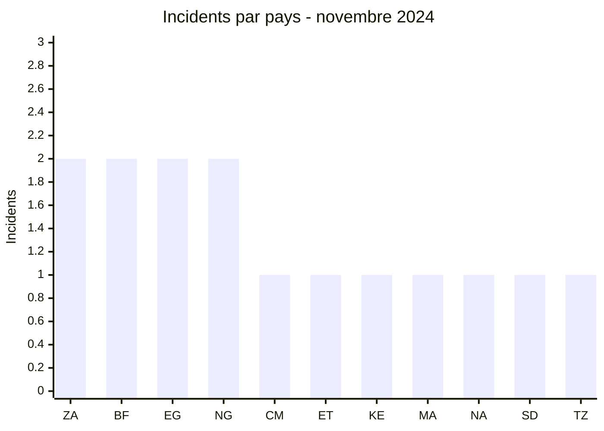
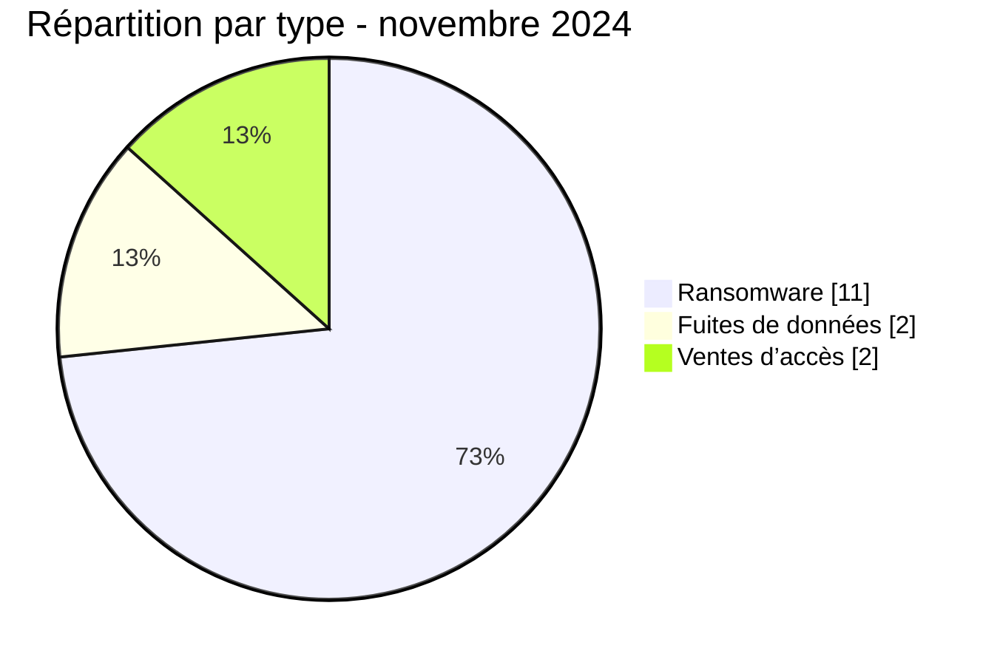

# Rapport CTI AFRINTEL - Novembre 2024

👉🏾 [English version](./README.md)

## 1. Résumé exécutif

Novembre 2024 compte **15 incidents dans 11 pays** : **11 revendications ransomware**, **2 fuites de données** et **2 ventes d’accès**. Aucun pays ne domine nettement le corpus : l’Afrique du Sud, le Burkina Faso, l’Égypte et le Nigeria enregistrent chacun deux incidents. L’Afrique de l’Est et l’Afrique de l’Ouest totalisent quatre incidents chacune.

Le mois se distingue moins par un foyer géographique que par la diversité des cibles. Les publications concernent notamment une administration fiscale, deux systèmes de santé publique, deux assureurs et plusieurs organisations industrielles. Trois cas comportent un échantillon publié dans les données AFRINTEL ; les autres restent évalués sur la publication de l’acteur et les éléments visibles au moment de la collecte.

Voir [victims_FR.md](./victims_FR.md).

## 2. Méthodologie

Le rapport couvre les incidents classés du 1er au 30 novembre 2024. La collecte repose sur les sites de divulgation, forums criminels et sources OSINT suivis par AFRINTEL. Une publication de victime, une fuite et une vente d’accès sont comptées séparément selon leur nature ; une vente d’accès ne prouve ni l’utilisation de l’accès ni une exfiltration.

Les statistiques dérivent des **15 incidents** de [victims_FR.md](./victims_FR.md), synchronisés avec [victims.md](./victims.md). Aucune donnée personnelle brute n’est reproduite.

## 3. Vue globale

| Indicateur | Valeur |
|---|---:|
| Incidents / Pays | **15 / 11** |
| Ransomware | **11** |
| Fuites de données | **2** |
| Ventes d’accès / Défacement | **2 / 0** |

### Classement par pays

| Pays | Total | Ransomware | Fuite | Vente d’accès |
|---|---:|---:|---:|---:|
| 🇿🇦 Afrique du Sud | 2 | 1 | 1 | 0 |
| 🇧🇫 Burkina Faso | 2 | 0 | 0 | 2 |
| 🇪🇬 Égypte | 2 | 2 | 0 | 0 |
| 🇳🇬 Nigeria | 2 | 2 | 0 | 0 |
| 🇨🇲 Cameroun | 1 | 1 | 0 | 0 |
| 🇪🇹 Éthiopie | 1 | 1 | 0 | 0 |
| 🇰🇪 Kenya | 1 | 1 | 0 | 0 |
| 🇲🇦 Maroc | 1 | 0 | 1 | 0 |
| 🇳🇦 Namibie | 1 | 1 | 0 | 0 |
| 🇸🇩 Soudan | 1 | 1 | 0 | 0 |
| 🇹🇿 Tanzanie | 1 | 1 | 0 | 0 |
| **Total** | **15** | **11** | **2** | **2** |

### Répartition régionale

| Région | Total | Ransomware | Fuite | Vente d’accès |
|---|---:|---:|---:|---:|
| Afrique de l’Est | 4 | 4 | 0 | 0 |
| Afrique de l’Ouest | 4 | 2 | 0 | 2 |
| Afrique australe | 3 | 2 | 1 | 0 |
| Afrique du Nord | 3 | 2 | 1 | 0 |
| Afrique centrale | 1 | 1 | 0 | 0 |
| **Total** | **15** | **11** | **2** | **2** |

### Répartition sectorielle normalisée

| Secteur | Incidents | Part |
|---|---:|---:|
| Industrie / Fabrication | 3 | 20,0 % |
| Finance / Banque | 2 | 13,3 % |
| Santé / Médical | 2 | 13,3 % |
| Services professionnels / Entreprises | 2 | 13,3 % |
| Technologies / Informatique | 2 | 13,3 % |
| Agriculture / Agro-industrie | 1 | 6,7 % |
| Aviation | 1 | 6,7 % |
| Éducation / Université | 1 | 6,7 % |
| Gouvernement / Administration | 1 | 6,7 % |
| **Total** | **15** | **100 %** |

### Acteurs les plus visibles

| Acteur | Incidents | Nature dominante |
|---|---:|---|
| KillSec | 3 | Ransomware |
| RansomHub | 2 | Ransomware |
| Sentap | 2 | Vente d’accès |
| Huit autres acteurs ou sources | 1 chacun | Ransomware ou fuite |

## 4. Analyse détaillée par type d’incident

### 4.1 Ransomware

Les 11 publications ransomware sont réparties entre neuf groupes. KillSec en signe trois, contre deux pour RansomHub. La publication visant Sumitomo Rubber South Africa comporte un échantillon ; celles visant l’Egyptian Tax Authority ou Kenana Sugar Company ne fournissent pas, dans les éléments collectés, de preuve technique permettant de confirmer l’étendue annoncée.

### 4.2 Fuites de données et ventes d’accès

La publication PPOTTS est associée à un échantillon de données. Le cas ACAO est une republication d’une revendication antérieure mentionnant environ 800 fichiers, sans échantillon visible lors de la collecte : il ne doit pas être interprété comme une nouvelle intrusion datée de novembre. Sentap propose séparément des accès liés à deux systèmes burkinabè de santé publique ; l’un comporte un échantillon, mais ni la validité actuelle des accès ni leur utilisation ne sont établies.

## 5. Impact sectoriel

L’industrie est le premier secteur du mois avec trois incidents. La finance, la santé publique, les services professionnels et les technologies en comptent deux chacun. L’impact potentiel le plus sensible se situe dans les environnements fiscaux, sanitaires et assurantiels, où une exposition pourrait toucher des données à caractère personnel ou financier. Cette sensibilité ne vaut pas confirmation du contenu revendiqué.

## 6. Profil des acteurs et évaluation du risque

| Périmètre | Niveau | Justification |
|---|---|---|
| 🇧🇫 Burkina Faso | 🔴 Élevé | Deux ventes d’accès visant des systèmes de santé publique |
| 🇪🇬 Égypte | 🔴 Élevé | Deux revendications ransomware, dont l’administration fiscale |
| 🇿🇦 Afrique du Sud | 🔴 Élevé | Un cas ransomware avec échantillon et une fuite avec échantillon |
| 🇳🇬 Nigeria | 🟠 Moyen | Deux revendications ransomware sans preuve technique publique |
| Autres pays | 🟠 Moyen | Un incident par pays, avec profondeur de preuve variable |

## 7. Tendances et lacunes de renseignement

- **Observé - confiance élevée :** le corpus est réparti sur 11 pays ; aucun pays ne dépasse deux incidents.
- **Observé - confiance élevée :** ransomware, fuites et ventes d’accès coexistent et doivent rester séparés dans les priorités de réponse.
- **Observé - confiance moyenne :** trois incidents sont associés à un échantillon publié, sans que cela valide automatiquement l’intégralité des volumes revendiqués.
- **Lacune majeure :** aucun rapport DFIR public n’a été identifié dans les sources consultées pour établir les vecteurs d’accès, les mouvements latéraux ou les mécanismes d’exfiltration.
- **Lacune :** la validité des accès proposés par Sentap et la date d’origine des données ACAO restent inconnues.
- **Collecte attendue :** rechercher des confirmations institutionnelles, dater les données republiées et suivre l’éventuelle réutilisation des accès proposés.

## 8. Cartographie MITRE ATT&CK contextuelle

| Qualification | Technique | Utilisation défensive |
|---|---|---|
| Hypothèse - confiance moyenne | T1078 - Valid Accounts | Scénario à examiner pour les ventes d’accès ; non observé dans les sources |
| Préventif | T1486 - Data Encrypted for Impact | Détecter les écritures et renommages massifs associés au chiffrement |
| Préventif | T1490 - Inhibit System Recovery | Alerter sur la suppression de clichés instantanés et la modification des sauvegardes |
| Préventif | T1567 - Exfiltration Over Web Service | Surveiller les transferts sortants inhabituels ; canal non établi |

## 9. Recommandations

- **Santé publique et administration fiscale :** revoir les comptes privilégiés, limiter les accès tiers et journaliser les exports massifs.
- **Assurance :** contrôler les dépôts documentaires, chiffrer les données sensibles et tester la procédure de notification.
- **Industrie :** segmenter les environnements bureautiques, industriels et prestataires.
- **Toutes organisations :** vérifier l’exposition des accès distants et imposer une MFA résistante au phishing.

## 10. Recommandations SOC et tactiques

| Qualification | Action |
|---|---|
| **Observé** | Suivre les domaines et organisations cités, sans transformer une publication criminelle en confirmation d’intrusion. |
| **Hypothèse** | Rechercher connexions distantes depuis des infrastructures inhabituelles, création de comptes et élévations de privilèges. |
| **Préventif** | Détecter dump LSASS, scripts PowerShell obfusqués, suppression de sauvegardes et usage anormal d’outils de transfert tels que Rclone. |

## 11. Recommandations stratégiques

| Priorité | Qualification | Mesure |
|---:|---|---|
| 1 | **Observé** | Prioriser les systèmes publics de santé et de fiscalité présents dans le corpus. |
| 2 | **Hypothèse** | Traiter les accès proposés comme potentiellement valides jusqu’à vérification interne, sans conclure à leur exploitation. |
| 3 | **Préventif** | Réduire la surface d’attaque externe, fermer les RDP inutiles et isoler les sauvegardes critiques. |

## 12. Conclusion

Novembre présente la diffusion géographique la plus large du corpus 2024, mais pas une campagne unique. Les incidents n’ont ni le même niveau de preuve ni la même nature. La priorité opérationnelle doit aller aux environnements où la fonction métier et les éléments disponibles se rejoignent : santé publique, fiscalité, assurance et industrie.

**AFRINTEL - TLP:CLEAR**

[Dépôt AFRINTEL](https://github.com/Hatchepsoute/AFRINTEL)
