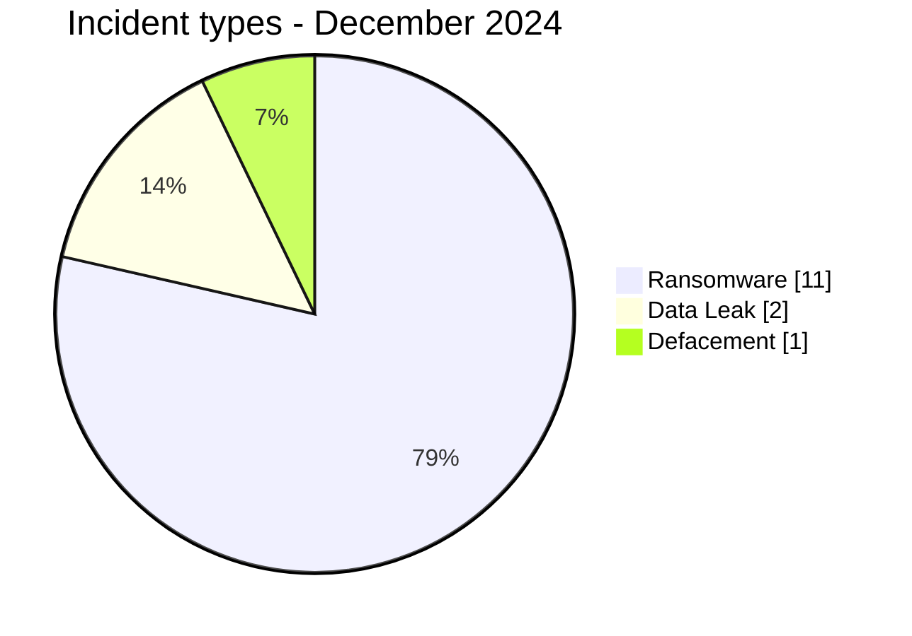
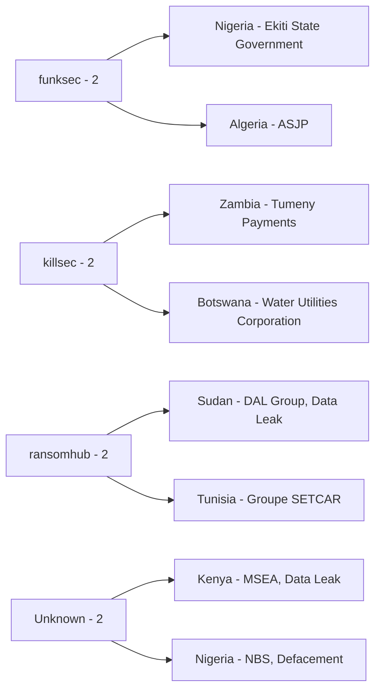
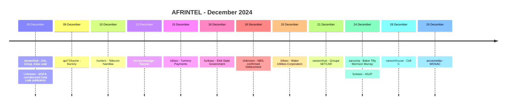

# AFRINTEL CTI Report - December 2024

👉🏾 [Version française](./README_FR.md)

## 1. Executive summary

The corrected December 2024 AFRINTEL corpus contains **14 documented incident records across 12 African countries**: **11 Ransomware**, **2 Data Leak** and **1 Defacement**. No Access Sale, DDoS or Operational Fraud record is present.

Two retrospective corrections are added. **Micro and Small Enterprises Authority (MSEA)** in Kenya is recorded as a `Data Leak` with `High` confidence and a `Corroborated - No Direct Victim Confirmation Located` status. **National Bureau of Statistics (NBS)** in Nigeria is recorded as a `Defacement` with `Victim Confirmed`, `Very High` confidence and documented multi-week service disruption.

Nigeria now records two incidents, joining South Africa as the only country with two records. Kenya becomes the twelfth country represented in December.

Four original cases remain particularly evidence-rich: DAL Group, Ekiti State Government, Baker Tilly Morrison Murray and ASJP. The two retrospective additions add two different evidence profiles: strong external corroboration for MSEA and direct victim confirmation for NBS.

👉🏾 [View the full victim list](./victims.md)

### 1.1 Month-over-month comparison

| Indicator | November 2024 | December 2024 | Change |
|---|---:|---:|---:|
| Total incidents | 16 | **14** | **-2 (-12.5%)** |
| Ransomware | 12 | **11** | **-1 (-8.3%)** |
| Data Leak | 2 | **2** | Stable |
| Access Sale | 2 | **0** | **-2 (-100.0%)** |
| DDoS | 0 | **0** | Stable |
| Defacement | 0 | **1** | **+1 (new)** |
| Operational Fraud | 0 | **0** | Stable |

December is slightly smaller than corrected November, but its evidence mix broadens: the corpus includes ransomware publications, two Data Leak records with different evidence maturity, and one victim-confirmed Defacement.

## 2. Methodology

- **Period:** 1-31 December 2024.
- **Source of truth:** harmonized `victims_FR.md` / `victims.md`.
- **Counting:** one harmonized card equals one documented incident record.
- **Taxonomy:** Ransomware, Data Leak, Access Sale, DDoS, Defacement, Operational Fraud.
- **Retrospective corrections:** MSEA and NBS are the two final missing incidents from the 2024 correction registry.
- **MSEA rule:** later authoritative references materially strengthen the breach assessment, but no direct MSEA notification was located in the reviewed retrospective source set; status therefore remains corroborated rather than victim-confirmed.
- **NBS rule:** website compromise and defacement are confirmed; no backend dataset theft is inferred.
- A sample's authenticity, victim attribution, incident mechanics and full scope remain separate analytical questions.

## 3. Global overview

### 3.1 Incident-type distribution

| Incident type | Records | Share |
|---|---:|---:|
| Ransomware | **11** | **78.6%** |
| Data Leak | **2** | **14.3%** |
| Defacement | **1** | **7.1%** |
| Access Sale | 0 | 0.0% |
| DDoS | 0 | 0.0% |
| Operational Fraud | 0 | 0.0% |
| **Total** | **14** | **100%** |

### 3.2 Country distribution

| Country | Ransomware | Data Leak | Defacement | Total |
|---|---:|---:|---:|---:|
| 🇿🇦 South Africa | 2 | 0 | 0 | **2** |
| 🇳🇬 Nigeria | 1 | 0 | 1 | **2** |
| 🇩🇿 Algeria | 1 | 0 | 0 | 1 |
| 🇧🇼 Botswana | 1 | 0 | 0 | 1 |
| 🇪🇬 Egypt | 1 | 0 | 0 | 1 |
| 🇰🇪 Kenya | 0 | 1 | 0 | 1 |
| 🇲🇷 Mauritania | 1 | 0 | 0 | 1 |
| 🇳🇦 Namibia | 1 | 0 | 0 | 1 |
| 🇸🇩 Sudan | 0 | 1 | 0 | 1 |
| 🇹🇿 Tanzania | 1 | 0 | 0 | 1 |
| 🇹🇳 Tunisia | 1 | 0 | 0 | 1 |
| 🇿🇲 Zambia | 1 | 0 | 0 | 1 |
| **Total** | **11** | **2** | **1** | **14** |

### 3.3 Regional distribution

| Region | Ransomware | Data Leak | Defacement | Total |
|---|---:|---:|---:|---:|
| Southern Africa | 5 | 0 | 0 | **5** |
| North Africa | 4 | 0 | 0 | **4** |
| East Africa | 1 | 2 | 0 | **3** |
| West Africa | 1 | 0 | 1 | **2** |
| **Total** | **11** | **2** | **1** | **14** |

### 3.4 Harmonized sector distribution

| Sector | Records | Share |
|---|---:|---:|
| Government / Administration | **3** | **21.4%** |
| Finance / Banking | 2 | 14.3% |
| Telecommunications | 2 | 14.3% |
| Agriculture / Agribusiness | 1 | 7.1% |
| Retail / E-commerce | 1 | 7.1% |
| Water / Utilities | 1 | 7.1% |
| Manufacturing / Industry | 1 | 7.1% |
| Professional / Business Services | 1 | 7.1% |
| Education / University | 1 | 7.1% |
| Transport / Logistics | 1 | 7.1% |
| **Total** | **14** | **100%** |

### 3.5 Actors / groups

| Actor / Group | Records |
|---|---:|
| ransomhub | 2 |
| killsec | 2 |
| funksec | 2 |
| Unknown | 2 |
| apt73/bashe | 1 |
| hunters | 1 |
| moneymessage | 1 |
| sarcoma | 1 |
| ransomhouse | 1 |
| arcusmedia | 1 |
| **Total** | **14** |

The two `Unknown` records are MSEA and NBS. MSEA has no confirmed intrusion actor in the reviewed source set. NBS confirmed the website compromise, but no named attacker is established.

## 4. Detailed analysis

### 4.1 Ransomware - 11 records

The eleven ransomware records are the same original December publications. Most remain claims whose technical mechanics are not independently established.

**Ekiti State Government** and **ASJP** contain the strongest locally reviewed technical material. The Ekiti archive includes a large website document repository and identity-related records that strongly support genuine exposure associated with the state portal. ASJP includes server-side filesystem material, more than 1,700 user folders and a separate 499-record name/email list consistent with the platform. Both are `Very High` confidence exposure assessments.

However, those samples establish data compromise more strongly than ransomware mechanics. Neither sample independently proves encryption, service interruption or the initial-access vector.

**Baker Tilly Morrison Murray** has a smaller sample containing identity, contract and employment-related documents, supporting `Medium` confidence in a published data sample associated with the ransomware claim.

The remaining ransomware listings require victim confirmation or public technical evidence before operational disruption, encryption or exfiltration scope can be treated as established.

### 4.2 Data Leak - 2 records

**DAL Group** remains a sample-backed Data Leak. Twelve reviewed screenshots include financial, banking, contractual, customer-account and identity-related material linked to the conglomerate. The material supports broad document exposure, but the full volume, affected-person count and acquisition method remain unknown.

**MSEA** is the retrospective Data Leak addition. Public reporting described employee records, government correspondence, financial statements and business-registration material offered for sale. Later references by INTERPOL's Africa Cyberthreat Assessment and ENACT strengthen the breach assessment. However, the reviewed retrospective source set contains no direct MSEA victim notification. AFRINTEL therefore records `High` confidence and a corroborated status instead of `Victim Confirmed`. The claimed USD 100,000 price remains secondary reporting.

### 4.3 Defacement - NBS

On **18 December 2024**, Nigeria's National Bureau of Statistics confirmed that its website had been hacked and advised the public to disregard information posted there until recovery. Independent reporting documented a `Page hacked` message.

The site remained unavailable for several weeks before restoration in January 2025. This supports `Victim Confirmed`, `Very High` confidence and `Level 3` impact for a Defacement with meaningful service disruption.

No reviewed public evidence establishes theft of backend statistical datasets or a named attacker. AFRINTEL therefore does not classify the event as Data Leak and does not infer exfiltration from the defacement.

## 5. Key findings and intelligence gaps

- Corrected December rises from **12 to 14 records** after adding MSEA and NBS.
- The annual correction registry is now fully applied: **10 of 10 retrospective records integrated**.
- Government / Administration becomes the leading December sector with **3 records**.
- South Africa and Nigeria each record **2 incidents**.
- Ekiti and ASJP provide very strong sample-based evidence of data compromise, but not independent proof of ransomware encryption.
- MSEA is strongly corroborated but not directly victim-confirmed in the reviewed source set.
- NBS is victim-confirmed as a website compromise/defacement, without confirmed backend data theft.
- Ransomware remains numerically dominant, but the strongest December evidence spans ransomware-associated exposure, a corroborated Data Leak and a confirmed Defacement.

## 6. Contextual MITRE ATT&CK mapping

| Qualification | Technique | Defensive use |
|---|---|---|
| Preventive | T1486 - Data Encrypted for Impact | Relevant to ransomware monitoring; encryption is not independently established for the December ransomware listings. |
| Contextual | T1213 - Data from Information Repositories | Relevant to document and account repositories observed in Ekiti, ASJP and DAL Group samples. |
| Preventive | T1567 - Exfiltration Over Web Service | Monitor unusual outbound transfers; acquisition and exfiltration channels remain unestablished. |
| Not asserted | NBS initial access | Defacement is confirmed, but the technical access mechanism is not established. |

## 7. Recommendations

- Government organizations should monitor administrative website changes, protect CMS and registrar accounts with phishing-resistant MFA and preserve web/application logs.
- MSEA should be treated as a high-priority validation case because corroboration is strong even though direct victim confirmation was not located in the reviewed audit sources.
- For NBS-like incidents, separate website integrity, service availability and backend data confidentiality during investigation.
- For Ekiti and ASJP, prioritize identity protection, account review and phishing monitoring based on the observed data, while avoiding unsupported ransomware-mechanism conclusions.
- For telecommunications, payments and water utilities, validate continuity, privileged access and isolated backup recovery around claim dates.

## 8. Timeline

## 9. Conclusion

December 2024 closes the corrected monthly sequence with **14 documented incident records across 12 African countries**: **11 Ransomware, 2 Data Leak and 1 Defacement**. Compared with corrected November, the corpus falls from 16 to 14 records, a decrease of **12.5%**. Ransomware falls slightly from 12 to 11, Data Leak remains stable at two, Access Sale disappears from the monthly corpus and Defacement appears with the confirmed NBS incident.

The two retrospective corrections materially improve the intelligence value of the month because they add evidence states that differ from ordinary criminal claims. MSEA is not merely a forum listing: later authoritative references strengthen the assessment that a breach occurred. Yet the absence of a direct MSEA notification in the reviewed audit sources prevents AFRINTEL from upgrading the case to `Victim Confirmed`. This is an important distinction between strong corroboration and direct institutional confirmation. The reported employee, correspondence, financial and business-registration categories can be retained as reported exposure, but neither the claimed sale price nor a technical root cause should be presented as independently established.

NBS represents a different and clearer evidential category. The institution itself confirmed that its website had been hacked, independent reporting documented a defacement message, and the prolonged outage demonstrates real service impact. At the same time, the evidence does not establish theft of the statistical backend. The strongest conclusion is therefore a confirmed **Defacement with service disruption**, not a Data Leak. This prevents availability and integrity impact from being automatically converted into a confidentiality breach.

The original December corpus already contained several strongly evidenced exposures. Ekiti State Government and ASJP provide `Very High` confidence material linking structured internal data to the named organizations. DAL Group and Baker Tilly provide additional sample-backed exposure signals. These cases demonstrate that the month's most valuable intelligence is not simply the number of ransomware labels, but the depth and nature of the available evidence. A ransomware-branded publication may contain convincing proof of data compromise without independently proving encryption, and a confirmed website hack may affect integrity and availability without proving exfiltration.

The corrected sector picture also changes. **Government / Administration becomes the largest sector with three records**, reflecting Ekiti, MSEA and NBS. This concentration deserves attention, but the three events are not technically equivalent: Ekiti is ransomware-associated with strong exposure evidence, MSEA is a corroborated Data Leak, and NBS is a confirmed Defacement. Treating them as one homogeneous government attack pattern would overstate what the data supports.

The most defensible CTI reading of December is therefore that the month combines **persistent ransomware visibility, multiple strongly supported data exposures, a corroborated Kenyan public-sector breach and a directly confirmed Nigerian website defacement**. The decrease from November should not be interpreted as a proportional fall in continental cyber risk. Instead, December demonstrates why AFRINTEL's value depends on maintaining separate dimensions for incident type, status, confidence, impact, chronology and evidence provenance.

With MSEA and NBS integrated, the retrospective correction registry is now **fully applied at 10 of 10 cases**. The next analytical step for the 2024 corpus should be to recompute the full-year totals, country distribution, sectors, actors, regions and 2024-to-2025 comparison from the corrected monthly records rather than relying on the original annual total of 118.

**AFRINTEL** - TLP:CLEAR
