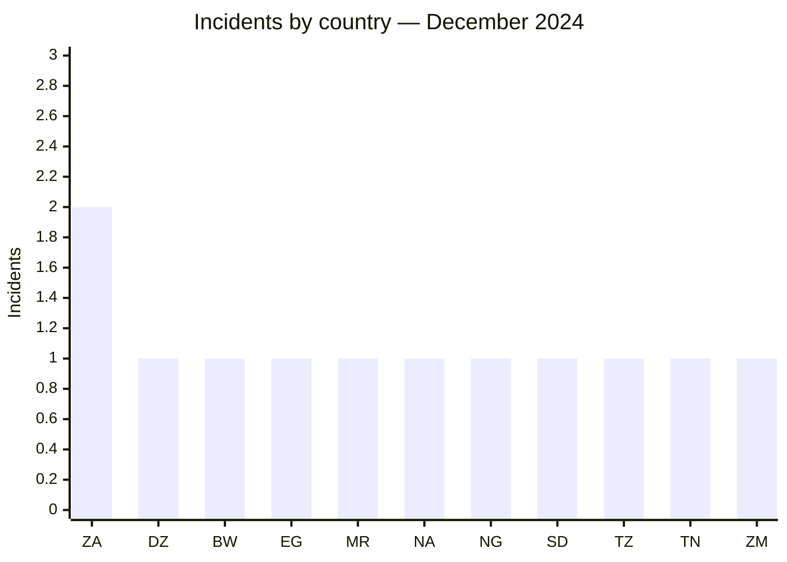
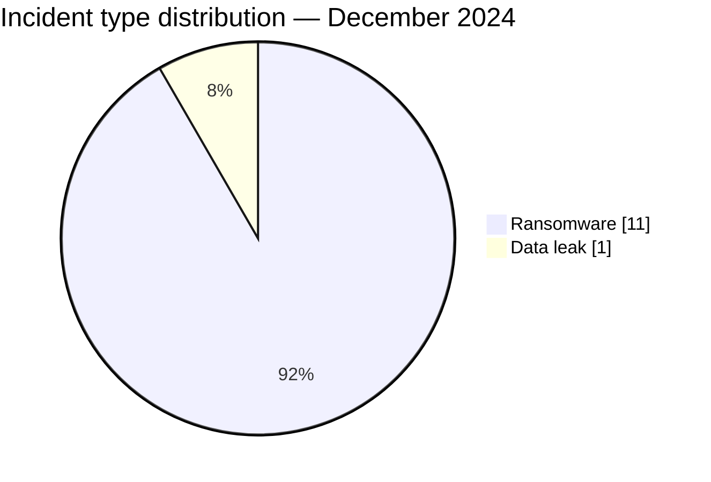

# AFRINTEL CTI Report — December 2024

👉🏾 [Version française](./README_FR.md)

## 1. Executive summary

December 2024 comprises **12 incidents across 11 countries**: **11 ransomware claims** and **1 data leak**. South Africa is the only country with two incidents. Southern Africa accounts for five publications, followed by North Africa with four.

Volume alone does not capture the month. Four cases include reviewed or published samples: DAL Group in Sudan, Ekiti State Government in Nigeria, Baker Tilly Morrison Murray in South Africa, and ASJP in Algeria. The Ekiti and ASJP material provides substantially deeper evidence than a leak-site listing alone. Conversely, no public technical evidence establishes the access method or operational impact of the claims involving Cell C, Telecom Namibia, or Water Utilities Corporation.

See [victims.md](./victims.md).

## 2. Methodology

This report covers incidents classified from 1 to 31 December 2024. Actor publications are compared, where possible, with samples available in AFRINTEL’s corpus. A sample’s structural authenticity, its attribution to an organisation, and the method by which it was acquired remain separate analytical questions.

All statistics derive from the **12 incidents** in [victims.md](./victims.md), synchronised with [victims_FR.md](./victims_FR.md). Sample findings are reported in aggregate; no raw personal data is reproduced.

## 3. Global overview

| Indicator | Value |
|---|---:|
| Incidents / Countries | **12 / 11** |
| Ransomware | **11** |
| Data leaks | **1** |
| Access sales / Defacement | **0 / 0** |

### Country ranking

| Country | Total | Ransomware | Leak |
|---|---:|---:|---:|
| 🇿🇦 South Africa | 2 | 2 | 0 |
| 🇩🇿 Algeria | 1 | 1 | 0 |
| 🇧🇼 Botswana | 1 | 1 | 0 |
| 🇪🇬 Egypt | 1 | 1 | 0 |
| 🇲🇷 Mauritania | 1 | 1 | 0 |
| 🇳🇦 Namibia | 1 | 1 | 0 |
| 🇳🇬 Nigeria | 1 | 1 | 0 |
| 🇸🇩 Sudan | 1 | 0 | 1 |
| 🇹🇿 Tanzania | 1 | 1 | 0 |
| 🇹🇳 Tunisia | 1 | 1 | 0 |
| 🇿🇲 Zambia | 1 | 1 | 0 |
| **Total** | **12** | **11** | **1** |

### Regional distribution

| Region | Total | Ransomware | Leak |
|---|---:|---:|---:|
| Southern Africa | 5 | 5 | 0 |
| North Africa | 4 | 4 | 0 |
| East Africa | 2 | 1 | 1 |
| West Africa | 1 | 1 | 0 |
| **Total** | **12** | **11** | **1** |

### Normalised sector distribution

| Sector | Incidents | Share |
|---|---:|---:|
| Finance / Banking | 2 | 16.7% |
| Telecommunications | 2 | 16.7% |
| Agriculture / Agribusiness | 1 | 8.3% |
| Water / Utilities | 1 | 8.3% |
| Education / University | 1 | 8.3% |
| Government / Administration | 1 | 8.3% |
| Manufacturing / Industry | 1 | 8.3% |
| Professional / Business Services | 1 | 8.3% |
| Retail / E-commerce | 1 | 8.3% |
| Transport / Logistics | 1 | 8.3% |
| **Total** | **12** | **100%** |

### Most visible actors

| Actor | Incidents | Activity |
|---|---:|---|
| FunkSec | 2 | Ransomware |
| KillSec | 2 | Ransomware |
| RansomHub | 2 | Ransomware and leak |
| Six other groups | 1 each | Ransomware |

## 4. Detailed analysis by incident type

### 4.1 Ransomware

Eleven victims were published by eight ransomware groups. FunkSec, KillSec, and RansomHub each appear twice. The Ekiti and ASJP cases have the strongest supporting material: the reviewed archives are consistent with the named organisations and contain structured document or account collections. This supports the assessed data exposure without establishing the initial vector or confirming service disruption.

The publications involving Cell C, Telecom Namibia, Water Utilities Corporation, Bankily, and Tumeny Payments concern important functions, but business criticality should not be conflated with a confirmed technical incident.

### 4.2 Data leak

DAL Group is the month’s only classified data leak. Twelve reviewed screenshots include financial, banking, contractual, and identity documents linked to the conglomerate. The material is more consistent with broad document exposure than with an isolated file. The complete volume, number of affected people, and acquisition method remain unknown.

## 5. Sectoral impact

Finance and telecommunications account for two incidents each. The other sectors are dispersed, but several provide essential functions: water, public administration, academic research, and payments. For Ekiti, ASJP, DAL Group, and Baker Tilly, risk follows from the nature of the observed documents. For the other cases, impact analysis remains prospective.

## 6. Threat actor profile and risk assessment

| Scope | Level | Rationale |
|---|---|---|
| 🇳🇬 Nigeria / 🇩🇿 Algeria | 🔴 High | Structured samples tied to an administration and a national academic platform |
| 🇸🇩 Sudan | 🔴 High | Financial and identity documents observed in the DAL Group sample |
| 🇿🇦 South Africa | 🔴 High | Two incidents, including a documentary sample involving Baker Tilly |
| 🇧🇼 Botswana / 🇳🇦 Namibia | 🟠 Medium | Essential operators named, without established operational impact |
| Other countries | 🟠 Medium | One claim per country, primarily without public technical evidence |

## 7. Key trends and intelligence gaps

- **Observed — high confidence:** 11 of 12 incidents are classified as ransomware; DAL Group is a data leak and remains separately counted.
- **Observed — high confidence:** four cases contain published or reviewed material, with varying depth.
- **Observed — high confidence:** the Ekiti and ASJP datasets structurally link the observed data to the organisations concerned.
- **Major intelligence gap:** no public DFIR report was identified in the consulted sources to explain initial access, persistence, lateral movement, or any encryption activity.
- **Gap:** no public material confirms disruption at the named telecommunications operators or water utility.
- **Collection requirement:** monitor victim communications, subsequent data availability, and independent technical corroboration.

## 8. Contextual MITRE ATT&CK mapping

| Qualification | Technique | Defensive use |
|---|---|---|
| Preventive | T1486 — Data Encrypted for Impact | Ransomware use case; encryption not established in the dataset |
| Preventive | T1490 — Inhibit System Recovery | Detect shadow-copy deletion and backup tampering |
| Assumption — medium confidence | T1078 — Valid Accounts | Access scenario to verify; no published telemetry |
| Preventive | T1567 — Exfiltration Over Web Service | Hunt for anomalous outbound transfer; channel not observed |

## 9. Recommendations

- **Telecommunications and water:** separate administration, billing, and operations; test continuity procedures.
- **Government and research:** inventory document repositories, reduce exposure, and require phishing-resistant MFA.
- **Finance and consulting:** monitor exports, constrain third-party access, and prepare for secondary fraud.
- **All organisations:** verify offline backups and restore one priority service in a controlled exercise.

## 10. SOC and tactical recommendations

| Qualification | Action |
|---|---|
| **Observed** | Search internally for markers specific to the affected documents and accounts without exposing personal data. |
| **Assumption** | Examine unusual remote authentication, abused service accounts, and privileged access outside normal hours. |
| **Preventive** | Detect LSASS dumping, obfuscated PowerShell, backup deletion, mass encryption, and unusual Rclone transfers. |

## 11. Strategic recommendations

| Priority | Qualification | Measure |
|---:|---|---|
| 1 | **Observed** | Address the Ekiti, ASJP, DAL Group, and Baker Tilly exposures according to the sensitivity of the observed data. |
| 2 | **Assumption** | Test identity- and exposed-service access scenarios without presenting them as established. |
| 3 | **Preventive** | Reduce the external attack surface, close unnecessary RDP exposure, and make critical backups immutable and isolated. |

## 12. Conclusion

December closes the year with a dataset dominated by ransomware, but its intelligence value is concentrated in four supported cases. The correct reading is therefore not “twelve confirmed attacks”; it is a distinction among documented exposures, credible but incomplete publications, and claims whose impact remains to be verified.

**AFRINTEL — TLP:CLEAR**

[AFRINTEL repository](https://github.com/Hatchepsoute/AFRINTEL)
