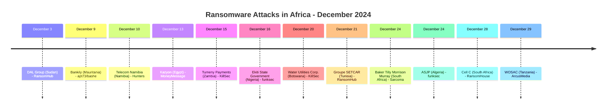
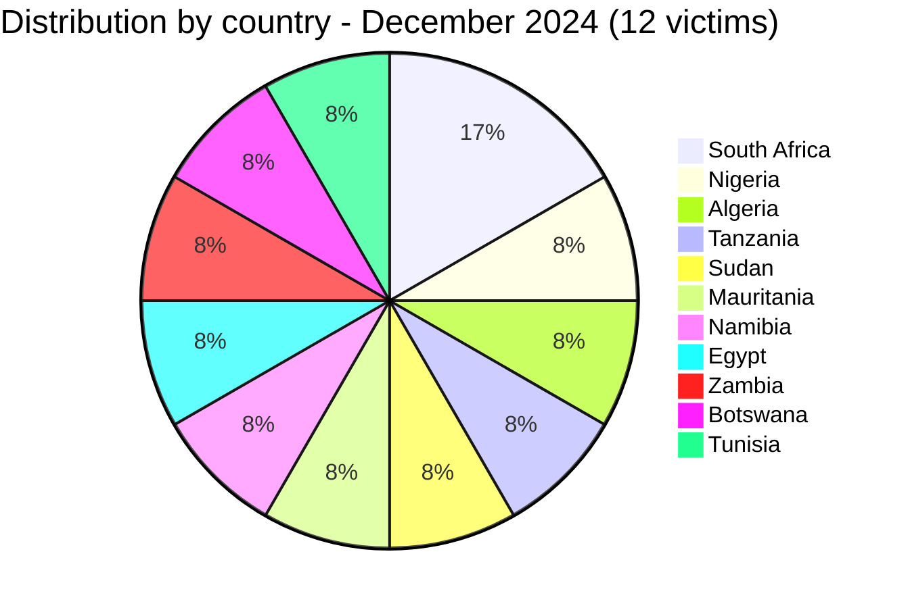

[](https://github.com/Hatchepsoute/AFRINTEL)


# CTI Report - December 2024: 12 victims across 11 countries: Cell C and critical infrastructure targeted at year-end

👉🏾 [Version française disponible ici](./README_FR.md)

### 1. Executive summary

December 2024 closes the year with **12 documented ransomware victims** across 11 countries. The month marks two critical infrastructure attacks: **Cell C** (South Africa's 4th largest MNO, 13M+ customers) claimed by RansomHouse, and **Water Utilities Corporation Botswana** (national water supply) hit by KillSec. The financial sector also takes multiple hits: Bankily (Mauritania mobile banking) and Tumeny Payments (Zambia fintech) are both claimed. funksec claimed two large-scale exposures in the public and academic sectors: the **Ekiti State Government** (Nigeria), backed by a reviewed sample exceeding 17,000 files including passport scans and CVs, and **ASJP** (Algeria's national scientific-journal platform, operated by CERIST), backed by a reviewed server-side backup covering more than 1,700 user accounts; both are assessed at very high confidence. DAL Group (Sudan's largest private conglomerate) and Telecom Namibia (national incumbent operator) round out a month of high-impact targets.

👉🏾 [Victims list](./victims.md)

**Key figures:**
- 🔹 **12 victims** identified
- 🔹 **9 active groups**: RansomHub (2), KillSec (2), funksec (2), RansomHouse (1), Hunters (1), MoneyMessage (1), apt73/bashe (1), Sarcoma (1), ArcusMedia (1)
- 🔹 **Countries affected**: South Africa (2), Nigeria (1), Algeria (1), Tanzania (1), Sudan (1), Mauritania (1), Namibia (1), Egypt (1), Zambia (1), Botswana (1), Tunisia (1)
- 🔹 **Sectors**: Telecommunications (2), Mobile Banking / Fintech (2), Public Administrations, Education / Research, Food & Agribusiness, Water / Public Utilities, Retail, Audit / Consulting, Automotive / Industrial, Maritime

### Monthly aggregate exposure view

The monthly CTI view combines data leaks and access sales as **data exposure**: **0 records** (0.0% of the monthly corpus). Source cards remain authoritative; an access sale does not by itself prove data exfiltration.

---

### 2. Attack timeline

| Date | Victim | Country | Ransomware group |
|------|--------|---------|-----------------|
| December 3 | DAL Group | Sudan | RansomHub |
| December 9 | Bankily | Mauritania | apt73/bashe |
| December 10 | Telecom Namibia | Namibia | Hunters |
| December 13 | Kazyon | Egypt | MoneyMessage |
| December 15 | Tumeny Payments Limited | Zambia | KillSec |
| December 16 | Ekiti State Government | Nigeria | funksec |
| December 20 | Water Utilities Corporation (WUC) | Botswana | KillSec |
| December 21 | Groupe SETCAR | Tunisia | RansomHub |
| December 24 | Baker Tilly Morrison Murray | South Africa | Sarcoma |
| December 24 | ASJP | Algeria | funksec |
| December 28 | Cell C | South Africa | RansomHouse |
| December 29 | WOSAC | Tanzania | ArcusMedia |



---

### 3. Victim analysis

#### 3.1 By country

| Country | Number of attacks |
|---------|-----------------|
| South Africa | 2 |
| Nigeria | 1 |
| Algeria | 1 |
| Tanzania | 1 |
| Sudan | 1 |
| Mauritania | 1 |
| Namibia | 1 |
| Egypt | 1 |
| Zambia | 1 |
| Botswana | 1 |
| Tunisia | 1 |



#### 3.2 By sector

| Sector | Count |
|--------|-------|
| Telecommunications | 2 |
| Mobile Banking / Fintech | 2 |
| Public Administrations | 1 |
| Education / Scientific Research | 1 |
| Food & Agribusiness | 1 |
| Water / Public Utilities | 1 |
| Retail / Hard-discount | 1 |
| Audit / Accounting / Consulting | 1 |
| Automotive / Industrial Vehicles | 1 |
| Maritime / Shipping | 1 |

```mermaid
xychart-beta
    title "Targeted Sectors - December 2024"
    x-axis ["Telecom", "Banking/Fintech", "Public Admin", "Education/Research", "Food/Agri", "Water/Utilities", "Retail", "Audit", "Automotive", "Maritime"]
    y-axis "Number of attacks" 0 to 3
    bar [2, 2, 1, 1, 1, 1, 1, 1, 1, 1]
```

#### 3.3 Ransomware groups

| Ransomware group | Number of attacks |
|-----------------|-----------------|
| RansomHub | 2 |
| KillSec | 2 |
| funksec | 2 |
| RansomHouse | 1 |
| Hunters | 1 |
| MoneyMessage | 1 |
| apt73/bashe | 1 |
| Sarcoma | 1 |
| ArcusMedia | 1 |

---

### 4. Key observations

- **funksec's double claim (Nigeria, Algeria)**: the Ekiti State Government claim is corroborated by a reviewed sample exceeding 17,000 files (roughly 530MB), including passport-style scans, CVs with sensitive personal fields and a Police Service Commission recruitment table; the ASJP (Algeria) claim is corroborated by a reviewed server-side backup covering more than 1,700 user accounts on CERIST's national academic-journal platform. Both are assessed at very high confidence, making funksec December's most prolific and best-corroborated actor.
- **Cell C (South Africa)**: RansomHouse's claim against the country's 4th largest MNO, serving 13 million+ customers, is December's most impactful attack. Potential exposure of subscriber PII, usage records, and billing data at scale.
- **Water Utilities Corporation Botswana**: KillSec claims the national water utility, a public infrastructure operator. Any disruption to operational systems could affect water supply to urban and rural populations.
- **Double telecom hit**: Telecom Namibia and Cell C both claimed in December, signalling a coordinated targeting pattern against African telecoms at year-end.
- **Financial sector cluster**: Bankily (mobile banking, Mauritania) and Tumeny Payments (fintech, Zambia) both targeted. Digital payment infrastructure is a growing ransomware target on the continent.
- **DAL Group Sudan**: RansomHub claims Sudan's largest private conglomerate, operating across food, agribusiness, and distribution, during an already acute humanitarian crisis in the country.
- **apt73/bashe first notable claim**: the group, tracked as an active threat actor, makes its most prominent African claim yet with Bankily, a platform used by thousands for daily financial transactions.
- **Year-end pattern**: 12 victims in December maintains a high baseline, consistent with prior years where year-end operational loosening expands the attack surface.

---

```mermaid
xychart-beta
    title "Monthly Evolution of Attacks - Full Year 2024"
    x-axis ["Jan", "Feb", "Mar", "Apr", "May", "Jun", "Jul", "Aug", "Sep", "Oct", "Nov", "Dec"]
    y-axis "Number of attacks" 0 to 16
    bar [3, 5, 7, 5, 8, 3, 7, 14, 4, 8, 12, 12]
```

**December total: 12 documented victims.** *Note: the January-November figures above have not been re-verified against their own monthly `victims.md` files during this update; the full-year total should be read from the annual rollup (`CyberAttackAfrica/2024/README.md`), which is recomputed independently from all 12 monthly source files.*

### 5. Recommendations

| Domain | Recommended action |
|--------|--------------------|
| Telecommunications | Harden billing and subscriber management systems, enforce MFA for internal admin portals, prepare crisis communication plans for data breach scenarios. |
| Public Administrations | Restrict and monitor access to document/media repositories holding identity documents, enforce least-privilege on state government portals, and plan citizen-notification procedures for large-scale personal data exposure. |
| Water / Public Utilities | Airgap OT/SCADA networks from corporate IT, audit KillSec TTPs, ensure operational continuity plans are documented and tested. |
| Mobile Banking / Fintech | Encrypt transaction databases, monitor for bulk account data exfiltration, notify regulators proactively in case of breach. |
| Conglomerates | Segment subsidiaries' networks to prevent lateral movement, conduct cross-subsidiary access reviews. |
| All organizations | Year-end skeleton staffing = reduced incident response capacity, ensure on-call rotations are active and detection thresholds are not lowered. |

---

*Report generated from AFRINTEL OSINT data. Free distribution (TLP:CLEAR)*
